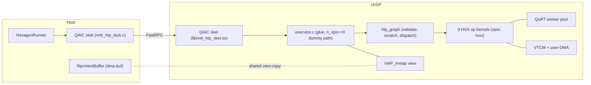

# Hexagon Backend

The Hexagon (cDSP) backend runs a decoder-only LLM on the DSP at **graph
granularity**: the host hands over an op-list and every large buffer once,
and each `forward()` call executes the whole list — one FastRPC round-trip
(~0.26 ms) per prefill chunk or decode token, so RPC overhead is
negligible even at M=1.

Status: qwen3-0.6b (W8_CX int8 weights) runs end-to-end on an 8 Elite
cDSP from a packed weight image and matches the x86 reference executor at
the model level (PPL 19.98 vs 20.27 reference). The CausalLM app runs it
through `"engine": "htp"` in `nntr_config.json` (section 5.4) at
13 tok/s decode / 24 tok/s prefill, with CPU fallback verified — behind
the same phone's CPU on the fp32 checkpoint (18.7 tok/s decode), but
those are M5-kernel numbers. M6 P3's tiled `vrmpy` matmul cuts DSP
decode time 2.5–2.8× on an S25 Ultra (55.9 M pcycles/step teacher-forced,
21.8 tok/s host wall) and a 128-token prefill chunk from ≈5.4 s to
736 ms, with the PPL matching the x86 reference (section 8.2). M6 P4's
int16 `down_proj` kernel takes that further: on the same S25 Ultra
decode runs at **32.0 tok/s** host wall in generation mode (59.5 M
pcycles/step) and a 128-token prefill chunk at **478 ms**, with the
remaining PPL gap to the x86 reference explained in section 8.2. The
app-level numbers in section 5.4 predate P3 and P4. The "~40 ms of host
time per generation step" once read out of the P3 logs does not survive
the #23 re-measurement: in the harness's own method the host wall of a
decode step is within 0.5–3 ms of the DSP op loop (31.3 ms vs 64.3 M
pcycles at 2.09 GHz at 512 tokens; section 8.2, "Host path"), so the
decode levers are the weight path (ledger ① ⑨ ⑩), not the logits
return. #24 keeps the host logits buffer in rpcmem mapped once with
`FASTRPC_MAP_STATIC`, so the FastRPC library passes its fd instead of
staging a copy of the 607,744 B, and measured what that return costs:
8919 µs (malloc) / 8771 µs (rpcmem) / 6381 µs (static) per isolated
call, 32-call warm medians, and < 0.1 ms inside a real 34 ms decode
step — ledger ⑫ closed, not a lever. The standalone
harnesses in section 5.3 remain the measurement/debug entry points.

---

## 1. Architecture



The host side is arm64 Android; the DSP side is hexagon v75/v79.

* **`nntr_htp.idl`** defines the wire interface. QAIC generates a host
  stub and a DSP skel from it at build time; neither is committed.
* **`nntr_htp_common.h`** is the op-list wire format (section 1.4), plain
  C compiled by both toolchains. Both sides pin `NNTR_HTP_ABI_VERSION`;
  `init()` performs a version handshake and rejects a mismatch with
  `AEE_EUNSUPPORTED` before touching anything else.
* **`RpcmemBuffer`** (host) is a move-only RAII wrapper around one rpcmem
  (dma-buf) allocation — memory the CPU and DSP share zero-copy.
* **`HexagonRunner`** (host) owns one `remote_handle64` session:
  `create()` → `init()` → `forward()`* → destructor closes. `create()`
  returning `nullptr` means "no usable DSP"; callers take the CPU path.
* **`executor.c`** (DSP) is the FastRPC glue: validates the op-list, maps
  the handed-off buffers persistently, and builds an `htp_graph` that
  `forward()`/`forward_debug()` delegate to. With `n_ops == 0` it keeps
  the M1 dummy pattern (a deterministic fill mixing in `weights[0]`) so
  the round-trip test can prove host-written data is visible through the
  mapping.
* **`htp_graph`** (DSP) owns what the kernels share: validates the
  op-list once at `init()`, sizes quantization/attention scratch from an
  op scan, acquires VTCM best-effort (DDR fallback), and per call
  dispatches the ops sequentially through the kind table. Each kernel
  fans out over the **QuRT worker pool** (one worker per HVX unit) and
  returns at a barrier.

### 1.1 Buffer strategy: hand off once, map forever

WEIGHTS / KV / ACT cross the boundary **once**, at `init()`, as dma-buf
fds; the DSP maps them with `HAP_mmap` for the session lifetime.
`forward()` carries only `token_ids` in and `logits` out — the FastRPC
driver manages coherency for those sequence arguments. The logits
(151,936 fp32 = 607,744 B per call) are a `rout sequence<float>` whose
host memory decides the path: a `malloc` buffer goes through the
library's staging copy, while a pointer inside an `rpcmem_alloc` buffer
is recognised by libadsprpc and passed as its dma-buf fd, the driver
doing the cache maintenance around the call. Since #24 both the CausalLM
backend (`HexagonBackend::logits_`) and the harness (`--logits-mem`,
default `static`) keep that buffer in rpcmem and map it once with
`FASTRPC_MAP_STATIC` (`HexagonRunner::register_static`) so the per-call
map/unmap disappears too; `--logits-mem rpcmem` (fd, mapped per call)
and `--logits-mem malloc` (staging copy) remain as the measurement
baselines. Measured cost of the 607,744 B return per path (32-call warm
medians of `hexagon_rpc_test`'s dummy path): malloc 8919 µs, rpcmem
8771 µs, static 6381 µs — and < 0.1 ms inside a real 34 ms decode step,
where the three are within 70 µs of each other (section 8.2, "Host
path"). No DSP, IDL or image change is involved: the kernel writes the
same bytes wherever the pointer lands.

Two non-obvious mechanics, both learned during bring-up:

1. **A raw fd number is meaningless to the DSP.** The host must first
   register it with `fastrpc_mmap(domain, fd, addr, 0, size,
   FASTRPC_MAP_FD_DELAYED)`; otherwise `HAP_mmap` fails with
   `AEE_ENOMEMORY`. Re-registering returns `AEE_EALREADY`, which
   `HexagonRunner::init()` treats as success so re-init works.
2. **The weights buffer is additionally passed as an in-sequence** in the
   same `init()` call: the driver performs the one-time CPU cache flush
   for in-parameters, the DSP ignores the sequence and keeps only the fd
   mapping. Weight content must be final before `init()`.

598 MB WEIGHTS + 224 MB KV + 4 MB ACT allocate fine as three rpcmem
buffers; `init()` takes ~1 s.

### 1.2 Session setup: unsigned PD

`create()` requests an unsigned protection domain via
`remote_session_control(DSPRPC_CONTROL_UNSIGNED_MODULE, ...)` before
opening the session — HVX needs no privileges, and this avoids per-device
testsig installation. The call is best-effort; `remote_handle64_open` is
the real gate.

### 1.3 Error convention

DSP methods return AEE codes (`AEEStdErr.h`) unchanged to the host. **rout
parameters are not copied back on failure** — `dsp_abi_version` reads 0
when `init()` fails; that is expected, not a marshalling bug.

### 1.4 Op-list wire format (ABI v4)

The op-list passed to `init()` is one 64-byte `nntr_htp_oplist_header`
(magic, version, `n_ops`, model shape — layers/heads/dims/`max_seq`/
`max_chunk`, and the WEIGHTS layout id (`weight_layout`, v4)) followed by
`n_ops` × 64-byte `nntr_htp_op_desc` records. Each descriptor names an op
kind, its m/k/n shape (`m` is 0, "the per-call token count", on every
kind but `MATMUL_LOGITS`, whose kernel ignores it), and up
to four tensor references — a buffer id (WEIGHTS / KV / ACT / TOKENS /
LOGITS) plus a 128-byte-aligned offset.

| kind | computes |
|------|----------|
| `EMBED` | tiled32 int8 embedding row gather + dequant → fp16 |
| `RMSNORM` | RMS norm, optional per-head QK-Norm (`FLAG_PER_HEAD`) |
| `MATMUL_W8A8` | per-token dynamic-quant int8×int8 tiled `vrmpy` matmul (32 rows per vector) → fp16 |
| `MATMUL_W8A16` | per-token int16 activation × int8 row-major weight, int32 lanes → fp32 → fp16 (`down_proj`; the op name keeps its wire meaning "no int8 activation quant") |
| `ROPE` | rotary embedding on q/k in place, precomputed cos/sin |
| `ATTN` | causal GQA attention against the persistent KV cache |
| `SILU_MUL` | SiLU(gate) ⊙ up |
| `ADD` | elementwise residual add |
| `MATMUL_LOGITS` | last-token int8 tiled `vrmpy` matmul → fp32 logits (same kernel, VTCM-streamed) |

`init()` validates everything up front and rejects a bad list with
`AEE_EBADPARM` (a version mismatch, rc 3, maps to `AEE_EUNSUPPORTED`
instead). Header rules (rc 4): `head_dim == 128`, `hidden % 64 == 0`,
`ffn % 64 == 0`, `n_kv_heads > 0`, `n_heads % n_kv_heads == 0`,
`max_chunk ≥ 1`, a known `weight_layout`. Per-op rules (rc 5): a known
kind, valid buffer ids and 128-byte-aligned offsets; `m == 0` on every
kind but `MATMUL_LOGITS` (a descriptor-fixed row count would bypass the
`forward()` gates below); `k > 0` and
`k % 128 == 0` for `MATMUL_W8A8` / `MATMUL_W8A16` / `MATMUL_LOGITS` /
`EMBED`, plus `k ≤ 16384` for `MATMUL_W8A16`; `n % 32 == 0` for the
tiled kinds (`MATMUL_W8A8`, `MATMUL_LOGITS`) and `vocab % 32 == 0` for
`EMBED`; `n % 64 == 0` for `RMSNORM` / `ADD` / `SILU_MUL` (the kernels
load whole 64-half vectors) and `n % head_dim == 0` for a `FLAG_PER_HEAD`
`RMSNORM`; `ATTN.layer < n_layers`, `max_seq % 64 == 0`, a KV buffer
that holds every layer and `in1`/`in2` (the chunk's fresh K/V rows) sized
for `max_chunk` rows; a `MATMUL_LOGITS` `in0` sized for `max_chunk` rows
(the kernel reads row `n_tokens - 1` whatever `m` says); and every other
tensor ref bounds-checked for `max_chunk` rows against the real buffer
sizes (`ROPE`'s `out` is in-place, `== in0`, and not checked separately).
The byte extents behind every "sized for `max_chunk` rows" clause come
from one table, `nntr_htp_op_extent()` in `nntr_htp_common.h`, which
`hexagon_ref_run --list-ops`/`--dump-op`, `ref_graph_forward` and
`sim_model` share (issue #36), so the four cannot disagree on an operand
size; the row rule `m ? m : n_tokens` is `nntr_htp_op_rows()` next to it.
`forward()`
checks the runtime arguments (token count ≤ `max_chunk`, position +
count ≤ `max_seq`, logits length) and every token id (`< vocab`; a
negative id fails the same unsigned compare) before any buffer pointer
or KV row is touched, and rejects with `AEE_EBADPARM`.
`HexagonBackend::forward` pre-checks the ids of the whole request on the
host, so a bad id in a later chunk cannot leave the earlier chunks in KV.

v4 additions: `reserved2[0]` became `weight_layout` and must read
`NNTR_HTP_WEIGHT_LAYOUT_TILED32` (1); any other value is rejected with
rc 4. `MATMUL_W8A8` / `MATMUL_LOGITS` need `n % 32 == 0` and `EMBED`
needs `vocab % 32 == 0` (rc 5) because their weights are stored in
32-row tiles (section 2.1). `MATMUL_W8A16` (`down_proj`) stays row-major
and is exempt. All four (`MATMUL_W8A8`/`MATMUL_W8A16`/`MATMUL_LOGITS`/
`EMBED`) also require `k % 128 == 0`. Since M6 P4 `MATMUL_W8A16`
additionally requires `k <= 16384` (rc 5): its int16 × int8 lanes
accumulate in int32, which is exact only up to that depth (section 7,
rule 8). A v3 op-list fails the version check as before. The `m == 0`,
`k > 0`, `n % 64`, PER_HEAD, `ATTN.layer`, ATTN `in1`/`in2`,
`MATMUL_LOGITS`-row and token-id rules above were added after the
2026-09-17 review (issue #33) without an ABI bump: they only refuse lists
and calls no kernel could have executed safely.

v3 additions: `forward()` returns the DSP cycle count of the op loop
(`HAP_perf_get_pcycles`), and `forward_debug()` runs ops `[0, n)` only
and returns a byte slice of WEIGHTS/KV/ACT — the primitive behind the
divergence bisect (section 6). A partial run still updates KV, so debug
sessions restart from pos 0.

---

## 2. Graph lowering and weight image

Lowering is host-side, SDK-free C++: it turns a model's shape into the
op-list plus WEIGHTS/ACT layout plans, and packs the weight image at
those offsets. `graph_lowering.h` (backend) holds only model-agnostic
vocabulary — `HexModelConfig`, `HexModelWeights`, `HexLoweredGraph`,
`align128()`, `pack_weights()`; the qwen3 recipe `lower_qwen3()` lives
with the app under `Applications/CausalLM/hexagon/`. A second model adds
its own `*_lowering.cpp` and reuses `pack_weights()` unchanged.

`lower_qwen3(cfg)` is pure shape computation (reads no weights);
`pack_weights(g, cfg, w, dst)` copies/converts each tensor of `w` to the
offsets `g.woff` already holds.

### 2.1 WEIGHTS image

A bump cursor lays out the image with every tensor 128B-aligned:

1. `embed` — int8 `[vocab][hidden]`, tied and reused as the
   `MATMUL_LOGITS` weight;
2. `embed_scale` — fp32 `[vocab]`;
3. `rope_table` — fp16 `[max_seq][cos64||sin64]`, angle
   `p * theta^(-2i/128)`, precomputed on the host by
   `nntr_htp_rope_row_f32` (`nntr_htp_rope.h`), the same fp32 row the
   simulator reference fills (each side keeps its own fp16 conversion);
4. `final_norm` — fp16 `[hidden]`;
5. per layer: `wq/wq_s`, `wk/wk_s`, `wv/wv_s`, `wo/wo_s`, `gate/gate_s`,
   `up/up_s`, `down/down_s`, then `attn_norm/ffn_norm/q_norm/k_norm`.

Projections carry one fp32 scale per output channel and are int8, but
since ABI v4 every projection except `down` is stored **tiled32** — the
same `N*K` bytes in a different order:

```
n_tiles = N / 32, k_tiles = K / 128
tile(nt, kt)  : 4096 B at ((nt * k_tiles + kt) * 4096)   # n-tile outer, k-tile inner
inside a tile : 32 vectors v[g], g = 0..31 (128 B each)
v[g] bytes [4r, 4r+3] = w[nt*32 + r][kt*128 + 4g .. +3]    (r = 0..31)
```

One vector therefore holds "32 rows × 4 consecutive k", which is exactly
what a `vrmpyacc` against a 4-byte activation splat wants: lane `r`
accumulates row `nt*32 + r`, and after all `g` and `kt` every lane is a
complete dot product with no horizontal reduction. A whole n-tile's K
strip (`32*K` bytes) is contiguous, so it streams with one DMA
descriptor. The inverse index is
`nntr_htp_tile_off(n, k, K) = ((n/32)*k_tiles + k/128)*4096 + ((k%128)/4)*128 + (n%32)*4 + k%4`
(`nntr_htp_common.h`); the host packer (`nntr_htp_repack_tiled32`), the
DSP kernels and the scalar references all use that one function.
Requirements: `K % 128 == 0` (as before) and `N % 32 == 0`; qwen3-0.6b's
N ∈ {1024, 2048, 3072, 151936} all qualify. `down` stays row-major
`[N][K]` because `MATMUL_W8A16` reads whole weight rows (int16
activation × int8 weight since M6 P4) and gains nothing from tiles;
unifying the layout is a follow-up (section 9). Norm gammas and the RoPE table are converted to fp16 as
before. For qwen3-0.6b (28 layers, hidden 1024, 16/8 heads, head_dim
128, ffn 3072, vocab 151936, max_seq 2048) the image is still exactly
**598,623,744 bytes** with no alignment padding.

Since M6 P3 the `MATMUL_W8A8` / `MATMUL_LOGITS` kernel reads a tile
strip as `k/4` consecutive vectors (`kt*4096 + g*128 == 128*(k/4)`), one
`vrmpyacc` per vector per token against a 4-byte activation splat, and
finishes the 32 lanes in qf32 (section 7, rule 5). `EMBED` still indexes
the table through `nntr_htp_tile_off` (a gather of K/4 4-byte loads per
token; it runs once per forward).

### 2.2 ACT buffer

Nine 128B-aligned slots, each sized for `max_chunk` tokens, reused by
every layer (so `act_size` does not scale with `n_layers`):

| slot | per token | role |
|------|-----------|------|
| `x` | `hidden` fp16 | residual stream |
| `t` | `hidden` fp16 | post-norm scratch |
| `q` | `n_heads*head_dim` fp16 | query projection |
| `kb` / `vb` | `n_kv_heads*head_dim` fp16 | this layer's k / v projection |
| `ao` | `n_heads*head_dim` fp16 | attention output |
| `h2` | `hidden` fp16 | matmul-out / residual scratch |
| `g` / `u` | `ffn` fp16 | gate / up projection |

The KV cache is separate: `kv_size = 2 * n_layers * n_kv_heads * max_seq
* head_dim * 2` bytes (fp16 key + value). Per layer/head, K is stored
transposed (`[head_dim][max_seq]`) so the score kernel streams 64
positions per vector; V is `[max_seq][head_dim]`. The validator requires
`max_seq % 64 == 0`. The layout is DSP-private (never read by the host).

**VTCM (4 MB requested best-effort at `init`).** `MATMUL_W8A8` /
`MATMUL_LOGITS` split it evenly per worker (rounded down to 128 B) and
use each slab as a two-chunk double buffer of whole 32-row tiles
(`rows_per_buf & ~31`; `buf[1] = buf[0] + rows_per_buf*k` stays
vector-aligned because `rows_per_buf % 32 == 0` and `k % 128 == 0`).
Activations are not copied into VTCM: the kernel reads the quantized
rows `xq` through the cache with 4-byte scalar loads, for which VTCM
brings nothing. A slab that cannot hold two tiles (or `HTP_MM_NO_VTCM`)
falls back to direct DDR reads with bit-identical output
(`test_matmul_dma` checks 4 MB, 256 KB and 64 KB). `MATMUL_W8A16` does
not use VTCM (a follow-up, section 9). The quant scratch `xq` is
`2 × max_chunk × k_max` bytes since M6 P4 — int8 rows for
W8A8/LOGITS, int16 rows for W8A16 — and `k_max` now includes the W8A16
`k` (3072).

### 2.3 Op sequence

`lower_qwen3()` emits `1 + 16 * n_layers + 2` ops (451 for qwen3-0.6b):
`EMBED`, then per layer

| # | kind | |
|---|------|--|
| 1 | RMSNORM | `x * attn_norm -> t` |
| 2–4 | MATMUL_W8A8 | `t * wq/wk/wv -> q/kb/vb` |
| 5–6 | RMSNORM | `q * q_norm`, `kb * k_norm` in place, `FLAG_PER_HEAD` |
| 7 | ROPE | q, kb in place via `rope_table` |
| 8 | ATTN | `q, kb, vb -> ao`, tagged with the layer's KV index |
| 9 | MATMUL_W8A8 | `ao * wo -> h2` |
| 10 | ADD | `x + h2 -> x` |
| 11 | RMSNORM | `x * ffn_norm -> t` |
| 12–13 | MATMUL_W8A8 | `t * gate/up -> g/u` |
| 14 | SILU_MUL | `g, u -> g` in place |
| 15 | MATMUL_W8A16 | `g * down -> h2` |
| 16 | ADD | `x + h2 -> x` |

then a final `RMSNORM` and `MATMUL_LOGITS` (weight refs point at
`embed`). Op 15 is W8A16 because the SwiGLU output is outlier-heavy:
per-token int8 there alone costs ~6 % PPL on qwen3-0.6b (x86 breakdown
on 128 tokens, reference 20.32: all-int8 21.72, down fp32 20.38, wo fp32
21.11, q/k/v/gate/up fp32 21.42, lm_head fp32 21.79).

### 2.4 Checkpoint and packed image files

`tools/hexagon/make_w8cx_bin.py` writes the W8_CX `.bin` from the
HuggingFace directory (header-less, 598,230,528 B for qwen3-0.6b; same
primitive and tensor order as `nntr_quantize --fc_dtype W8_CX` on the
hvx_m3 branch, which is not on this branch): embedding, then per layer
`attn_norm, wq, q_norm, wk, k_norm, wv, wo, ffn_norm, up, gate, down`,
then `output_norm` (2-D tensors as int8 `[N][K]` + fp32 `[N]`, norms
fp32). `Qwen3W8cxBin` mmaps it and hands out non-owning pointers as a
`HexModelWeights`.

`nntr_hexpack <bin> <prefix> [--layers N]` writes `<prefix>.hexw` (the
WEIGHTS image; 172,498,944 B for the 1-layer bring-up image) and
`<prefix>.hexcfg` (12 `key=value` lines: the 11 `HexModelConfig` fields
plus `weight_layout=tiled32`). Every consumer re-runs `lower_qwen3()`
from the `.hexcfg`, so image and op-list cannot drift.

A `.hexcfg` without `weight_layout` is a pre-v4, row-major image;
`read_hexcfg` rejects it ("legacy image ... regenerate with
nntr_hexpack") so it can never be paired with the tiled kernels. The
CausalLM app packs from the `.bin` at start-up and needs no regeneration.

---

## 3. Source layout

```
nntrainer/tensor/hexagon/
├── htp/                      # hexagon-clang (DSP side)
│   ├── nntr_htp.idl          # FastRPC interface (init/forward/forward_debug)
│   ├── nntr_htp_common.h     # op-list wire format v4 + validation + op extents / row rule / size helpers + tiled32 index (shared with host)
│   ├── nntr_htp_rope.h       # RoPE cos/sin row, shared by the packer and the sim reference
│   ├── executor.c            # FastRPC glue -> htp_graph (or n_ops==0 dummy path)
│   ├── htp_graph.{h,c}       # executor: pool, scratch, VTCM, dispatch, forward_upto
│   ├── worker_pool.{h,c}     # QuRT worker pool + barrier
│   ├── ops/                  # one kernel per op kind
│   │   ├── hvx-matmul.c      # tiled vrmpy W8A8/LOGITS (VTCM/DMA streaming) + int16 lane-wise W8A16 + quant worker
│   │   ├── hvx-attn.c / hvx-rmsnorm.c / hvx-rope.c / hvx-embed.c
│   │   └── hvx-eltwise.c     # ADD + SILU_MUL
│   ├── hvx/                  # vector helpers: f16 math, per-token int8/int16 quantization (HVX); exp/inverse from ggml-hexagon
│   ├── hex/                  # scalar utils (ggml-hexagon)
│   └── dma/                  # user-DMA queue (ggml-hexagon)
├── host/                     # NDK clang, part of libnntrainer (enable-hexagon)
│   ├── rpcmem_allocator.{h,cpp}
│   ├── hexagon_runner.{h,cpp}
│   └── graph_lowering.{h,cpp}   # HexModelConfig/Weights, pack_weights(), f32_to_f16_bits
└── meson.build

Applications/CausalLM/hexagon/
├── qwen3_lowering.{h,cpp}    # lower_qwen3(): the op sequence of section 2.3
├── qwen3_w8cx_bin.{h,cpp}    # mmap reader for the W8_CX .bin
├── hexagon_backend.{h,cpp}   # engine="htp" session: .bin -> rpcmem -> HexagonRunner (section 5.4)
├── hex_image.{h,cpp}         # .hexcfg read/write + raw file helpers
└── hex_pack.cpp              # nntr_hexpack (meson target, host-only)

test/hexagon/
├── test_oplist_header.c      # x86: wire-format self-check
├── test_lowering.cpp         # x86: op-list, layouts, pack_weights, hexcfg round trip
├── test_w8cx_bin.cpp         # x86: .bin reader sanity on the real checkpoint
├── hexagon_ref_run.cpp       # x86: scalar reference executor of a packed image
├── hexagon_rpc_test.cpp      # device: M1 round-trip test (n_ops == 0)
├── hexagon_e2e_test.cpp      # device: runs a packed image through HexagonRunner
└── sim/                      # simulator golden tests
    ├── ref_ops.{h,c}         # scalar reference kernels (also used by hexagon_ref_run)
    ├── ref_fp16_x86.h        # __fp16 stand-in for gcc < 12 on x86
    ├── sim_model.{h,c}       # parameterized hand lowering (qwen3 op sequence, any shape)
    ├── test_profile.c        # per-op-kind pcycle profile at qwen3 shape (SIM_PROF lines)
    └── test_*.c              # one file per test

tools/hexagon/
├── build_host_x86.sh         # x86 tests + nntr_hexpack + hexagon_ref_run (no SDK)
├── build_skel.sh             # qaic + hexagon-clang -> libnntr_htp_skel.so
├── build_sim_test.sh / run_sim_test.sh
├── build_host_test.sh        # NDK cross-build: hexagon_rpc_test + hexagon_e2e_test
├── run_device_test.sh / check_rpc_log.py / plot_rpc_latency.py   # M1 round-trip
├── run_e2e_test.sh           # push image + harness, run, pull dumps, capture FARF
├── make_tokens.py            # text -> int32 LE token file
├── find_divergence.py        # bisect the first op where DSP != x86 reference
└── summ_prof.py              # SIM_PROF logs -> per-kind / rescaled / thread-balance tables
```

`hvx/hvx-exp.h`, `hvx-inverse.h`, `hvx-base.h`, `hvx-floor.h`,
`hvx-types.h`, `hex/` and `dma/` are imported from llama.cpp's
ggml-hexagon backend (MIT); they keep their headers and are listed in
`NOTICE`.

---

## 4. Build integration (`enable-hexagon`)

```bash
./tools/package_android.sh . -Denable-hexagon=true -Dhexagon-sdk-root=$HEXAGON_SDK_ROOT
```

Prerequisites: Hexagon SDK 6.4 or newer (bring-your-own, as for QNN;
mounted into the dev container by `tools/docker/run.sh`, which exports
`HEXAGON_SDK_ROOT`) and an Android NDK (r26d is baked into the
container). The option (default `false`, strict no-op when off):

* errors out unless `platform=android` and an SDK root is given;
* runs QAIC at **configure time** into `<builddir>/nntr_htp_generated/`
  (the Android build is meson-configure → ndk-build, so the stub path
  must be a plain string) and registers the `.idl` as a reconfigure
  trigger;
* adds `host/*.cpp` + the stub to `nntrainer_sources` and ships
  `libcdsprpc.so` as a prebuilt — a link stub only; at runtime the
  device's `/vendor/lib64/libcdsprpc.so` resolves under the same soname.

The DSP skel is **not** part of the meson build (section 5.3).

---

## 5. Build and run

### 5.1 x86 (no SDK, no device)

The W8_CX checkpoint (`$W8CX.bin` below) is produced from the
HuggingFace Qwen3-0.6B directory by `tools/hexagon/make_w8cx_bin.py`
(numpy only; same primitive and tensor order as `nntr_quantize --fc_dtype
W8_CX` on the hvx_m3 branch). For the Qwen3-0.6B snapshot used by the
#23 baseline the file is 598,230,528 bytes with md5
`7562313bb4cc70410450d0ab3a4fa563`; another HF snapshot is legitimate
and only changes the md5, not the size. `tools/docker/setup_wizard.sh`
downloads the HF files, runs it, and prints the md5.

```bash
python3 tools/hexagon/make_w8cx_bin.py $HF_DIR $W8CX.bin      # ~2 min
./tools/hexagon/build_host_x86.sh        # -> build_x86_hexagon/{test_lowering,test_w8cx_bin,nntr_hexpack,hexagon_ref_run}
./build_x86_hexagon/test_lowering                        # LOWER_TEST PASS
./build_x86_hexagon/test_w8cx_bin $W8CX.bin              # W8CX_BIN_TEST PASS
gcc -Wall -Werror -o /tmp/t test/hexagon/test_oplist_header.c -lm && /tmp/t   # -lm: the shared RoPE row
ninja -C build_x86 Applications/CausalLM/nntr_hexpack    # same tool via meson

./build_x86_hexagon/nntr_hexpack $W8CX.bin /tmp/qwen3_full            # ~2 s
python3 tools/hexagon/make_tokens.py $HF_DIR text.txt /tmp/t.i32 --limit 512
./build_x86_hexagon/hexagon_ref_run /tmp/qwen3_full --tokens /tmp/t.i32 --eval
```

Images packed before ABI v4 (no `weight_layout` line in the `.hexcfg`)
must be regenerated with `nntr_hexpack`; sizes are unchanged
(598,623,744 / 172,498,944 bytes). The `--eval` PPL is bit-identical
across the layout change because the int8 paths are integer-exact
(verified on 386 steps of a local prompt: PPL 37.4738 / top1 133 before
and after).

Since M6 P4 `hexagon_ref_run` implements the int16 `down_proj`
activation (`ref_quant_row_i16` + `ref_matmul_w8a16`), so its numerics
changed: the `--eval` PPL on the 387-token local prompt is **37.1629 /
top1 134** (was 37.4738 / 133, −0.83 %) and on the 512-token prompt
**33.0195 / 184** (was 33.4011 / 181, −1.14 %). The `eval.txt` 20.2718
row of section 8.1 was not re-measured — that text is not on the build
machine. The 8-token `find_divergence.py` bound is unchanged.

**A reference figure can depend on the `hexagon_ref_run` build that
produced it.** Issue #23 ran the same packed image (md5 `5abf61be…`)
and the same 512-token file (md5 `10bb428f…`) through two builds of the
tool: the container's clang build gives PPL **41.2365 / top-1 161**,
the workstation's native gcc 13.1.0 build **41.5466 / 164** — 0.75 %
apart with no DSP involved, as large as the DSP-vs-reference gaps this
section is used to judge.

The workstation build is stable across the toolchain move: re-run at
`e086248a` on 2026-09-17 it reproduces the 512-token prompt figure
above exactly (**33.0195 / 184**, 199 s). So the spread is between the
two host builds on the new prompt, not drift in this machine's
reference. Quote the reference build alongside any device gap; the
33.0195 / 184 figure is the workstation build.

`hexagon_ref_run` interprets a packed image with the scalar `ref_*`
kernels — the same fp16 + per-token int8 math as the DSP — and is the
accuracy oracle. Modes: default (prefill in chunks, then greedy
`--steps N`), `--eval` (teacher-forced PPL, one token per step),
`--dump-op i --dump-out f` (run ops `[0, i)`, write op `i-1`'s output),
`--list-ops`. `ref_ops.c` is C shared with the simulator; on x86 it is
compiled as C++ so `__fp16` can be a conversion struct
(`ref_fp16_x86.h`) on gcc 11.

### 5.2 Simulator golden tests

```bash
# inside tools/docker/run.sh the entrypoint has already sourced setup_sdk_env.source
HEX_ARCH=v75 tools/docker/run.sh ./tools/hexagon/build_sim_test.sh    # -> build_hexagon/sim/libnntr_sim_test.so
HEX_ARCH=v75 tools/docker/run.sh ./tools/hexagon/run_sim_test.sh <name>
```

`hexagon-sim` boots a QuRT image and dispatches one test by name; a pass
prints `SIM_TEST <name> PASS`. The 13 tests (`smoke pool exp quant
matmul matmul_dma rmsnorm rope eltwise embed attn logits graph`) compare
each kernel — and `graph`, a full 2-layer prefill/decode plus partial
execution — against `ref_ops.c` with a mixed bound `|d| <= atol + rtol *
|ref|`; the integer paths are bit-exact by construction. `graph` also
carries the negatives: corrupted header fields and one mutated copy of
the op-list per validator shape rule (`ATTN.layer`, `k == 0` on the four
int8 kinds, `n % 64`, PER_HEAD `n % head_dim`, a `MATMUL_LOGITS` `in0`
or an ATTN `in2` too short for `max_chunk` rows, a fixed `m`) that init
must refuse with rc 5, and forward calls with a token id `>= vocab` or
`-1` that must be rejected without touching KV/ACT (section 1.4).
`graph` (and `profile`) also fail with `sim_model validate rc=N` if
`sim_model_build_oplist`'s self-validation rejects the hand lowering.
History: all
13 passed on v75 and v79 with SDK 6.3.0.0 / toolchain 8.8 (M2), and on
v75 with SDK 6.0.0.2 / toolchain 8.7.08 through M6 P4. Current
toolchain (#23, 2026-09-17): **SDK 6.4.0.2, QuIC LLVM Hexagon Clang
19.0.04 (HEXAGON_Tools 19.0.04, `toolv19`), `run_main_on_hexagon`
`hexagon_toolv19_v75` / `hexagon_toolv19_v79`**, inside
`tools/docker/run.sh`. On **v75** all 13 pass and `profile acc` passes
with every STAT bit-identical to the P4 record (section 8.3). On
**v79** the same build gives 9 PASS / 4 FAIL: `quant` (tie row
`x=-1.5` → `-1` instead of `-2`, plus a ±1 element in `rand0`,
`rand15`, `k3072`; `quant_generic pm1=13/65536`, `quant16_generic
229/25600`), `matmul` (`matmul_w8a8_m1` `max_abs=0.03125
max_rel=0.045677`), `matmul_dma` (`ref_4096k` `0.0625/0.273998`) and
`logits` (`0.0195827/0.273973`) fail, while `smoke pool exp rmsnorm
rope eltwise embed attn graph` pass. The failing set is qf-only code:
`quant_row` in `hvx-quant.h` and the W8A8 epilogue `mm_tile` in
`hvx-matmul.c`, neither of which has an `__HVX_ARCH__` branch (the
quantizer's only arch-dependent instruction is the exact fp16→fp32
widening from `hvx-base.h`), while the ops that do take the IEEE
helpers at `>= 79` pass. Recorded as data for the v79-native
follow-up (section 9, issue #35), not fixed here. The
`run_main_on_hexagon` image is picked per `HEX_ARCH` from
`$DEFAULT_TOOLS_VARIANT` (`run_sim_test.sh` prints `SIM_RUN
runmain=...`); `HEX_EXTRA_CFLAGS` appends compiler flags to both sim
and skel builds.

`test_matmul` covers m ∈ {1, 7, 8, 128} at n = 256 plus n = 64, which is
two tiles over four workers so two of them get an empty range, and the
W8A16 cases m ∈ {1, 8} at n = 256 plus `(m, k, n) = (7, 3072, 100)`
(row and token tails together) and `(2, 128, 6)` (k = 128, the 1- and
2-row tails independently of the worker count);
`test_matmul_dma` runs the VTCM path at 4 MB / 256 KB / 64 KB (the last
one falls back to DDR). `test_quant` requires byte-identity against
`ref_quant_row` on random, all-zero, tie, negative-only, k=128 and
k=3072 rows and at most a 2e-4 rate of ±1 differences on 64 generic
rows, printing `SIM_TEST quant_generic STAT pm1=<n>/<total>`
(section 7, rule 6). The int16 rows are checked the same way against
`ref_quant_row_i16`: the zero row and the tie row (`x[0] = 32767`, then
±(n + 0.5) up to 2047.5) must be byte-identical, and 16 generic rows
(k alternating 3072 / 128) may differ by ±1 LSB at a rate under 2 %,
printing `SIM_TEST quant16_generic STAT pm1=<n>/25600` (section 7,
rule 8).

**Profile test.** `run_sim_test.sh profile <acc|prefill0|prefill512|decode512>
[n_workers]` lowers the qwen3-0.6b shape with 2 layers and vocab 4096
(`sim_model`) and prints `SIM_PROF` lines: per-op-kind pcycles
(`htp_graph_profile_get`, a DSP-side API — the RPC ABI is unchanged) for
a 128-token chunk at pos 0, the same chunk at pos 512, or the median of
eight n=1 decode steps at pos 512, plus the cost of 1000 empty
`wp_run()` barriers. `acc` runs only that 8-token accuracy check (a few
minutes) and is the per-task gate from M6 P2 on; `prefill0` additionally
checks an 8-token prefill against the reference; the other two scenarios
only time the graph. That
check uses the same 0.1 atol/rtol bound as `find_divergence.py` (section
6), not the graph test's tighter 3e-2/5e-2, because per-token int8
re-binning at this depth amplifies a 1-ulp fp16 difference roughly 2×
per layer. `n_workers` requests the pool size
(`htp_graph_init_ex`; `wp_create` clamps it to the 128B-mode HVX-unit
count, 4 in the simulator — the device count is not recorded yet).
`SIM_TIMING=1` adds
`--timing`, but it is impractically slow at this shape — a 2026-09-14
run was aborted after 30 minutes without reaching its first
`SIM_PROF scenario=` line (it stalled inside the 8-token accuracy
forward), so section 8.3's baseline uses `timing=off` throughout.
`python3 tools/hexagon/summ_prof.py logs/hexagon/sim_prof_*.log`
rescales to 28 layers / full vocab and prints a sim-derived ms/token at
2.09 GHz; these are simulator cycles, not device measurements
(section 8.3). Every scenario also prints one `SIM_PROF op=` line per op
(kind, layer, k, n, pcycles); `summ_prof.py` groups them by (kind, k, n).
`summ_prof.py` also prints a ms/tok row for `acc`; that is an 8-token
gate run, not a measurement — use the three long scenarios
(section 8.3).

### 5.3 Device

```bash
# builds run in the dev container (SDK mounted, ANDROID_NDK set by the image);
# the adb steps below run on the workstation with the phone attached
HEX_ARCH=v75 tools/docker/run.sh ./tools/hexagon/build_skel.sh   # -> build_hexagon/skel/libnntr_htp_skel.so (see section 7)
tools/docker/run.sh ./tools/hexagon/build_host_test.sh           # -> build_hexagon/host/{hexagon_rpc_test,hexagon_e2e_test}

./tools/hexagon/run_device_test.sh [serial]            # RPC_TEST PASS
python3 tools/hexagon/check_rpc_log.py logs/hexagon/device_test_<stamp>.log

./tools/hexagon/run_e2e_test.sh /tmp/qwen3_full [serial] -- --tokens /tmp/t.i32 --eval
./tools/hexagon/run_e2e_test.sh /tmp/qwen3_full [serial] -- --tokens /tmp/t.i32 --chunk 128 --steps 64
```

The binaries link only host sources + stub with `-static-libstdc++`
(`libc++_shared.so` does not exist under `/data/local/tmp`). The run
scripts write `0x1f` into `<binary>.farf` on the device — without it
DSP FARF lines never reach logcat — and capture them into
`logs/hexagon/device_farf_<stamp>.log`. `run_e2e_test.sh` pushes the skel,
harness, image and token file only when the device copy differs
(the image is ~600 MB) and pulls back `--dump-out` files.

**Pitfall: that push check used to compare file size only.** ABI v4
reordered the WEIGHTS bytes without changing the image size (still
598,623,744), so a device that already held a pre-v4 image kept it — a
row-major image paired with a `.hexcfg` claiming
`weight_layout=tiled32`, which every P2 and P3 skel read as garbage
(PPL 2e8 … nan) until the `.hexw` was pushed by hand. Since M6 P4 the
script's `push_if_changed` compares `md5sum` with the device copy
instead, so a same-size image is re-pushed; an out-of-band `adb push`
is no longer needed.

`hexagon_rpc_test` drives `init()` with `n_ops == 0` and verifies the
RPC/mapping contract: session open, rpcmem, ABI-mismatch rejection, fd
registration + `HAP_mmap`, the dummy pattern `token_ids[i%3] + pos + i +
weights[0]` (proving host-written data is visible), and 32 timed
round-trips. `hexagon_e2e_test` mirrors `hexagon_ref_run`'s modes so
the two outputs compare 1:1; every line starts with `E2E ` and each step
reports DSP pcycles and host wall time.

### 5.4 The CausalLM app (`engine="htp"`)

The app never goes through nntrainer's `Engine`/`Context` (the `"htp"`
`ComputeEngine` string exists but nothing registers a context for it):
per-layer dispatch would reintroduce the per-op RPC cost the design
rejects, so the offload is all-or-nothing at the app level.

```json
{ "engine": "htp", "model_file_name": "nntr_qwen3_0.6b_w8cx_DEFAULT.bin", ... }
```

`main.cpp` sees `"engine": "htp"` and, for `Qwen3ForCausalLM`, calls
`CausalLM::initHexagon(weight_file)` **instead of**
`initialize()/load_weight()/repack_weight()`:
`HexagonBackend::create()` (`Applications/CausalLM/hexagon/`) reads the
W8_CX `.bin` with `Qwen3W8cxBin`, lowers with `lower_qwen3`, packs the
weight image straight into rpcmem (no `.hexw` file), and hands
WEIGHTS/KV/ACT to `HexagonRunner::init()`. On success the CPU graph is
never built (no 600 MB of CPU weights); `run()` then routes its three
`incremental_inference` call sites through one `infer()` helper that
sends the prompt in `max_chunk` pieces and one token per decode step, and
the host KV-cache management becomes a no-op (KV lives on the DSP).
Sampling, streaming, EOS handling and multi-turn positions
(`global_token_len`) are unchanged.

Fallback is the safety net, not a strategy: any failure at init (no skel,
`open`/`init`/ABI error, rpcmem, checkpoint shape mismatch) or an
unsupported option (`batch_size > 1`, system-prompt KV save/load,
`skip_prefill`, untied `lm_head`) prints a `hexagon: ...` line on stderr
and the app runs on the CPU exactly as before. A `forward()` failure
mid-generation ends the run with an exception — there is no CPU graph to
switch to.

Build: `tools/package_android.sh . -Denable-hexagon=true
-Dhexagon-sdk-root=...` (the prebuilt now exports `-DENABLE_HEXAGON=1`
to ndk-build consumers), then `Applications/CausalLM/build_android.sh
--cache` — without `--cache` the app script wipes `builddir` and rebuilds
nntrainer with its default options, i.e. without the backend.
On the device the process needs `ADSP_LIBRARY_PATH`/`DSP_LIBRARY_PATH`
pointing at the directory holding `libnntr_htp_skel.so`, and a copy of
the vendor `/vendor/lib64/libcdsprpc.so` next to the binary (the app
links `libandroid`, so `/vendor/lib64` must **not** be on
`LD_LIBRARY_PATH` — vendor `libbase` then shadows the system one and the
executable fails to link).

Measured on the S25 (default prompt, 18-token prefill, 64 generated
tokens): DSP init (mmap + pack 598 MB + `init`) inside a 6.4 s e2e,
prefill 23.8 tok/s, generation **13.0 tok/s**, peak RSS 758 MB — the same
per-token cost as the harness (section 8.2), i.e. no measurable app
overhead from tokenizer/sampling. Fallback, verified two ways: with the skel removed the app prints
`hexagon: open failed (0x80000406), CPU fallback`; with an fp32
checkpoint under `engine="htp"` it prints `hexagon: w8cx bin: size
2384199680 != expected 598230528, CPU fallback` and then generates on the
CPU (18-token prefill 52 tok/s, decode **18.7 tok/s**, RSS 3.1 GB). Note
the W8_CX CPU loader is not on this branch (it lives on `hvx_m3`), so a
W8_CX checkpoint that falls back stops with `No matching enum for value:
W8_CX-FP32` — a pre-existing gap, not part of the DSP path.

| path (S25, same prompt) | prefill | decode | RSS |
|---|---|---|---|
| DSP, W8_CX (`engine="htp"`) | 23.8 tok/s | 13.0 tok/s | 758 MB |
| CPU, fp32 (fallback) | 52.0 tok/s | 18.7 tok/s | 3.1 GB |

The DSP path wins on memory (int8 weights, KV on the DSP) and loses on
speed until the matmul kernel is fixed; see section 9.

---

## 6. Debugging a divergence

```bash
python3 tools/hexagon/find_divergence.py /tmp/qwen3_full /tmp/t.i32 --serial <serial> --chunk 8
# -> FIRST_DIVERGENCE op=<i> kind=<k> layer=<l> max_abs=.. max_rel=..   or NO_DIVERGENCE
```

Both runners execute ops `[0, i)` for the same chunk at pos 0 and dump
op `i-1`'s output (`hexagon_ref_run --dump-op`, `hexagon_e2e_test
--dump-op --dump-buf --dump-off --dump-bytes` over `forward_debug`).
"Outputs agree" is monotone in `i`, so 451 ops take 9 comparisons.
The last op writes LOGITS, which `forward_debug` cannot dump; judge it by
the `--eval` PPL of both runners. Default tolerance is 0.1: per-token
int8 amplifies ~1e-4 fp16 noise 5–8× per matmul (measured on the 1-layer
image: ATTN rel-RMS 1e-4 → next W8A8 3e-3), so a tight tolerance flags
two correct implementations as diverged. Use a 1-layer image
(`nntr_hexpack --layers 1`) for fast iteration.

---

## 7. HVX kernel rules (8 Elite silicon)

Found with the 1-layer image + `find_divergence.py`; the v75/v79
simulators pass either way, so a device pass is not optional.

1. **IEEE-format HVX float instructions are not trustworthy on this
   part.** `Q6_Vhf_vadd_VhfVhf` returned all zeros on silicon; in the
   v79-native build `Q6_Wsf_vmpyacc_WsfVhfVhf` and chained
   `Q6_Vqf32_vadd_Vqf32Vqf32` produced inf in ATTN and the W8A16 dot
   (also on the v79 simulator, printf-sensitive). Kernels use only
   qf-format ops — `Wqf32_vmpy_VhfVhf`, `Vqf32_vadd/vsub_VsfVsf`,
   `Vqf32_vmpy_VsfVsf`, `Vsf_equals_Vqf32`, `Vhf_equals_Wqf32` — and the
   device skel is built with **`HEX_ARCH=v75`**, which runs unchanged on
   v79 silicon. The v79-native build remains a to-do.
   *Update (#23, 2026-09-17, `docs/measurements/23-sdk64-baseline.md`):*
   a v79-native skel built with hexagon-clang 19.0.04 (SDK 6.4) ran the
   full 512 / 1024 / 4096 set on the S25 Ultra with no hang, no DSP
   restart and no FARF fatal, PPL and top-1 tracking the v75 skel at
   every context (section 8.2) — the inf / all-zero failures above did
   not reproduce with this toolchain. The same build fails four
   simulator tests by ±1 LSB (`quant`, `matmul`, `matmul_dma`,
   `logits`; section 5.2), so on SDK 6.4 the simulator and the silicon
   disagree in the *opposite* direction from 2026-08. Standing rule
   from it: a v79 change is judged by **both** gates — a simulator
   failure confined to ±1 LSB does not predict a device failure, and a
   device `--eval` match does not clear a failing simulator test.
   Whether the 2026-08 failures were a toolchain-8.x artefact or still
   lurk behind the qf path is ledger ④'s question; the shipping skel
   stays `HEX_ARCH=v75` until it is answered.
2. **`Vhf_equals_Vqf16` after a qf16 multiply rounds badly** (v75 sim
   probe: correct RNE 57 %, truncation 21 %, worse 21 %) while
   `Vhf_equals_Wqf32` is exact RNE. RMSNORM, SILU_MUL, ROPE, ADD and ATTN
   compute in fp32 inside the op and narrow to fp16 once — the same
   contract as the reference. Truncating instead at every op boundary
   costs 2.7 % PPL.
3. **SILU clamps the exp argument** (`-g <= 80`): qwen3 layer 27 has
   |g| > 250, `exp(-g)` overflowed and the HVX reciprocal turned
   `1/(1+inf)` into NaN instead of 0.
4. The kernels require `-mhvx-ieee-fp` (toolchain 8.8) for the fp16
   intrinsics; both build scripts pass it. Since SDK 6.4 the scripts
   probe the flag on an empty translation unit and print the outcome
   (`hexagon-clang v75: -mhvx-ieee-fp probe -> -mhvx-ieee-fp`); with
   HEXAGON_Tools 19.0.04 it is accepted on v75 and v79, so the v75 skel
   still receives it (#23, 2026-09-17).
5. **Tiled int8 matmul (M6 P3).** The weight vector is shared across
   tokens and the activation is broadcast with `Q6_V_vsplat_R` of 4
   quantized bytes; `Q6_Vw_vrmpyacc_VwVbVb` (signed × signed) accumulates
   32 rows in int32, which is exact in any order, so the sums match the
   scalar reference bit for bit. The epilogue converts with
   `Q6_Vsf_equals_Vw` and multiplies in the reference's order
   `((float)acc * sw[n]) * sx[t]` through `Vqf32_vmpy_VsfVsf` /
   `Vsf_equals_Vqf32`, then narrows once with `Vhf_equals_Wqf32`
   (`hvx_vec_f32_to_f16`). Both stores go through `hvx_vec_store_u` —
   64 B per tile for fp16, 128 B for the fp32 logits, whose pointer
   carries no alignment guarantee. qf32 rounding can differ from the
   CPU's IEEE product by one fp16 ulp, which moved the `matmul_w8a8_m8`
   STAT from `max_abs` 0 to 0.0078125 (one fp16 ulp) and is why the unit
   tests keep a 2e-3/1e-3 bound; the `profile acc` STAT did not move
   (section 8.3), and the integer path itself is exact.
   `Q6_Vsf_equals_Vw` is the one instruction P3 newly exercises on
   silicon — no earlier kernel converted int32 to fp32 in vector — and
   rule 1 makes that worth stating; the S25 Ultra `--eval` run
   (section 8.2) matched the x86 reference, so it behaves.
6. **Vector per-token quantization (M6 P3).** `htp_quant_row_fp16` takes
   `absmax` as an unsigned integer max over sign-cleared fp16 bits
   (exact — positive fp16 bit patterns are monotone in value), forms the
   fp32 product with `Vqf32_vmpy_VsfVsf` / `Vsf_equals_Vqf32`, then
   rounds by adding the magic `1.5*2^8` in qf32 so that the resulting sf
   bits minus the magic bits read `2*floor(p*2^14) + 1`, shifting that
   toward zero and finishing with an integer ties-to-even step. A plain
   magic add does not work here: Qfloat uses Von Neumann rounding (the
   fraction LSB is an implicit one — V75 HVX PRM §4.6), so every qf32
   result is truncated onto a 2-ulp grid and biased half a step away
   from zero before any rounding code runs, and no qf-only kernel can
   reproduce `lrintf(fl32(x*inv))` for every input. Rounding therefore
   happens at 2^-14 resolution and differs from the scalar
   `ref_quant_row` by one int8 step on roughly 3.6e-5 of elements of
   generic data (modelled; 0/65536 observed on the simulator), which is
   what `test_quant`'s ±1 rate bound allows (section 5.2). NaN inputs
   count towards `absmax` here while the scalar skips them. Still to do
   on the device: run the tie row explicitly. The negative-tie path
   relies on Qfloat rounding being sign-symmetric, which the PRM does not
   spell out, and the S25 Ultra `--eval` match (section 8.2) only covers
   it indirectly.
7. **HVX code may only run on pool workers.** `wp_create` has every
   worker `qurt_hvx_lock` a 128 B unit at thread entry and hold it for
   the session, so no unit is left for the RPC/caller thread: it owns no
   HVX context, and locking one there deadlocks. Anything vectorized
   therefore has to go through `wp_run`, including the degenerate cases
   — the `MATMUL_LOGITS` row was quantized inline on the caller until
   P3's last commit routed it through `quant_worker`, paying one barrier
   rather than shortcutting `m == 1`. The simulator does not enforce
   context ownership, so this class of bug is invisible there and only a
   device run (or review) catches it.
8. **int16 activation for `down_proj` (M6 P4).** The SwiGLU output is
   quantized per token to int16 (`absmax / 32767`) by
   `htp_quant_row_fp16_i16`, the same magic-constant rounding as rule 6
   through the shared `quant_row(x, q, k, i8)` body but with
   `1.5*2^16`, so the rounding resolution is 2^-6 of an int16 step and
   about 1 % of generic elements differ from `ref_quant_row_i16` by one
   LSB (modelled; `test_quant` observed `quant16_generic
   STAT pm1=167/25600`). The kernel multiplies int16 × int8 lane-wise
   with `Q6_Ww_vmpyacc_WwVhVh` after a `Q6_Wh_vunpack_Vb` of each 128
   weight bytes — exact int32, since a lane holds `k/64` products of
   magnitude ≤ 32767 × 127 and lo+hi `2*k/64` of them, which stays
   inside int32 for `k <= 16384`; the validator rejects a larger
   `MATMUL_W8A16` `k` with rc 5 (section 1.4). It then folds four rows
   with two `Q6_W_vshuff_VVR` steps and three `vror` steps, converting
   with `Q6_Vsf_equals_Vw` first and doing every fold in qf32, so the
   fp32 summation order differs from the reference's exact int64 dot
   and the unit tests keep their 2e-3/1e-3 bound. Scaling stays in the
   reference order `((float)dot * sw[n]) * sx[t]`, the narrowing is one
   `hvx_vec_f32_to_f16` and the store one `hvx_vec_store_u` of
   `2*rows` bytes — no horizontal scalar sum and no scalar fp16
   conversion is left. This changes the model's numerics (the fp16
   activation is gone): x86 `--eval` PPL moved 37.4738 → **37.1629** on
   the 387-token local prompt (section 5.1), and the S25 Ultra matched
   the new reference to +1.29 % there and +0.89 % on 512 tokens
   (section 8.2) — a gap whose source was isolated to the upstream
   qf32 chain, not to this kernel. `Q6_Ww_vmpyacc_WwVhVh` and the
   `Q6_W_vshuff_VVR` fold are the instructions P4 first exercises on
   silicon, which rule 1 makes worth stating; the 1-ulp isolation in
   section 8.2 is what shows they behave.
9. **Two S25 Ultra units, two decode clocks (#24, 2026-09-18;
   an environment gap, plan 0000 §2).** The P3 / P4 / #24 unit
   `R3CY10WM83Y` holds 1905–1915 MHz (`pcycles_per_us`) through the
   generation loop; the #23 unit `R3CY205ZMND` held 2054. With the same
   v75 skel (md5 `cc0f1725…`) the DSP Mcycles per decode step agree
   across the two units within ~1 % (512: 65.1 vs 64.3; 1024: 85.0 vs
   84.2; 4096: 225.9 vs 213.0 after 168 s of sustained load) while tok/s
   differ by −8 / −1 / −5 %. So the P4 → #23 512-token decode "gain"
   (27.7 → 31.9 tok/s) was the unit, not the SDK: on `R3CY10WM83Y` P4
   ran 68.9 Mcyc in 36.1 ms (1.91 GHz) and #24 65.1 Mcyc in 34.0 ms.
   Rules: (a) every handoff and every benchmark row names the unit
   serial; (b) across units compare DSP Mcycles, tok/s bands only within
   a unit; (c) a host-vs-DSP gap and the `pcycles_per_us ≥ 2.05` bar are
   read against the run's own generation-loop clock, never the nominal
   2090 MHz — at 1.91 GHz a 34.0 ms / 65.1 Mcyc step is a ≈ 0 ms gap,
   though the nominal formula prints 2.85 ms; (d) the first e2e run after
   a push is cold (3 % host wall and 5 % DSP cycles high, the first 16
   `forward_full_us` of an `hexagon_rpc_test` group ~20 % high), so an
   A/B at the sub-ms level is run twice with the variant order reversed
   and the second pass is read. The teacher-forced `--eval` loop on the
   same unit runs at 1167–1178 MHz (issue #41).

---

## 8. Results

Device: Galaxy S25 (SM-S931N, SM8750 = 8 Elite, cDSP v79), v75 skel,
SDK 6.3.0.0, 2026-08-31. Dummy `forward()` round-trip (M1 test, 32
iterations): 231 / 255 / 284 µs min / median / max.

### 8.1 Accuracy

Text: `eval.txt` (387 tokens) and its first 128; long = *Pride and
Prejudice*, first 70k chars in 8 × 2048-token windows (torch proxy).

| baseline | 128 tok | 387 tok | 16,376 tok |
|---|---|---|---|
| ① fp32 (nntrainer `--eval` / torch) | 19.893 | 19.1652 | 26.4673 |
| ② fake-quant W8_CX | 20.3183 | 19.5977 | 26.5031 |
| ②' x86 reference, packed image | 20.3758 | **20.2718** (top-1 155) | — |
| ③ DSP, same image | 21.3479 | **20.2802** (top-1 154) | — |

* ③ vs ②' on 387 tokens: **+0.04 % PPL**. On 128 tokens they swing by
  several percent against each other for the amplification reason in
  section 6, so short-text logit gates between two correct
  implementations are not meaningful; the model-level number is.
* ③ vs ② (+3.5 %) is the activation-quantization cost of the w8a8
  design — ②' shows the same +3.4 % — not a kernel error.
* 1-layer image: device vs reference top-1 8/8, generated ids identical;
  per-op rel-RMS ≤ 1e-4 up to ATTN, bit-exact for EMBED / RMSNORM / W8A8.
* M6 P4's int16 `down_proj` activation moved the x86 reference from
  37.4738 to 37.1629 on the 387-token local prompt (−0.83 %; the
  `eval.txt` rows above were not re-measured, so ②' and ③ still show
  the fp16-activation definition). Compare that with the +6 % an int8
  `down_proj` costs (section 2.3).

### 8.2 Performance on device (M5, then M6 P3 and P4)

`--chunk 128 --steps 64`; medians over decode steps 2–64, host wall time
around each RPC. "M4" is the scalar-score attention kernel, "M5" the
vectorized one (K cached transposed, 64 positions per vector pair), both
measured back to back on the same device session.

| input | prefill M4 → M5 | Mcycles/tok | decode (n=1) M4 → M5 | Mcycles/tok |
|---|---|---|---|---|
| 512 tok | 24.5 s → 20.5 s (21.1 → **25.2 tok/s**) | 100 → 84 | 102.0 → 89.2 ms (9.8 → **11.2 tok/s**) | 211 → 185 |
| 1024 tok | 62.5 s → 44.6 s (16.8 → **23.2 tok/s**) | 126 → 91 | 136.5 → 88.6 ms (7.3 → **11.3 tok/s**) | 286 → 185 |
| teacher-forced, 386 steps | — | — | 78.6 → 77.1 ms (12.7 → 13.0 tok/s) | 159 → 156 |

* Decode no longer depends on position (89 ms at both 512 and 1024) and the
  128-token chunk at pos 896 dropped from 10.8 s to 6.5 s: the old score
  loop did a 64-lane horizontal scalar sum per (query, position); the new
  one accumulates 64 positions per `mpyacc`. The remaining ~88 ms/token is
  the weight path (598 MB at ~7 GB/s effective — the ~60 tok/s bandwidth
  bound is still far).
* Accuracy on `eval.txt` (386 steps) with the M5 kernel: PPL **19.9787**,
  top-1 157 (M4 kernel 20.2802 / 154, x86 reference 20.2718 / 155) —
  within the noise band of section 8.1; generated ids diverge after a
  handful of tokens as expected for two correct w8a8 implementations.
* `HAP_power` vote (compute apptype + DCVS_v3 performance mode, TURBO
  floor, sleep disabled at `init`) was accepted (rc 0) but changed
  nothing: pcycles/µs stayed at 2.09 G in every run, so the cDSP already
  runs at its top corner while the harness hammers it. Not kept; revisit
  when the `engine="htp"` app leaves idle gaps between RPCs.
* The previous per-op HexKL path decoded at ~0.16 tok/s.

**VTCM/DMA double buffering** (`HTP_MM_NO_VTCM` build forces the direct
DDR path; 1024-token prefill + 128 decode steps, same session):

| W8A8 weight path | prefill | decode (n=1) | Mcycles/tok |
|---|---|---|---|
| VTCM ring, DMA double buffer (default) | 44.8 s (23.2 tok/s) | 90.7 ms (11.0 tok/s) | 91 / 187 |
| direct DDR reads (`HEX_EXTRA_CFLAGS=-DHTP_MM_NO_VTCM`) | 45.1 s (23.1 tok/s) | 95.1 ms (10.5 tok/s) | 92 / 199 |

Outputs are bit-identical. The overlap buys ~5 % on decode and nothing on
prefill, so neither is limited by getting weights into the core.

**Prefill chunk sweep** (1024 tokens, default kernels):

| `--chunk` | prefill | Mcycles/tok | ACT bytes |
|---|---|---|---|
| 32 | 47.1 s (22.4 tok/s) | 94 | 3.9 MB |
| 64 | 45.9 s (22.9 tok/s) | 92 | 3.9 MB |
| 128 (default) | 44.6 s (**23.3 tok/s**) | 90 | 3.9 MB |
| 256 (`max_chunk=256` image) | 50.3 s (20.9 tok/s) | 101 | 7.9 MB |

`max_chunk=128` stays the default. Prefill costs ~43 ms per token whatever
the chunk size — about 10 GMAC/s on 0.44 GMAC/token — so the W8A8 matmul
is compute-bound in its inner loop (the M5 kernel ran one dot product
per (row, token), each with a horizontal reduction — the same shape the
attention kernel had before M5), not
bandwidth-bound; that was M6 P3's target (section 8.3).

**M6 P3 on device.** Galaxy S25 Ultra (R3CY10WM83Y), v75 skel built at
`343653a5`, 2026-09-16. `run_device_test.sh` RPC_TEST PASS (median
259 µs round-trip). Measured against the M5 numbers above on the same
harness:

| | M5 | M6 P3 |
|---|---|---|
| `--eval` 386 steps, PPL / top-1 | 19.9787 / 157 (`eval.txt`) | **37.5336 / 134** (x86 reference 37.4738 / 133) |
| `--eval` decode, DSP pcycles/step | 156 M (77.1 ms, 13.0 tok/s) | **55.9 M** (26.8 ms); host wall 45.8 ms (**21.8 tok/s**) |
| `--chunk 128 --steps 64` decode | 185 M (89.2 ms, 11.2 tok/s) | ~73 M steady (35 ms) after a ~92 M warm-up over ~20 steps; host wall 76.4 ms (13.1 tok/s) |
| 128-token prefill chunk at pos 0 | ≈ 5.4 s | **1,413 M pcycles / 736 ms** host |

The PPL pair is the accuracy result that matters: 37.5336 on the device
against 37.4738 from `hexagon_ref_run` on the same tokens — the local
prompt of section 5.1, not `eval.txt`, so the absolute value is not
comparable to the 19.98 in the M5 row; the DSP-vs-reference gap is what
is being read. That closes the silicon question for the tiled kernel,
`Q6_Vsf_equals_Vw` and the vector quant at once (section 7, rules 5–6).

DSP decode time fell 2.5–2.8×, but ~40 ms of every generation step is
host-side — the RPC round trip plus copying and argmax-ing 151,936
floats of logits — so on the device the decode bottleneck is now the
host/RPC path, not the DSP (section 9; re-read in #24, see "Host path"
at the end of this section: the P4 and #23 logs no longer show that
gap). The two decode rows differ
because `--eval` is teacher-forced (no sampling, no KV divergence) while
`--steps` generates; the warm-up is not explained yet.

**M6 P4 on device.** Same phone (Galaxy S25 Ultra, R3CY10WM83Y), v75
skel built at `82eacd7e`, 2026-09-16; `run_device_test.sh` RPC_TEST
PASS, and both the skel and the image md5 were verified against the
device copies before every run. The P4 x86 reference is the int16
`down_proj` one of section 5.1.

| `--eval` | DSP (P4) | x86 reference (P4) | gap |
|---|---|---|---|
| 387 tok, PPL / top-1 | **37.6413 / 138** | 37.1629 / 134 | **+1.29 %** |
| 512 tok, PPL / top-1 | **33.3132 / 189** | 33.0195 / 184 | **+0.89 %** |

Running the P3 skel (`8669ed2b`) on the same tokens gives 37.5336 / 134
(+0.16 % against its own reference 37.4738) and 33.5493 / 183
(+0.44 % against 33.4011), so P3 → P4 on 512 tokens moved the DSP
−0.70 % and the reference −1.14 %.

That widening was isolated with the 1-layer image (`--dump-op`, a
128-token chunk) and it is not the new kernel. The `down_proj`
**input** — the SILU_MUL output, code unchanged since P3 — already
differs DSP-vs-reference by rel-RMS 2.65 % (max_abs 0.113, still 0
elements outside the 0.1/0.1 bound), and the `down_proj` output differs
by 2.46 %, i.e. slightly less. Recomputing the int16 reference from the
DSP's *own* input and comparing against the DSP output gives rel-RMS
1.6e-4 with max_abs 0.00098 = one fp16 ulp, on 19.9 % of elements —
consistent with the ~1 % ±1-LSB quantization rate of section 7, rule 8.
So the kernel is exact to its definition on silicon; the DSP-vs-
reference gap comes from the upstream ATTN/W8A8 qf32 chain, and PPL on
these prompts responds by ~1 % to sub-1e-3 perturbations (the reference
itself moved 1.14 % from the int16 change alone). The 0.16 / 0.44 /
0.89 / 1.29 % figures are therefore one band, not a regression;
closing it is an accuracy follow-up on the upstream chain (section 9).

| | M6 P3 | M6 P4 |
|---|---|---|
| `--eval` decode, DSP pcycles/step | 55.9 M (26.8 ms); host 45.8 ms (21.8 tok/s) | **43.3 M** mean (median 43.65 M, 20.7 ms at 2.09 GHz); host 38.0 ms (**26.3 tok/s**) |
| `--chunk 128 --steps 64` decode, steady | ~73 M (35 ms); host 76.4 ms (13.1 tok/s) | **59.5 M** (28.5 ms); host 31.2 ms (**32.0 tok/s**) |
| 128-token prefill chunk at pos 0 | 1,413 M pcycles / 736 ms host | **871.9 M / 478 ms** |

The generation-mode warm-up behaves as in P3 (75 M → 59.5 M over ~20
steps). Note that host wall in generation mode fell further than the
DSP did (76.4 → 31.2 ms host against 35 → 28.5 ms DSP); the P3 host
figure may have included host-side conditions that differ and this was
not investigated, so **the DSP pcycles are the comparable number**.

Throughput by context, generation mode `--chunk 128 --steps 64`
(prefill tok/s = prompt tokens ÷ host wall of all prefill chunks;
decode tok/s = 1000 ÷ the median host wall over the 63 decode steps
after the prompt — host wall, not DSP time):

| context (prompt tokens) | prefill tok/s | DSP Mcyc/tok | decode tok/s | decode median host ms | decode median DSP Mcyc |
|---|---|---|---|---|---|
| 512 | 192.1 | 11 | 27.7 | 36.1 | 68.9 |
| 1024 | 118.2 | 18 | 22.9 | 43.7 | 85.2 |
| 4096 | 27.3 | 77 | 9.4 | 106.1 | 216.9 |

The 4096 row needs an image packed with `--max-seq 4224` (weights
599,180,800 B). Against the M5 rows at the top of this section: 512
tokens went 25.2 → 192.1 tok/s prefill and 11.2 → 27.7 tok/s decode,
1024 tokens 23.2 → 118.2 and 11.3 → 22.9.

The same three contexts re-measured 2026-09-17 after the SDK 6.4 move
(issue #23, `docs/measurements/23-sdk64-baseline.md`; skels built with
Hexagon SDK 6.4.0.1 / hexagon-clang 19.0.04 instead of 6.0.0.2 /
toolchain 8.7.08, kernels unchanged). The P4 rows above are kept rather
than overwritten, because the two sets were taken on different days and
the decode figures carry the spread described below:

| context | v75 prefill tok/s | v75 decode tok/s | v75 decode Mcyc | v79 prefill tok/s | v79 decode tok/s | v79 decode Mcyc |
|---|---|---|---|---|---|---|
| 512 | 189.0 | 31.92 | 64.3 | 207.4 | 31.36 | 60.1 |
| 1024 | 117.1 | 23.16 | 84.2 | 131.2 | 25.27 | 76.5 |
| 4096 | 27.1 | 9.61 | 213.0 | 34.4 | 11.44 | 177.6 |

Two things to read from it. **The SDK move cost nothing**: the v75
columns match P4 within −1.6 … −0.6 % on prefill and are at or above it
on decode. **The v79-native skel is 10–27 % faster on the same
silicon** and the gap grows with context (prefill +9.7 / +12.0 / +26.9 %
against v75, decode cycles −6.5 / −9.1 / −16.6 %), with PPL and top-1
tracking v75 at every context — so the `__HVX_ARCH__ >= 79` surface that
fails four simulator tests (section 5.2) does no device-visible damage.
Issue #35 should be re-read against these numbers.

Caveat on the decode column at 512, measured from the #23 logs: the
generation-mode median is taken over 63 steps that are still settling,
and only the 512 runs drift during them (first-ten → last-ten median
Mcyc: 512 `67.1 → 64.3`, 1024 `83.6 → 84.8`, 4096 `212.3 → 213.6`).
Effective DSP clock across the six runs spans 1884 – 2064 MHz. Session
thermals are not the cause — the same context depth measured in
teacher-forced mode gives 52.0 Mcyc cold and 51.6 Mcyc ten minutes
later. Treat the 512 decode pair as ±5 %; a firmer number needs
repeated medians or an estimator taken from the settled tail.

**Host path (#24, ledger ⑫; plan `docs/plans/24-host-logits.md`,
measurement `docs/measurements/24-host-logits.md`, 2026-09-18).** The
harness times only the RPC (`t0 … runner->forward … us`); argmax and
`log_softmax_at` sit outside the timed region. Read that way, the #23
v75 logs already put the host-vs-DSP gap per decode step at 0.5 / 2.9 /
2.2 ms for 512 / 1024 / 4096 (31.3 ms vs 64.3 Mcyc at 2.054 GHz, and so
on), not the ~40 ms the P3 paragraph above quotes: that figure was P3
generation mode (already marked not comparable) plus the teacher-forced
`--eval` rows, where `pcycles ÷ µs` reads ≈ 1.15 G because the DSP
downclocks while the host spends ~10 ms between RPCs in 151,936 double
`exp()` calls. #24 therefore changed only the host memory of the logits
(rpcmem, optionally `FASTRPC_MAP_STATIC`; section 1.1), no DSP byte, and
measured the 607,744 B return three ways on the P4 unit `R3CY10WM83Y`
(v75 skel `cc0f1725…`, SDK 6.4.0.1 harnesses; rule 9 of section 7 on
why this unit reads 1.91 GHz).

(i) In isolation, `hexagon_rpc_test` dummy path (n_ops == 0), 32 calls
per memory kind, warm run:

| host memory of the logits | median `forward_full_us` | − malloc |
|---|---|---|
| malloc (staging copy) | 8919 | 0 |
| rpcmem (fd, mapped per call) | 8771 | −148 µs |
| rpcmem + `FASTRPC_MAP_STATIC` (mapped once) | **6381** | **−2538 µs** |
| 8-float `forward_us` reference | 259 | — |

The dummy path's 151,936-float fill is a scalar loop with a software
modulo and reports no pcycles, so the absolute rows contain it; the
differences are the transport. The one-time mapping is what removes the
cost; the per-call fd path alone buys almost nothing (plan §3 rule 4
nearly fired; `remote_register_buf_attr` on the plain rpcmem path is the
untried variant, worth ≤ 0.07 ms on the next table's evidence).

(ii) In the real step, `--chunk 128 --steps 64`, each variant run twice
with the order reversed (pass 2 read, pass 1 was cold):

| host memory | ctx | prefill tok/s | median host ms | DSP Mcyc | pcycles/µs | decode tok/s | `E2E gen` |
|---|---|---|---|---|---|---|---|
| static | 512 | 182.5 | **34.00** | 65.1 | 1915 | **29.4** | = malloc = rpcmem |
| rpcmem | 512 | 184.7 | 34.06 | 64.8 | 1902 | 29.4 | same |
| malloc | 512 | 185.5 | 34.07 | 64.9 | 1906 | 29.4 | same |
| static | 1024 | 114.5 | 43.42 | 85.0 | 1957 | 23.0 | = #23 `111108` |
| static | 4096 | 25.4 | 110.04 | 225.9 | 2053 | 9.1 | = #23 `111217` |

The three memories are within 70 µs (0.2 %) of each other on a 34 ms
step: the 2.5 ms that `static` saves in an empty call does not survive
inside a real step, whose host wall is the DSP op loop at this unit's
clock plus ≈ 0 ms. Pass 1's 1.8 ms spread was warm-up (its first run
carried 68.3 Mcyc, DSP-side, so not a host copy).

(iii) Accuracy, `--eval` on the P4 prompt (reference #23 A 33.0884 /
189, x86 33.0195 / 184): malloc **33.0884 / 189**, rpcmem **33.0884 /
189**; generated ids byte-identical across the three memories and to
#23's logs at 512 (re-run of the `t512_23.i32` command), 1024 and 4096.
The `--eval` runs' `pcycles_per_us` is **1167 / 1178** against 1905–1915
in the generation loop on the same unit (0.61×) — the opening number of
issue #41 (DSP clock during host idle gaps), independent of the host
memory kind.

Verdict (plan §3 rules, supervisor 2026-09-18): the harness and
`HexagonBackend` ship the `static` path (2.4 ms better than rpcmem in
(i) in both runs, never worse in (ii); the changelog says the end-to-end
gain is ≤ 0.07 ms). The DSP top-k / argmax method (ABI v5) is **not**
opened: its trigger was written against the nominal-clock gap (2.85 ms),
which the same-minute malloc run and rule 9(c) show to be the unit's
clock, not transport. Ledger ⑫ is closed: the 151,936-logit return is
not a decode lever; the decode budget belongs to the weight stream
(#25, then #51) and to #41.

### 8.3 Simulator profile (M6 baseline, P3 and P4 acc)

hexagon-sim v75 (SDK 6.0.0.2, toolchain 8.7.08), `timing=off`, 2-layer /
vocab-4096 model, workers 4 (auto; `htp_graph_init_ex` can request a
count but `wp_create` clamps it to the simulator's 4 HVX units, so a
6-worker run is not expressible and was skipped), measured
2026-09-14, logs `logs/hexagon/sim_prof_{prefill0,prefill512,decode512}_w4.log`.
Cycles are simulator pcycles; "ms/tok" divides the 28-layer / full-vocab
rescaling by 2.09 GHz and is **not** a device measurement — the
simulator does not model DDR bandwidth, so decode numbers here bound
compute only. `SIM_TIMING=1` (cycle-accurate timing) exists but is
impractically slow at this shape: a `--timing` run of `prefill0` was
aborted after 30 minutes without reaching its first
`SIM_PROF scenario=` line (it stalled inside the 8-token accuracy
forward), against 23m48s wall-clock for the non-timing run below
(prefill512 41m35s, decode512 34m42s). The accuracy gate for these runs
is `profile_prefill_acc STAT max_abs=0.0914676 max_rel=93.3662`
(unchanged through every M6 P3 commit) — moved once at P2, because the
sim profile model (`sim_model.c` fill)
is now a permuted draw of the same random bytes, read through the tile
index instead of row-major, so the reference and DSP inputs differ from
P1's numerically but the kernels vs. scalar references still agree
bit-exactly on every integer path — inside the 0.1 atol/rtol bound
(section 5.2) with no single divergent op.

**raw (sim pcycles, model as run)**

| scenario | workers | timing | tokens | total | EMBED | RMSNORM | MATMUL_W8A8 | ROPE | ATTN | SILU_MUL | ADD | MATMUL_LOGITS | MATMUL_W8A16 | barrier/op |
|---|---|---|---|---|---|---|---|---|---|---|---|---|---|---|
| prefill0 (P1) | 4 | off | 128 | 1028601630 | 1479141 | 1157993 | 939704687 | 298476 | 6102014 | 1291956 | 83238 | 601029 | 77882241 | 4332 |
| prefill512 (P1) | 4 | off | 128 | 1059812175 | 1479915 | 1158034 | 938298568 | 298476 | 38715038 | 1292706 | 85885 | 600504 | 77882194 | n/a\* |
| decode512 (P1) | 4 | off | 1 | 9265863 | 50160 | 78894 | 7533759 | 10344 | 288128 | 50531 | 22739 | 600837 | 632788 | n/a\* |
| prefill0 (P3) | 4 | off | 128 | 109369374 | 1553238 | 1161944 | 20931070 | 298446 | 6101996 | 1291212 | 82445 | 65485 | 77882368 | 4329 |
| prefill512 (P3) | 4 | off | 128 | 141982701 | 1553631 | 1161983 | 20931069 | 298446 | 38715020 | 1291212 | 82450 | 65485 | 77882235 | 4329 |
| decode512 (P3) | 4 | off | 1 | 1664446 | 52185 | 79464 | 462297 | 10326 | 288110 | 49828 | 23310 | 65092 | 632676 | 4329 |

\* `barrier_empty_x1000` is only in the P1 `prefill0` log — the other two
were recorded before the test printed that line. The barrier cost does
not depend on the scenario, so the `prefill0` value (4332 cyc/op) is
applied to all three P1 rows of the scaled table below via
`--barrier-cyc`; the P3 logs all carry the line. All three P3 rows come
from one commit (`343653a5`).

**scaled to 28 layers / vocab 151936 (sim-derived ms at 2.09 GHz, NOT device time; 451 ops/token, barrier/op override = 4332 cyc for the P1 rows)**

| scenario | workers | timing | ms/tok | barrier ms/tok | EMBED | RMSNORM | MATMUL_W8A8 | ROPE | ATTN | SILU_MUL | ADD | MATMUL_LOGITS | MATMUL_W8A16 |
|---|---|---|---|---|---|---|---|---|---|---|---|---|---|
| prefill0 (P1) | 4 | off | 53.82 | 0.007 | 0.01% | 0.11% | 91.39% | 0.03% | 0.59% | 0.13% | 0.01% | 0.15% | 7.57% |
| prefill512 (P1) | 4 | off | 55.45 | 0.007 | 0.01% | 0.11% | 88.57% | 0.03% | 3.65% | 0.12% | 0.01% | 0.15% | 7.35% |
| decode512 (P1) | 4 | off | 69.35 | 0.935 | 0.04% | 0.77% | 73.77% | 0.10% | 2.82% | 0.49% | 0.22% | 15.59% | 6.20% |
| prefill0 (P3) | 4 | off | 5.66 | 0.007 | 0.10% | 1.08% | 19.37% | 0.28% | 5.65% | 1.20% | 0.08% | 0.16% | 72.09% |
| prefill512 (P3) | 4 | off | 7.37 | 0.007 | 0.08% | 0.83% | 14.88% | 0.21% | 27.53% | 0.92% | 0.06% | 0.12% | 55.37% |
| decode512 (P3) | 4 | off | 12.47 | 0.934 | 0.22% | 4.61% | 26.84% | 0.60% | 16.73% | 2.89% | 1.35% | 10.01% | 36.74% |

Generated by

```bash
python3 tools/hexagon/summ_prof.py --barrier-cyc 4332 \
  logs/hexagon/sim_prof_prefill0_w4.log \
  logs/hexagon/sim_prof_prefill512_w4.log \
  logs/hexagon/sim_prof_decode512_w4.log
python3 tools/hexagon/summ_prof.py \
  logs/hexagon/sim_prof_prefill0_w4_p3c.log \
  logs/hexagon/sim_prof_prefill512_w4_p3c.log \
  logs/hexagon/sim_prof_decode512_w4_p3c.log   # -> logs/hexagon/summ_p3c.txt
```

`--barrier-cyc 4332` forces the `prefill0` barrier value onto all three
rows so every `ms/tok` shares one definition (op cycles + 451 barriers);
the percentages are over the scaled op total, excluding the barrier.
MATMUL_LOGITS is rescaled by vocab, the layer kinds by 28/2; EMBED is a
gather (cost O(tokens × hidden)) and is counted once per forward,
unscaled. Scaling RMSNORM by 14 also multiplies the single final norm,
a known ~0.1 % overstatement.

(Device measurements, section 8.2: 25 tok/s prefill, 11–13 tok/s decode.
The sim-derived numbers land in the same order of magnitude, so the sim
ratios are usable for bottleneck ranking even though they are not a
device measurement.)

Reading the P1 baseline (superseded by the P3 rows above and the P3
notes below, kept because it is the reasoning that ordered P2–P5):
MATMUL_W8A8 is 91% of prefill
and 74% of decode's sim-derived
cycles (simulator-derived, not device); at 2-layer × 128-token scale
that op does ≈3.2 GMAC in 938M cycles, ≈3.4 MAC/cycle against HVX's
≈2048 MAC/cycle vrmpy peak, and decode's single-token matmul is equally
inefficient (the average W8A8 call, ≈2.1 MMAC at m=1, costs 628K
cycles — the per-kind counters cannot attribute cost to one op) — so
decode is kernel-efficiency-bound, not bandwidth-bound, at this shape, which puts
the tiled W8A8 kernel ahead of any DMA/VTCM work. MATMUL_W8A16 (`down`)
is next at 7.4%/6.2% and will grow in relative share once W8A8 is
tiled. MATMUL_LOGITS is 15.6% of decode once rescaled to the full
vocabulary, making it decode's second-largest cost after W8A8. ATTN
scales linearly with sequence length (6.1M cycles at L=128 vs 38.7M at
L=640), giving it 3.6% of prefill512 and 2.8% of decode512 — both far
behind W8A8. The barrier (4332 cycles/op, 451 ops/token) sim-derives to
1.95M cycles ≈ 0.93 ms/token (simulator-derived, not device), well under
this project's 3 ms predicate for the fusion follow-up, but inside
decode it dominates the smallest ops (most of RMSNORM's 8.8K cycles and
ADD's 5.7K cycles is the 4.3K-cycle barrier), so any future "split
decode into columns" change gets a low ceiling from the barrier floor
alone. Per-worker instruction counts (T1..T4: 76% / 80% / 84% spread
across the three scenarios) look imbalanced, but the simulator's
per-thread Insns cover the whole run — including DMA busy-waits and
unmeasured setup/fill work — so they are an upper bound on kernel
imbalance, not a measurement of the profiled window; a real balance
verdict needs a `HTP_MM_NO_VTCM` comparison to separate out DMA wait.

M6 P2 (tiled32 layout, ABI v4) changed only the WEIGHTS byte order; no
P2 row is recorded because its bridge kernels gathered rows out of the
tiles and were slower than the M5 ones. **M6 P3** replaced the
W8A8/LOGITS kernel with the tiled `vrmpy` one, moved activation
quantization onto the worker pool and vectorized it:

* prefill512 `MATMUL_W8A8` 938,298,568 → **20,931,069** pcycles (44.8×,
  predicate ≤ 234,574,642 PASS); whole-scenario total 1,059,812,175 →
  141,982,701 (7.5×).
* decode512 `MATMUL_W8A8 + MATMUL_LOGITS` 7,533,759 + 600,837 =
  8,134,596 → 462,297 + 65,092 = **527,389** (15.4×, predicate
  ≤ 2,711,532 PASS); total 9,265,863 → 1,664,446 (5.6×).
* Per-shape `per_call` on the 8-token `acc` run, P2 bridge → P3 at
  `3a52c764` (the commit before the LOGITS quant fix): gate/up 1024→3072
  9,952,435 → 173,868; kv 1024→1024 5,779,039 → 66,405; o 2048→1024
  11,335,208 → 119,414; q 1024→2048 7,864,199 → 120,678; LOGITS
  7,693,620 → 60,874; all ops 114,455,535 → 6,940,426.
* Whole-run thread Insns fell from 6,976,126,635 to 3,551,900,612
  (prefill512, 2.0×) and 5,893,729,661 to 3,113,313,034 (decode512,
  1.9×), and the T1..T4 worker spread from 80 %/84 % to **16 %** and
  **17 %** — just over 06-verification's < 15 % predicate, and still an
  upper bound because the counters cover the whole run including DMA
  busy-wait. `prefill0`'s 344 % spread is that caveat in the extreme: it
  also runs the single-threaded scalar reference for the 8-token
  accuracy check.
* `MM_TB 4` (four tokens blocked per weight vector load) was adopted on
  a 1.3–3.7 % per-shape W8A8 gain in the `acc` run. That is small only
  because the simulator does not charge weight bandwidth realistically;
  the on-device gain should be larger, which is why it must be
  re-measured there.
* Token blocking does nothing at m=1, so after the first three commits
  decode512 was still at 7,396,241 (1.10×, predicate FAIL): the scalar
  `htp_quant_row_fp16` cost ≈345K pcycles for one k=1024 row and at m=1
  a single worker ran it alone. Vectorizing it (section 7, rule 6) is
  what closed the gate, and it also took prefill512 from 18.19 to
  7.37 ms/tok.
* `MATMUL_LOGITS` rose from 59,580 to 65,485 pcycles in the last commit:
  its single activation row was still quantized inline on the RPC
  thread, which owns no HVX context (section 7, rule 7), so it now goes
  through `quant_worker` at the cost of one extra barrier per op.

The P3 qf32 epilogue left the `profile acc` STAT untouched
(0.0914676 / 93.3662 from P2 through HEAD); the only accuracy movement
is `matmul_w8a8_m8` going from `max_abs` 0 to one fp16 ulp (0.0078125),
inside the unit tests' 2e-3/1e-3 bound.

**per-shape `per_call` at P3 HEAD** (raw pcycles, 2-layer / vocab 4096):

| kind | k → n | prefill512 (128 tok) | decode512 (1 tok) |
|---|---|---|---|
| `MATMUL_W8A16` (`down`) | 3072 → 1024 | 38,941,117 | 316,338 |
| `MATMUL_W8A8` (gate/up) | 1024 → 3072 | 2,591,091 | 52,281 |
| `MATMUL_W8A8` (q) | 1024 → 2048 | 1,746,051 | 38,121 |
| `MATMUL_W8A8` (o) | 2048 → 1024 | 1,731,893 | 38,459 |
| `MATMUL_W8A8` (k/v) | 1024 → 1024 | 902,704 | 25,002 |
| `MATMUL_LOGITS` | 1024 → 4096 | 65,485 | 65,092 |

Budget framing (all simulator-derived, not device): prefill512 is
**7.37 ms/tok**, inside 06-verification's ≤ 10 ms/tok predicate, and
decode512 is 12.47 ms/tok against a ≤ 16.5 ms compute budget. W8A8 is no
longer the bottleneck — it is 14.9 % of prefill512 and 26.8 % of
decode512. `MATMUL_W8A16` (`down_proj`, as of P3 still row-major, no
VTCM and one fp16 × int8 dot per row) was **55.4 % of prefill and
36.7 % of decode**, which is what made it P4's target; the single 3072→1024 call costs
more than every W8A8 call of its layer put together. ATTN is second at
long context (27.5 % of prefill512, 16.7 % of decode512) and grows
linearly with sequence length, so it stays P5. The barrier is unchanged
at 0.934 ms/tok in decode.

**M6 P4 (`82eacd7e`), `profile acc` only.** The three long scenarios
were *not* re-run for P4 — the device measurements of section 8.2 were
taken instead — so every `prefill0` / `prefill512` / `decode512` row and
percentage above is still P3 and does not describe the int16 kernel.
What was re-run is the 8-token `acc` gate
(`logs/hexagon/sim_prof_acc_w4_p4t2.log`, wall 10m39s against P3's
~16m), plus the 13 golden tests (13/13 PASS,
`logs/hexagon/sim_13tests_p4.log`):

* per-shape `per_call`, `MATMUL_W8A16` 3072 → 1024: 2,445,246 →
  **683,954 pcycles (3.58×)**, past the ≥ 3× completion predicate; the
  whole 8-token run went 6,940,426 → 3,415,503 (2.03×) and the other
  kinds stayed within ±5 %.
* the `acc` STAT moved to `max_abs=0.077216 max_rel=98.2637` (P3
  0.0914676 / 93.3662), inside the 0.1/0.1 gate. It moves at all
  because the reference itself changed (`ref_quant_row_i16` +
  `ref_matmul_w8a16`), not only the kernel.
* unit STATs: `matmul_w8a16_m1 0/0`, `m2 0/0`, `m8
  0.0078125/0.000974659`, `m7 0.03125/0.0138741` — all inside the
  2e-3/1e-3 bound; `quant16_generic pm1=167/25600`; the `matmul_w8a8_*`
  and `matmul_dma_*` STATs are unchanged from P3. The graph STATs
  shifted within the bound (`graph_prefill` 0.020095/16.4921 →
  0.0245416/9.3795, `graph_decode` 0.0241753/10.7802 →
  0.0202219/23.975) for the same reason.

**SDK 6.4 re-run (#23, 2026-09-17).** Same sources (`82eacd7e` kernels),
rebuilt in `tools/docker/` with SDK 6.4.0.2 / hexagon-clang 19.0.04
(`toolv19`), `HEX_ARCH=v75`, workers 4, `timing=off`, under Rosetta
emulation on the Mac: `profile acc` PASS with `profile_prefill_acc STAT
max_abs=0.077216 max_rel=98.2637` — bit-identical to the P4 value above,
as are every unit STAT of the 13 tests (`quant_generic 0/65536`,
`quant16_generic 167/25600`, `matmul_w8a16_m8 0.0078125/0.000974659`,
`graph_prefill 0.0245416/9.3795`, `graph_decode 0.0202219/23.975`).
`total_pcycles` 3,454,962 against P4's 3,415,503 (+1.2 %);
`MATMUL_W8A16` per_call 697,913 against 683,954 (+2.0 %); `MATMUL_W8A8`
per_call 120,224; ATTN 91,475; `barrier_empty_x1000` 4,121,706. Wall:
`acc` 10m23s, the 13 tests 4m13s. `HEX_ARCH=v79` on the same build:
`profile acc` PASS with `profile_prefill_acc STAT max_abs=0.0899355
max_rel=49.2742` (moved, still inside the 0.1 bound), 13 tests 9 PASS /
4 FAIL (section 5.2). The v79 simulator model exposes 6 HVX units, so
that run used `workers=6` (`total_pcycles` 6,105,728,
`barrier_empty_x1000` 8,319,592) and its pcycles are not comparable with
the 4-worker v75 rows. The `prefill0` / `prefill512` / `decode512`
scenarios were not re-run (the device handoff
`docs/measurements/23-sdk64-baseline.md` is the performance check;
section 2 of the contract).

The ≤ 25 % share predicate of `06-verification.md` cannot be read off
this run — it is defined on `prefill512`, which was not re-measured —
so P4 was judged on the `acc` ratio and on the device instead. VTCM/DMA
streaming for W8A16 and an `MM16_R`/`MM16_TB` sweep were both left out
(section 9); the simulator does not model DDR, so neither is decidable
here.

---

## 9. Planned work

* **Performance (first)**: K^T reuse across query rows in prefill
  attention (`Follow-up:` note in `hvx-attn.c`) — P5. After P4 took
  `MATMUL_W8A16` down 3.58× (section 8.3), ATTN is the largest
  remaining cost at long context and the only one that grows with
  sequence length.
* **Accuracy: the upstream qf32 divergence.** At layer 0 on the device
  the SILU_MUL output already differs from the x86 reference by
  rel-RMS 2.65 % while the new int16 kernel is exact to one fp16 ulp on
  the DSP's own input (section 8.2). That ATTN/W8A8 qf32 chain, not the
  kernels, is what sets the 0.16–1.29 % DSP-vs-reference PPL band, and
  it should be looked at together with the P5 attention work.
* **The host/RPC decode path — closed (#24, ledger ⑫, 2026-09-18).**
  Measured in section 8.2, "Host path": the 151,936-float logits return
  costs ≈ 2.5 ms in an empty call and < 0.1 ms inside a real 34 ms decode
  step; the harness and the backend keep the buffer in rpcmem with
  `FASTRPC_MAP_STATIC`, no ABI change, and no DSP top-k / argmax method
  is planned. What remains on the host side is the **DSP clock during
  host idle gaps** (issue #41): the same unit runs at 1.17 GHz under
  teacher-forced `--eval` against 1.91 GHz in the generation loop, so a
  caller that does host work between steps (`engine="htp"` sampling,
  tokenizer, printing) loses up to 39 % of the DSP clock — a
  `HAP_power` / DCVS vote sized for gapped decode, judged on the app
  path, not the harness. The decode budget itself belongs to the weight
  stream: cross-op prefetch and the `MM_TB` / `MM16_R` / chunk device
  sweep (#25), then the 4-bit weight stream (#51).
* **Device re-measurement of the rest**: section 5.4's app numbers and
  the section 8.2 M5 tables predate P3 and P4, `MM_TB`'s real effect
  (the simulator showed only 1–4 %) is unmeasured on silicon, and the
  vector quant's tie row has only been covered indirectly by the
  `--eval` PPL match (section 7, rule 6). The `--steps` warm-up
  (~75 M → ~59.5 M pcycles over the first ~20 steps in P4) is also
  unexplained.
* **Left out of P4, still open**: VTCM/DMA streaming for the W8A16
  weight rows, which only a device A/B can decide because the simulator
  does not model DDR bandwidth; an `MM16_R` / `MM16_TB` sweep on the
  device for the same reason; and tiling `down` so the image carries
  one weight layout.
* **`engine="htp"` follow-ups**: route host-side `hexagon:` messages
  into the nntrainer logger instead of stderr; system-prompt KV
  save/load on the DSP (today it forces the CPU path); a second lowered
  architecture would move the `Qwen3ForCausalLM` gate in `main.cpp` into
  a per-model lowering table.
* **v79-native skel** (ledger ④): the SDK 6.4 upgrade (#23) unblocked
  the v79 simulator, and its first data point narrows the problem: with
  hexagon-clang 19.0.04 the v79 build fails `quant`, `matmul`,
  `matmul_dma` and `logits` on the simulator (section 5.2) — all in
  qf-only code (`quant_row` in `hvx-quant.h` and the W8A8 epilogue
  `mm_tile` in `hvx-matmul.c`, neither of which has an `__HVX_ARCH__`
  branch; the quantizer's only arch-dependent instruction is the exact
  fp16→fp32 widening) — while `attn`, `eltwise` and `graph`, the ops
  that do take the IEEE helpers at `>= 79`, pass. The
  device data point (variant B of
  `docs/measurements/23-sdk64-baseline.md`, 2026-09-17) came back the
  other way: the v79 skel matches the v75 skel's PPL / top-1 at 512 /
  1024 / 4096 and is faster (prefill +9.7 / +12.0 / +26.9 %, decode DSP
  cycles −6.5 / −9.1 / −16.6 %; section 8.2), with no hang or DSP
  restart. Next, in order: (a) make the four v79 simulator failures
  pass or bounded — the tie row of the `>= 79` quantizer branch and the
  W8A8 epilogue are ±1 LSB off `ref_ops.c`, so either the quantizer's
  tie rounding is made independent of the qf32 rounding mode (rule 6
  assumes v75's Von Neumann jam) or the tests get a documented per-arch
  bound; (b) re-run the device `--eval` on that build;
  (c) only then flip the `build_skel.sh` default and re-read issue #35
  ("make v75 the default and fail the build on IEEE helpers at
  >= v79"), which these numbers argue against. Neither the P3 tiled
  kernel nor the P4 int16 one is affected — both use qf-format ops
  only.
