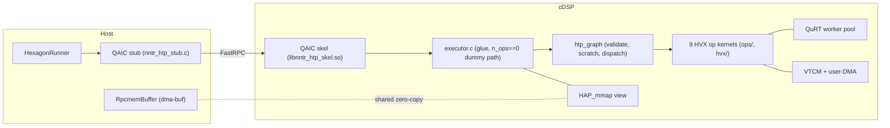

# Hexagon Backend

The Hexagon (cDSP) backend runs a decoder-only LLM on the DSP at **graph
granularity**: the host hands over an op-list and every large buffer once,
and each `forward()` call executes the whole list — one FastRPC round-trip
(~0.26 ms) per prefill chunk or decode token, so RPC overhead is
negligible even at M=1.

Status: qwen3-0.6b (W8_CX int8 weights) runs end-to-end on an 8 Elite
cDSP from a packed weight image and matches the x86 reference executor at
the model level (PPL 19.98 vs 20.27 reference). The CausalLM app runs it
through `"engine": "htp"` in `nntr_config.json` (section 5.4) at
13 tok/s decode / 24 tok/s prefill, with CPU fallback verified. That is
still **slower than the same phone's CPU running the fp32 checkpoint
(18.7 tok/s decode)**: the W8A8 matmul inner loop is compute-bound
(section 8.2) and is the next piece of work (section 9). The standalone
harnesses in section 5.3 remain the measurement/debug entry points.

---

## 1. Architecture



The host side is arm64 Android; the DSP side is hexagon v75/v79.

* **`nntr_htp.idl`** defines the wire interface. QAIC generates a host
  stub and a DSP skel from it at build time; neither is committed.
* **`nntr_htp_common.h`** is the op-list wire format (section 1.4), plain
  C compiled by both toolchains. Both sides pin `NNTR_HTP_ABI_VERSION`;
  `init()` performs a version handshake and rejects a mismatch with
  `AEE_EUNSUPPORTED` before touching anything else.
* **`RpcmemBuffer`** (host) is a move-only RAII wrapper around one rpcmem
  (dma-buf) allocation — memory the CPU and DSP share zero-copy.
* **`HexagonRunner`** (host) owns one `remote_handle64` session:
  `create()` → `init()` → `forward()`* → destructor closes. `create()`
  returning `nullptr` means "no usable DSP"; callers take the CPU path.
* **`executor.c`** (DSP) is the FastRPC glue: validates the op-list, maps
  the handed-off buffers persistently, and builds an `htp_graph` that
  `forward()`/`forward_debug()` delegate to. With `n_ops == 0` it keeps
  the M1 dummy pattern (a deterministic fill mixing in `weights[0]`) so
  the round-trip test can prove host-written data is visible through the
  mapping.
* **`htp_graph`** (DSP) owns what the kernels share: validates the
  op-list once at `init()`, sizes quantization/attention scratch from an
  op scan, acquires VTCM best-effort (DDR fallback), and per call
  dispatches the ops sequentially through the kind table. Each kernel
  fans out over the **QuRT worker pool** (one worker per HVX unit) and
  returns at a barrier.

### 1.1 Buffer strategy: hand off once, map forever

WEIGHTS / KV / ACT cross the boundary **once**, at `init()`, as dma-buf
fds; the DSP maps them with `HAP_mmap` for the session lifetime.
`forward()` carries only `token_ids` in and `logits` out — the FastRPC
driver manages coherency for those small sequence arguments.

Two non-obvious mechanics, both learned during bring-up:

1. **A raw fd number is meaningless to the DSP.** The host must first
   register it with `fastrpc_mmap(domain, fd, addr, 0, size,
   FASTRPC_MAP_FD_DELAYED)`; otherwise `HAP_mmap` fails with
   `AEE_ENOMEMORY`. Re-registering returns `AEE_EALREADY`, which
   `HexagonRunner::init()` treats as success so re-init works.
2. **The weights buffer is additionally passed as an in-sequence** in the
   same `init()` call: the driver performs the one-time CPU cache flush
   for in-parameters, the DSP ignores the sequence and keeps only the fd
   mapping. Weight content must be final before `init()`.

598 MB WEIGHTS + 224 MB KV + 4 MB ACT allocate fine as three rpcmem
buffers; `init()` takes ~1 s.

### 1.2 Session setup: unsigned PD

`create()` requests an unsigned protection domain via
`remote_session_control(DSPRPC_CONTROL_UNSIGNED_MODULE, ...)` before
opening the session — HVX needs no privileges, and this avoids per-device
testsig installation. The call is best-effort; `remote_handle64_open` is
the real gate.

### 1.3 Error convention

DSP methods return AEE codes (`AEEStdErr.h`) unchanged to the host. **rout
parameters are not copied back on failure** — `dsp_abi_version` reads 0
when `init()` fails; that is expected, not a marshalling bug.

### 1.4 Op-list wire format (ABI v4)

The op-list passed to `init()` is one 64-byte `nntr_htp_oplist_header`
(magic, version, `n_ops`, model shape — layers/heads/dims/`max_seq`/
`max_chunk`, and the WEIGHTS layout id (`weight_layout`, v4)) followed by
`n_ops` × 64-byte `nntr_htp_op_desc` records. Each descriptor names an op
kind, its m/k/n shape (`m == 0` means "the per-call token count"), and up
to four tensor references — a buffer id (WEIGHTS / KV / ACT / TOKENS /
LOGITS) plus a 128-byte-aligned offset.

| kind | computes |
|------|----------|
| `EMBED` | tiled32 int8 embedding row gather + dequant → fp16 |
| `RMSNORM` | RMS norm, optional per-head QK-Norm (`FLAG_PER_HEAD`) |
| `MATMUL_W8A8` | per-token dynamic-quant int8×int8 matmul over tiled32 weights → fp16 |
| `MATMUL_W8A16` | fp16 activation × int8 weight, fp32 accumulate → fp16 (no activation quant; `down_proj`) |
| `ROPE` | rotary embedding on q/k in place, precomputed cos/sin |
| `ATTN` | causal GQA attention against the persistent KV cache |
| `SILU_MUL` | SiLU(gate) ⊙ up |
| `ADD` | elementwise residual add |
| `MATMUL_LOGITS` | last-token int8 matmul over tiled32 weights → fp32 logits |

`init()` validates everything up front (header, kinds, alignment, every
tensor ref bounds-checked against the real buffer sizes) and rejects a
bad list with `AEE_EBADPARM`; `forward()` only checks runtime arguments
(token count ≤ `max_chunk`, position < `max_seq`, logits length).

v4 additions: `reserved2[0]` became `weight_layout` and must read
`NNTR_HTP_WEIGHT_LAYOUT_TILED32` (1); any other value is rejected with
rc 4. `MATMUL_W8A8` / `MATMUL_LOGITS` need `n % 32 == 0` and `EMBED`
needs `vocab % 32 == 0` (rc 5) because their weights are stored in
32-row tiles (section 2.1). `MATMUL_W8A16` (`down_proj`) stays row-major
and is exempt. All four (`MATMUL_W8A8`/`MATMUL_W8A16`/`MATMUL_LOGITS`/
`EMBED`) also require `k % 128 == 0`. A v3 op-list fails the version
check as before.

v3 additions: `forward()` returns the DSP cycle count of the op loop
(`HAP_perf_get_pcycles`), and `forward_debug()` runs ops `[0, n)` only
and returns a byte slice of WEIGHTS/KV/ACT — the primitive behind the
divergence bisect (section 6). A partial run still updates KV, so debug
sessions restart from pos 0.

---

## 2. Graph lowering and weight image

Lowering is host-side, SDK-free C++: it turns a model's shape into the
op-list plus WEIGHTS/ACT layout plans, and packs the weight image at
those offsets. `graph_lowering.h` (backend) holds only model-agnostic
vocabulary — `HexModelConfig`, `HexModelWeights`, `HexLoweredGraph`,
`align128()`, `pack_weights()`; the qwen3 recipe `lower_qwen3()` lives
with the app under `Applications/CausalLM/hexagon/`. A second model adds
its own `*_lowering.cpp` and reuses `pack_weights()` unchanged.

`lower_qwen3(cfg)` is pure shape computation (reads no weights);
`pack_weights(g, cfg, w, dst)` copies/converts each tensor of `w` to the
offsets `g.woff` already holds.

### 2.1 WEIGHTS image

A bump cursor lays out the image with every tensor 128B-aligned:

1. `embed` — int8 `[vocab][hidden]`, tied and reused as the
   `MATMUL_LOGITS` weight;
2. `embed_scale` — fp32 `[vocab]`;
3. `rope_table` — fp16 `[max_seq][cos64||sin64]`, angle
   `p * theta^(-2i/128)`, precomputed on the host;
4. `final_norm` — fp16 `[hidden]`;
5. per layer: `wq/wq_s`, `wk/wk_s`, `wv/wv_s`, `wo/wo_s`, `gate/gate_s`,
   `up/up_s`, `down/down_s`, then `attn_norm/ffn_norm/q_norm/k_norm`.

Projections carry one fp32 scale per output channel and are int8, but
since ABI v4 every projection except `down` is stored **tiled32** — the
same `N*K` bytes in a different order:

```
n_tiles = N / 32, k_tiles = K / 128
tile(nt, kt)  : 4096 B at ((nt * k_tiles + kt) * 4096)   # n-tile outer, k-tile inner
inside a tile : 32 vectors v[g], g = 0..31 (128 B each)
v[g] bytes [4r, 4r+3] = w[nt*32 + r][kt*128 + 4g .. +3]    (r = 0..31)
```

One vector therefore holds "32 rows × 4 consecutive k", which is exactly
what a `vrmpyacc` against a 4-byte activation splat wants: lane `r`
accumulates row `nt*32 + r`, and after all `g` and `kt` every lane is a
complete dot product with no horizontal reduction. A whole n-tile's K
strip (`32*K` bytes) is contiguous, so it streams with one DMA
descriptor. The inverse index is
`nntr_htp_tile_off(n, k, K) = ((n/32)*k_tiles + k/128)*4096 + ((k%128)/4)*128 + (n%32)*4 + k%4`
(`nntr_htp_common.h`); the host packer (`nntr_htp_repack_tiled32`), the
DSP kernels and the scalar references all use that one function.
Requirements: `K % 128 == 0` (as before) and `N % 32 == 0`; qwen3-0.6b's
N ∈ {1024, 2048, 3072, 151936} all qualify. `down` stays row-major
`[N][K]` because `MATMUL_W8A16` reads fp16 × int8 rows and gains nothing
from tiles. Norm gammas and the RoPE table are converted to fp16 as
before. For qwen3-0.6b (28 layers, hidden 1024, 16/8 heads, head_dim
128, ffn 3072, vocab 151936, max_seq 2048) the image is still exactly
**598,623,744 bytes** with no alignment padding.

Until the tiled `vrmpy` kernel lands (M6 P3) the `MATMUL_W8A8` /
`MATMUL_LOGITS` kernels gather each output row from the tiles into a
per-worker scratch row and run the previous row-dot; `EMBED` indexes the
table through `nntr_htp_tile_off`. That bridge is correctness-only
(K/4 scalar loads per output row).

### 2.2 ACT buffer

Nine 128B-aligned slots, each sized for `max_chunk` tokens, reused by
every layer (so `act_size` does not scale with `n_layers`):

| slot | per token | role |
|------|-----------|------|
| `x` | `hidden` fp16 | residual stream |
| `t` | `hidden` fp16 | post-norm scratch |
| `q` | `n_heads*head_dim` fp16 | query projection |
| `kb` / `vb` | `n_kv_heads*head_dim` fp16 | this layer's k / v projection |
| `ao` | `n_heads*head_dim` fp16 | attention output |
| `h2` | `hidden` fp16 | matmul-out / residual scratch |
| `g` / `u` | `ffn` fp16 | gate / up projection |

The KV cache is separate: `kv_size = 2 * n_layers * n_kv_heads * max_seq
* head_dim * 2` bytes (fp16 key + value). Per layer/head, K is stored
transposed (`[head_dim][max_seq]`) so the score kernel streams 64
positions per vector; V is `[max_seq][head_dim]`. The validator requires
`max_seq % 64 == 0`. The layout is DSP-private (never read by the host).

### 2.3 Op sequence

`lower_qwen3()` emits `1 + 16 * n_layers + 2` ops (451 for qwen3-0.6b):
`EMBED`, then per layer

| # | kind | |
|---|------|--|
| 1 | RMSNORM | `x * attn_norm -> t` |
| 2–4 | MATMUL_W8A8 | `t * wq/wk/wv -> q/kb/vb` |
| 5–6 | RMSNORM | `q * q_norm`, `kb * k_norm` in place, `FLAG_PER_HEAD` |
| 7 | ROPE | q, kb in place via `rope_table` |
| 8 | ATTN | `q, kb, vb -> ao`, tagged with the layer's KV index |
| 9 | MATMUL_W8A8 | `ao * wo -> h2` |
| 10 | ADD | `x + h2 -> x` |
| 11 | RMSNORM | `x * ffn_norm -> t` |
| 12–13 | MATMUL_W8A8 | `t * gate/up -> g/u` |
| 14 | SILU_MUL | `g, u -> g` in place |
| 15 | MATMUL_W8A16 | `g * down -> h2` |
| 16 | ADD | `x + h2 -> x` |

then a final `RMSNORM` and `MATMUL_LOGITS` (weight refs point at
`embed`). Op 15 is W8A16 because the SwiGLU output is outlier-heavy:
per-token int8 there alone costs ~6 % PPL on qwen3-0.6b (x86 breakdown
on 128 tokens, reference 20.32: all-int8 21.72, down fp32 20.38, wo fp32
21.11, q/k/v/gate/up fp32 21.42, lm_head fp32 21.79).

### 2.4 Checkpoint and packed image files

`nntr_quantize` writes the W8_CX `.bin` (header-less, 598,230,528 B for
qwen3-0.6b): embedding, then per layer `attn_norm, wq, q_norm, wk,
k_norm, wv, wo, ffn_norm, up, gate, down`, then `output_norm` (2-D
tensors as int8 `[N][K]` + fp32 `[N]`, norms fp32). `Qwen3W8cxBin` mmaps
it and hands out non-owning pointers as a `HexModelWeights`.

`nntr_hexpack <bin> <prefix> [--layers N]` writes `<prefix>.hexw` (the
WEIGHTS image; 172,498,944 B for the 1-layer bring-up image) and
`<prefix>.hexcfg` (12 `key=value` lines: the 11 `HexModelConfig` fields
plus `weight_layout=tiled32`). Every consumer re-runs `lower_qwen3()`
from the `.hexcfg`, so image and op-list cannot drift.

A `.hexcfg` without `weight_layout` is a pre-v4, row-major image;
`read_hexcfg` rejects it ("legacy image ... regenerate with
nntr_hexpack") so it can never be paired with the tiled kernels. The
CausalLM app packs from the `.bin` at start-up and needs no regeneration.

---

## 3. Source layout

```
nntrainer/tensor/hexagon/
├── htp/                      # hexagon-clang (DSP side)
│   ├── nntr_htp.idl          # FastRPC interface (init/forward/forward_debug)
│   ├── nntr_htp_common.h     # op-list wire format v4 + validation + tiled32 index (shared with host)
│   ├── executor.c            # FastRPC glue -> htp_graph (or n_ops==0 dummy path)
│   ├── htp_graph.{h,c}       # executor: pool, scratch, VTCM, dispatch, forward_upto
│   ├── worker_pool.{h,c}     # QuRT worker pool + barrier
│   ├── ops/                  # one kernel per op kind
│   │   ├── hvx-matmul.c      # W8A8 (DDR + VTCM/DMA), W8A16, LOGITS
│   │   ├── hvx-attn.c / hvx-rmsnorm.c / hvx-rope.c / hvx-embed.c
│   │   └── hvx-eltwise.c     # ADD + SILU_MUL
│   ├── hvx/                  # vector helpers: f16 math, quant; exp/inverse from ggml-hexagon
│   ├── hex/                  # scalar utils (ggml-hexagon)
│   └── dma/                  # user-DMA queue (ggml-hexagon)
├── host/                     # NDK clang, part of libnntrainer (enable-hexagon)
│   ├── rpcmem_allocator.{h,cpp}
│   ├── hexagon_runner.{h,cpp}
│   └── graph_lowering.{h,cpp}   # HexModelConfig/Weights, pack_weights(), f32_to_f16_bits
└── meson.build

Applications/CausalLM/hexagon/
├── qwen3_lowering.{h,cpp}    # lower_qwen3(): the op sequence of section 2.3
├── qwen3_w8cx_bin.{h,cpp}    # mmap reader for the W8_CX .bin
├── hexagon_backend.{h,cpp}   # engine="htp" session: .bin -> rpcmem -> HexagonRunner (section 5.4)
├── hex_image.{h,cpp}         # .hexcfg read/write + raw file helpers
└── hex_pack.cpp              # nntr_hexpack (meson target, host-only)

test/hexagon/
├── test_oplist_header.c      # x86: wire-format self-check
├── test_lowering.cpp         # x86: op-list, layouts, pack_weights, hexcfg round trip
├── test_w8cx_bin.cpp         # x86: .bin reader sanity on the real checkpoint
├── hexagon_ref_run.cpp       # x86: scalar reference executor of a packed image
├── hexagon_rpc_test.cpp      # device: M1 round-trip test (n_ops == 0)
├── hexagon_e2e_test.cpp      # device: runs a packed image through HexagonRunner
└── sim/                      # simulator golden tests
    ├── ref_ops.{h,c}         # scalar reference kernels (also used by hexagon_ref_run)
    ├── ref_fp16_x86.h        # __fp16 stand-in for gcc < 12 on x86
    ├── sim_model.{h,c}       # parameterized hand lowering (qwen3 op sequence, any shape)
    ├── test_profile.c        # per-op-kind pcycle profile at qwen3 shape (SIM_PROF lines)
    └── test_*.c              # one file per test

tools/hexagon/
├── build_host_x86.sh         # x86 tests + nntr_hexpack + hexagon_ref_run (no SDK)
├── build_skel.sh             # qaic + hexagon-clang -> libnntr_htp_skel.so
├── build_sim_test.sh / run_sim_test.sh
├── build_host_test.sh        # NDK cross-build: hexagon_rpc_test + hexagon_e2e_test
├── run_device_test.sh / check_rpc_log.py / plot_rpc_latency.py   # M1 round-trip
├── run_e2e_test.sh           # push image + harness, run, pull dumps, capture FARF
├── make_tokens.py            # text -> int32 LE token file
├── find_divergence.py        # bisect the first op where DSP != x86 reference
└── summ_prof.py              # SIM_PROF logs -> per-kind / rescaled / thread-balance tables
```

`hvx/hvx-exp.h`, `hvx-inverse.h`, `hvx-base.h`, `hvx-floor.h`,
`hvx-types.h`, `hex/` and `dma/` are imported from llama.cpp's
ggml-hexagon backend (MIT); they keep their headers and are listed in
`NOTICE`.

---

## 4. Build integration (`enable-hexagon`)

```bash
./tools/package_android.sh . -Denable-hexagon=true -Dhexagon-sdk-root=$HEXAGON_SDK_ROOT
```

Prerequisites: Hexagon SDK 6.3.0.0+ (bring-your-own, as for QNN) and an
Android NDK. The option (default `false`, strict no-op when off):

* errors out unless `platform=android` and an SDK root is given;
* runs QAIC at **configure time** into `<builddir>/nntr_htp_generated/`
  (the Android build is meson-configure → ndk-build, so the stub path
  must be a plain string) and registers the `.idl` as a reconfigure
  trigger;
* adds `host/*.cpp` + the stub to `nntrainer_sources` and ships
  `libcdsprpc.so` as a prebuilt — a link stub only; at runtime the
  device's `/vendor/lib64/libcdsprpc.so` resolves under the same soname.

The DSP skel is **not** part of the meson build (section 5.3).

---

## 5. Build and run

### 5.1 x86 (no SDK, no device)

```bash
./tools/hexagon/build_host_x86.sh        # -> build_x86_hexagon/{test_lowering,test_w8cx_bin,nntr_hexpack,hexagon_ref_run}
./build_x86_hexagon/test_lowering                        # LOWER_TEST PASS
./build_x86_hexagon/test_w8cx_bin $W8CX.bin              # W8CX_BIN_TEST PASS
gcc -Wall -Werror -o /tmp/t test/hexagon/test_oplist_header.c && /tmp/t
ninja -C build_x86 Applications/CausalLM/nntr_hexpack    # same tool via meson

./build_x86_hexagon/nntr_hexpack $W8CX.bin /tmp/qwen3_full            # ~2 s
python3 tools/hexagon/make_tokens.py $HF_DIR text.txt /tmp/t.i32 --limit 512
./build_x86_hexagon/hexagon_ref_run /tmp/qwen3_full --tokens /tmp/t.i32 --eval
```

Images packed before ABI v4 (no `weight_layout` line in the `.hexcfg`)
must be regenerated with `nntr_hexpack`; sizes are unchanged
(598,623,744 / 172,498,944 bytes). The `--eval` PPL is bit-identical
across the layout change because the int8 paths are integer-exact
(verified on 386 steps of a local prompt: PPL 37.4738 / top1 133 before
and after).

`hexagon_ref_run` interprets a packed image with the scalar `ref_*`
kernels — the same fp16 + per-token int8 math as the DSP — and is the
accuracy oracle. Modes: default (prefill in chunks, then greedy
`--steps N`), `--eval` (teacher-forced PPL, one token per step),
`--dump-op i --dump-out f` (run ops `[0, i)`, write op `i-1`'s output),
`--list-ops`. `ref_ops.c` is C shared with the simulator; on x86 it is
compiled as C++ so `__fp16` can be a conversion struct
(`ref_fp16_x86.h`) on gcc 11.

### 5.2 Simulator golden tests

```bash
source $HEXAGON_SDK_ROOT/setup_sdk_env.source
HEX_ARCH=v75 ./tools/hexagon/build_sim_test.sh    # -> build_hexagon/sim/libnntr_sim_test.so
HEX_ARCH=v75 ./tools/hexagon/run_sim_test.sh <name>
```

`hexagon-sim` boots a QuRT image and dispatches one test by name; a pass
prints `SIM_TEST <name> PASS`. The 13 tests (`smoke pool exp quant
matmul matmul_dma rmsnorm rope eltwise embed attn logits graph`) compare
each kernel — and `graph`, a full 2-layer prefill/decode plus partial
execution — against `ref_ops.c` with a mixed bound `|d| <= atol + rtol *
|ref|`; the integer paths are bit-exact by construction. All pass on
v75 and v79 (SDK 6.3.0.0, toolchain 8.8). The `run_main_on_hexagon`
image is picked per `HEX_ARCH`; `HEX_EXTRA_CFLAGS` appends compiler
flags to both sim and skel builds.

**Profile test.** `run_sim_test.sh profile <acc|prefill0|prefill512|decode512>
[n_workers]` lowers the qwen3-0.6b shape with 2 layers and vocab 4096
(`sim_model`) and prints `SIM_PROF` lines: per-op-kind pcycles
(`htp_graph_profile_get`, a DSP-side API — the RPC ABI is unchanged) for
a 128-token chunk at pos 0, the same chunk at pos 512, or the median of
eight n=1 decode steps at pos 512, plus the cost of 1000 empty
`wp_run()` barriers. `acc` runs only that 8-token accuracy check (a few
minutes) and is the per-task gate from M6 P2 on; `prefill0` additionally
checks an 8-token prefill against the reference; the other two scenarios
only time the graph. That
check uses the same 0.1 atol/rtol bound as `find_divergence.py` (section
6), not the graph test's tighter 3e-2/5e-2, because per-token int8
re-binning at this depth amplifies a 1-ulp fp16 difference roughly 2×
per layer. `n_workers` requests the pool size
(`htp_graph_init_ex`; `wp_create` clamps it to the 128B-mode HVX-unit
count, 4 in the simulator — the device count is not recorded yet).
`SIM_TIMING=1` adds
`--timing`, but it is impractically slow at this shape — a 2026-09-14
run was aborted after 30 minutes without reaching its first
`SIM_PROF scenario=` line (it stalled inside the 8-token accuracy
forward), so section 8.3's baseline uses `timing=off` throughout.
`python3 tools/hexagon/summ_prof.py logs/hexagon/sim_prof_*.log`
rescales to 28 layers / full vocab and prints a sim-derived ms/token at
2.09 GHz; these are simulator cycles, not device measurements
(section 8.3). Every scenario also prints one `SIM_PROF op=` line per op
(kind, layer, k, n, pcycles); `summ_prof.py` groups them by (kind, k, n).

### 5.3 Device

```bash
source $HEXAGON_SDK_ROOT/setup_sdk_env.source          # + ANDROID_NDK
HEX_ARCH=v75 ./tools/hexagon/build_skel.sh             # -> build_hexagon/skel/libnntr_htp_skel.so (see section 7)
./tools/hexagon/build_host_test.sh                     # -> build_hexagon/host/{hexagon_rpc_test,hexagon_e2e_test}

./tools/hexagon/run_device_test.sh [serial]            # RPC_TEST PASS
python3 tools/hexagon/check_rpc_log.py logs/hexagon/device_test_<stamp>.log

./tools/hexagon/run_e2e_test.sh /tmp/qwen3_full [serial] -- --tokens /tmp/t.i32 --eval
./tools/hexagon/run_e2e_test.sh /tmp/qwen3_full [serial] -- --tokens /tmp/t.i32 --chunk 128 --steps 64
```

The binaries link only host sources + stub with `-static-libstdc++`
(`libc++_shared.so` does not exist under `/data/local/tmp`). The run
scripts write `0x1f` into `<binary>.farf` on the device — without it
DSP FARF lines never reach logcat — and capture them into
`logs/hexagon/device_farf_<stamp>.log`. `run_e2e_test.sh` pushes the skel,
harness, image and token file only when the device copy differs in size
(the image is ~600 MB) and pulls back `--dump-out` files.

`hexagon_rpc_test` drives `init()` with `n_ops == 0` and verifies the
RPC/mapping contract: session open, rpcmem, ABI-mismatch rejection, fd
registration + `HAP_mmap`, the dummy pattern `token_ids[i%3] + pos + i +
weights[0]` (proving host-written data is visible), and 32 timed
round-trips. `hexagon_e2e_test` mirrors `hexagon_ref_run`'s modes so
the two outputs compare 1:1; every line starts with `E2E ` and each step
reports DSP pcycles and host wall time.

### 5.4 The CausalLM app (`engine="htp"`)

The app never goes through nntrainer's `Engine`/`Context` (the `"htp"`
`ComputeEngine` string exists but nothing registers a context for it):
per-layer dispatch would reintroduce the per-op RPC cost the design
rejects, so the offload is all-or-nothing at the app level.

```json
{ "engine": "htp", "model_file_name": "nntr_qwen3_0.6b_w8cx_DEFAULT.bin", ... }
```

`main.cpp` sees `"engine": "htp"` and, for `Qwen3ForCausalLM`, calls
`CausalLM::initHexagon(weight_file)` **instead of**
`initialize()/load_weight()/repack_weight()`:
`HexagonBackend::create()` (`Applications/CausalLM/hexagon/`) reads the
W8_CX `.bin` with `Qwen3W8cxBin`, lowers with `lower_qwen3`, packs the
weight image straight into rpcmem (no `.hexw` file), and hands
WEIGHTS/KV/ACT to `HexagonRunner::init()`. On success the CPU graph is
never built (no 600 MB of CPU weights); `run()` then routes its three
`incremental_inference` call sites through one `infer()` helper that
sends the prompt in `max_chunk` pieces and one token per decode step, and
the host KV-cache management becomes a no-op (KV lives on the DSP).
Sampling, streaming, EOS handling and multi-turn positions
(`global_token_len`) are unchanged.

Fallback is the safety net, not a strategy: any failure at init (no skel,
`open`/`init`/ABI error, rpcmem, checkpoint shape mismatch) or an
unsupported option (`batch_size > 1`, system-prompt KV save/load,
`skip_prefill`, untied `lm_head`) prints a `hexagon: ...` line on stderr
and the app runs on the CPU exactly as before. A `forward()` failure
mid-generation ends the run with an exception — there is no CPU graph to
switch to.

Build: `tools/package_android.sh . -Denable-hexagon=true
-Dhexagon-sdk-root=...` (the prebuilt now exports `-DENABLE_HEXAGON=1`
to ndk-build consumers), then `Applications/CausalLM/build_android.sh
--cache` — without `--cache` the app script wipes `builddir` and rebuilds
nntrainer with its default options, i.e. without the backend.
On the device the process needs `ADSP_LIBRARY_PATH`/`DSP_LIBRARY_PATH`
pointing at the directory holding `libnntr_htp_skel.so`, and a copy of
the vendor `/vendor/lib64/libcdsprpc.so` next to the binary (the app
links `libandroid`, so `/vendor/lib64` must **not** be on
`LD_LIBRARY_PATH` — vendor `libbase` then shadows the system one and the
executable fails to link).

Measured on the S25 (default prompt, 18-token prefill, 64 generated
tokens): DSP init (mmap + pack 598 MB + `init`) inside a 6.4 s e2e,
prefill 23.8 tok/s, generation **13.0 tok/s**, peak RSS 758 MB — the same
per-token cost as the harness (section 8.2), i.e. no measurable app
overhead from tokenizer/sampling. Fallback, verified two ways: with the skel removed the app prints
`hexagon: open failed (0x80000406), CPU fallback`; with an fp32
checkpoint under `engine="htp"` it prints `hexagon: w8cx bin: size
2384199680 != expected 598230528, CPU fallback` and then generates on the
CPU (18-token prefill 52 tok/s, decode **18.7 tok/s**, RSS 3.1 GB). Note
the W8_CX CPU loader is not on this branch (it lives on `hvx_m3`), so a
W8_CX checkpoint that falls back stops with `No matching enum for value:
W8_CX-FP32` — a pre-existing gap, not part of the DSP path.

| path (S25, same prompt) | prefill | decode | RSS |
|---|---|---|---|
| DSP, W8_CX (`engine="htp"`) | 23.8 tok/s | 13.0 tok/s | 758 MB |
| CPU, fp32 (fallback) | 52.0 tok/s | 18.7 tok/s | 3.1 GB |

The DSP path wins on memory (int8 weights, KV on the DSP) and loses on
speed until the matmul kernel is fixed; see section 9.

---

## 6. Debugging a divergence

```bash
python3 tools/hexagon/find_divergence.py /tmp/qwen3_full /tmp/t.i32 --serial <serial> --chunk 8
# -> FIRST_DIVERGENCE op=<i> kind=<k> layer=<l> max_abs=.. max_rel=..   or NO_DIVERGENCE
```

Both runners execute ops `[0, i)` for the same chunk at pos 0 and dump
op `i-1`'s output (`hexagon_ref_run --dump-op`, `hexagon_e2e_test
--dump-op --dump-buf --dump-off --dump-bytes` over `forward_debug`).
"Outputs agree" is monotone in `i`, so 451 ops take 9 comparisons.
The last op writes LOGITS, which `forward_debug` cannot dump; judge it by
the `--eval` PPL of both runners. Default tolerance is 0.1: per-token
int8 amplifies ~1e-4 fp16 noise 5–8× per matmul (measured on the 1-layer
image: ATTN rel-RMS 1e-4 → next W8A8 3e-3), so a tight tolerance flags
two correct implementations as diverged. Use a 1-layer image
(`nntr_hexpack --layers 1`) for fast iteration.

---

## 7. HVX kernel rules (8 Elite silicon)

Found with the 1-layer image + `find_divergence.py`; the v75/v79
simulators pass either way, so a device pass is not optional.

1. **IEEE-format HVX float instructions are not trustworthy on this
   part.** `Q6_Vhf_vadd_VhfVhf` returned all zeros on silicon; in the
   v79-native build `Q6_Wsf_vmpyacc_WsfVhfVhf` and chained
   `Q6_Vqf32_vadd_Vqf32Vqf32` produced inf in ATTN and the W8A16 dot
   (also on the v79 simulator, printf-sensitive). Kernels use only
   qf-format ops — `Wqf32_vmpy_VhfVhf`, `Vqf32_vadd/vsub_VsfVsf`,
   `Vqf32_vmpy_VsfVsf`, `Vsf_equals_Vqf32`, `Vhf_equals_Wqf32` — and the
   device skel is built with **`HEX_ARCH=v75`**, which runs unchanged on
   v79 silicon. The v79-native build remains a to-do.
2. **`Vhf_equals_Vqf16` after a qf16 multiply rounds badly** (v75 sim
   probe: correct RNE 57 %, truncation 21 %, worse 21 %) while
   `Vhf_equals_Wqf32` is exact RNE. RMSNORM, SILU_MUL, ROPE, ADD and ATTN
   compute in fp32 inside the op and narrow to fp16 once — the same
   contract as the reference. Truncating instead at every op boundary
   costs 2.7 % PPL.
3. **SILU clamps the exp argument** (`-g <= 80`): qwen3 layer 27 has
   |g| > 250, `exp(-g)` overflowed and the HVX reciprocal turned
   `1/(1+inf)` into NaN instead of 0.
4. The kernels require `-mhvx-ieee-fp` (toolchain 8.8) for the fp16
   intrinsics; both build scripts pass it.

---

## 8. Results

Device: Galaxy S25 (SM-S931N, SM8750 = 8 Elite, cDSP v79), v75 skel,
SDK 6.3.0.0, 2026-08-31. Dummy `forward()` round-trip (M1 test, 32
iterations): 231 / 255 / 284 µs min / median / max.

### 8.1 Accuracy

Text: `eval.txt` (387 tokens) and its first 128; long = *Pride and
Prejudice*, first 70k chars in 8 × 2048-token windows (torch proxy).

| baseline | 128 tok | 387 tok | 16,376 tok |
|---|---|---|---|
| ① fp32 (nntrainer `--eval` / torch) | 19.893 | 19.1652 | 26.4673 |
| ② fake-quant W8_CX | 20.3183 | 19.5977 | 26.5031 |
| ②' x86 reference, packed image | 20.3758 | **20.2718** (top-1 155) | — |
| ③ DSP, same image | 21.3479 | **20.2802** (top-1 154) | — |

* ③ vs ②' on 387 tokens: **+0.04 % PPL**. On 128 tokens they swing by
  several percent against each other for the amplification reason in
  section 6, so short-text logit gates between two correct
  implementations are not meaningful; the model-level number is.
* ③ vs ② (+3.5 %) is the activation-quantization cost of the w8a8
  design — ②' shows the same +3.4 % — not a kernel error.
* 1-layer image: device vs reference top-1 8/8, generated ids identical;
  per-op rel-RMS ≤ 1e-4 up to ATTN, bit-exact for EMBED / RMSNORM / W8A8.

### 8.2 Performance (M5)

`--chunk 128 --steps 64`; medians over decode steps 2–64, host wall time
around each RPC. "M4" is the scalar-score attention kernel, "M5" the
vectorized one (K cached transposed, 64 positions per vector pair), both
measured back to back on the same device session.

| input | prefill M4 → M5 | Mcycles/tok | decode (n=1) M4 → M5 | Mcycles/tok |
|---|---|---|---|---|
| 512 tok | 24.5 s → 20.5 s (21.1 → **25.2 tok/s**) | 100 → 84 | 102.0 → 89.2 ms (9.8 → **11.2 tok/s**) | 211 → 185 |
| 1024 tok | 62.5 s → 44.6 s (16.8 → **23.2 tok/s**) | 126 → 91 | 136.5 → 88.6 ms (7.3 → **11.3 tok/s**) | 286 → 185 |
| teacher-forced, 386 steps | — | — | 78.6 → 77.1 ms (12.7 → 13.0 tok/s) | 159 → 156 |

* Decode no longer depends on position (89 ms at both 512 and 1024) and the
  128-token chunk at pos 896 dropped from 10.8 s to 6.5 s: the old score
  loop did a 64-lane horizontal scalar sum per (query, position); the new
  one accumulates 64 positions per `mpyacc`. The remaining ~88 ms/token is
  the weight path (598 MB at ~7 GB/s effective — the ~60 tok/s bandwidth
  bound is still far).
* Accuracy on `eval.txt` (386 steps) with the M5 kernel: PPL **19.9787**,
  top-1 157 (M4 kernel 20.2802 / 154, x86 reference 20.2718 / 155) —
  within the noise band of section 8.1; generated ids diverge after a
  handful of tokens as expected for two correct w8a8 implementations.
* `HAP_power` vote (compute apptype + DCVS_v3 performance mode, TURBO
  floor, sleep disabled at `init`) was accepted (rc 0) but changed
  nothing: pcycles/µs stayed at 2.09 G in every run, so the cDSP already
  runs at its top corner while the harness hammers it. Not kept; revisit
  when the `engine="htp"` app leaves idle gaps between RPCs.
* The previous per-op HexKL path decoded at ~0.16 tok/s.

**VTCM/DMA double buffering** (`HTP_MM_NO_VTCM` build forces the direct
DDR path; 1024-token prefill + 128 decode steps, same session):

| W8A8 weight path | prefill | decode (n=1) | Mcycles/tok |
|---|---|---|---|
| VTCM ring, DMA double buffer (default) | 44.8 s (23.2 tok/s) | 90.7 ms (11.0 tok/s) | 91 / 187 |
| direct DDR reads (`HEX_EXTRA_CFLAGS=-DHTP_MM_NO_VTCM`) | 45.1 s (23.1 tok/s) | 95.1 ms (10.5 tok/s) | 92 / 199 |

Outputs are bit-identical. The overlap buys ~5 % on decode and nothing on
prefill, so neither is limited by getting weights into the core.

**Prefill chunk sweep** (1024 tokens, default kernels):

| `--chunk` | prefill | Mcycles/tok | ACT bytes |
|---|---|---|---|
| 32 | 47.1 s (22.4 tok/s) | 94 | 3.9 MB |
| 64 | 45.9 s (22.9 tok/s) | 92 | 3.9 MB |
| 128 (default) | 44.6 s (**23.3 tok/s**) | 90 | 3.9 MB |
| 256 (`max_chunk=256` image) | 50.3 s (20.9 tok/s) | 101 | 7.9 MB |

`max_chunk=128` stays the default. Prefill costs ~43 ms per token whatever
the chunk size — about 10 GMAC/s on 0.44 GMAC/token — so the W8A8 matmul
is compute-bound in its inner loop (`hvx_dot_i8` per (row, token) with a
horizontal reduction each, the same shape the attention kernel had), not
bandwidth-bound; that is the next target.

### 8.3 Simulator profile (M6 baseline)

hexagon-sim v75 (SDK 6.0.0.2, toolchain 8.7.08), `timing=off`, 2-layer /
vocab-4096 model, workers 4 (auto; `htp_graph_init_ex` can request a
count but `wp_create` clamps it to the simulator's 4 HVX units, so a
6-worker run is not expressible and was skipped), measured
2026-09-14, logs `logs/hexagon/sim_prof_{prefill0,prefill512,decode512}_w4.log`.
Cycles are simulator pcycles; "ms/tok" divides the 28-layer / full-vocab
rescaling by 2.09 GHz and is **not** a device measurement — the
simulator does not model DDR bandwidth, so decode numbers here bound
compute only. `SIM_TIMING=1` (cycle-accurate timing) exists but is
impractically slow at this shape: a `--timing` run of `prefill0` was
aborted after 30 minutes without reaching its first
`SIM_PROF scenario=` line (it stalled inside the 8-token accuracy
forward), against 23m48s wall-clock for the non-timing run below
(prefill512 41m35s, decode512 34m42s). The accuracy gate for these runs
is `profile_prefill_acc STAT max_abs=0.0914676 max_rel=93.3662` — moved
from the P1 baseline because the sim profile model (`sim_model.c` fill)
is now a permuted draw of the same random bytes, read through the tile
index instead of row-major, so the reference and DSP inputs differ from
P1's numerically but the kernels vs. scalar references still agree
bit-exactly on every integer path — inside the 0.1 atol/rtol bound
(section 5.2) with no single divergent op.

**raw (sim pcycles, model as run)**

| scenario | workers | timing | tokens | total | EMBED | RMSNORM | MATMUL_W8A8 | ROPE | ATTN | SILU_MUL | ADD | MATMUL_LOGITS | MATMUL_W8A16 | barrier/op |
|---|---|---|---|---|---|---|---|---|---|---|---|---|---|---|
| prefill0 | 4 | off | 128 | 1028601630 | 1479141 | 1157993 | 939704687 | 298476 | 6102014 | 1291956 | 83238 | 601029 | 77882241 | 4332 |
| prefill512 | 4 | off | 128 | 1059812175 | 1479915 | 1158034 | 938298568 | 298476 | 38715038 | 1292706 | 85885 | 600504 | 77882194 | n/a\* |
| decode512 | 4 | off | 1 | 9265863 | 50160 | 78894 | 7533759 | 10344 | 288128 | 50531 | 22739 | 600837 | 632788 | n/a\* |

\* `barrier_empty_x1000` is only in the `prefill0` log — the other two
were recorded before the test printed that line. The barrier cost does
not depend on the scenario, so the `prefill0` value (4332 cyc/op) is
applied to all three rows of the scaled table below via `--barrier-cyc`.

**scaled to 28 layers / vocab 151936 (sim-derived ms at 2.09 GHz, NOT device time; 451 ops/token, barrier/op override = 4332 cyc)**

| scenario | workers | timing | ms/tok | barrier ms/tok | EMBED | RMSNORM | MATMUL_W8A8 | ROPE | ATTN | SILU_MUL | ADD | MATMUL_LOGITS | MATMUL_W8A16 |
|---|---|---|---|---|---|---|---|---|---|---|---|---|---|
| prefill0 | 4 | off | 53.82 | 0.007 | 0.01% | 0.11% | 91.39% | 0.03% | 0.59% | 0.13% | 0.01% | 0.15% | 7.57% |
| prefill512 | 4 | off | 55.45 | 0.007 | 0.01% | 0.11% | 88.57% | 0.03% | 3.65% | 0.12% | 0.01% | 0.15% | 7.35% |
| decode512 | 4 | off | 69.35 | 0.935 | 0.04% | 0.77% | 73.77% | 0.10% | 2.82% | 0.49% | 0.22% | 15.59% | 6.20% |

Generated by

```bash
python3 tools/hexagon/summ_prof.py --barrier-cyc 4332 \
  logs/hexagon/sim_prof_prefill0_w4.log \
  logs/hexagon/sim_prof_prefill512_w4.log \
  logs/hexagon/sim_prof_decode512_w4.log
```

`--barrier-cyc 4332` forces the `prefill0` barrier value onto all three
rows so every `ms/tok` shares one definition (op cycles + 451 barriers);
the percentages are over the scaled op total, excluding the barrier.
MATMUL_LOGITS is rescaled by vocab, the layer kinds by 28/2; EMBED is a
gather (cost O(tokens × hidden)) and is counted once per forward,
unscaled. Scaling RMSNORM by 14 also multiplies the single final norm,
a known ~0.1 % overstatement.

(Device measurements, section 8.2: 25 tok/s prefill, 11–13 tok/s decode.
The sim-derived numbers land in the same order of magnitude, so the sim
ratios are usable for bottleneck ranking even though they are not a
device measurement.)

Reading: MATMUL_W8A8 is 91% of prefill and 74% of decode's sim-derived
cycles (simulator-derived, not device); at 2-layer × 128-token scale
that op does ≈3.2 GMAC in 938M cycles, ≈3.4 MAC/cycle against HVX's
≈2048 MAC/cycle vrmpy peak, and decode's single-token matmul is equally
inefficient (the average W8A8 call, ≈2.1 MMAC at m=1, costs 628K
cycles — the per-kind counters cannot attribute cost to one op) — so
decode is kernel-efficiency-bound, not bandwidth-bound, at this shape, which puts
the tiled W8A8 kernel ahead of any DMA/VTCM work. MATMUL_W8A16 (`down`)
is next at 7.4%/6.2% and will grow in relative share once W8A8 is
tiled. MATMUL_LOGITS is 15.6% of decode once rescaled to the full
vocabulary, making it decode's second-largest cost after W8A8. ATTN
scales linearly with sequence length (6.1M cycles at L=128 vs 38.7M at
L=640), giving it 3.6% of prefill512 and 2.8% of decode512 — both far
behind W8A8. The barrier (4332 cycles/op, 451 ops/token) sim-derives to
1.95M cycles ≈ 0.93 ms/token (simulator-derived, not device), well under
this project's 3 ms predicate for the fusion follow-up, but inside
decode it dominates the smallest ops (most of RMSNORM's 8.8K cycles and
ADD's 5.7K cycles is the 4.3K-cycle barrier), so any future "split
decode into columns" change gets a low ceiling from the barrier floor
alone. Per-worker instruction counts (T1..T4: 76% / 80% / 84% spread
across the three scenarios) look imbalanced, but the simulator's
per-thread Insns cover the whole run — including DMA busy-waits and
unmeasured setup/fill work — so they are an upper bound on kernel
imbalance, not a measurement of the profiled window; a real balance
verdict needs a `HTP_MM_NO_VTCM` comparison to separate out DMA wait.

M6 P2 (tiled32 layout, ABI v4) changed the WEIGHTS byte order and the
kernels' addressing only; the table above remains the baseline. The P2
bridge kernels are slower than the M5 ones (row gather), so no P2 row is
recorded — P3 replaces the bridge and re-measures all three scenarios.

Budget framing (all simulator-derived, not device): against the 10 ms/tok
sim predicate for prefill (06-verification), everything except W8A8 is
already ≈6.3 ms/tok at prefill512, leaving ≈3.7 ms for W8A8's current
≈49.1 ms — so the tiled W8A8 kernel alone needs roughly 13×
(≈3.4 → ≈46 MAC/cycle), after which MATMUL_W8A16 (≈4.1 ms/tok) is
≈41 % of the whole budget. W8A8 tiling alone therefore cannot close the
gap; W8A16 has to follow.

---

## 9. Planned work

* **Performance (first)**: the W8A8 matmul inner loop (section 8.2:
  prefill is compute-bound at ~10 GMAC/s, decode reads weights at
  ~7 GB/s; the CPU fp32 path is 1.4× faster at decode today) — batch rows
  per weight load and drop the per-dot horizontal reduction, the same
  restructuring the attention kernel got in M5; then VTCM streaming for
  W8A16 (`ponytail:` note in `hvx-matmul.c`) and K^T reuse across query
  rows in prefill attention (`ponytail:` note in `hvx-attn.c`).
* **`engine="htp"` follow-ups**: route host-side `hexagon:` messages
  into the nntrainer logger instead of stderr; system-prompt KV
  save/load on the DSP (today it forces the CPU path); a second lowered
  architecture would move the `Qwen3ForCausalLM` gate in `main.cpp` into
  a per-model lowering table.
* **v79-native skel**: find why the IEEE/qf32-chain paths misbehave
  (section 7) so `HEX_ARCH=v79` can be the default again.
