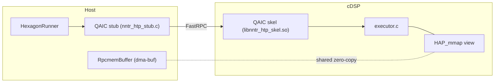

# Hexagon HVX Backend (FastRPC infrastructure)

This document describes the Hexagon HVX backend infrastructure: a
host ↔ cDSP FastRPC layer with persistent buffer mapping, an
on-device round-trip test, and build integration behind the
`enable-hexagon` meson option.

The infrastructure is currently **plumbing only** — the DSP executor
answers `forward()` with a deterministic dummy pattern used by the
round-trip test, and nothing in the nntrainer engine calls it yet.
The engine hookup (dispatching supported graphs to the DSP) is
planned work; see section 6.

---

## 1. Design goal

Offloading individual tensor ops to the DSP pays a FastRPC
round-trip per op. For autoregressive decode (M=1) the ops are tiny
and numerous, so per-call overhead dominates and offload can end up
slower than staying on the CPU.

This backend therefore offloads at **graph granularity**: the DSP
receives an op-list once, keeps every large buffer persistently
mapped, and executes the whole list per call — so decode costs **one
RPC per token**. The infrastructure validates the expensive parts of
that contract — one-time buffer handoff, persistent DSP-side
mapping, and the RPC round-trip itself — on device, and measures the
round-trip at ~0.26 ms median (see section 5). At one RPC per token
this overhead is negligible.

---

## 2. Architecture



The host side is arm64 Android; the DSP side is hexagon v75/v79.

* **`nntr_htp.idl`** defines the wire interface. QAIC generates a
  host stub and a DSP skel from it; both sides are regenerated at
  build time and never committed.
* **`nntr_htp_common.h`** is the op-list wire header (magic + ABI
  version), plain C compiled by both toolchains. Both sides pin
  `NNTR_HTP_ABI_VERSION`; `init()` performs a version handshake and
  the DSP rejects a mismatch with `AEE_EUNSUPPORTED` before touching
  anything else.
* **`RpcmemBuffer`** (host) is a move-only RAII wrapper around one
  rpcmem (dma-buf) allocation — memory the CPU and DSP can share
  zero-copy. `valid()` is the single health check.
* **`HexagonRunner`** (host) owns one `remote_handle64` session:
  `create()` → `init()` → `forward()`* → destructor closes.
  `create()` returning `nullptr` means "no usable DSP" and callers
  must take the CPU fallback path.
* **`executor.c`** (DSP) validates the op-list header, persistently
  maps the handed-off buffers, and serves `forward()`. It currently
  fills logits with a deterministic pattern that mixes in
  `weights[0]` so the test can prove host-written data is visible
  through the mapping.

### 2.1 Buffer strategy: hand off once, map forever

Large buffers (weights / KV cache / activation scratch) cross the
boundary **once**, at `init()`, as dma-buf fds. The DSP maps them
with `HAP_mmap` and keeps the mapping for the session lifetime.
`forward()` carries only `token_ids` in and `logits` out — the
FastRPC driver manages coherency for those small sequence arguments
automatically.

Two non-obvious mechanics, both learned the hard way during
bring-up:

1. **A raw fd number is meaningless to the DSP.** The fd is a host
   process handle; passing it as an `int32` gives the DSP nothing to
   map, and `HAP_mmap` fails with `AEE_ENOMEMORY`. The host must
   first register the fd for the domain with
   `fastrpc_mmap(domain, fd, addr, 0, size, FASTRPC_MAP_FD_DELAYED)`.
   `FASTRPC_MAP_FD_DELAYED` defers the actual mapping to the
   DSP-side `HAP_mmap` call, which is exactly our pattern.
   Re-registering the same fd
   returns `AEE_EALREADY`, which `HexagonRunner::init()` treats as
   success so re-init works.
2. **The weights buffer is additionally passed as an in-sequence**
   in the same `init()` call. The driver performs the one-time CPU
   cache flush for in-parameters; the DSP ignores the sequence and
   keeps only the fd mapping. Weight content must therefore be final
   before `init()` is called.

### 2.2 Session setup: unsigned PD

`create()` requests an unsigned protection domain via
`remote_session_control(DSPRPC_CONTROL_UNSIGNED_MODULE, ...)` before
opening the session. HVX needs no privileges, and unsigned PD avoids
per-device testsig installation and production signing. The call is
best-effort — some firmwares reject it — and the subsequent
`remote_handle64_open` is the real success/failure gate.

### 2.3 Error convention

DSP methods return the AEE codes defined in `AEEStdErr.h`; the
driver passes them through to the host unchanged. Note that **rout
parameters are not copied back on failure** — e.g. `dsp_abi_version`
reads 0 when `init()` fails, which is expected, not a marshalling
bug.

---

## 3. Source layout

```
nntrainer/tensor/hexagon/
├── htp/                      # compiled by hexagon-clang (DSP side)
│   ├── nntr_htp.idl          # FastRPC interface
│   ├── nntr_htp_common.h     # op-list wire header, shared with host
│   └── executor.c            # dummy executor
├── host/                     # compiled by NDK clang, part of libnntrainer
│   ├── rpcmem_allocator.{h,cpp}
│   └── hexagon_runner.{h,cpp}
└── meson.build               # folds host sources + stub into the lib

test/hexagon/
├── test_oplist_header.c      # x86 self-check for the wire header
└── hexagon_rpc_test.cpp      # on-device round-trip test (standalone)

tools/hexagon/
├── build_skel.sh             # qaic + hexagon-clang → libnntr_htp_skel.so
├── build_host_test.sh        # NDK cross-build of the on-device test
├── run_device_test.sh        # adb push + run + log capture
├── check_rpc_log.py          # PASS/FAIL verdict + latency stats
└── plot_rpc_latency.py       # latency histogram (matplotlib)
```

---

## 4. Building

Prerequisites: Hexagon SDK 6.3.0.0 or later and an Android NDK. The
SDK is
proprietary and follows the same bring-your-own-SDK pattern as the
QNN backend (see `QNN_BUILD.md`).

### 4.1 DSP skel

```bash
source $HEXAGON_SDK_ROOT/setup_sdk_env.source
./tools/hexagon/build_skel.sh          # HEX_ARCH=v75 to override (default v79)
# → build_hexagon/skel/libnntr_htp_skel.so
```

The skel is cross-built by hexagon-clang and is **not** part of the
meson build; it is pushed to the device separately (or shipped with
the app and found via `ADSP_LIBRARY_PATH`).

### 4.2 Host library (`enable-hexagon`)

```bash
./tools/package_android.sh . \
  -Denable-hexagon=true \
  -Dhexagon-sdk-root=$HEXAGON_SDK_ROOT
```

What the option does:

* errors out unless `platform=android` and an SDK root is given;
* runs QAIC at **configure time** into
  `<builddir>/nntr_htp_generated/` so the stub path stays a plain
  string for the `Android.mk` source list (the Android build is
  meson-configure → ndk-build, so ninja targets can't be used here);
* registers the `.idl` as a reconfigure trigger (`configure_file`
  copy), so editing the IDL reruns QAIC instead of silently building
  against a stale stub;
* adds `host/*.cpp` and the generated stub to `nntrainer_sources`
  and ships `libcdsprpc.so` as a prebuilt. The SDK copy is a link
  stub only — at runtime the loader resolves the device's own
  `/vendor/lib64/libcdsprpc.so` under the same soname.

The option defaults to `false` and is a strict no-op when off.

### 4.3 Standalone on-device test

```bash
./tools/hexagon/build_skel.sh
./tools/hexagon/build_host_test.sh     # needs ANDROID_NDK; links -static-libstdc++
./tools/hexagon/run_device_test.sh     # [adb-serial]
python3 tools/hexagon/check_rpc_log.py logs/hexagon/device_test_<stamp>.log
```

The test binary links only the host sources + stub (no libnntrainer)
and is linked with `-static-libstdc++` because `libc++_shared.so`
does not exist under `/data/local/tmp`.

`run_device_test.sh` also writes `0x1f` into
`hexagon_rpc_test.farf` on the device before running — without that
file the DSP's FARF log lines never reach logcat, and DSP-side
failures are invisible. FARF output is captured into
`logs/hexagon/device_farf_<stamp>.log`.

### 4.4 What the test verifies

1. session open (skel loads, unsigned PD path works);
2. rpcmem allocation (3 × 4 KB dma-bufs);
3. ABI mismatch rejection (version 999 must fail `init`);
4. successful `init` (fd registration + `HAP_mmap` + handshake);
5. forward pattern match — logits must equal
   `token_ids[i%3] + pos + i + weights[0]`, where `weights[0]` was
   written by the **host**, proving the persistent mapping is real;
6. forward latency, 32 timed iterations (= per-token RPC cost).

Every output line starts with `RPC_TEST`; `check_rpc_log.py` turns a
captured log into a `VERDICT: PASS/FAIL` exit code.

---

## 5. Measured baseline

On an 8 Elite device, 32 dummy `forward()` round-trips:

| min | median | max |
|-----|--------|-----|
| 168 µs | 258.5 µs | 598 µs |

This is the floor cost of one graph-level call per token.

---

## 6. Current status and planned work

Implemented: the FastRPC skeleton described above — IDL, dummy
executor, persistent fd mapping, on-device round-trip test, and the
`enable-hexagon` build wiring.

Planned, in rough order:

* real HVX kernels behind the op-list, plus a DSP worker thread
  pool;
* real weight sizes/layouts in the op-list;
* engine hookup — a Context/ComputeOps integration per
  `ARCHITECTURE.md`, KV-cache invalidation when a `forward()` fails
  mid-generation, and routing DSP-side errors into the nntrainer
  logger (host messages currently go to stderr, DSP messages to
  FARF/logcat);
* power/latency tuning (`HAP_power` votes).

The dummy executor is stateless, so failure handling and power
tuning have nothing to act on until real kernels land.
