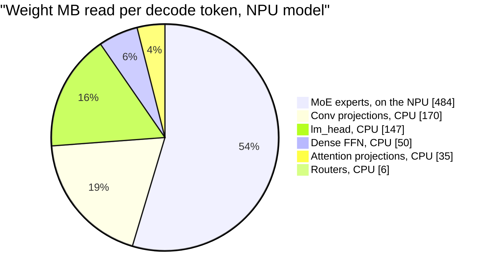
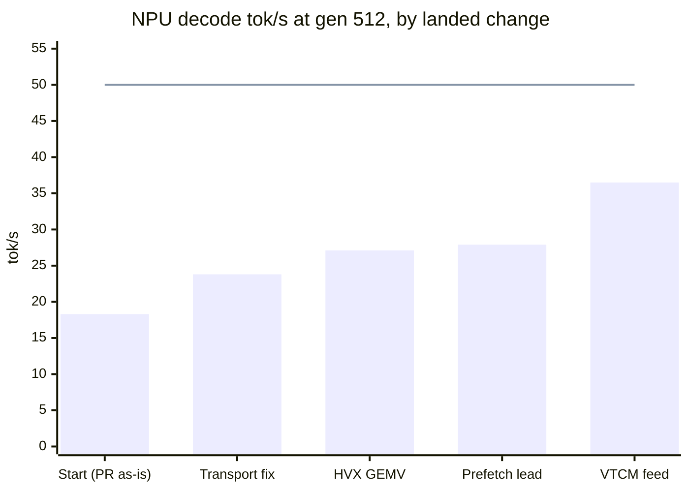
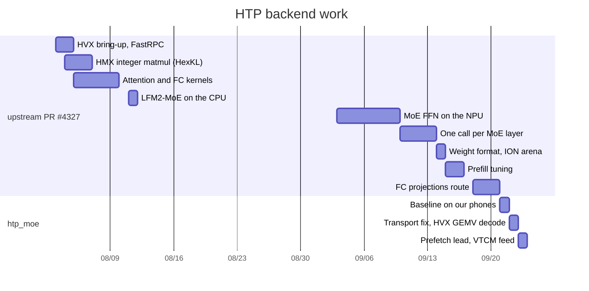

# nntrainer on the Hexagon NPU (HTP backend) — technical overview

As of **2026-09-23**, `htp_moe` @ `9fb1a3bc` (fork `dlwlzzero/nntrainer`).
Device: Samsung Galaxy S25 Ultra (Snapdragon 8 Elite, Hexagon v79).
Model: LFM2.5-8B-A1B, an 8B-parameter mixture-of-experts language model.

This tree holds two bodies of work, tagged throughout these docs:

- **`upstream PR #4327`**: the HTP backend itself. It includes FastRPC
  plumbing, integer matrix multiply on the matrix unit (HMX), attention and
  FC kernels, and the MoE FFN on the NPU. That PR is frozen here at
  `2ce38d65` (2026-07-08 to 2026-09-21).
- **`htp_moe`**: the work after it, aimed at decode speed. It covers the
  call transport, a vector-unit (HVX) decode path for the MoE FFN, weight
  prefetch and streaming, and measurement tooling (2026-09-21 onward).

## Summary

### What runs on the NPU today

| operation (layers per token) | prefill (many tokens at once) | decode (one token at a time) | origin |
|---|---|---|---|
| **MoE FFN** (22) | **On the NPU**, matrix-unit path | **On the NPU**, vector-unit path | PR #4327 (prefill), htp_moe (decode) |
| Attention core (6) | CPU. NPU kernels built and tested, **off** | CPU | PR #4327 |
| FC projections: conv in/out, attention q/k/v/o, dense FFN | CPU. NPU route built, **off** by config | CPU | PR #4327 |
| Norms, RoPE, conv1d, router, lm_head | CPU | CPU | — |

In the measured configuration only the MoE FFN runs on the NPU. The other
NPU kernels exist, but switching them on did not pay in this setup. Moving
*every* layer onto the NPU is the plan for decode ([roadmap](roadmap.md)).

### Results

| | NPU | CPU (8 threads) | |
|---|---:|---:|---|
| **Prefill** tok/s, prompt 512 | ≈ 400–530 | ≈ 270–340 | NPU is ahead, ≈ 1.6× |
| **Decode** tok/s, gen 512: reference, before the feed | 27.89 | **49.22** | NPU is behind |
| **Decode** tok/s, gen 512: VTCM weight feed, the default since PR #118 | **36.49** | | +31 % in the same sitting, text identical |
| **Decode target** | **≥ 50** | | see below: not reachable by bytes with today's CPU/NPU split |

Sources: NPU #117 (2026-09-23), CPU #94 (2026-09-22). The feed was
measured as a variant against the reference in #117 and merged as the
default the same day. It becomes the reference row once a sitting measures
it as its own control. The full table is in [measurement.md](measurement.md).

**Why decode is the hard part.** Decode speed is set by how fast weights
are read: each token reads ≈ 893 MB on the NPU model. The NPU reads its
484 MB of experts through one DMA stream at 31–37 GB/s, depending on the
phone. The CPU reads the other 408 MB at ≈ 50 GB/s (the CPU model reads
953 MB at 52 tok/s). Done one after the other, the floor is ≈ 21–24 ms per
token (≈ 42–47 tok/s). That is above the 20 ms that 50 tok/s needs
([roadmap.md](roadmap.md) §1).

The line is the target. The bars come from
different sittings (#77, #88, #100, #117 A, #117 B). Only an A/B inside one
sitting is a verdict, so the bars show direction, not exact gains.

**Where a decode token's time goes** (gen 512):

| | before the feed | with the feed (default now) | needed for 50 tok/s |
|---|---:|---:|---:|
| MoE on the NPU (22 calls) | 21.9 ms | 15.7 ms | 13.0–15.5 (byte floor) |
| CPU ↔ NPU round trips | 4.2 ms | 2.0 ms | ≈ 0 |
| Everything else, on the CPU | 9.8 ms | 9.7 ms | ≈ 8.2 (byte floor) |
| **token** | **35.9 ms** | **27.4 ms** | **20 ms**, but the floors add up to ≈ 21–24 |

### What is next

1. Measure the feed default as its own sitting's control. That makes
   ≈ 36.5 tok/s the reference number.
2. **Decide how to get under the byte floor.** The options are:
   - CPU and NPU reading at the same time,
   - fewer bytes per token,
   - a faster NPU read.

   The planned one-call-per-token track (#85 → #82 → #81) removes the
   2 ms of round trips. But it moves the CPU's 408 MB onto the NPU's
   slower DMA stream, so it needs a bandwidth measurement first.
3. Sync the ≈ 40 newer upstream PR commits (#120). They add fused conv,
   q/k/v and dense-FFN block calls.
4. The project's earlier "48–52 tok/s physical ceiling" came from an
   estimate of 730 MB per token and 34–38 GB/s of memory bandwidth. Both
   were low, and it is withdrawn ([lessons.md](lessons.md) D1).

### Timeline

## Chapters

| chapter | what it covers |
|---|---|
| [architecture.md](architecture.md) | The whole system in one pass: hardware, who runs what, one token, one MoE call, code map |
| [foundation.md](foundation.md) | FastRPC, the IDL and skel, sessions, shared memory, call cost, build and deploy |
| [hmx-matmul.md](hmx-matmul.md) | Integer matrix multiply on the HMX, tile layouts, the DMA ring, VTCM |
| [weight-format.md](weight-format.md) | From the checkpoint to NPU bytes: formats, the offline packer, bytes per token |
| [moe-ffn.md](moe-ffn.md) | The MoE FFN kernel: the prefill (HMX) path, the decode (HVX GEMV) path, the VTCM feed |
| [measurement.md](measurement.md) | How we measure, how to read a profile, the verification ladder, **the benchmark table** |
| [lessons.md](lessons.md) | Rules learned on silicon, closed questions, negative results |
| [roadmap.md](roadmap.md) | What is left, one call per token, upstream sync, prior work |

Written after the upstream sync (#120): attention, FC and block calls,
model integration.

## Reading the numbers

- **Sitting.** One session on one phone. Variant A (the unchanged
  reference) runs first, and every comparison is inside one sitting.
  Phones drift up to ~16 % between sittings.
- **Gen 64 / 512 / 1024.** Tokens generated after a 512-token prompt.
- **Unit.** Two S25 Ultra phones were used. Their NPU DMA engines differ by
  ≈ 19 % (31.2 vs 37.3 GB/s), so per-call NPU times are not compared across
  them unscaled.
- **(PR author's device).** Numbers the upstream PR measured on its
  author's phone, with its own method. They are shown for context and never
  compared directly with ours.
- **Text identical.** The NPU model's expert weights (`QS4CX_WH`) differ
  from the CPU model's (`Q4_0`), so NPU runs are checked against their own
  control, and kernels are proven bit-identical to the reference path by
  tests.
