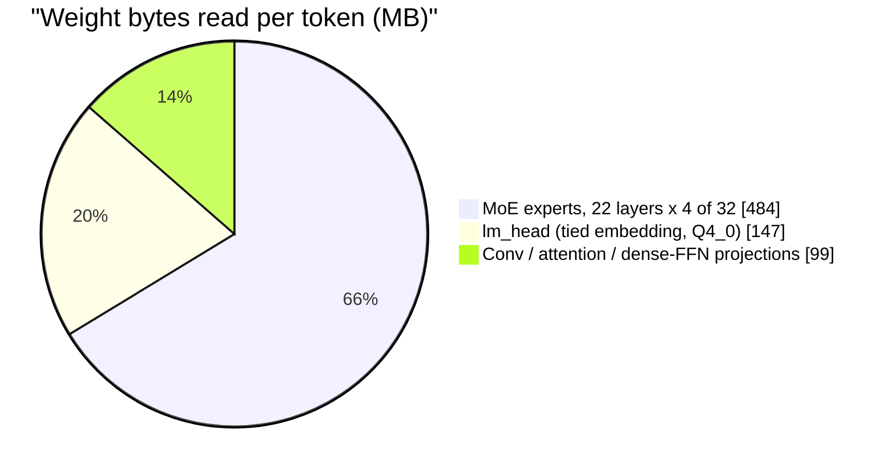

# LFM2.5-8B-A1B decode on the Hexagon NPU — technical overview

As of **2026-09-23**, `htp_moe` @ `192b44dd` (fork `dlwlzzero/nntrainer`).
Device: Samsung Galaxy S25 Ultra (Snapdragon 8 Elite, Hexagon v79).

## Summary (one page)

**Goal.** Run the decode step of LFM2.5-8B-A1B (an 8B-parameter
mixture-of-experts language model) on the phone's NPU at **≥ 50 tokens/s**,
faster than the phone's CPU, with generated text identical to the CPU run.

**Where we are.**

| | gen 64 | gen 512 | gen 1024 | tok/s, prompt 512 |
|---|---:|---:|---:|---|
| NPU, `htp_moe` today | 28.22 | 27.89 | 27.23 | #117 variant A, 2026-09-23 |
| NPU + VTCM weight feed (PR #118, not merged yet) | 37.38 | 36.49 | 35.01 | #117 variant B, same sitting, text identical |
| CPU, 8 threads (the bar to beat) | 52.43 | 49.22 | 48.31 | #94 sitting 2, 2026-09-22 |
| **target** | **50** | **50** | **50** | |

Once the feed lands, the NPU is **1.37× short** of the target at gen 512.
Prefill (reading the prompt) is already faster on the NPU (≈ 400–530 tok/s
vs the CPU's 270–340) and is only guarded here: no change may slow it by
more than 5 %.

The line is the 50 tok/s target. `*` = measured, PR open. Each bar comes
from a different sitting (#77, #88, #100, #117 A, #117 B). Phones drift up
to ~16 % between sittings, so only an A/B inside one sitting counts as a
verdict. The bars show direction, not exact gains.

**Why it is hard.** Decoding one token reads about **730 MB of weights**.
The phone's memory delivers 34–38 GB/s, so no processor can do better than
about 19–21 ms per token, which is **48–52 tok/s**. The CPU already runs at
that ceiling. The target is at the physical limit, not far below it.

**Where a token's time goes now** (gen 512, estimated from tok/s and the
per-call profile of the same sitting):

| | today (A) | with the feed (B) | needed for 50 tok/s |
|---|---:|---:|---:|
| MoE on the DSP (22 calls) | 21.9 ms | 15.7 ms | 13.0–15.5 (byte floor) |
| ARM ↔ DSP round trips | 4.2 ms | 2.0 ms | ≈ 0 |
| Everything else, on the CPU | 9.8 ms | 9.7 ms | ≈ 6.5 (byte floor) |
| **token** | **35.9 ms** | **27.4 ms** | **20 ms** |

**What is next.**
1. Land the VTCM feed (PR #118). It is measured, and making it the default
   is the next step.
2. **One DSP call per token** (issues #85 → #82 → #81). Move every
   remaining layer op onto the DSP so the CPU is no longer in the loop
   between MoE layers. This is the only lever left for the ≈ 5 ms that
   remain after the feed.
3. The target sits at the physical ceiling, so 50 tok/s is reachable only
   on units whose DMA runs at ≈ 37 GB/s. On a 31 GB/s unit the NPU tops out
   near 45 tok/s unless each token reads fewer bytes.

## What was built

Three bottlenecks ("walls") stood between the upstream starting point
(18 tok/s) and the target. Their state:

| wall | what it was | state |
|---|---|---|
| 1. Matrix unit pads 1 row to 64 | The HMX computes 64-row tiles; decode has one row, so 63/64 of the work was waste | **Fixed.** Decode now runs on a vector-unit (HVX) matrix-vector kernel. Its cost is now waiting for weights from memory, which the prefetch lead and then the VTCM feed attack |
| 2. Weight DMA at 16–18 GB/s | The DSP's DMA ran far below an isolated probe (72–117 GB/s) | **Dissolved.** The probe numbers are unreachable by any real per-call copy; the engine's real rate is 31–37 GB/s, depending on the unit |
| 3. ARM ↔ DSP call cost | 0.53–0.59 ms per call × 22 calls per token | **Fixed** to ≈ 0.09–0.19 ms per call (right-sized shared buffers, longer poll). The remainder goes only with one call per token |

How the pieces fit: [architecture.md](architecture.md).

## Chapters

Written:
- [architecture.md](architecture.md): the whole system in one pass. Which
  processor runs what, one token end to end, one MoE call step by step, the
  memory tiers and the code map.

Planned (this list is revised after the first two chapters are reviewed):
transport, weight format, MoE FFN on the matrix unit, decode GEMV on the
vector unit, attention and FC kernels, model integration, measurement
(including the benchmark table and how to update it), lessons (rules learned
on silicon), roadmap.

## Reading the numbers

- **Sitting.** One session on one phone. Variant A (the unchanged
  reference binary) runs first, then the other variants. Every tok/s
  comparison in these docs is inside one sitting.
- **Gen 64 / 512 / 1024.** The number of generated tokens after a 512-token
  prompt. Decode tok/s covers the whole generation.
- **Unit.** Two S25 Ultra phones were used. Their DMA engines differ by
  ≈ 19 % (31.2 vs 37.3 GB/s on an untouched test cell), so per-call DSP
  times are never compared across units unscaled.
- **Text identical.** The NPU model's weights (`QS4CX_WH`) differ from the
  CPU model's (`Q4_0`), so the NPU is checked against its own control, not
  against the CPU's text. Kernels are additionally proven bit-identical to
  the reference path by host and device tests.
