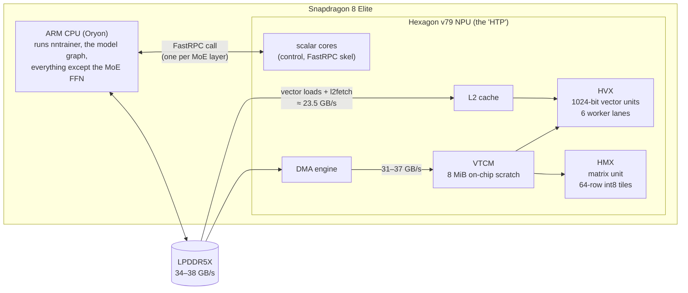
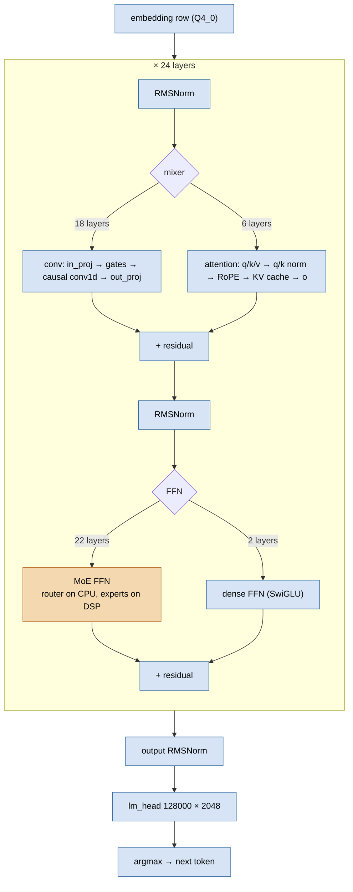
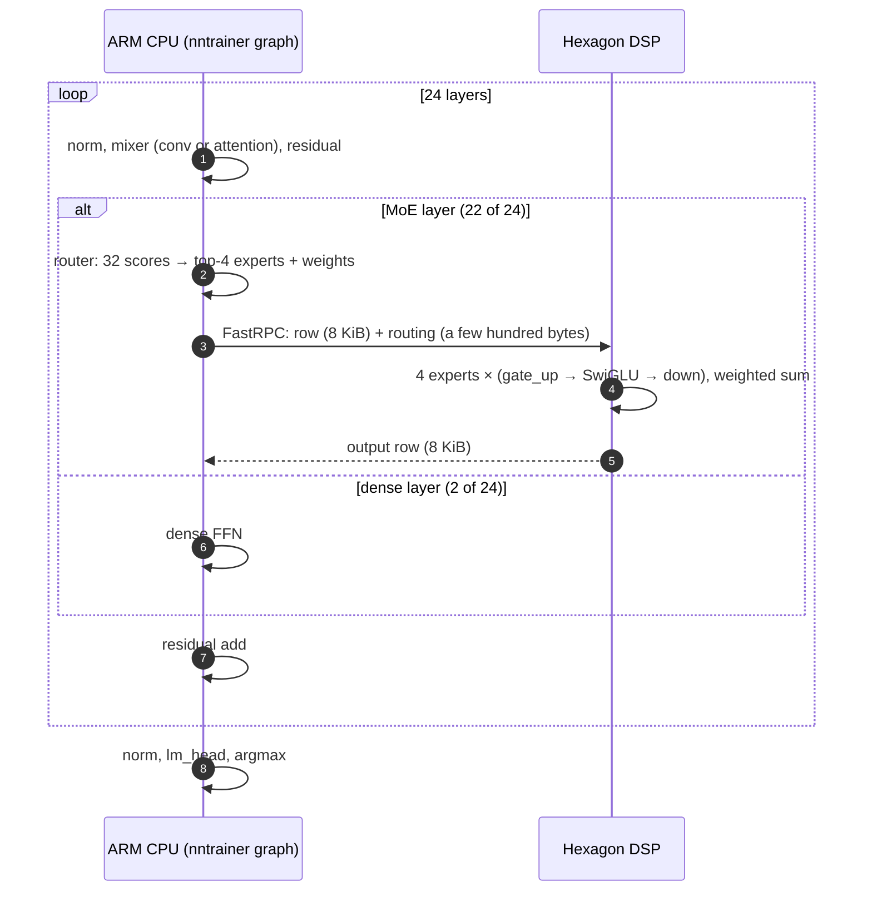
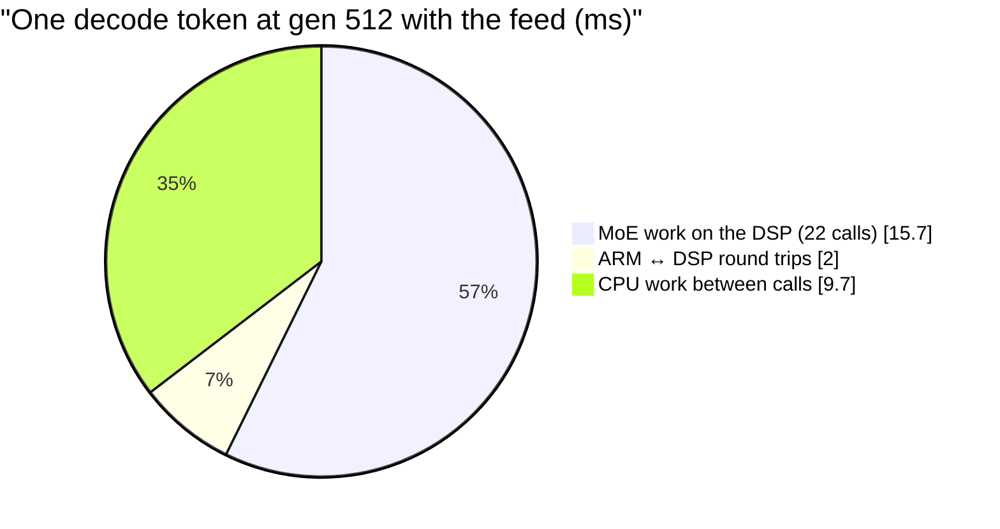
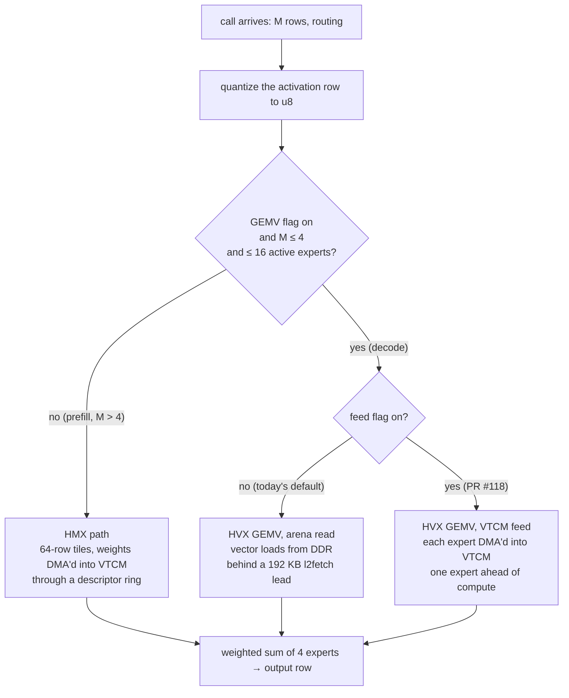
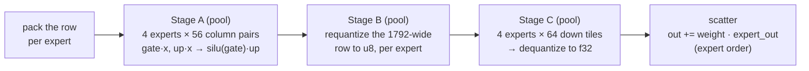
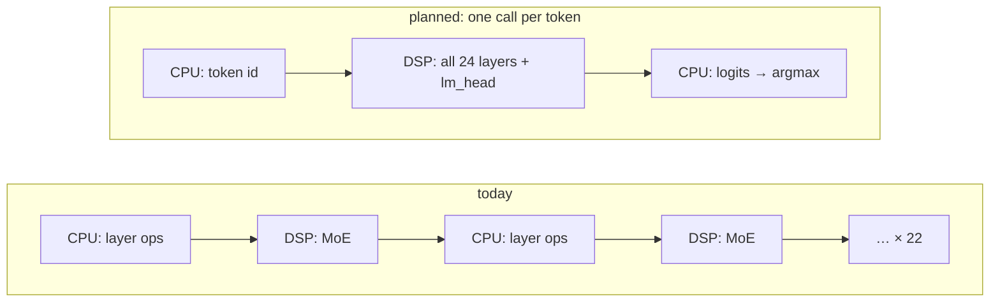

# Architecture

As of **2026-09-23**, `htp_moe` @ `192b44dd`. All numbers are from the
Galaxy S25 Ultra. Code is named by path and symbol, not by line number.

This chapter walks the system once, top-down. It covers the hardware, which
processor runs which part of the model, one token end to end, one MoE call
step by step, where the weight bytes travel, and where the code lives.

## 1. The hardware

The terms used throughout:

- **HTP / DSP / NPU**: the same device, Qualcomm's Hexagon Tensor
  Processor. The code calls it `htp`.
- **HVX**: the DSP's vector unit. It is good at one-row work (matrix ×
  vector).
- **HMX**: the DSP's matrix unit. It is fast for many rows, but it always
  computes 64-row tiles.
- **VTCM**: fast on-chip memory. HMX reads only from here; HVX reads from
  here or through the L2 cache.
- **ION arena**: DDR memory that both the ARM and the DSP map. All MoE
  expert weights live in it, loaded once at model load.
- **FastRPC**: Qualcomm's ARM → DSP remote call. The interface is
  `test/htp/nntr_hvx.idl`. `qaic` generates the ARM stub and the DSP skel
  from it.

## 2. The model and who runs what

LFM2.5-8B-A1B: 24 layers, hidden width 2048, vocabulary 128 000, lm_head
tied to the input embedding.

- **Mixers**: 18 layers use a short convolution and 6 use attention.
- **Feed-forward blocks**: 22 layers use a **MoE FFN** (32 experts, the
  router picks 4 per token, each expert 2048 → 1792 → 2048 with SwiGLU).
  The other 2 use a dense FFN.

Orange means the DSP, blue means the CPU. In the NPU configuration **only
the 22 MoE FFN blocks leave the CPU**. Kernels also exist for attention and
for the FC projections on the DSP (§7). They are switched per model config
(`*_engine` keys) and are **off** in the measured configuration.

The CPU still reads ≈ 246 MB of the ≈ 730 MB each token needs (lm_head 147,
projections 99). That, plus the 22 round trips, is why the long-term design
is **one DSP call per token** (§8).

## 3. One token, end to end

Decode means the prompt is already processed, and the model now produces one
token at a time. Every matrix product is one row (M = 1) times a weight
matrix.

At gen 512, with the VTCM feed on, the token takes ≈ 27.4 ms:

## 4. One MoE call, step by step

### 4.1 On the ARM

| step | what happens | code |
|---|---|---|
| route | The normalized row × router matrix gives 32 logits. Sigmoid, plus a per-expert bias used only for ranking, gives the top 4. Their weights are the bias-free sigmoids, normalized | `Applications/CausalLM/models/lfm2_moe/lfm2_moe_layer.cpp`: `buildExpertAssignments` |
| decide | `QS4CX_WH` expert weights always go to the DSP: no CPU kernel reads that layout | same file: `tryMoeLayerOnAccelerator` |
| arrays | The routing becomes `row_index`, `row_count[32]` and `row_weight`, in expert order | same file |
| stage | The activation row is copied into a shared ION buffer. Buffers come in power-of-two size classes from 64 KiB up, so a decode call touches a 64 KiB pair and not the 4 MiB pair sized for the prompt | `nntrainer/tensor/htp_backend/htp_compute_ops.cpp`: `StagingPool`, `stage` |
| call | `nntr_hvx_mm_u8i4_moe_layer(...)` blocks until the DSP returns. The ARM polls for the reply for up to 5 ms before falling back to an interrupt wake-up | `htp_compute_ops.cpp`; poll window `NNTR_HTP_POLL_US` in `htp_backend.cpp` |
| options | Once per session, `moe_set_opts` sends the kernel's switches (GEMV path, loop, prefetch lead, feed) as one bit word. The DSP echoes what it applied, and the ARM prints it as the `[HTP] moe m1 gemv: ...` banner, which proves which path a run took | `sendMoeOptsOnce`; `htp_moe_opts.h` |

### 4.2 On the DSP: which path

The whole MoE layer is one kernel entry, `hexkl_mm_u8i4_moe_layer_run` in
`nntrainer/tensor/htp_backend/hmx/hexkl_mm_u8i4_moe.c`. Its first decision
is the path:

All three paths produce **byte-identical output**. Integer sums do not
depend on order, and the final f32 adds run in the same sequence. Host and
device tests check that on every change (`MoeLayerM1GemvMatchesHmx`).
Prefill (M > 4) never enters the GEMV branch, so decode work cannot slow
prefill by construction.

### 4.3 The decode path (HVX GEMV)

The GEMV path runs on a worker pool with one lane per HVX context (6 on v79)
and synchronizes with barriers:

Per call (gen 64, level-2 profile, unit `R3CY10WM83Y`):

| | today (arena read) | VTCM feed |
|---|---:|---:|
| `mm`: matrix work incl. waiting for weights | 931.9 µs | 676.4 µs |
| `dsp`: whole call on the DSP | 995.1 µs | 711.9 µs |
| transport: round trip minus DSP time | 190.3 µs | 92.3 µs |
| weight read rate | ≈ 23.6 GB/s | ≈ 32.6 GB/s |

Each call reads **22.02 MB** of weights: 4 experts × (gate_up 3.5 MiB +
down 1.75 MiB). The arithmetic itself takes ≈ 240 µs. The rest of `mm` is
waiting for bytes. So the decode kernel is **bound by how fast the weights
arrive**, and each improvement to it has been an improvement to that feed:

1. Prefetch lead (default since PR #115): the one-row loop asks the L2
   cache for the next 192 KB before it needs it. It gives +3–4 % decode.
2. VTCM feed (PR #118): the DMA engine copies each expert into VTCM while
   HVX computes on the previous one. This hides the arithmetic under the
   copy and gives +29–33 % decode.

The floor is the bytes divided by the DMA rate: 22.02 MB at 37.3 GB/s is
≈ 590 µs per call, so there is little left inside the call.

### 4.4 The prefill path (HMX)

The path upstream shipped, kept for prefill and as an opt-out
(`NNTR_MOE_HTP_M1_GEMV=0`). VTCM is carved into fixed regions (activation
block, gate_up weights 3.5 MiB, down weights 1.75 MiB, accumulators,
results). For each expert, the weights are DMA'd from the arena into VTCM in
column chunks. The HMX then multiplies 64-row tiles, and HVX workers
dequantize, apply SwiGLU, requantize and scatter. At M = 1, 63 of the 64
rows are padding. That is why decode moved off this path.

## 5. The weight format

Expert weights use **`QS4CX_WH`**: 4-bit signed weights with one scale per
output channel, stored as 32 × 32 tiles of 512 bytes in the order the HMX
reads, followed by a per-channel column sum (it corrects for the
activation's zero point without recomputing it per call). The class is
`QS4CX_WH_Tensor` in `nntrainer/tensor/qs4cx_tensor.h`. Activations are 8-bit
unsigned (u8) with a per-row scale and zero point, which is why the kernels
are named `u8i4`. The HVX GEMV reads the same bytes in the same order, so
both paths share one weight blob per expert. The format is produced
offline by `Applications/CausalLM/quantize_stream.cpp`
(`--moe_dtype QS4CX_WH`). Everything else in the model stays `Q4_0` on the
CPU.

## 6. Runtime switches

| variable / key | default | what it does |
|---|---|---|
| `moe_engine` (`nntr_config.json`) | `cpu` | `htp` sends the MoE FFN to the DSP |
| `attn_proj_engine`, `conv_in_proj_engine`, `conv_out_proj_engine`, `dense_ffn_engine` | `cpu` | route those projections to the DSP; off in the measured config |
| `NNTR_MOE_HTP_M1_GEMV` | on | `0` sends decode back to the HMX path |
| `NNTR_MOE_HTP_GEMV_ROWS1`, `NNTR_MOE_HTP_GEMV_LEAD_KB` | `1`, `192` | the GEMV loop shape and prefetch lead |
| `NNTR_HTP_POLL_US` | 5000 | how long the ARM polls for the DSP's reply |
| `NNTR_HTP_PROFILE` | off | `2`/`3`: per-stage µs per call (`[HTP-PROFILE]`), DMA ring line |
| `NNTR_HTP_DMA_TRACE` | off | a per-descriptor DMA dump |
| `NNTR_L2_CHECK`, `NNTR_L2_DIFF`, `NNTR_L2_SHADOW` | off | compare DSP output against a CPU reference in-run |

## 7. Code map

| area | paths / symbols |
|---|---|
| ARM side of every DSP call | `nntrainer/tensor/htp_backend/htp_compute_ops.cpp` (`StagingPool`, `sendMoeOptsOnce`, the `[HTP-PROFILE]` printer), `htp_backend.cpp` (session, poll), `htp_rpcmem.h` (ION), `htp_moe_opts.h` |
| Call interface | `test/htp/nntr_hvx.idl`; the skel entry `test/htp/nntr_hvx_mm_u8i4.c` |
| MoE layer kernel | `nntrainer/tensor/htp_backend/hmx/hexkl_mm_u8i4_moe.{c,h}` (`hexkl_mm_u8i4_moe_layer_run`, `moe_push_weight_chunk`, the `use_m1` branch) |
| DMA | `hmx/hexkl_dma_ring.c`, `hmx/hexkl_mm_u8i4_dma.c`, `hmx/hexkl_dma_trace.c` |
| HVX kernels | `hvx/hvx_gemm_u8i4_wh.c` (`hvx_gemm_u8i4_wh_col`, `gemm_row1`), `hvx_worker_pool.c`, `hvx_quant_u8.c`, `hvx_dequant_i32.c`, `hvx_swiglu_*`, `hvx_softmax*` |
| Attention / FC on the DSP (built, off by default) | `hmx/hexkl_attn_u8.c`, `hmx/hexkl_attn_dtype.c`, `hmx/hexkl_kv_quant.c`, `hmx/hexkl_mm_u8i8_dma.c` |
| Model | `Applications/CausalLM/models/lfm2_moe/` (`lfm2_moe_layer.cpp`: router, `tryMoeLayerOnAccelerator`; `lfm2_moe_causallm.cpp`), `Applications/CausalLM/models/lfm2/lfm2_causallm.cpp` (graph, `*_engine` keys) |
| Weight conversion | `Applications/CausalLM/quantize_stream.cpp`, `Applications/CausalLM/res/lfm2_moe/lfm2-8b-a1b/weight_converter.py` |
| Tests | host checks `test/htp/host/*_host_check.c` + `run_host_checks.sh` (no DSP needed); device gtests `test/unittest/unittest_hvx_*`; DMA probes `unittest_hvx_dma_probe` |
| Build | `test/htp/build.sh` (DSP skel), `Applications/CausalLM/build_android.sh --htp` (app) |

## 8. Where the design goes next

Today's shape is **22 DSP calls per token, with the CPU working in between**.
After the feed, what remains is the 2.0 ms of round trips and the 9.7 ms of
CPU work between calls. Neither can be removed call by call. The planned
shape is one call per token: the ARM sends a token in and gets logits back,
and every layer op runs on the DSP.

The steps:
1. An entry point with a validated op table (#85).
2. M = 1 kernels for RMSNorm, q/k norm, RoPE and conv1d + gating (#82).
3. Attention with a DSP-resident KV cache (#81).
4. The FC projections, router and lm_head, which no issue covers yet.

None of these saves time alone. The call count drops only when every op
between two MoE layers is resident.
