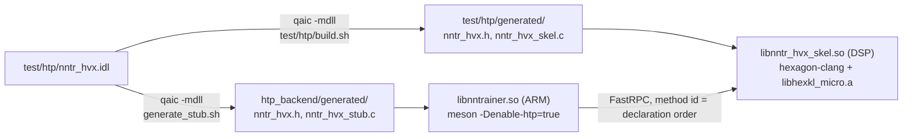
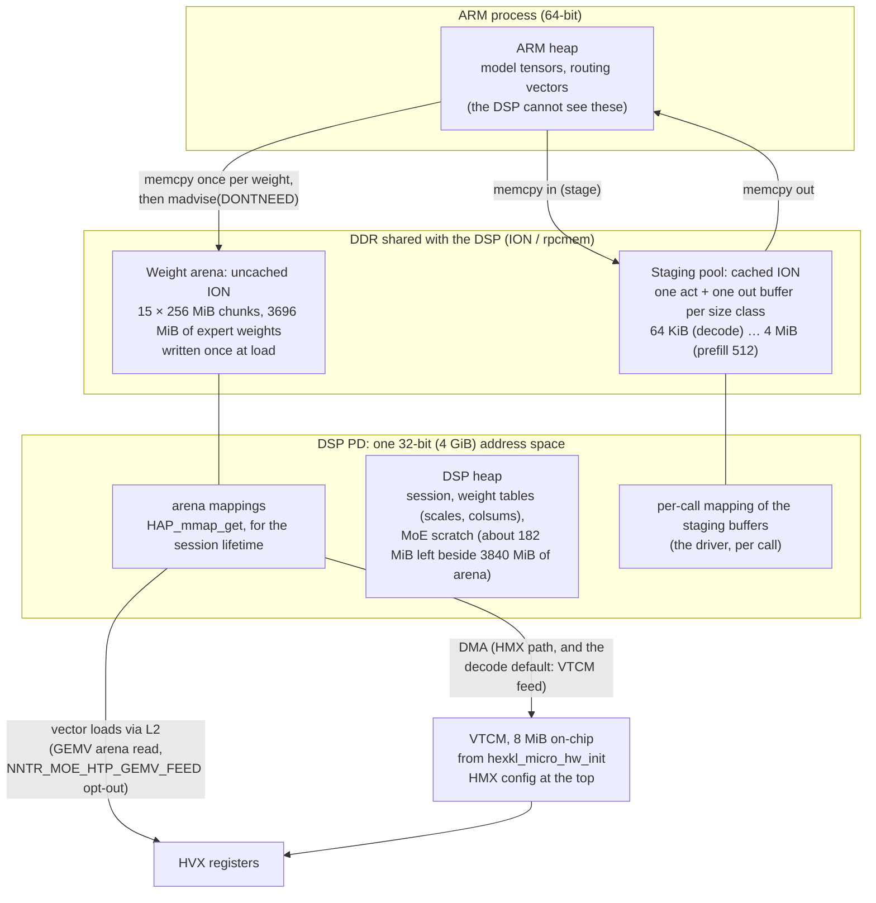
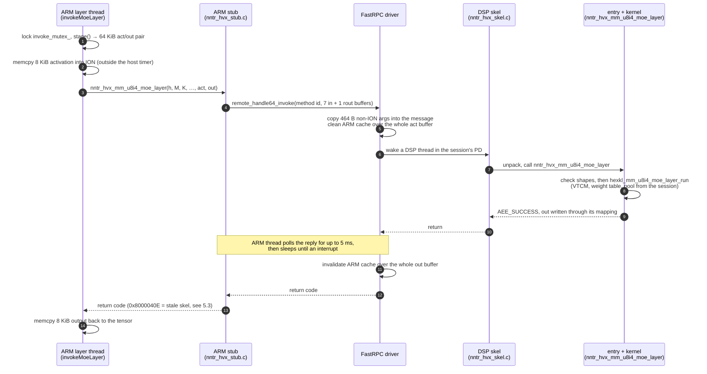

# Foundation: FastRPC, session, memory, build

As of **2026-09-23**, `htp_moe` @ `9fb1a3bc`.

This chapter covers the plumbing that every HTP kernel sits on. It explains
how an ARM function call becomes a DSP function call (FastRPC), what the DSP
session holds for its lifetime, where each byte lives (heap, shared ION
buffers, the weight arena, VTCM), what one call costs and why, and how the
two halves are built and kept in step. Kernels themselves are in other
chapters.

Terms used below:

- **FastRPC**: Qualcomm's remote procedure call from the ARM CPU to the DSP.
  The ARM calls an ordinary C function (the **stub**); the kernel driver
  carries the arguments over; a DSP-side dispatcher (the **skel**) unpacks
  them and calls our C function on the DSP.
- **PD** (protection domain): the DSP-side process our skel runs in. It has
  its own 32-bit virtual address space.
- **ION / rpcmem**: Android's shared-memory allocator, reached through
  Qualcomm's `rpcmem_*` API. An ION buffer is DDR that both the ARM and the
  DSP can map.
- **VTCM**: 8 MiB of on-chip scratch memory on the DSP. HMX reads only from
  it.

## 1. FastRPC: one interface, two generated halves

*Provenance: upstream PR #4327 (interface, skel, stub generation); `htp_moe`
added `moe_set_opts`, `dma_probe`, `dma_replay`, `moe_dma_trace_read`.*

### 1.1 The IDL

The whole ARM ↔ DSP interface is one file, `test/htp/nntr_hvx.idl`: one
interface `nntr_hvx` derived from `remote_handle64` with 39 methods. A
method takes scalars (`in uint32`, `in float`), input arrays
(`in sequence<T>`) and output arrays (`rout sequence<T>`). The `rout uint32`
form returns a scalar, such as a weight handle.

The methods fall into six groups:

| group | methods | skel file |
|---|---|---|
| session | `open`, `close` (implicit from `remote_handle64`), `add_f32` (smoke test) | `test/htp/hvx_add_f32.c` |
| u8i4 matmul and MoE | `weight_register_u8i4[_arena]`, `weight_release_u8i4`, `arena_attach/detach`, `mm_u8i4_layer*`, `mm_u8i4_moe_layer[_timed]`, `moe_set_opts`, probes | `test/htp/nntr_hvx_mm_u8i4.c` |
| u8i8 matmul | `weight_register_u8i8`, `mm_u8i8_layer[_timed]` | `test/htp/nntr_hvx_mm_u8i8.c` |
| softmax / SwiGLU checks | `exp_f32`, `swiglu_det_f32`, `softmax_f32`, `softmax_blocked_f32` | `test/htp/nntr_hvx_softmax.c` |
| attention | `attn_register`, `attn_kv_append`, `attn_forward[_timed]`, … | `test/htp/nntr_hvx_attn.c` |
| DMA measurement | `dma_probe`, `dma_replay` | `test/htp/nntr_hvx_dma_probe.c` |

The measured decode configuration uses four of them per run:
`arena_attach` and `weight_register_u8i4_arena` at load, `moe_set_opts` once
per session, and `mm_u8i4_moe_layer` 22 times per token.

### 1.2 Stub and skel generation

Qualcomm's `qaic` compiler turns the IDL into three files:
`nntr_hvx.h` (the C prototypes both sides share), `nntr_hvx_stub.c` (ARM)
and `nntr_hvx_skel.c` (DSP). It runs twice, into two directories, and
neither output is checked in:



- `nntrainer/tensor/htp_backend/generate_stub.sh` writes the ARM stub and
  deletes the skel it also produced. `meson.build` in the same directory adds
  the stub to `nntrainer_sources`. It fails the configure step if the stub is
  missing, and also if the IDL is newer than the generated header. The second
  check exists because a stale stub used to surface later as an unrelated
  compile error, or not at all.
- `test/htp/build.sh` regenerates its own copy and links the skel (§5).

In the generated code each method is a numbered **method id**, assigned in
declaration order: ids 0 and 1 are `open` and `close`, `add_f32` is 2,
`moe_set_opts` is 40. A generated `methods[]` table also records the scalar
and buffer counts for each method. So an app and a skel built from different
IDLs disagree on what a method id means, or on how many buffers it carries.
§5.3 covers what that looks like on the device.

### 1.3 The skel entry files

Each IDL method `foo` becomes a DSP function `nntr_hvx_foo(remote_handle64
handle, …)`. A `sequence<T>` argument arrives as a pointer plus an `int`
length (`act_f32`, `act_f32Len`). The handle is the session pointer that
`nntr_hvx_open` returned (§2.2), cast back. The entry functions are thin.
They validate every length against the shapes (a mismatch returns
`AEE_EBADPARM`) and call a kernel under `nntrainer/tensor/htp_backend/hmx/`
or `hvx/`. For example, `nntr_hvx_mm_u8i4_moe_layer` runs
`check_moe_layer_args` and `check_moe_row_totals`, then calls
`hexkl_mm_u8i4_moe_layer_run` with the session's VTCM, weight table, worker
pool, scratch and flags.

### 1.4 The `_timed` twins

Seven methods have a `_timed` twin, for example `mm_u8i4_moe_layer_timed`.
The twin takes identical arguments plus `rout sequence<uint32> stage_us`. It
runs the same kernel between two DSP timer reads and fills a per-stage
microsecond table. It is a separate method rather than a flag so that the
production call pays nothing for the probes. The ARM side picks the twin
when `NNTR_HTP_PROFILE >= 2` (`HtpComputeOps::invokeMoeLayer`). The DSP checks
`stage_usLen == MOE_N_STAGES` and returns `AEE_EBADPARM` otherwise. A mismatch
there is the most common symptom of an app and a skel that were built apart
(§5.3).

The twin is what makes **transport** a measured number and not a guess:

> transport = host wall time around the stub call − the DSP's own `dsp_total`

The ARM-side staging `memcpy` sits outside the host timer, so transport
covers only the FastRPC round trip.

### 1.5 Adding a method

1. **Append** it at the end of `nntr_hvx.idl`. Appending keeps every
   existing method id, so an older skel still serves the old methods.
2. Implement `nntr_hvx_<name>` in the skel file of its group. Validate every
   length and handle and return `AEE_EBADPARM` on a mismatch, because the ARM
   side is a trust boundary for the DSP.
3. Add any new `.c` file to `SRCS` in `test/htp/build.sh`. The
   undefined-symbol check (§5.1) catches a forgotten one at build time.
4. If you need per-stage timing, add a `_timed` twin, not a flag.
5. Rebuild **both** halves (§5) and push both. `build_android.sh --htp`
   regenerates the stub but never rebuilds the skel.
6. If the ARM side depends on the new method, make it fail loudly on an old
   skel. `sendMoeOptsOnce` is the model. The DSP echoes the option bits it
   applied (`applied`), and the ARM throws with a rebuild hint when the call
   fails or the echo differs from what it sent. Without that, the run could
   silently take a different kernel path.

## 2. The session

*Provenance: upstream PR #4327; the 5 ms poll default and the
`NNTR_HTP_POLL_US` knob are upstream commits made after the PR's freeze,
brought into `htp_moe` by PR #103. The skel's bus-vote compile switch is
`htp_moe`.*

A process opens exactly one session and keeps it until exit.

### 2.1 ARM side: `HtpBackend`

`nntrainer/tensor/htp_backend/htp_backend.cpp`, `HtpBackend::HtpBackend`
(a process-wide singleton, `HtpBackend::global()`):

1. **Unsigned PD.** `remote_session_control(DSPRPC_CONTROL_UNSIGNED_MODULE,
   {CDSP_DOMAIN_ID, 1})` lets an unsigned development skel load on the
   compute DSP. A failure here is only logged, because a signed skel does not
   need it. On the S25 Ultra used for bring-up no test signature was
   needed.
2. **Open.** `nntr_hvx_open(nntr_hvx_URI "&_dom=cdsp", &h)`. If this fails
   (skel not on `ADSP_LIBRARY_PATH`, driver error), the backend stays
   disabled. `nntrainer/htp_context.cpp` then attaches no HTP ops and layers
   run on the CPU. One exception: a model quantized to `QS4CX_WH` has no
   CPU kernel for its expert weights (`float_tensor.cpp` throws), so with
   the backend disabled it fails instead of falling back.
3. **Latency QoS.** `remote_handle64_control(h, DSPRPC_CONTROL_LATENCY, …)`
   with `RPC_POLL_QOS` and `latency = 5000` µs (`NNTR_HTP_POLL_US`
   overrides it). In poll mode the ARM thread spins on the reply for up to
   that long, then falls back to sleeping until an interrupt. If the driver
   rejects poll mode, the code tries `RPC_PM_QOS` with 100 µs. The result is
   stored as `qosMode()`: 2 = poll, 1 = PM, 0 = both rejected. The profile's
   first line prints it (`[HTP-PROFILE] level=… qos_mode=…`). A transport
   number is only meaningful at `qos_mode=2`.

The poll window matters because a decode call runs about 1–1.4 ms. With a
100 µs window every call ended on the slow interrupt wake-up (§4). Asking
for 10 000 µs was refused by the driver on the PR author's device (the
session fell back to PM QoS, `qos_mode=1`), even though `remote.h`
documents 10 000 as the maximum. So 5000 is the default. The cost is one
ARM core spinning while the DSP works, and that thread is blocked anyway.

The removed alternative matters too. `HtpBackend` used to open a HexKL
*macro* API (SDKL) session. Once a process has used the *micro* API that
our skel is built on, a later macro session fails permanently
(`0x80000401`, no recovery with backoff). So one process cannot mix the two,
and the backend is micro-only.

### 2.2 DSP side: `nntr_hvx_open`

`test/htp/hvx_add_f32.c`, `nntr_hvx_open`, allocates one
`nntr_hvx_session` (`test/htp/nntr_hvx_session.h`) and returns its address
as the handle. Everything below is done **once per session, not per call**:

| step | call | what the session keeps |
|---|---|---|
| HVX present | `qurt_hvx_get_units()`, bits 15:8 = number of 128-byte HVX contexts; 0 → `AEE_EUNSUPPORTED` | — |
| VTCM + power-up | `hexkl_micro_hw_init(&vtcm_base, &vtcm_size, &hmx_fp16_rate)` (HexKL's reference initializer; `-DNNTR_HEXKL_HW_INIT_2ARG` for older HexKL drops) | `vtcm_base`, `vtcm_size` |
| HMX config slot | `config_off = (vtcm_size − hexkl_micro_hmx_config_size())` aligned down: the HMX config sits at the top of VTCM | `config_off` |
| HMX lock | `hexkl_micro_hmx_lock()`, held until `close` | `hmx_locked` |
| accumulator readout | `hexkl_micro_hmx_setup_acc_read_int32` | — |
| worker pool | `hvx_worker_pool_create(n_hvx − 1)`: one worker per HVX context minus one, because the calling FastRPC thread takes the last lane itself. On the S25 Ultra that is 6 lanes (#100 reads 5.76 lanes busy over `mm`) | `quant_pool` |
| power votes | `HAP_power_set`: apptype `COMPUTE_CLIENT_CLASS`; DCVS v2 performance mode, NOM…TURBO corners, 100 µs wake latency; bus 40 GB/s at 100 % (drop with `-DNNTR_HVX_NO_BUS_VOTE`). All best effort | votes die with the PD |

The session also holds the u8i4 and u8i8 weight tables (2048 and 512
slots), up to `NNTR_HVX_MAX_ARENAS` = 32 attached arena chunks, the MoE
call's heap scratch (`moe_scratch`, grown on demand), and `moe_flags` from
`moe_set_opts` (0 = the HMX loop, because the session is `calloc`'d).

`nntr_hvx_close` releases in reverse. It frees weight slots before it puts
back the arena mappings, because a borrowed slot points into an arena. Then
it frees the scratch, destroys the pool and unlocks the HMX.

The design assumes **one client process per DSP**: `hexkl_micro_hw_init` and
the HMX lock are DSP-wide singletons. On the ARM side a single
`invoke_mutex_` in `HtpComputeOps` serializes every call into the session.

## 3. Memory

*Provenance: upstream PR #4327 (rpcmem wrapper, arena, weight
registration); size-class staging is an upstream commit made after the
freeze, brought in by `htp_moe` PR #103.*

### 3.1 The regions



| region | allocated by | mapped to DSP | cache | lifetime | holds |
|---|---|---|---|---|---|
| ARM heap | nntrainer | never | cached | model | tensors, activations |
| staging pool | `HtpRpcBuffer` (`rpcmem_alloc`, default flags = cached) via `stage()` | by the driver, on each call that passes it | cached ARM side; the driver cleans and invalidates the whole buffer per call | process | one call's activation in and output back |
| weight arena | `HtpRpcBuffer(size, HTP_RPC_FLAGS_UNCACHED)` in `tryChunk` | once: `fastrpc_mmap(…, FASTRPC_MAP_FD)` + `arena_attach` → `HAP_mmap_get` | uncached ARM side, so ARM writes reach DDR with nothing to flush | process | expert weights, `QS4CX_WH` bytes as-is |
| DSP heap | `malloc` inside the PD | native | cached | session | session struct, weight tables, `moe_scratch` |
| VTCM | `hexkl_micro_hw_init` | native | on-chip SRAM | session | per-call working set of the kernels |

### 3.2 The rpcmem wrapper

`nntrainer/tensor/htp_backend/htp_rpcmem.h`:

- `HtpRpcMemApi::get()` resolves `rpcmem_init/alloc/free/to_fd` and
  `fastrpc_mmap/munmap` with `dlsym(RTLD_DEFAULT, …)` from the device's
  `libcdsprpc.so`, which the process already loaded for the session. The
  SDK's link-time stub library does not export them, so never push that
  stub to the phone. If either `alloc` or `free` is missing, both are
  treated as absent, so an rpcmem allocation is never freed with libc
  `free`.
- `HtpRpcBuffer` is one byte buffer. It is ION when rpcmem is available and
  falls back to `malloc` otherwise. `isIon()` reports which one it got, and
  `fd()` returns the ION fd, which is needed only for the arena.
- `HtpRpcBuffer::allocCount()` counts constructions process-wide. The
  profile's `staging:` line prints it, and it must not grow with the call
  count.

Why ION at all: FastRPC pins and maps a plain heap pointer on **every**
call. The driver recognizes an rpcmem buffer and keeps its SMMU mapping
across calls. Before this, weight registration over plain heap moved about
155 MB/s. On ION-backed buffers the PR author measured 44.6 GB/s sustained
(PR author's device).

### 3.3 The weight arena

The MoE expert weights (1408 matrices: 22 layers × 32 experts × gate_up
and down, 3696 MiB) do not travel per call. They live in the **arena**:
ION memory that the DSP maps once and reads in place.

`HtpComputeOps::get_or_register_wh`, per weight, at load:

1. `ensureArena`: the arena needs both `rpcmem_to_fd` and `fastrpc_mmap`.
   Without them a `QS4CX_WH` model throws: its bytes have no other home.
2. `place` → `placeExisting` scans every chunk for room at the next
   **4 KiB** boundary (the DSP requires 512 B). A page-aligned weight is
   never split across a page by alignment alone, and the waste is under
   0.25 %. Scanning all chunks lets a 1.75 MiB down weight fill tails that a
   3.5 MiB gate_up cannot.
3. If no chunk has room, `newChunk` → `tryChunk` makes one. The steps are
   `rpcmem_alloc` (uncached) → `rpcmem_to_fd` →
   `fastrpc_mmap(CDSP_DOMAIN_ID, fd, …, FASTRPC_MAP_FD)` →
   `nntr_hvx_arena_attach(fd)`, which calls `HAP_mmap_get` on the DSP. Each
   failure is reported by name, because each means something different:
   host ION exhausted, DSP address space exhausted, or the DSP arena table
   full. A refused size is halved, down to 64 MiB, and the cap is
   remembered.
4. `memcpy` the WH bytes into the chunk. Then
   `nntr_hvx_weight_register_u8i4_arena(K, N, arena, off, scales, colsums,
   bias)` sends only the 3 × N small arrays. On the DSP, the slot *borrows*
   `arena_va + off` (no copy) and copies the three arrays onto the DSP heap.
   The DSP checks that `off + (K/32)(N/32)·512` lies inside the mapping.
5. `releaseArmSource` calls `madvise(MADV_DONTNEED)` on the ARM copy's
   pages. Without it the model holds every weight twice, and registration
   stopped at 1170 of 1408 weights before this was added. `NNTR_HTP_KEEP_ARM_WEIGHTS=1`
   keeps the copy for debugging.

**The limit is the DSP's 32-bit address space, not host RAM.** The arena
mappings and the DSP heap share one 4 GiB space. A clean process maps
3840 MiB in 256 MiB chunks, after which the heap answered `AEE_ENOMEMORY`
after about 182 MiB more. With 1 GiB chunks it stopped at 3072 MiB. Each
mapping is aligned to its own size, so 1 GiB chunks land at 1, 2 and 3 GiB,
and the 768 MiB below the first one can no longer be reached. That is why
`kArenaChunkMax` is 256 MiB. The model's 3696 MiB leaves about 144 MiB of
margin. A larger model would first need fewer bytes per weight, not a new
allocator.

The arena is never `fastrpc_munmap`'d. `nntr_hvx_close` puts every mapping
back (`nntr_hvx_arenas_put_all`), and process exit reclaims the ION. A
process that loads and unloads models would leak one arena per model. This
is marked `ponytail:` in the code, with an explicit shutdown hook as the fix.

The older DSP-heap path (`weight_register_u8i4`: send int4 weights, bake
them to WH layout on the DSP, keep them on the DSP heap) still serves
`QS4CX` models. It stops at about 1.89 GB of weights, which is why
`QS4CX_WH` and the arena exist.

### 3.4 Staging: activations and outputs

Each call copies the activation into a shared buffer, and the output comes
back through another. `HtpComputeOps::stage(StagingPool &, bytes)` rounds
the size up to a power of two from 64 KiB and returns that class's buffer,
creating it on first use. Two pools exist, `act_pool_` and `out_pool_`, and
all classes stay allocated. A decode MoE call (8 KiB each way) uses the
64 KiB pair. A prefill call at prompt 512 (4 MiB) uses the 4 MiB pair.

**Why classes: cache maintenance scales with the buffer, not the payload.**
The staging buffers are cached on the ARM. Before the DSP reads the
activation, the driver must write the ARM cache back to DDR (clean). Before
the ARM reads the output, the driver must drop stale lines (invalidate).
The driver does this over the **whole dma-buf** it was handed, not over the
bytes the call uses. The PR author measured 36–59 µs per MB of buffer
(PR author's device). The earlier design grew one pair to the largest shape
seen (`ensureCapacity`). After a 512-token prompt, every decode call moved
16 KiB on 8 MiB of buffers. That cost 553 µs of transport on a 3.6 MB pair
and 1633 µs on a 12.7 MB pair (PR author's device).

The profile prints the inventory under each MoE row:

```
[HTP-PROFILE]     staging: act 65536 B out 65536 B ion=y  rpc allocs=19 (session)  non-ION in-args=6/464 B
```

At decode, the only bytes the driver copies outside ION are 464 B. That is
a 48 B block of scalars plus the five small arrays: `h_gate_up`, `h_down`,
`row_index`, `row_count` and `row_weight`.

## 4. What a call costs

*Provenance: `htp_moe` (measurements; the fix is PR #103).*

One synchronous MoE call at decode, end to end:



`transport` is steps 3–13 minus the DSP's own time in step 8. The DSP side
of the boundary is small: unpacking (the `stage` column, about 4–5 µs) and
scratch setup (`alloc`, below 1 µs).

### 4.1 Measured

All rows are the M==1 (decode) MoE call at profile level 2, in µs per
call, `qos_mode=2`. **Compare only inside a sitting.** Transport drifts
between sittings as much as tok/s does. Identical sources on the same unit
and the same day read 648.6 and 401.3 about two hours apart, while the
`dsp` column moved −0.2 %. Only `dsp` is comparable across sittings.

| sitting | variant | transport |
|---|---|---:|
| #88, 2026-09-22, unit `R3CY205ZMND` | A: before the fix (one grow-only 4 MiB pair, 100 µs poll), HMX path | 401.3 |
| | C: size-class staging, poll forced back to 100 µs | 155.5 |
| | **B: size-class staging + 5 ms poll (PR #103)** | **87.9** |
| #100, 2026-09-23, unit `R3CY205ZMND` | HMX path (`NNTR_MOE_HTP_M1_GEMV=0`) | 84.6 |
| | HVX GEMV reading the arena directly (the default until PR #118) | 185.8 |
| #117, 2026-09-23, unit `R3CY10WM83Y`, two sittings | A: GEMV, arena read | 184.6 / 190.3 |
| | **B: GEMV fed from VTCM by DMA (PR #118, the decode default since its merge)** | **82.0 / 92.3** |

What the rows say:

- **#88 took 313.4 µs off the call: 245.8 µs (78 %) was staging, 67.6 µs
  (22 %) the poll window.** C isolates the poll. In the same sitting decode
  went 18.72 / 16.83 / 16.46 → 24.50 / 23.80 / 23.52 tok/s at gen 64 / 512
  / 1024, with text bit-identical and prefill −0.9 %. The transport column
  explains only about 6.9 of the 12.6 ms/token gained. About 5 ms landed
  outside the MoE call. Candidates are the poll keeping the calling core
  and its cluster clock up between calls, and cache maintenance around the
  call. Not decided.
- **The DSP-side read pattern moves the host-side number.** In one sitting
  and one binary, the GEMV path's direct arena read cost about 100 µs more
  transport per call than the HMX path, and the VTCM feed brought it back
  to the HMX level. The cause is not separated. Candidates: the direct HVX
  read leaves more cache maintenance or DMA-link sync at the call boundary,
  or the shorter call simply ends inside the poll window. So read
  `transport` beside `mm` whenever a DSP-side change is measured.
- **The remaining ≈ 85–90 µs per call is the synchronous floor.** It is
  464 argument bytes, cache maintenance on two 64 KiB buffers (about 5 µs
  at the measured rate), and the invoke, wake and return. At 22 calls per
  token it is ≈ 2 ms/token. Getting below it takes fewer calls, not a
  cheaper call (see the table below).

The rule that follows: moving a matmul to the DSP pays only when the
matmul costs clearly more than a round trip. The conv `in_proj` on the DSP
saved 13 ms of an expected 65–100 ms (PR author's device), which is why those projections
stay on the CPU in the measured configuration.

### 4.2 Considered and not built

| option | why not (yet) | reopens when |
|---|---|---|
| **Prebind** per-layer handles (`moe_layer_bind` / `moe_layer_run`, removing `h_gate_up`/`h_down` from each call) | removes 256 of the 464 non-ION bytes: ≤ 5–10 µs of an ≈ 88 µs floor, for an IDL change | one call per token (#85) needs per-layer tables on the DSP anyway |
| **Uncached staging pair** for decode | removes the ≈ 5 µs of maintenance, but the ARM then reads its output from uncached DDR every call, and it forks the prefill path | not planned |
| **dspqueue** / a resident DSP worker (async packet queue, no per-call invoke) | the measured cost was buffer size and the poll window, both fixed on plain FastRPC | #85 lands and transport is still ≥ 10 % of the per-token DSP time; then pipelining token *t+1*'s dispatch is the only way under the floor |

## 5. Build and deploy

*Provenance: upstream PR #4327 (`build.sh`, `generate_stub.sh`,
`build_android.sh --htp`); `htp_moe` added the undefined-symbol check (#97)
and `HEX_EXTRA_CFLAGS`.*

### 5.1 The DSP skel: `test/htp/build.sh`

Prerequisite: `source $HEXAGON_SDK_ROOT/setup_sdk_env.source`. It:

1. Finds HexKL's `libhexkl_micro.a` at
   `$HEXKL_ROOT/lib/$HEXKL_SDK_VER/hexagon_toolv19_v79/`. The SDK must be
   6.1.1.0 or newer (no v79 build of HexKL before it). **6.4.0.1 is the
   verified combination** and the one every measurement handoff pins with
   `HEXKL_SDK_VER=6.4.0.1`. Left unset, `HEXKL_SDK_VER` picks the newest
   version under `$HEXKL_ROOT/lib`, which is not necessarily the verified
   one. `HEX_ARCH` defaults to `v79`. If the library is missing, the script
   says which part of the path is wrong.
2. Runs `qaic` into `test/htp/generated/`.
3. Compiles the six skel entry files, the generated skel, and every
   `hmx/*.c` and `hvx/*.c` the kernels need (the `SRCS` list) with
   `hexagon-clang -mv79 -mhvx -mhvx-length=128B -O3 -fPIC -shared -Wall
   -Werror`, linking `libhexkl_micro.a`, into
   `test/htp/build/libnntr_hvx_skel.so`. Add extra defines through
   `HEX_EXTRA_CFLAGS`.
4. **Undefined-symbol check.** A Hexagon shared object links even with
   unresolved symbols, and the device loader then refuses it with
   `0x80000406` and a message that looks like an ELF-layout bug. The script
   lists the skel's undefined dynamic symbols with `hexagon-readelf
   --dyn-syms` and fails on anything outside the set the DSP image provides:
   `HAP_*`, `compute_resource_*`, `qurt_*`, compiler runtime, and a short
   libc list. It also fails if the list is empty, so a missing `readelf`
   cannot pass the check vacuously. This was added after a skel that
   compiled cleanly still failed to load on the phone (#94, #97).

### 5.2 The app: `Applications/CausalLM/build_android.sh --htp`

`--htp` runs `generate_stub.sh` (the ARM stub), locates `libsdkl.so` in the
HexKL addon (`HEXKL_ROOT`, `HEXKL_ARCH=armv8_android26`), and configures
nntrainer with `-Denable-htp=true -Dhexkl-sdk-root=… -Dhexkl-lib-subdir=…
-Dhexagon-sdk-root=…`. It prints a reminder that it does **not** build the
skel. Measurement handoffs build with `build_android.sh --htp`, then
`--htp --cache`, and name the commit. They never name a local path.

On the device, the skel goes into a directory on `ADSP_LIBRARY_PATH`, and
the app's libraries go on `LD_LIBRARY_PATH`. Only the device's own
`libcdsprpc.so` may be used, never the SDK's link-time stub.

### 5.3 App and skel must match

The stub and the skel must come from the same IDL, and the skel must come
from the same DSP sources the app expects. The failure modes are
distinguishable:

| symptom | meaning |
|---|---|
| `AEE_EBADPARM` (`0x8000040E`) on a call whose shapes are right | skel older than the app, e.g. a different `stage_us` count in a `_timed` twin. `invokeMoeLayer` appends this hint to its error |
| `nntr_hvx_moe_set_opts failed … applied=…` | skel predates `moe_set_opts` or one of its bits. The app throws instead of running another path |
| `0x80000406` at open (`dlopen` of the skel) | the skel itself does not load, usually an undefined symbol (§5.1) |
| `nntr_hvx_open failed … Is libnntr_hvx_skel.so on ADSP_LIBRARY_PATH?` | skel not found. The backend disables itself (§2.1) |
| configure error "stub is older than nntr_hvx.idl" | IDL changed and the stub was not regenerated |

The rule: **any change to the IDL or to a DSP source means rebuilding the
skel with `test/htp/build.sh` and pushing it.** An IDL change also means
regenerating the stub, which `build_android.sh --htp` does.

## 6. Host checks without a DSP

*Provenance: upstream PR #4327 (`moe_layer_host_check`,
`worker_pool_host_check`, stubs); `htp_moe` added the DMA, options, replay
and `gemv_native` checks.*

`test/htp/host/run_host_checks.sh` compiles DSP sources with the host `gcc`
against stand-in headers. It needs no phone and no SDK.

- `test/htp/host/stub/` provides `qurt.h` (threads mapped to pthreads),
  `hexkl_micro.h`, `HAP_perf.h` and `AEEStdErr.h`, so kernels and the
  worker pool compile on x86. `replay_stub/` adds `remote.h`, the HVX type
  headers and a hand-written `nntr_hvx.h` for the replay entry.
- HMX and HVX arithmetic are **scalar stand-ins** here, so these checks do
  not verify the hardware's arithmetic. They verify everything around it:
  routing, buffer reuse (the DMA stand-in completes at once, so a transfer
  into a live buffer shows up as a wrong result), scatter, VTCM layout
  arithmetic, option-word encoding and DMA plans.
- The exception is `gemv_native_check.c`. When the SDK's x86 HVX emulation
  library (`libnative.a`) is present, it builds the real
  `hvx/hvx_gemm_u8i4_wh.c` on x86. It also checks that two deliberate
  mutations of the kernel make it fail.

The rest of the verification ladder (DSP skel build, device gtests,
full-model runs) is covered in the measurement chapter.

## Tried and dropped

| attempt | result | why it matters |
|---|---|---|
| Passing plain heap tensors straight to FastRPC | pinned and mapped on every call; weight registration moved about 155 MB/s | why `HtpRpcBuffer` exists and why every call stages through ION |
| One grow-only staging pair (`ensureCapacity`) | every decode call paid cache maintenance on the largest buffer: 553–1633 µs of transport (PR author's device); 401 µs in #88 A | why `StagingPool` has size classes. Do not "simplify" it back |
| 100 µs poll window | every decode call ended on the interrupt wake; 67.6 µs/call of #88's cut | why the default is 5000 µs |
| 10 000 µs poll window | refused by the driver, session fell to PM QoS (PR author's device) | 5000 is the tested ceiling; check `qos_mode=2` after any change |
| `fastrpc_mmap` with flags 0 (`FASTRPC_MAP_STATIC`) for the arena | `HAP_mmap_get` refused the fd; three device runs | the arena must use `FASTRPC_MAP_FD` |
| 1 GiB arena chunks | stopped at 3072 MiB, then refused at every size down to 64 MiB | alignment waste in the 4 GiB DSP space; 256 MiB chunks reach 3840 MiB |
| Weights on the DSP heap (bake on the DSP) | ceiling about 1.89 GB | why `QS4CX_WH` + the arena exist; the path remains for `QS4CX` |
| HexKL macro (SDKL) session beside the micro API | a macro session opened after any micro call fails permanently | the backend is micro-only; no mixing within a process |

## Code map

| topic | path : symbol |
|---|---|
| interface | `test/htp/nntr_hvx.idl` |
| ARM stub generation | `nntrainer/tensor/htp_backend/generate_stub.sh`; stale/missing check in `nntrainer/tensor/htp_backend/meson.build` |
| ARM session | `nntrainer/tensor/htp_backend/htp_backend.{h,cpp}`: `HtpBackend`, `qosMode` |
| backend attach / fallback | `nntrainer/htp_context.cpp` |
| rpcmem / ION | `nntrainer/tensor/htp_backend/htp_rpcmem.h`: `HtpRpcMemApi`, `HtpRpcBuffer`, `allocCount` |
| staging, calls, profile | `nntrainer/tensor/htp_backend/htp_compute_ops.cpp`: `StagingPool`, `stage`, `stagedMemcpy`, `invokeMoeLayer`, `sendMoeOptsOnce`, `HtpProfile` |
| arena, registration | same file: `get_or_register_wh`, `ensureArena`, `place`, `placeExisting`, `newChunk`, `tryChunk`, `registerFromArena`, `releaseArmSource`, `kArenaChunkMax` |
| DSP session | `test/htp/nntr_hvx_session.h`: `nntr_hvx_session`; `test/htp/hvx_add_f32.c`: `nntr_hvx_open`, `nntr_hvx_close` |
| DSP arena, weights | `test/htp/nntr_hvx_mm_u8i4.c`: `nntr_hvx_arena_attach`, `nntr_hvx_weight_register_u8i4_arena`, `nntr_hvx_arenas_put_all`; `hmx/hexkl_mm_u8i4_dma.c`: `hexkl_weight_u8i4_register_arena` |
| worker pool | `nntrainer/tensor/htp_backend/hvx/hvx_worker_pool.c`: `hvx_worker_pool_create` |
| builds | `test/htp/build.sh`; `Applications/CausalLM/build_android.sh --htp` |
| host checks | `test/htp/host/run_host_checks.sh`, `test/htp/host/stub/`, `test/htp/host/replay_stub/` |
