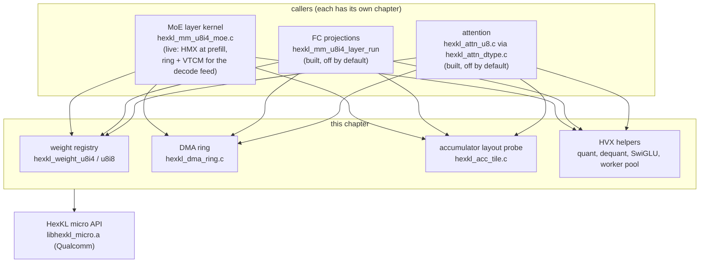
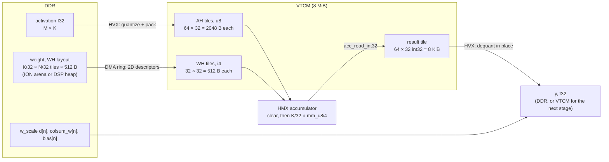
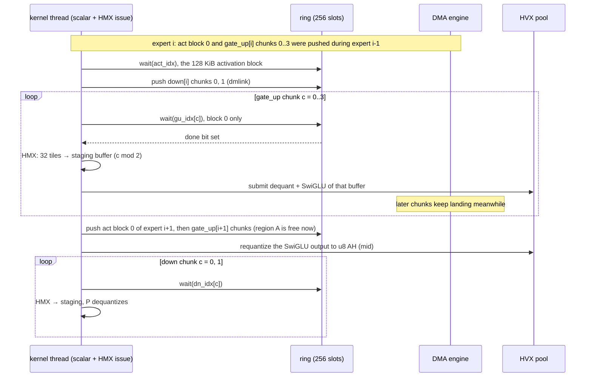

# The HMX integer matmul layer

As of **2026-09-23**, `htp_moe` @ `9fb1a3bc`.

This chapter describes the integer matrix-multiply layer on the Hexagon matrix
unit (HMX). The MoE kernel, the FC projections and the attention kernels are
all built on it. It covers the vendor library underneath (HexKL), the data
types and tile layouts, the dequantization math, the DMA ring that moves
weights into VTCM, the HVX helpers around the HMX, and what the DMA engine was
measured to deliver. The MoE-specific scheduling on top of this layer is only
touched where it explains the ring. The decode path that bypasses the HMX
(HVX GEMV) has its own chapter. It still uses this layer's ring and VTCM:
since PR #118 its weights are DMA'd into VTCM (§6).

Provenance: the layer is **upstream PR #4327**, from its HMX matmul phase (P2,
early August 2026) on. `htp_moe` added the DMA trace, the per-worker DMA probe,
the skel's undefined-symbol guard, the M = 1 VTCM feed's use of the ring
(PR #118) and every DMA measurement from #77 on.

## 1. Where this layer sits



All of it runs inside one DSP library, the FastRPC skel
`libnntr_hvx_skel.so`, built by `test/htp/build.sh`. The skel holds a session
(`nntr_hvx_session` in `test/htp/nntr_hvx_session.h`). `nntr_hvx_open` in
`test/htp/hvx_add_f32.c` sets the session up once per process: VTCM, the HMX
lock, the accumulator read config and the worker pool. No per-call number
includes that setup.

## 2. HexKL

**What it is.** HexKL is Qualcomm's HMX kernel library. It ships as an add-on
to the Hexagon SDK (`hexkl_addon`). It has two APIs:

- The **macro API** (`sdkl.h`, `libsdkl.so`) runs on the ARM side. Each call is
  one whole matmul, sent to the DSP over FastRPC.
- The **micro API** (`hexkl_micro.h`, `libhexkl_micro.a`) runs on the DSP.
  It exposes single HMX tile operations, so the caller owns the loop, the VTCM
  layout and the DMA.

**Which one is used.** Only the micro API. The macro API is not used at
run time, for two reasons:

1. It cannot prefetch. Each macro call stages its own weight and cannot see
   the next matmul. A hand-written micro-API loop with cross-matmul weight
   prefetch beat the macro kernel 1.7–2.0× on the DSP (§8.3).
2. It is a one-way door. A macro-API session opened after any micro-API
   FastRPC session fails permanently. The skel holds a micro-API session, so
   the old macro-API session in `HtpBackend` was removed (see the header
   comment in `nntrainer/tensor/htp_backend/htp_backend.h`).

The micro-API calls this tree uses are these, and no others:

| call | what it does | used in |
|---|---|---|
| `hexkl_micro_hw_init` | Maps the VTCM arena (8 MiB on v79). Returns its base and size | `nntr_hvx_open` |
| `hexkl_micro_hmx_lock` / `_unlock` | Takes the HMX for the session | `nntr_hvx_open` / close |
| `hexkl_micro_hmx_config_size`, `_setup_acc_read_int32` | Reserves and writes the accumulator read config at the top of VTCM (`config_off`) | `nntr_hvx_open` |
| `hexkl_micro_hmx_rm_to_wh_i4` / `_i8` | Converts one 32 × 32 weight tile from row-major to the WH layout | registration (`hexkl_weight_u8i4_register`, `hexkl_weight_u8i8_register`) |
| `hexkl_micro_hmx_acc_clear_int32` | Zeroes the accumulator | every matmul loop |
| `hexkl_micro_hmx_mm_u8i4` / `_u8i8` | One tile multiply-accumulate: 64 × 32 u8 activation × 32 × 32 weight | every matmul loop |
| `hexkl_micro_hmx_acc_read_int32` | Writes the accumulator out as one 64 × 32 int32 tile in VTCM | every matmul loop |
| `hexkl_micro_hmx_copy_32b_to_submatrix` | Un-shuffles that tile into a row-major matrix (scalar) | the layout probe, plus a fallback path |

The micro API has no bias, scale or zero-point support. That is why the HVX
dequant pass in §3 exists at all.

**Linking and versions.**

- The DSP skel links `libhexkl_micro.a` statically from
  `$HEXKL_ROOT/lib/$HEXKL_SDK_VER/hexagon_toolv19_v79/`. The package is HexKL
  **1.0.0-beta.2**, and `tools/htp/env.sh` points `HEXKL_ROOT` at it.
- `build.sh` requires Hexagon SDK **6.1.1.0 or newer**, because older SDK
  directories of the add-on carry no v79 library. The upstream PR built with
  SDK 6.4.0.2. The `htp_moe` workstation builds with **6.4.0.1**, which
  `build.sh` names as the verified combination.
- The ARM app links `libsdkl.so` only when meson runs with
  `-Denable-htp=true` (see `meson.build`). That link is left over from the
  macro API; nothing calls into it at run time.
- `hexkl_micro_hw_init` takes three arguments in beta.2 and took two in an
  older drop. `nntr_hvx_open` uses the three-argument form, and
  `-DNNTR_HEXKL_HW_INIT_2ARG` switches to the old one.
- Since `htp_moe` #97, `build.sh` lists the skel's undefined dynamic symbols
  and fails the build if any `hexkl_*`/`hvx_*`/`nntr_*` symbol is left
  unresolved. The linker accepts such a symbol, but the on-device loader
  rejects it with `0x80000406`.

## 3. Data types and the math

The HMX activation port is always 8-bit unsigned. The weight port takes
4-bit or 8-bit signed values. Hence the two variants:

- **u8i4**: u8 activations × i4 weights. Every live path uses it.
- **u8i8**: u8 activations × i8 weights. The weight tile doubles to 1024 B;
  everything else is the same.

**Activation quantization** (per row, asymmetric, done on HVX by
`hvx_quant_rows_u8_params` in `hvx/hvx_quant_u8.c`):

```text
rmin = min(0, min_k x[m][k])          rmax = max(0, max_k x[m][k])
s[m] = (rmax - rmin) / 255
z[m] = clamp(round_half_even(-rmin / s[m]), 0, 255)
u[m][k] = clamp(round_half_even(x[m][k] · (1 / s[m])) + z[m], 0, 255)     so x ≈ s[m] · (u - z[m])
```

A row that is all zeros keeps `s = 1`, `z = 0`. Padding rows (≥ M) get the
same values, so a host reference can reproduce them without special cases.

**Weights** are symmetric int4 with one scale per output channel `n`:
`w[k][n] ≈ d[n] · q[k][n]`, `q ∈ [-8, 7]`. The format is `QS4CX_WH`, covered in
the weight-format chapter. At registration each weight also carries
`colsum_w[n] = Σ_k q[k][n]` and `bias[n]`.

**Dequantization.** The HMX returns `acc[m][n] = Σ_k u[m][k] · q[k][n]` in
int32. Expanding the product:

```text
y[m][n] = Σ_k x[m][k] · w[k][n]
        = s[m] · d[n] · ( Σ_k u·q  −  z[m] · Σ_k q )
        = ( acc[m][n] − z[m] · colsum_w[n] ) · s[m] · d[n]  +  bias[n]
```

The zero-point term depends only on the weight, so it is a precomputed table
and costs one multiply per output. `hvx_dequant_i32_to_f32` and
`hvx_dequant_acc_tile_to_f32` (`hvx/hvx_dequant_i32.c`) compute exactly this,
in f32, in this order: convert `acc` and `colsum_w` to f32, subtract
`z · colsum`, multiply by `s`, multiply by `d`, add `bias`. By arithmetic, at
the model's K = 2048, `|acc|` and `z · colsum` stay below 255 · 8 · 2048 ≈
4.2 M < 2²⁴, so the int-to-f32 conversions are exact.

## 4. Tiles and layouts

The HMX works on fixed tiles. The constants come from `hexkl_micro.h`
(`HEXKL_HMX_INT8_BLOCK_N_ROW` = 64, `_N_COL` = 32, `_N_INNER` = 32). One
`hexkl_micro_hmx_mm_u8i4` call multiplies a 64 × 32 activation tile by a
32 × 32 weight tile and adds the result into a 64 × 32 int32 accumulator. A
64 × 32 block of output takes K/32 such calls, then one read-out.



**Activation, "AH" layout.** Each tile holds 64 rows × 32 columns, stored flat
and row-major inside the tile. Tiles are ordered by (row block, k tile) at a
2048-byte stride:

```text
offset(m, k) = ((m / 64) · (K / 32) + k / 32) · 2048  +  (m % 64) · 32  +  (k % 32)
```

`hvx_quant_pack_u8_ah` quantizes and writes straight into this layout, with
no separate layout pass. There is also an ARM-side twin,
`htp_quant_pack_u8_ah` in `nntrainer/tensor/htp_act_quant.h`, which produces
the same bytes bit for bit. It feeds the u8-in entry (§5).

**Weight, "WH" layout.** A tile is 32 × 32 int4 values, which is exactly
512 bytes, so the layout can only be a permutation of nibbles. For element
(r, c) of a tile, where r is the k index and c the n index:

```text
byte   = (r / 8) · 128 + c · 4 + (r % 4)
nibble = (r / 4) % 2          (0 = low half)
tile t = kt · (N / 32) + nt   stored at t · 512   (k-major)
```

Each byte holds two k values, four rows apart, for the same column. The
formula was read off the device's own converter. `whSlot` in
`nntrainer/tensor/htp_wh_layout.h` implements it on the host, so the offline
quantizer can write WH bytes without a DSP. The gtest
`HmxMmU8I4Layer.WhPackReferenceMatchesDspBake` checks it byte for byte against
the DSP bake. The ARM-side `sdkl_cpu_i4_rm_to_i4_wh` produces the
**transposed** tile. A square test cannot tell the two apart, which cost two
device rounds.

Because tiles are k-major, the tiles for a run of output columns
[nt0, nt0 + cn) form `cn · 512` contiguous bytes, repeated K/32 times at a
stride of `(N / 32) · 512`. That is exactly one 2D DMA descriptor. §6 uses
this to stream a weight in column chunks without re-baking it.

**Accumulator read-out.** `hexkl_micro_hmx_acc_read_int32` lands a 64 × 32
int32 tile (8 KiB) in VTCM, in a layout HexKL does not document. The vendor's
`copy_32b_to_submatrix` knows the shuffle, but it is scalar: it took
**52.8 µs per tile** (PR author's device). That was 80 % of a prefill
attention layer and 97 % of a decode one. `hexkl_acc_layout_get` in
`hmx/hexkl_acc_tile.c` avoids the copy with a trick:

1. Write the ramp 0, 1, …, 2047 into the result tile.
2. Run the vendor copy once.
3. Now each destination slot holds the index of the source element that
   landed there. That is the permutation, taken from the vendor's own code.
4. Accept the permutation only if **every** element fits
   `base + r · row_stride + c`. Each tile row is then 32 contiguous int32,
   which is one HVX vector, and the dequant reads the tile where it sits.

On v79 the probe finds `row_stride` = 32. If a future SDK reshuffles the
tile, the probe either follows the new layout or reports `usable = 0`, and
`hexkl_mm_u8i4_layer_run` falls back to the vendor copy. The fused kernels
return `AEE_EUNSUPPORTED` instead, because they have no fallback. The probe
runs once per process and overwrites the result tile, so every caller runs
it before its matmul loop starts.

**Why M = 1 wastes 63/64 of the HMX.** The accumulator is always 64 rows. At
decode there is one real row, so every tile multiply computes 63 rows of
padding. The weight DMA and the number of `mm` calls do not shrink either.
Only the read-out side skips the padding: the dequant emits `cnt = min(64,
M − m0)` rows. The cost depends on the caller:

- **FC projection, q_proj shape.** The padding tax was about 40 µs of a
  113 µs DSP call (PR author's device, 2026-08-08). The FastRPC round trip
  dominated, so the FC path simply declines M = 1:
  `HtpComputeOps::accelerates_q4_0_at_m1()` returns false.
- **MoE layer at decode.** The padding was the main cost ("wall 1"). In one
  sitting, the HMX path took **1384.6 µs** on the DSP per call, against
  **1041.5 µs** for the HVX GEMV that replaced it (#100, 2026-09-23). Decode
  now leaves the HMX; see the GEMV chapter.

## 5. The entry points: what is live

Weights are registered once and stay resident. A registered weight is a slot
(`hexkl_weight_u8i4`) holding WH bytes plus `w_scale`, `colsum_w` and `bias`.
There are two ways to register:

- **Bake** (`hexkl_weight_u8i4_register`): the DSP converts the weight tile
  by tile into VTCM scratch, split over the worker pool, then copies the
  result to the DSP heap. It is slow: about 25 ms per 2048 × 3584 weight.
- **Borrow** (`hexkl_weight_u8i4_register_arena`): the WH bytes already sit
  in a host ION arena, written offline in WH order. The slot points at them
  in place, and nothing is baked or copied. The MoE path registers this way.

| file | symbol | what it is | state at `9fb1a3bc` |
|---|---|---|---|
| `hmx/hexkl_mm_u8i4.c` | `hexkl_mm_u8i4_plan`, `_bake_weights`, `_run` | First harness: one matmul, weight baked into VTCM each call, vendor read-out | **built, test only** (`nntr_hvx_mm_u8i4` accuracy entry) |
| `hmx/hexkl_mm_u8i4_dma.c` | `hexkl_weight_u8i4_register[_arena]`, `_export`, `_release` | Weight registry, up to 2048 slots | **live** (every u8i4 caller) |
| same | `hexkl_mm_u8i4_layer_run` | N weights sharing one activation (q/k/v, gate/up): double-buffered, next weight prefetched, in-place dequant. `hexkl_mm_opts` adds a pool, caller-given scale/zp, accumulate, and a pre-packed u8 activation (the u8-in entry) | **built, off by default**: FC projections and the per-expert MoE path at M > 1, only when the model config sends them to the HTP |
| same | `hexkl_mm_u8i4_gate_up_swiglu_run` | Per-expert gate_up → SwiGLU → requantize to u8 AH. The caller then runs `layer_run` on down through the u8-in path | **built, off by default**: reached only for plain `QS4CX` experts at M > 1 |
| same | `hexkl_mm_u8i4_fused_run` | Whole expert FFN in one call | **dormant**: `invokeFused` has no caller. Wrong output on real weights, root cause never found (§8.2) |
| `hmx/hexkl_mm_u8i8_dma.c` | `hexkl_weight_u8i8_register`, `hexkl_mm_u8i8_layer_run` | u8i4's registry and `layer_run` mirrored at 1024 B tiles; no borrow path, 512 slots | **built, off**: reached through `hexkl_attn_dtype.c` (attention, off) and the `mm_u8i8_layer` IDL test entry. No model path registers i8 weights |
| `hmx/hexkl_acc_tile.c` | `hexkl_acc_layout_get` | Ramp probe of the accumulator layout | **live** |
| `hmx/hexkl_dma_ring.c` | `hexkl_dma_ring_*` | DMA ring (§6) | **live** |
| `hmx/hexkl_mm_u8i4_moe.c` | `hexkl_mm_u8i4_moe_layer_run` | The whole-layer MoE kernel. It calls `hexkl_micro_hmx_mm_u8i4` directly and reuses the registry, ring, probe and HVX helpers | **live**: HMX loop at prefill (and at decode with `NNTR_MOE_HTP_M1_GEMV=0`); at decode, the ring feeds the HVX GEMV's weights into VTCM (`NNTR_MOE_HTP_GEMV_FEED=0` turns the feed off) |

In the measured configuration (`moe_engine = htp`, all other `*_engine` keys
`cpu`), everything in this layer that runs is inside
`hexkl_mm_u8i4_moe_layer_run`: the HMX loop at prefill, and the ring and
VTCM at decode, where they feed the HVX GEMV.

`layer_run` is short enough to state as a schedule. It serves the FC
projections and the per-expert path:

1. `hexkl_dma_ring_reset`, then push weight 0 into buffer 0.
2. Quantize and pack the activation into VTCM while weight 0 is in flight.
   Moving the push ahead of the quantization cut gate_up's wait from
   111.9 µs to 22.8 µs per call (PR author's device, 2026-09-10).
3. `drain`. Then, for each weight i:
   - push weight i+1 into the other buffer;
   - run all tiles of weight i on the HMX and dequantize each result tile in
     place;
   - `drain`.

```mermaid
gantt
    title layer_run with 3 weights (q_proj shape, M = 64, µs, rounded)
    dateFormat X
    axisFormat %s
    section DMA
    weight 1 (exposed)   : 0, 35
    weight 2 (hidden)    : 35, 70
    weight 3 (hidden)    : 75, 110
    section HMX + dequant
    weight 1             : 35, 75
    weight 2             : 75, 115
    weight 3             : 115, 155
```



These are the stage times of the FC run, PR author's device, 2026-08-08. One
weight alone pays 75 µs of DMA plus multiply. Three weights in one call pay
55 µs each, because the DMA wait per weight falls from 35 to 12.3 µs.

## 6. The DMA ring

`hmx/hexkl_dma_ring.c` is a small user-mode DMA queue. It was ported from
llama.cpp's ggml-hexagon `dma-queue` and is shared by every caller.

- **Descriptor.** `hexkl_dma_desc2d` is the hardware's 2D descriptor, 128-byte
  aligned, type 9. Its fields are `src`, `dst`, `row_size`, `nrows`,
  `src_stride` and `dst_stride`, plus bypass bits for VTCM endpoints. The
  struct is also used by the DMA probe in `test/htp/nntr_hvx_dma_probe.c`.
- **Ring.** The ring holds 256 descriptors (`HEXKL_DMA_RING_N`) and serves the
  calling thread's single DMA engine. `hexkl_dma_ring_push2d` fills the next
  slot and flushes it from the cache (`dccleaninva`). It then either starts
  the engine (`dmstart`) or chains the slot onto the in-flight tail
  (`dmlink`). Push never blocks, except when the ring is full, which no
  caller reaches: a MoE layer call at prefill queues about 194, and a decode
  call with the feed queues 8.
- **Order.** Chained descriptors retire in push order. So
  `hexkl_dma_ring_wait(idx)` (spin on the slot's `done` bit with `dmpoll`)
  also covers everything pushed before `idx`. `hexkl_dma_ring_next_idx`
  returns the slot the next push will take, so a caller can wait for one
  chunk of a transfer. `hexkl_dma_ring_drain` waits for everything and marks
  the engine idle.
- **Row size.** A single-row DMA with `row_size` above about 512 KB
  **silently corrupts** on this device, so the code never issues one.
  `hexkl_mm_u8i4_dma.c` caps rows at 256 KiB, and `hexkl_mm_u8i4_moe.c`
  (`moe_dma_row_size`) at 16 KiB. Both pick the largest power of two that
  divides the transfer and use `nrows` for the rest.
- **Trace** (`htp_moe`, #87). `hexkl_dma_ring_is_done` reads a done bit once,
  and `hmx/hexkl_dma_trace.c` records push, wait and completion per
  descriptor when `NNTR_HTP_PROFILE` / `NNTR_HTP_DMA_TRACE` are set. It costs
  nothing when off.

**Column chunks.** The MoE kernel does not wait for a whole weight. Two
helpers split it:

- `moe_push_weight_chunk` issues output columns [nt0, nt0 + cn) as one
  descriptor: `row = cn · 512`, `nrows = K/32`, `stride = (N/32) · 512`. The
  destination keeps the WH layout, so the matmul indexing does not change.
- `moe_push_gate_up_chunks` pairs each gate chunk with the matching up chunk,
  because the fused epilogue consumes gate tile j and up tile j together.

With the chunk size capped at 32 tiles (`hexkl_moe_layout.acc_tiles`), at the
model shape:

- gate_up (3.5 MiB) goes as 4 paired chunks. Each descriptor is 8 KiB × 64
  rows at a 56 KiB stride.
- down (1.75 MiB) goes as 2 chunks.

Before chunking, waiting for all of gate_up cost 110 µs per expert out of a
136 µs transfer (PR author's device).

The decode feed (PR #118) goes the other way: `moe_m1_push` sends each
whole matrix as **one** descriptor (56 KiB rows × 64, contiguous), 8 per
call at top-4. That is the `f2` shape certified in #100: chunking bought
nothing there, because the GEMV is one expert behind the DMA anyway.



The activation block is always pushed **ahead** of the weight chunks it is
computed against. The ring retires in order, so a wait on a block queued
behind 5.25 MB of weights would also wait for those weights. That mistake
cost 795 µs at decode, and the profile booked it as "gather" (PR author's
device).

**VTCM carve-up.** The arena is the 8 MiB from `hexkl_micro_hw_init`. The
HMX config region takes its top (`config_off`). Each caller lays out the rest
by offset, and every region is aligned to 2048 bytes
(`HEXKL_HMX_ACTIVATION_ALIGNMENT`):

| caller | regions, in order |
|---|---|
| `layer_run` (u8i4 and u8i8) | activation, all row blocks · weight buffer 0 · weight buffer 1, each sized for the widest handle · one 8 KiB result tile |
| `gate_up_swiglu_run` | one 64-row activation block · gate_up weight, single buffer · gate f32 · up f32 · result tile |
| `moe_layer_run`, HMX path (`hexkl_mm_u8i4_moe_layout`) | see the next table |
| `moe_layer_run`, M = 1 feed (`moe_m1_gu_off`, `moe_m1_dn_off`) | two gate_up-sized slabs at 0 and 3.5 MiB (7 MiB). Expert i's gate_up lands in slab i & 1. Once a slab has no gate_up left to hold, two down matrices land in it: down j goes to slab (j >> 1) & 1, half j & 1. A slab is reused only after the pool run that read it has joined, which `test/htp/host/moe_layer_host_check.c` checks. A shape whose two slabs do not fit falls back to the arena read |

The MoE layout at the model shape (K = 2048, inter = 1792, N_out = 2048),
computed from `hexkl_mm_u8i4_moe_layout`:

| region | size |
|---|---:|
| activation, one 64-row block (`act_off`) | 128 KiB |
| gate_up WH, region "A" (`w_gu_off`) | 3.5 MiB |
| down WH (`w_dn_off`) | 1.75 MiB |
| silu(gate) · up, f32 (`gate_off`) | 448 KiB |
| requantized mid, u8 AH (`mid_off`) | 112 KiB |
| 2 staging buffers × 32 result tiles (`result_off`) | 512 KiB |
| block output, f32 (`res_f32_off`) | 512 KiB |
| **total** | **≈ 6.92 MiB** |

The weights are **not** double-buffered, because 2 × 5.25 MiB does not fit.
Instead the schedule reuses region A in time. Once expert i's gate_up
matmul is done, A is dead, and expert i+1's gate_up streams into it while
expert i's down runs.

## 7. HVX helpers around the HMX

All in `nntrainer/tensor/htp_backend/hvx/`. The HMX only multiplies. Every
other step of a matmul runs on HVX.

| file | symbols | role |
|---|---|---|
| `hvx_quant_u8.c` | `hvx_quant_rows_u8_params` (K1), `hvx_quant_pack_u8_ah` (K2), `_mapped`, `_rows` | K1 computes the per-row scale and zero point. K2 quantizes (round half to even) and writes AH tiles. `_mapped` packs rows in expert order through a row map. `_rows` packs a 4-row-aligned range, so the MoE kernel can run the pack as background units while it issues HMX work |
| `hvx_dequant_i32.c` | `hvx_dequant_i32_to_f32`, `hvx_dequant_acc_tile_to_f32`, `hvx_dequant_acc_tiles_to_f32`, `hvx_dequant_swiglu_acc_tiles_to_f32`, job structs `hvx_dq_tiles_job` / `hvx_dq_swiglu_job` | The §3 formula in four shapes: from a DDR staging matrix (fallback), from one tile in place, from a staged batch of tiles split over the pool, and fused with SwiGLU on gate/up tile pairs, so the gate and up halves are never stored. All four do the same operations in the same order, so their outputs are bitwise identical |
| `hvx_swiglu_f32.c`, `hvx_swiglu_det.h` | `hvx_swiglu_inplace_f32`, `hvx_swiglu_det_sf` | Deterministic SwiGLU (below) |
| `hvx_worker_pool.c` | `hvx_worker_pool_run`, `_submit` / `_wait`, `_submit_bg` / `_wait_bg` | QuRT threads, one per HVX context minus the caller's (6 contexts on v79, so 5 workers). Three lanes: `run` (fork-join, the caller takes a slice); `submit` (workers only, while the caller issues HMX tiles); a background queue of up to 128 jobs claimed unit by unit, where a job's units start only after every earlier job completes |

**Deterministic SwiGLU.** SwiGLU is computed on the DSP (MoE kernel), on the
ARM for the ARM-side reference, and in the offline tools. Its output is then
requantized to u8. Two implementations that are each accurate, but round
differently, will eventually put one element on opposite sides of a
quantization step. The down matmul then spreads that step across all 2048
outputs. It was measured: 1 element of 1792 flipped on 5 of 32 expert calls,
and 22 layers of that give a different token stream (PR author's device).

The fix is a specification, not more precision. `hvx_swiglu_det.h` defines
SwiGLU as a fixed sequence of IEEE f32 operations: clamped `exp` with a
degree-7 polynomial, a reciprocal from a magic-number seed plus three Newton
steps, no fused multiply-add, no qf32, no divide. The ARM twin,
`nntrainer/tensor/swiglu_det.h`, implements the same sequence in scalar and
NEON code. Its NEON code pins every intermediate with an empty `asm`, because
`-ffast-math` would otherwise contract multiply-add pairs into `fmla`. The
gates are `HvxSwigluDet.MatchesScalarBitExact` (DSP vs scalar) and
`SwigluDetNeon.MatchesScalar`. One known exception: v79 HVX keeps subnormals,
and the subnormal row of the first gate fails for that reason.

## 8. Measured behaviour

### 8.1 The DMA engine

| measurement | rate | source |
|---|---:|---|
| Isolated probe, `DMA_PROBE`, one engine, contiguous | 72–80 GB/s | #77, 2026-09-21 |
| Isolated probe, strided 2D | 108–117 GB/s (107 cool, 89 at ≈ 51 °C) | #77; drift #94 |
| Weight DMA inside the FC bench | ≈ 39–41 GB/s | PR author's device, 2026-08-04 |
| HMX MoE layer call, in place (46-descriptor list at M = 1) | 16.2–18.0 GB/s | #77 |
| Tag-validated per-call copy, `c_star` (content checked) | **26.3 GB/s** = 0.36 × the same log's probe | #100, 2026-09-23 |
| Every other validated cell: 8–46 descriptors, `dmstart` / linked / chained, linear or strided destination | 30–31.7 GB/s | #100 |
| Anchor cell `DMA_REPLAY workers=1`, unit `R3CY205ZMND` | 31.2–31.4 GB/s (40.2 once, #94) | #100, #113 |
| Same anchor cell, unit `R3CY10WM83Y` | 37.1–37.3 GB/s | #117, two sittings |
| VTCM feed for the M = 1 GEMV, in place (22.02 MB per call; the decode default since PR #118) | 32.6 GB/s (engine 32.3–34.4) | #117 |
| For comparison: HVX reading the ION arena directly (no DMA) | 21–27 GB/s | #105, #113 |

What these numbers mean:

- **The probe rate is not reachable per call.** 107–117 GB/s is above the
  ≈ 85 GB/s peak of a 64-bit LPDDR5X-10667 bus. That figure is spec
  arithmetic; the phone's DRAM grade is not recorded. Strided transfers also
  beat contiguous ones by ~40 %, which DRAM does not do. And the probe's
  content check cannot see a transfer dropped after its first pass. No
  per-call copy with checked content has come close: every validated cell
  sits at 26–37 GB/s. **Read an absolute DMA rate against the same run's
  validated cell, never against a probe.**
- **The real single-queue rate is about 31–37 GB/s, and it depends on the
  unit.** The two phones differ by 19 % on the untouched anchor cell. Their
  direct HVX reads of DDR match within 1 %, so the difference is in the DMA
  engine or its clock. One unit read 40.2 once and 31.2–31.4 in every
  sitting since, cool or hot, so a DMA-fed kernel's gain is unit-dependent.
- **HVX reading VTCM beside a running DMA is nearly free.** HVX streaming
  VTCM while the DMA writes into it costs 0.1–0.3 % (699.8 → 700.5 µs per
  call and similar, #100). A VTCM feed costs the DMA rate and nothing more.
  In the #117 feed, the engine was busy for 640–682 µs of a 712 µs call, and
  the ≈ 240 µs of compute was fully hidden.
- **The in-call 16–18 GB/s on the HMX path comes from scheduling, not from
  the engine.** Replaying the same 46-descriptor list paced to the call's own
  schedule reproduces 15.6–18.6 GB/s. Replayed back to back, the list runs
  faster than `c_star`. The rate is set by the gaps where nothing is queued.
- **More queues do not help.** Replaying the list on 1, 2 or 4 workers,
  each with its own engine, read 40.2, 39.1 and 36.5 GB/s. The bus vote
  changes it by ≤ 4 %.

### 8.2 Tried and dropped

| attempt | result | why it matters |
|---|---|---|
| The vendor read-out (`copy_32b_to_submatrix`) per result tile | 52.8 µs per 8 KiB tile, 80–97 % of attention time (PR author's device) | It is the reason for the ramp probe and the in-place dequant. Keep the fallback: a new SDK may change the tile layout |
| Double-buffering whole expert weights in VTCM | 2 × 5.25 MiB does not fit in 8 MiB | Explains the single region A, reused in time |
| Waiting for a whole weight before its first tile | gate_up: 110 µs exposed of a 136 µs transfer, per expert (PR author's device) | Explains the column chunks and `ring_wait(idx)` |
| Queuing the activation block behind the weight chunks | Its wait covered 5.25 MB: 795 µs at decode, booked as "gather" (PR author's device) | The ring retires in order; push what you will wait for first |
| Treating the probe as the ceiling ("the call loses 4–7×", #77) | Dissolved by `c_star` (#100): the real list is faster than the validated ceiling | Someone will re-run a probe and see 100+ GB/s. It is not a target |
| One call for the whole expert FFN (`hexkl_mm_u8i4_fused_run`) | Passed synthetic-weight SNR gates at 138–141 dB, but gave wrong text on the real model; NaN ruled out; root cause not found | Dormant in the tree. The split call (gate_up_swiglu + u8-in down) replaced it. Anyone reviving it must test with real weights (`NNTR_L2_DIFF`) |
| SwiGLU with `hvx_exp_sf` and a qf32 reciprocal | Accurate to ≈ 1e-6, yet 1 of 1792 elements flipped on 5 of 32 calls | Reason for the bit-exact `swiglu_det` spec shared with the ARM side |
| A pool job per 8 KiB tile in the dequant | 0.55 µs of work per tile against a fork/join of several µs | Batches of 32 tiles with `submit` / `wait` instead |
| HVX GEMV instead of HMX for **FC** at M = 1 | Rejected for FC: the padding tax was ~40 µs against ~326 µs of transport (PR author's device) | Re-opened for the MoE at decode, where the padding was the main cost (§4) |

### 8.3 FC against QNN and SDKL

All on the PR author's device. The shape is Qwen3-0.6B q_proj, K 1024 ×
N 2048, u8i4 (2026-08-08).

**Against QNN.** QNN reported one FC op on a Galaxy **S26** Ultra. Its table
gives no M, but the implied MAC rate only makes sense at M = 1. Our columns
are M = 64: the accumulator is 64 rows either way, so the multiply, weight
DMA and read-out are the same work.

| stage | QNN, µs | ours, µs |
|---|---:|---:|
| input quantize / load | 44.5 | 22 |
| **weight load + multiply** | **69.9** | **75** (55 per matmul when three share a call) |
| output format, i.e. read-out + dequant | 151.1 | 59 |
| output writeback | 72.9 | 0 (dequant writes the output directly) |
| device total | 347 | 156 |
| host + transport | 166 | 326 |
| wall | 513 | 516 |
| one-time init (weight bake) | 5 097 | 12 213 |

- **Multiply:** parity alone (1.07×), 1.3× faster when three weights share a
  call.
- **Device total:** 2.2× faster, almost all of it in getting the result out
  of the accumulator.
- **Wall:** a tie, but not like for like. Ours moves f32 and QNN moves u8,
  and the two phones differ.

**Against SDKL.** The same micro-API loop with cross-matmul prefetch beat
HexKL's own macro kernel running on the DSP by 1.7–2.0×: q_proj at M = 64,
56.3 µs against 107.8 µs. Without prefetch the two tie (106.5 vs 107).

**At prefill (M = 1024)** the same call spent 2 229 µs on the DSP: quantize
633, DMA wait 39, multiply 619, read-out 380, dequant 558. Quantize plus
dequant is 53 %. That split is why the u8-in entry exists: the activation is
quantized on the ARM (`htp_quant_pack_u8_ah`), sent as u8 through
`hexkl_mm_opts.act_ah_prepacked`, and DMA'd into VTCM like a weight. It also
cuts the FastRPC payload 4×.

## 9. Tests

| what | where |
|---|---|
| WH formula vs the DSP bake, byte for byte | `test/unittest/unittest_hvx_mm_u8i4.cpp`: `WhPackReferenceMatchesDspBake` |
| layer_run, split expert path, u8-in path vs host references | same file: `HmxMmU8I4Layer.*`, including `GateUpSwigluPlusU8InMatchesTwoCallReference` |
| HMX MoE path vs HVX GEMV, bit-identical | same file: `MoeLayerM1GemvMatchesHmx` |
| DMA probe, chunk-list replay, validated cells | `test/unittest/unittest_hvx_dma_probe.cpp`: `DmaProbeShapes`, `MoeChunkReplay`; host arithmetic `test/htp/host/{dma_probe,dma_replay,dma_trace,replay_cells}_host_check.c` |
| Worker pool | `test/htp/host/worker_pool_host_check.c` |
| Deterministic SwiGLU | `unittest_hvx_softmax.cpp`: `HvxSwigluDet.MatchesScalarBitExact`; NEON twin `SwigluDetNeon.MatchesScalar` |

The host checks run with `test/htp/host/run_host_checks.sh` and need no DSP.
The gtests need the device and the skel from `test/htp/build.sh`.
