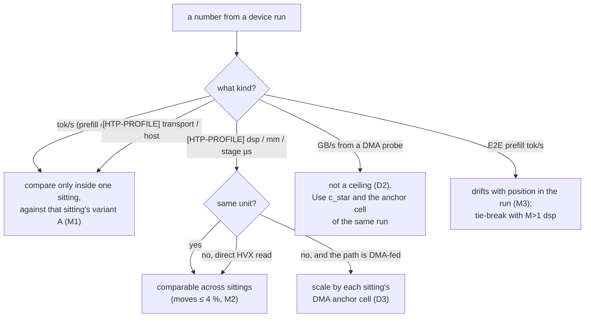
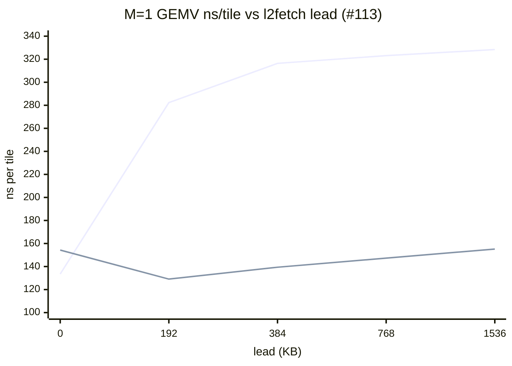
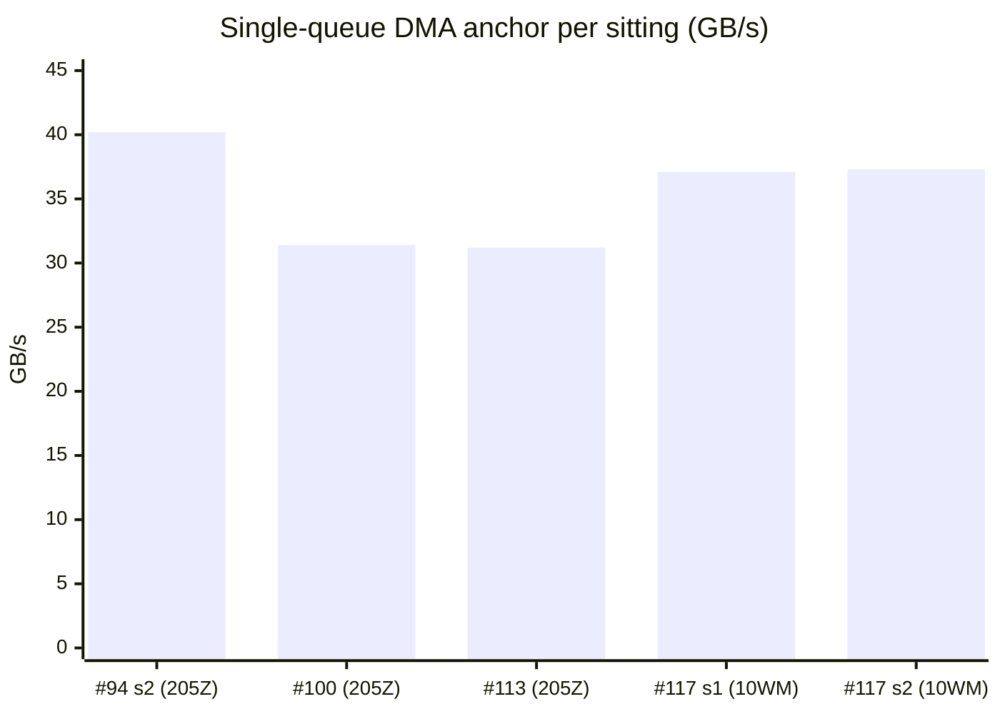

# Lessons learned on silicon

As of **2026-09-23**, `htp_moe` @ `9fb1a3bc`.

This chapter collects what the phone taught us that reasoning got wrong.
It covers the rules that now bind every change, the questions that are
closed and how they were closed, the negative results worth keeping, and
the questions that are still open. It merges two sources: the device work
of the upstream PR #4327 (Jul–Sep 2026) and the `htp_moe` decode work
(#77 onward, 2026-09-21 to 2026-09-23, up to the merge of PR #118).
Plans and ordering belong to the roadmap chapter. The system itself is described in
[architecture.md](architecture.md).

**How to read it.**

- Each rule has an ID (`D3`, `K2`, …) grouped by topic. The column
  *was* gives the old ledger rule number, so a reference such as "rule 28"
  in an issue or commit can be mapped here. `—` means the rule is new to
  this list (mostly lessons from the upstream PR's documents).
- Tags: `upstream PR #4327` for lessons from the upstream PR's device work,
  `htp_moe` for this project's, `hvx_impl` for rules carried over from the
  earlier HVX-only branch, whose silicon rules apply here too.
- Rules that were later amended or withdrawn appear only in their final
  form. The withdrawal is kept when it is the lesson itself (D2).
- "Unit" is one of the two Galaxy S25 Ultra phones: `R3CY205ZMND`
  (most `htp_moe` sittings) and `R3CY10WM83Y` (#117, and the upstream
  author's device).
- "Sitting" is one session on one phone. Variant A is the unchanged
  reference binary and runs first.

## 1. Rules learned on silicon

### 1.1 Reading a number

Most rules below are about which number can be compared with which. They
reduce to one picture:

### 1.2 DMA and memory

| ID | rule | evidence | tag | was |
|---|---|---|---|---|
| D1 | **Decode is bytes divided by each reader's bandwidth.** One token reads ≈ 893 MB of weights on the NPU model (MoE 484 on the DSP, 408 on the CPU) and ≈ 953 MB on the CPU model. Count the bytes from the model's shapes, not from an estimate: the long-quoted 730 MB (and the 48–52 tok/s "ceiling" built on it with 34–38 GB/s) undercounted the non-MoE weights by ≈ 160 MB. | The CPU model at 52.4 tok/s reads ≈ 50 GB/s (#94); the CPU alone read 67.9 GB/s in #77's two-reader probe. The MoE share is 22 × 22.02 MB = 484 MB per token. Byte counts reproduce both model file sizes ([weight-format.md](weight-format.md)). | upstream PR #4327, htp_moe | — |
| D2 | **An isolated DMA probe is not a ceiling. The tag-validated per-call cell `c_star` is.** Probe rates cannot be reached by any real per-call descriptor list. Wall 2 is decided only by instrumentation inside the layer call. | Probes read 72–80 GB/s (contiguous) and 108–117 GB/s (strided 2D) while the MoE call's own DMA ran at 16.2–18.0 GB/s (#77). The "4–7× gap" was then blamed on the chunk list (≈ 2.7×, #94 sitting 2). #100 (2026-09-23) re-measured with content-checked cells: `c_star` = **26.3 GB/s** = 0.36 × the same log's probe (73.2). Against `c_star` the traced 46-descriptor list runs at **1.19×**, so it is faster than the ceiling. Every validated cell sits at 30–31.7 GB/s whatever the descriptor count (8 to 46), chaining mode or destination layout. The "list is slow" rule was withdrawn. | htp_moe | 11 (amended), 19 (withdrawn), 28 |
| D3 | **The single-queue DMA rate belongs to the unit and can shift for good between sittings. Every absolute GB/s or `mm` gate on a DMA-fed path is read next to the same sitting's anchor cell.** The anchor is `DMA_REPLAY workers=1 load=0 pace=0` in `unittest_hvx_dma_probe` (`MoeChunkReplay`), unchanged since #94. | `R3CY205ZMND`: 40.2 GB/s once (#94 sitting 2), then 31.4 (#100) and 31.2 (#113). `R3CY10WM83Y`: 37.1 and 37.3 (#117, two sittings). A cooled repeat (31.8 °C vs 46.5 °C) matched every ratio within 1 %, so the shift is not thermal. One-worker rows were 15–30 % low while four-worker rows stayed within 6 %, so it is the issue rate of one queue, not aggregate DDR bandwidth. The direct HVX read is the same on both units (`mm` 922.7 / 931.9 vs 937.0, < 1 %). Consequences: a DMA-fed win depends on the unit (the VTCM feed is 1.38× on `R3CY10WM83Y`, ≈ 1.16× projected on the other). The MoE floor per token is 13.0 ms at 37.3 GB/s and 15.5 ms at 31.2. | htp_moe | 10, 30, 32, 34 |
| D4 | **HVX reading weights straight from DDR tops out at 21–27 GB/s, whether the buffer is the ION arena or the cached heap.** Only a DMA feed into VTCM gets past it. | #105 (2026-09-22): arena vs heap within 11 %, no consistent sign. The same band (21–25 GB/s direct vs 37 through the DMA ring) was measured on a sibling SoC in `hvx_impl` #59. | htp_moe | 27 |
| D5 | **HVX streaming out of VTCM is nearly free next to a DMA writing into it.** A VTCM feed costs the DMA rate and nothing else. | #100: HVX load on vs off costs 0.1–0.3 % on all three certified feed shapes (699.8 → 700.5, 695.5 → 697.6, 700.5 → 701.8 µs/call). Confirmed inside the layer call by #117: the DMA is busy 640–682 µs of a 712 µs call and the ≈ 240 µs of arithmetic is hidden. | htp_moe | 29 |
| D6 | **The DSP's 4 GiB address space, not host RAM, bounds how many weights can be mapped.** Mappings and the DSP heap share it. Large chunks waste space to alignment. | 3840 MiB of arena plus ≈ 182 MiB of heap fill one 4 GiB space. With 1 GiB chunks the app stopped at 3072 MiB, which looked like a 3 GiB limit. The real cause was 768 MiB lost to alignment. 256 MiB chunks fit 3840 (2026-09-15, PR author's device). Code: `kArenaChunkMax` = 256 MiB in `htp_compute_ops.cpp`, `NNTR_HVX_MAX_ARENAS` = 32 in `test/htp/nntr_hvx_session.h`. | upstream PR #4327 | 8 |
| D7 | **The kind of memory and the access pattern decide the time, not the instruction count.** Scattered writes to uncached DDR break write combining. | Re-splitting the quantizer by row groups scattered its writes to the uncached FastRPC output buffer: `quant` went from 98.5 to 295.5 µs per call (+200 %). The same quantize function takes 28.1 µs from VTCM and 69.1 µs from uncached DDR (2.5×). 2026-09-10, PR author's device. | upstream PR #4327 | — |

### 1.3 HVX and HMX kernels

| ID | rule | evidence | tag | was |
|---|---|---|---|---|
| K1 | **The HMX always computes 64-row tiles. Its cost scales with the number of blocks, not with M.** At M = 1, 63 of 64 rows are padding, and one decode call cannot go below ≈ 1 ms on the HMX. This is why decode moved to an HVX GEMV. | Per block, `mm` ≈ 188 µs and `acc` ≈ 65 µs, the same at prefill and decode. 4 blocks predict 752 / 259 µs, and decode measured 752.0 / 260.5 (2026-09-15, PR author's device). | upstream PR #4327 | — |
| K2 | **At M = 1 the HVX GEMV over the arena is bound by DDR read latency, not by `vrmpy` issue. Cutting compute there makes it slower.** Read a compute-side change on the `hot` (L2-resident) cell, or after the weights come from VTCM. | #105: dropping `gemm_rows4`'s three dead accumulators (the one-row loop `gemm_row1` in `hvx/hvx_gemm_u8i4_wh.c`) raised M==1 `mm` from 973.0 to 1044.6 µs (+7.4 %) and cut decode by 4–8 %, while the `hot` cell got 2.26× faster (70.77 → 31.25 ns/tile). With 2 `vrmpy` per quarter-tile instead of 8, fewer loads are in flight to cover the latency. | htp_moe | 26 |
| K3 | **An `l2fetch` lead helps only a loop that is starved for latency, and only up to one L2 budget.** Never add a prefetch knob without its own `hot`-vs-`arena` cell. Read the lead as an ordinal, not as bytes. Under the VTCM feed (the default since PR #118) the lead is off by construction: there is nothing left to prefetch. | #113 (2026-09-23), full 2 × 5 matrix (below). The four-row loop with any lead is 2.1–2.5× slower (interference, not eviction: the `hot` cell stays flat at 71.7–73.5). The one-row loop improves to 192 KB (154.3 → 129.1 ns/tile) and degrades past it (384 KB × 6 lanes ≈ 2.25 MB, the L2 budget). In the layer call, one-row + 192 KB gives `mm` 937.0 vs 1000.2 (−6.3 %). The hardware queues three `l2fetch` per thread and stalls on a fourth, so the up half of stage A gets only about two column-computes of lead (comment on `HVX_GEMV_PF_LEAD_KB` in `hmx/hexkl_mm_u8i4_moe.h`). | htp_moe | 31 |
| K4 | **Integer `vrmpy` sums are exact in any order. Divergence can enter only in the float epilogue.** This is what lets a new path be proven bit-identical to the old one. | `MoeLayerM1GemvMatchesHmx`: GEMV vs HMX, 0 bad elements at every sitting since #94. | hvx_impl | — |
| K5 | **ARM and DSP give the same bits only if they run the same IEEE operations in the same order: no FMA, no qf32, no division.** "Both accurate" is not enough when the result feeds a u8 quantizer. | Two SwiGLU implementations, each accurate to ≈ 1e-6, flipped one u8 level in 5 of 32 calls (`total_flips=1/1792`, SNR 67.6–79.8 dB). The down matmul spread that one element across the row. A shared deterministic SwiGLU (`nntrainer/tensor/swiglu_det.h`, `hvx/hvx_swiglu_det.h`) gave 32/32 `max_abs_err=0` (2026-09-10, PR author's device). | upstream PR #4327 | — |
| K6 | **The compiler is part of the source.** FMA contraction silently changes bits. `#pragma clang fp contract(off)` does not protect NEON intrinsics. Check the emitted code of any kernel that must be bit-identical. | A reference built with FMA failed the device layer test by exactly 1 ULP on 20 097 of 409 600 elements (2026-09-14, PR author's device). The `swiglu_det.h` header records 12 `fmla` emitted with the pragma and without it. Only an empty `asm` tie on each result stops the contraction. | upstream PR #4327 | — |
| K7 | **v79 HVX IEEE `sf` arithmetic keeps subnormals. It does not flush them to zero.** A scalar spec for HVX `sf` code is plain IEEE round-to-nearest-even with no flush. The host side must not run under a flush either (`-ffast-math` can set aarch64 FPCR.FZ). | #95 (2026-09-22, side tree): an FWHT fed ±1e-39 returned `0x1.7f4b4p-127`, the unflushed result, where the flushing spec said `+0`. The fix is part of #110 and not yet in this tree. The overflow row of the same test (±3e38) is unexplained (§4). | htp_moe | 24 (second) |
| K8 | **Quantizers decode integers, never `sf` bits, because qf32 → sf conversion differs between v75 and v79.** Compute in fp32 inside an op and narrow once. | `hvx_impl`: narrowing after a qf16 multiply cost 2.7 % perplexity. | hvx_impl | — |
| K9 | **Estimates of the form "N events × T each" failed 3 of 3 inside the kernel.** The time is set by which memory is touched in which pattern (D7), and by what waits on what. The one change that survived hid a wait. It did not remove work. | Phase A (2026-09-10, PR author's device): quantizer re-split +200 %, dequant splat change no effect, worker spin-wait 0.8 µs where 50 µs was predicted. Only hiding the weight DMA behind the activation quant survived: drain 111.9 → 67.9 µs (−39 %). | upstream PR #4327 | — |

The lead matrix behind K3 (#113, `ns_per_tile` on the arena, lower is
better). The upper line is the four-row loop, the lower the one-row loop:

### 1.4 Transport (ARM ↔ DSP calls)

| ID | rule | evidence | tag | was |
|---|---|---|---|---|
| T1 | **Moving a matmul to the DSP pays only when the round trip is smaller than the work.** The stages of one layer must run in one call. | conv in_proj on the DSP saved 13 ms of prefill where 65–100 ms was expected. One call per expert would be 176 calls × 326 µs ≈ 57 ms per token of pure transport. Upstream fit at prefill payloads: transport ≈ 150 µs + payload / 3.0 GB/s (PR author's device). | upstream PR #4327 | 7 |
| T2 | **The ARM polls for the DSP's reply for up to `NNTR_HTP_POLL_US` µs (default 5000), then falls back to an interrupt wait.** A call longer than the window pays the wake-up. The window has a driver ceiling: 10 000 is refused, and the session drops to PM QoS (`qos_mode=1` in the profile's first line). | Code comment in `htp_backend.cpp`. At 100 µs the decode call's transport read 158 µs, at 5000 it read 83 µs (PR author's device). In #88, the poll was 67.6 µs of the 313.4 µs cut. | upstream PR #4327 | — |
| T3 | **A transport change also moves time outside the call's own timer.** Budget from tok/s, not from the profile alone. | #88 (2026-09-22): of the 12.6 ms/token gain, only ≈ 6.9 ms shows in the transport column. The time outside the MoE call read 13.5 ms (A), 11.4 (poll 100 µs), 8.4 (fix) at gen 64. Cause not separated (candidates: the polling core keeps its cluster clock up, cache maintenance around the call). | htp_moe | 23 (corollary) |
| T4 | **A DSP-side read pattern moves the ARM-side transport column.** Read `transport` next to `mm` for every DSP-path variant. | #100 read the GEMV path's transport at 185.8 µs vs 84.6 on the HMX path and called it a GEMV path cost. #117 then read 82.0 / 92.3 µs with the VTCM feed vs 184.6 / 190.3 on the direct arena read, same binary and sitting. The extra ≈ 100 µs belonged to the direct HVX arena read, not to the GEMV. 22 × ≈ 0.1 ms = 2.2 ms/token came back with the feed. Cause not separated. | htp_moe | 35 |

### 1.5 Measurement method and drift

| ID | rule | evidence | tag | was |
|---|---|---|---|---|
| M1 | **Only an A/B inside one sitting is a verdict. Any unit may be used.** Every sitting starts with the control binary. The filled handoff records which unit ran, and every benchmark row is tagged with it. | Decode drifted 20.8 → 16.5 tok/s between upstream sittings with no code change. Three identical consecutive runs read 25.1 → 16.2 → 14.5 tok/s (PR author's device). Two units were 6–8.6 % apart on one binary (`hvx_impl`). The CPU path drifts ≤ 7 % per cell day to day (#94 first attempt vs #77). | upstream PR #4327, htp_moe | 9, 10, 13 |
| M2 | **Across sittings, only the DSP's own columns (`dsp`, `mm`, stage µs) carry the kernel.** tok/s, `host` and `transport` carry host and thermal state. | Same unit, same path: NPU tok/s −7..−16 % while `dsp`/`mm` moved ≤ 4 % (#94 sitting 2 vs #77). Identical sources ≈ 2 h apart: transport 648.6 → 401.3 µs (−38 %), `dsp` −0.2 %. Two profile passes from 30 °C and from 50–58 °C agreed ≤ 0.4 % on every `mm` (#105). Upstream: `dsp` 612 → 560 → 558 µs while transport read 272 → 2686 → 527. | upstream PR #4327, htp_moe | 20, 23, 27 (part) |
| M3 | **End-to-end prefill tok/s drifts with the cell's position in the run.** Use the M>1 `dsp` column as the tie-breaker for the prefill gate. | Variant A's own repeated pairs differed by −10..−24 % (#105). In #117 sitting 2, A's gen-1024 prefill read 528.9 right after a cool-down vs 401.9 later. | htp_moe | 27 (part) |
| M4 | **A `--profile` build is never the tok/s binary.** | It makes prefill 83 % slower (4360 vs 2377 ms, PR author's device). It adds ≈ 20 ms/token to decode on both paths (#77: 76.2 vs 54.4 ms and 39.3 vs 19.0 ms). | upstream PR #4327, htp_moe | 1 |
| M5 | **`NNTR_HTP_PROFILE=3` inflates `[M0-PROF] ffn=` about 5×.** Only the `[HTP-PROFILE]` `transport`, `host` and `dsp` columns compare across levels 2 and 3. | 16–20 ms → 88–90 ms per MoE layer (#77). | htp_moe | 15 |
| M6 | **Read `min`, not `avg`, of a profile column** when the first call pays a one-time setup. | Upstream: averages included the registration call. | upstream PR #4327 | 2 |
| M7 | **The profile's `host` column wraps only the FastRPC call.** ARM work around it is invisible. No `[HTP-PROFILE]` block at all means nothing was dispatched: check the config on the device, not on the host. | An ARM-side activation quantize looked free and cost 300–420 µs per call (PR author's device). | upstream PR #4327 | — |
| M8 | **In a GEMV profile row (`m1_gemv=calls/calls`), `swiglu` is lane-time summed over the 6-lane pool, not a stage.** `swiglu / mm` is lane utilization. | #94 C: 5601.2 / 974.7 = 5.75 lanes. Since PR #108 the row's `rest` leaves it out, and `htp_compute_ops.cpp` prints `weight DMA: n/a (direct arena read inside mm, … lanes busy …)`. | htp_moe | 24 (first) |
| M9 | **A DSP bandwidth loop must defeat VTCM and L2 residency, or it measures the cache.** Bound the result inside the test (≤ 150 GB/s or `INVALID`). | The two-reader probe's `dsp_alone` read 3265 GB/s (#77). The bound is not yet in `unittest_hvx_dma_probe.cpp`. It is #90's fix. | htp_moe | 12 |
| M10 | **Inside one sitting, a probe rate follows the phone's temperature.** Quote a probe with its `thermal_zone0`. Use the cool reading as the achievable rate. | Probe shape iii, 1 worker: 106.9 GB/s at 29 °C, 88.8 at ≈ 51 °C (3–19 %) while the tok/s cells of the same sitting held (#94 sitting 2). | htp_moe | 18 |
| M11 | **Accuracy verdicts come from full-model columns (perplexity, per-call SNR over a whole run, text vs A), never from a synthetic single-shape test.** A gtest gates bit-identity to its reference. It prints SNR as a field. SNR in front of a quantizer means nothing: compare bits. | #95: `MoeLayerHadamardMatchesTwoCallReference` matched its reference bit for bit but read −5.8 dB SNR on uniform synthetic input. The full model in the same sitting gained +8.0 dB median SNR over ≈ 6.2 k real calls and 12.7 % lower perplexity. | htp_moe, upstream PR #4327 | 25 |
| M12 | **Host checks model neither HMX nor HVX nor real DMA. Normal-looking text does not catch a 1-ULP error.** Run the device layer test on every kernel change. | The upstream kernel changed six times on "host check bit-identical" alone. The next device layer test failed (the cause was the reference's FMA, K6). 1 ULP still picked the same tokens over 473 generated. | upstream PR #4327 | — |
| M13 | **Square test shapes hide transposes and swapped arguments.** | Cost two device rounds upstream (PR author's device). | upstream PR #4327 | — |
| M14 | **For LFM2-MoE, the tok/s report comes from `CausalLM::run` in `causal_lm.cpp`.** The report block in `Lfm2CausalLM::run_with_embeddings` runs only on the embedding-input path. Any new report line (such as `generation(last 64)`) goes in the base block. | #77, deviation 3. The line is planned (#89) and not in the code at `9fb1a3bc`. | htp_moe | 16 |

The anchor cell of D3, per sitting (GB/s, `DMA_REPLAY workers=1 load=0
pace=0`, identical code in every sitting):

`205Z` = `R3CY205ZMND`, `10WM` = `R3CY10WM83Y`. The first bar has not come
back in two sittings. The last two are a different engine rate on a
different phone.

### 1.6 Build and deploy

| ID | rule | evidence | tag | was |
|---|---|---|---|---|
| B1 | **Rebuild the DSP skel (`test/htp/build.sh`) whenever the IDL or any DSP source changes.** `Applications/CausalLM/build_android.sh` never builds it. The three loader errors: `0x8000040E` (`AEE_EBADPARM`) = skel older than the IDL. `0x80000406` = the skel itself does not load. `htp Context is not registered` = app side. | Hit three times upstream. #94's first attempt hit the second one (#97). | upstream PR #4327, htp_moe | 3, 17 (part) |
| B2 | **A Hexagon shared object links with unresolved symbols, and the device loader then fails with a message that reads like a segment-layout bug.** `test/htp/build.sh` now fails if `hexagon-readelf --dyn-syms` lists an undefined symbol outside the runtime allow-list (`HAP_*`, `compute_resource_*`, `qurt_*`, compiler-rt, libc). Every new `.c` under `htp_backend/` is checked against the script's `SRCS` at review. | #97: `hexkl_dma_trace.c` never entered `SRCS`. The host check compiled it on its own, so the host gate passed, and the skel had seven undefined `hexkl_dma_trace_*`. The ledger named `hexagon-nm -u -D`. The script uses `readelf`. | htp_moe | 17 |
| B3 | **`build_android.sh` without `--htp` builds a CPU-only `libnntrainer.so` without complaint.** Without `--cache` it deletes `builddir` first. Check `readelf -d libnntrainer.so` for `libsdkl.so` in `NEEDED`. | The upstream rule named a `--clean` flag. That flag no longer exists in this tree. The same trap now sits behind any build without `--htp`. | upstream PR #4327 | 4 |
| B4 | **Never push the link-time stub `libcdsprpc.so` to the phone.** The device's own library must be the one loaded. | Upstream mobile run guide. | upstream PR #4327 | 5 |
| B5 | **`QS4CX_WH` has no CPU fallback.** A wrong layout gives plausible wrong text, not an error. `moe_htp_layers` must stay empty (empty means every MoE layer takes `moe_engine`). A listed subset would send the others to a CPU path that cannot read the format. | `tryMoeLayerOnAccelerator` and `Lfm2MoeCausalLM::createMoeLayer` (`lfm2_moe_layer.cpp`, `lfm2_moe_causallm.cpp`). | upstream PR #4327 | 6 |
| B6 | **Always set `HEXKL_SDK_VER` (6.4.0.1) and `HEXKL_ROOT` explicitly.** Unset, `test/htp/build.sh` takes the newest directory under `$HEXKL_ROOT/lib`, so a workstation with another HexKL installed links it silently. | #94 sitting 2. The fallback is `ls -1 "$HEXKL_ROOT/lib" \| sort -V \| tail -1` in the script. | htp_moe | 21 (part) |
| B7 | **Compiled artifacts are not byte-identical across build paths. A handoff is reproducible from its commit, not from a staging directory.** A sitting whose variants are different binaries is accepted only if (a) every result row carries the device md5 of the binary that differs, (b) the source diff between the variant commits is exactly the change under test, and (c) shared DSP artifacts are one file for all variants. Variants switched only by environment or config on one binary set need (a) alone. | #77: skel, app and gtest md5s all changed after rebuilding identical sources elsewhere, while every non-compiled file matched. #94 sitting 2 and #88 ran on sets rebuilt from the named commits. | htp_moe | 14, 21, 22 |
| B8 | **A fresh worktree is not ready to build.** `subprojects/` is empty (`git submodule update --init --depth 1`). `Applications/CausalLM/lib/libtokenizers_android_c.a` is per checkout. `libc++_shared.so` may have to come from the NDK r30 sysroot. | #105 run notes: the Android build died on `iniparser.h` after ≈ 15 min. | htp_moe | — |

### 1.7 Process

| ID | rule | evidence | tag | was |
|---|---|---|---|---|
| P1 | **Measure the breakdown before acting on a hypothesis.** | The first FastRPC hypothesis (marshalling dominates) measured 16–32 %. The real cost, a scalar accumulator copy-out at 92 % of DSP time, was found by per-stage timing (PR author's device). | upstream PR #4327 | — |
| P2 | **A hypothesis that fits the numbers is not yet the cause.** | In one upstream session, 4 of 5 first diagnoses were wrong, and each was fixed by a measurement. Example: "lm_head is FP32, 537 MB" matched 25.7 ms by coincidence. The real cause was an unrepacked Q4_0 tied embedding read at 2.9 GB/s vs 24.5 for a repacked FC in the same run. In `htp_moe` the "4–7× DMA gap" turned out to be the probe (D2). | upstream PR #4327, htp_moe | — |
| P3 | **One variable per run.** Confirm switch states before the run and check them in the output afterwards. On the M=1 path, the `[HTP] moe m1 gemv: on (applied=0x…) lead=…KB rows1=… feed=… source=…` banner proves which path ran. An unset run prints `applied=0x303e1 … feed=vtcm`, and `NNTR_MOE_HTP_GEMV_FEED=0` prints `feed=arena`. An A log with the wrong word voids the sitting. | Upstream: a run that moved two switches together answered nothing. The banner is printed by `sendMoeOptsOnce` in `htp_compute_ops.cpp`. | upstream PR #4327, htp_moe | — |
| P4 | **A decode win below the issue's gate may still land as the default** if it holds at all three generation lengths in one sitting, the text is byte-identical and the prefill gate holds. Whether the issue is done is still the gate's call. A win at one length only, a win inside A's own spread, or a win bought with a text change does not qualify. | User decision, 2026-09-23. #113's one-row + 192 KB loop missed `mm` ≤ 840 (937.0) and landed (PR #115) on decode +4.11 / +3.29 / +4.26 % at gen 64 / 512 / 1024. | htp_moe | 33 |

## 2. Verdicts

Closed questions, oldest first. Numbers from the PR author's device are
marked.

| question | answer | evidence | date |
|---|---|---|---|
| Group several FC projections into one call? | Yes. Transport 326 → 68 µs per matmul. | Upstream FC measurements (PR author's device) | 2026-08-08 |
| One FastRPC call per expert? | No: 176 calls/token ≈ 57 ms of transport. One call per MoE layer instead. | Upstream MoE task analysis | 2026-09-04 |
| Where does an upstream MoE call spend its time (prefill)? | Moving and converting bytes. The HMX multiply is 17 % of a gate_up call. Transport is 54 %. | Upstream per-stage profile (PR author's device) | 2026-09-09 |
| Fuse gate_up → SwiGLU → down into one call? | Yes, once SwiGLU is bit-identical on both sides (K5): 32/32 `max_abs_err=0`. | Upstream (PR author's device) | 2026-09-10 |
| Upstream kernel micro-optimizations (quantizer split, dequant splat, worker spin, DMA overlap)? | One of four survived: overlap weight DMA with activation quant (K9). | Upstream (PR author's device) | 2026-09-10 |
| Can all 1408 expert weights be mapped on the DSP? | Yes: 256 MiB chunks, 3840 MiB arena, ≈ 182 MiB heap in one 4 GiB space (D6). | Upstream (PR author's device) | 2026-09-15 |
| Why was the first `QS4CX_WH` decode 3.5× slower than the CPU? | Three walls, and fixing one leaves the next as the floor. HMX 64-row tile 1.03 ms, weight DMA at 18 GB/s (1.19 ms floor), transport 0.57 ms × 22 calls = 12.5 ms/token. Plus lm_head at 25.7 ms (tied embedding not repacked, fixed by a blocked twin in `tie_word_embedding.cpp`). | Upstream decode analysis (PR author's device) | 2026-09-16 |
| conv in_proj on the DSP? | Runs, text identical, −13 ms prefill. Not a decode lever. | Upstream (PR author's device) | 2026-09-18..21 |
| Where does an NPU decode token go (profile build)? | `lfm2_moe` 42.1 vs CPU 22.3 ms/token. `fully_connected` 28.2 vs 10.3, with no FC on the DSP. Most of that gap is the profile build's own ≈ 20 ms/token (M4), so it is worth ≈ 2–3 ms in real tok/s. lm_head 2.85 vs 3.40: the NPU run already wins there. | #77 A, `R3CY205ZMND` | 2026-09-21 |
| What is the MoE call's transport made of (wall 3)? | Buffer handling, not argument marshalling. Staging 245.8 µs (decode's 8 KiB rode a 4 MiB cached ION pair) + poll 67.6 µs of 401.3. Fixed by size-class ION staging (`StagingPool`) and the 5 ms poll: **87.9 µs/call**, decode +30.9 / +41.4 / +42.9 % at gen 64 / 512 / 1024, text identical. Prebound handles not needed. | #77 B, #88 (PR #103), `R3CY205ZMND` | 2026-09-22 |
| HVX GEMV instead of HMX at M = 1 (wall 1)? | Yes. Upstream had rejected it for decode: decode was then "memory-bound, 25.81 vs 25.73 tok/s" and belonged on the CPU. Here it cut the call's `dsp` 1414 → 1044 µs (−26 %) with text identical. It is the default since PR #108: +13.5 % decode at gen 64 vs GEMV off, same sitting. | #94 sitting 2 C, #100 A/A0, `R3CY205ZMND` | 2026-09-22 / 23 |
| Is the DMA descriptor list slow (wall 2)? | No. Against `c_star` it runs 1.19× faster than the ceiling (D2). The in-situ 16–18 GB/s was interleaving with compute plus an engine that tops out near 31 GB/s on that unit. At M = 1 the GEMV path bypasses the list (`desc=2/call`). | #94 sitting 2 attribution, #100 | 2026-09-23 |
| Can the GEMV's compute side get `mm` down further? | No. The best (loop, lead) pair is one-row + 192 KB at `mm` 937.0 µs. It lands as the default under P4: decode +4.11 / +3.29 / +4.26 %. Under a direct feed `mm` cannot go below ≈ 815 µs (22 MB at 27 GB/s). | #105, #113 (PR #115), `R3CY205ZMND` | 2026-09-23 |
| Feed the GEMV from VTCM by DMA? | Yes. `mm` 931.9 → 676.4 µs (−27.4 %), transport 190.3 → 92.3 µs, decode **+32.5 / +30.9 / +28.6 %**, text identical 36/36, prefill `dsp` ±0.04 %. The default since PR #118 (`HVX_GEMV_M1_FEED` = 1 in `hmx/hexkl_mm_u8i4_moe.h`, opt-out `NNTR_MOE_HTP_GEMV_FEED=0`). The gain depends on the unit (D3). | #117, two sittings, `R3CY10WM83Y` | 2026-09-23 |
| Hadamard rotation of the MoE down_proj input (`QS4CX_WH_HAD`)? | Carry it over: perplexity 115.095 → 100.497 (−12.7 %, now below the CPU's 109.759), median requant SNR +8.0 dB. Cost +0.3 % of the M==1 `dsp`, decode within drift. Port pending (#110). | #95, side tree `htp_hadamard`, `R3CY205ZMND` | 2026-09-22 |
| How far are the NPU's weights from the CPU's in accuracy? | NPU perplexity is +4.9 % over the CPU `Q4_0` model, and the text leaves the CPU's at generated word 43. That is why NPU rows are checked against their own control, not against the CPU text. | #95 | 2026-09-22 |
| Where does a token go with the feed on (gen 512)? | 27.4 ms = MoE on the DSP 15.7 + round trips 2.0 + CPU work 9.7. Floors: MoE 13.0 ms at 37.3 GB/s (15.5 at 31.2), the CPU's 408 MB ≈ 8.2 ms at ≈ 50 GB/s. The serial floor is ≈ 21–24 ms (≈ 42–47 tok/s), so 50 tok/s needs concurrent CPU/DSP reads, fewer bytes, or a faster DSP read ([roadmap.md](roadmap.md) §1). | #117 sitting 2 profiles and tok/s | 2026-09-23 |

## 3. Tried and dropped

Cross-cutting negative results that someone could plausibly try again,
or that explain why the design is what it is. Results owned by one
component are in that component's chapter.

| attempt | result | why it matters |
|---|---|---|
| Use an isolated DMA probe rate as the target | 72–117 GB/s is not reachable by any real per-call list (D2) | Gates on DMA-fed paths use `c_star` and the anchor cell |
| More DMA workers issuing in parallel | 1 / 2 / 4 workers: 40.2 / 39.1 / 36.5 GB/s | The engine does not scale with issuers; one queue is the design |
| Bus bandwidth vote | ≤ 4 %, inside noise (#77) | Not a knob worth carrying |
| Vary descriptor count, chaining mode or destination layout | Every validated cell 30–31.7 GB/s (#100) | The feed uses the simplest shape (`f2`: two linear descriptors per expert) |
| Cross-matmul weight prefetch at MoE widths | Drain at 35 GB/s with 4 handles and with 1 (PR author's device) | Prefetch helps only where something else is waiting. The VTCM feed is the working form |
| Push the next expert's gate_up chunks early (upstream) | The activation queued behind them. GATHER 84 → 747 µs/call. The DMA moves ≈ 12 GB/s next to the HMX (PR author's device) | Ordering inside one in-order ring decides who waits |
| Quantize the activation on the ARM | 300–420 µs per call, against 100–150 µs of transport saved (PR author's device) | HVX writes quantized tiles straight into VTCM. There is no DDR detour to save |
| Drop the GEMV's dead accumulators without a prefetch lead | `mm` +7.4 %, decode −4..−8 % (#105) | Less compute means fewer loads in flight at M = 1 (K2) |
| Add an `l2fetch` lead to the four-row loop | 2.1–2.5× slower at every lead (#113) | Prefetch interferes with a loop that is not latency-starved (K3) |
| Prebound FastRPC handles (planned for wall 3) | Not built: staging + poll already reached 87.9 µs/call (#88) | The per-call arguments are 464 bytes and never were the cost |
| Pass the MoE call's arguments from one rpcmem buffer (upstream) | Transport 627 → 605 µs, noise (PR author's device) | Same lesson as above |
| Poll window of 10 000 µs | Refused by the driver. The session falls back to PM QoS | 5000 µs is the default. The ceiling between the two is unknown |
| Run the dense FFN through the MoE kernel (upstream `d2f0bf47`) | +4 % perplexity (PR author's device) | Must stay off by default if the upstream sync brings it (#120) |
| `NNTR_NUM_THREADS=8` on the CPU side (upstream) | Net loss: lm_head −5.6 s, FC +6.7 s over a run (PR author's device) | The thread count is left at the app default |

## 4. Open questions

The questions still open at `9fb1a3bc`, with the current evidence. What
to do about them is the roadmap chapter's.

| question | current evidence | issue |
|---|---|---|
| Can the CPU and the DSP read DDR at the same time for more total bandwidth? This decides whether a CPU + NPU expert split can ever pay. | The CPU side reads 67.9 → 39.7 GB/s under DSP contention (−41 %). The DSP side of the probe measured its cache (M9). | #90 |
| Why does the feed's in-call DMA run below the anchor? | The engine reads 32.3–34.4 GB/s in the layer call vs the anchor's 37.3 and the VTCM microbench's 37.7. That is ≈ 86 µs/call ≈ 1.9 ms/token on `R3CY10WM83Y`, nothing on a 31 GB/s unit. `first expert ready at 122 µs` is the first 3.5 MB not hidden. To be confirmed by the first sitting that runs the feed as variant A. | not filed |
| Does one DSP call per token pay? | Round trips 2.0 + CPU work 9.7 = 11.7 ms/token against a ≈ 8.2 ms CPU byte floor. Moving the CPU's 408 MB to the DSP at its single-stream 31–37 GB/s would cost 11–13 ms, so it pays only if the DSP reads those weights faster than one DMA stream (unmeasured). No single op saves time until every op between two MoE layers is on the DSP. | #85, #82, #81 (#84 harness) |
| Which accuracy column gates the per-token entry? | Once attention and the norms run on the DSP, the text cannot stay bit-identical to the CPU run. The CPU runs attention in fp16 with its own `exp`. Candidates: text vs A, perplexity (`NNTR_PPL`, upstream `32b46e32`), or a matching deterministic CPU path. | user decision; #110 |
| Why is `fully_connected` slower on the NPU run with no FC on the DSP? | 28.2 vs 10.3 ms/token in the profile build. In real tok/s the whole outside-the-call time is 9.7 ms against a ≈ 8.2 ms byte floor, so ≈ 1.5 ms at stake. Candidates: CPU threads contending with the FastRPC poll thread, CPU clock while the DSP runs. | ride-along, no issue |
| What moved ≈ 5 ms/token outside the MoE call in #88 (T3), and ≈ 100 µs of transport in #117 (T4)? | Both measured in-sitting, neither separated. Candidates: the polling core's clock, cache maintenance at the call boundary, a call that ends inside the poll window. | — |
| Why is the DMA engine 19 % faster on one unit, and why did `R3CY205ZMND` read 40.2 GB/s once? | Three anchor values (40.2 once, 31.2–31.4 twice, 37.1–37.3 twice). The HVX direct read is the same on both units, so the difference is in the DMA engine or its clock (D3). | — |
| Why does the replay test fail its content check? | `MoeChunkReplay` reads `checksum_ok=n` on all 11 old cells, including the D3 anchor that every handoff quotes. The timing is sound: the replay writes packed where the kernel writes strided, and the DDR read stream is the same. | #99 |
| What does the HVX FWHT do with overflow inputs? | The ±3e38 row differs in 127 of 256 outputs. It is ungated and unexplained (inf/NaN encoding is the candidate). | #110 |
| lm_head blocked twin: confirmed on this tree? | #77's profile reads lm_head at 2.85 ms/token (CPU 3.40), consistent with the twin working. It has no dedicated in-sitting A/B. | — |
| `generation(last 64)` in the report | Not printed for LFM2-MoE yet (M14). | #89 |
