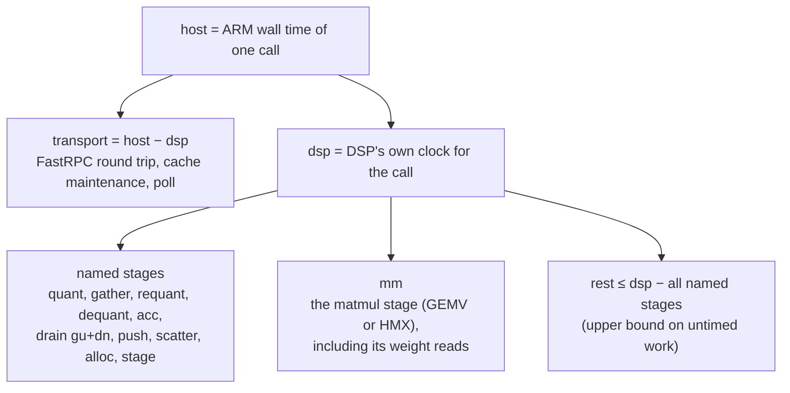
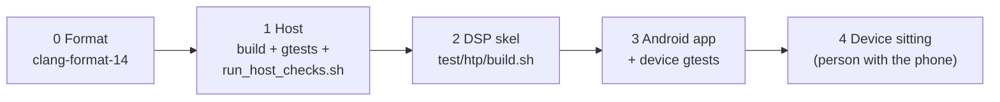
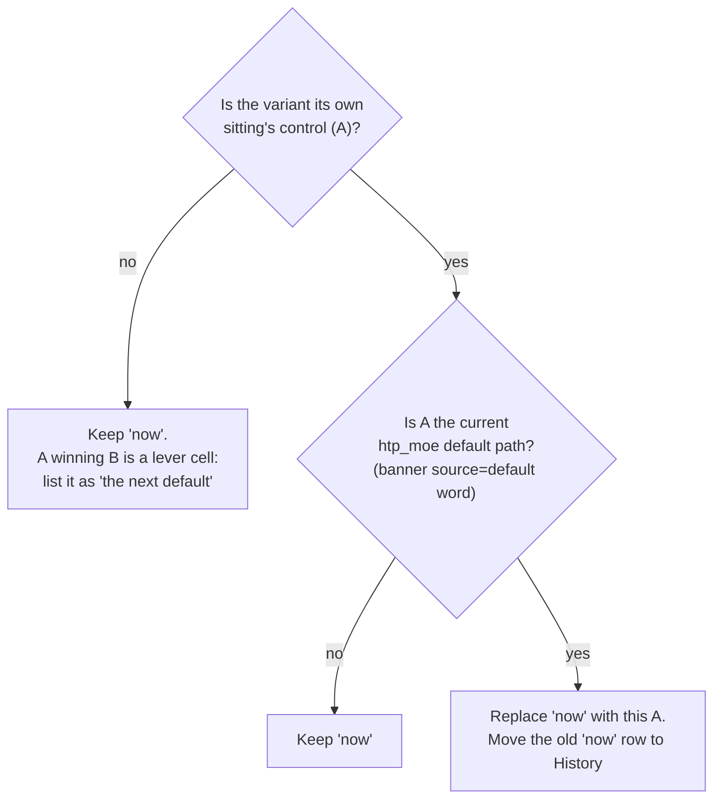

# Measurement

As of **2026-09-23**, `htp_moe` @ `9fb1a3bc`.

This chapter covers how LFM2.5-8B-A1B decode speed is measured on the
phone, how to read the NPU profile the runtime prints, the checks a change
must pass before it goes to the phone, and the benchmark and goal tables
themselves. The last section is the checklist a person follows to add a new
measurement sitting to this chapter, with no tooling beyond a shell and a
text editor.

Provenance: the profiler's base (levels 1–3, the `host` / `dsp` /
`transport` columns, the stage columns, `blocks=`, the `weight DMA:` line)
comes from **upstream PR #4327**. The measurement protocol, the `DMA ring:`
and `staging:` lines, `m1_gemv=`, the swiglu lane-time reading, the host
checks added after the PR and every number below are **htp_moe**.

## 1. How we measure

### 1.1 The run

Every number in this chapter comes from a **full-model end-to-end run** on
the phone: `nntrainer_causallm` with the real 8B model, never a kernel
benchmark on its own. Kernel tests and probes may run next to it but never
replace it.

| setting | value |
|---|---|
| binary | `nntrainer_causallm`, release build with `--htp`. A `--profile` build is never used for tok/s, because it inflates prefill by about 83 % |
| threads | `NNTR_NUM_THREADS=8`, for both the CPU and the NPU model |
| prompt | 512 tokens (`prompt512.txt`, md5 `fc65c158…`) |
| generation | 64, 512 and 1024 tokens (`"num_to_generate"` in the model's `nntr_config.json`) |
| decoding | greedy (`"do_sample": false`, `"bad_word_ids": [124900]`) so the text can be compared byte for byte |
| repeats | two runs per cell (variant × G), reported as the mean of the two |
| NPU model | `q40-qs4cx-wh`: MoE experts in `QS4CX_WH`, everything else Q4_0; `"moe_engine": "htp"`, `"moe_htp_layers": ""` |
| CPU model | `q40`: all Q4_0, no HTP |

The run prints one block at the end (`Applications/CausalLM/models/causal_lm.cpp`,
`CausalLM::run`):

```
prefill: 512 tokens, <ms> ms, <tok/s> TPS
generation: <G> tokens, <ms> ms, <tok/s> TPS
total: <ms> ms
peak memory: <KB> KB
```

`prefill:` with a count other than 512 voids that run's prefill column.
`generation:` with a count other than G means the config edit failed.
Decode tok/s is the `generation:` line, averaged over the whole
generation. A "last 64 tokens" rate is planned (#89) but not printed yet.

The device command, from `/data/local/tmp/nntrainer/causallm` on the phone:

```
adb shell "cd /data/local/tmp/nntrainer/causallm && \
  <variant env> NNTR_NUM_THREADS=8 LD_LIBRARY_PATH=. ADSP_LIBRARY_PATH=. \
  ./nntrainer_causallm ./models/q40-qs4cx-wh \"\$(cat prompt512.txt)\"" 2>&1 | tee <log>
```

The CPU control is the same command with `./models/q40` and no variant
environment.

### 1.2 Sittings, variant A first, mirrored order

A **sitting** is one session on one phone with one set of pushed files.
The phone's decode speed drifts between sittings with no code cause: up to
±9 % on the CPU and −7 to −16 % on the NPU on the same unit from one day to
the next, while the DSP-side profile columns move ≤ 4 %. So:

- **Variant A**, the unchanged reference binary, runs first in every sitting.
  Every other variant (at most four in total) is read only against the A of
  the same sitting. A tok/s from another sitting is never a verdict.
- Inside each G block, variants run in **mirrored order** (A, A0, B, B, A0,
  A), so the thermal ramp over the block hits every variant equally. The
  mean of the mirrored pair is the cell's value.
- Where possible the variants are **one binary set** switched by
  environment variables. Then the only thing that differs between cells is
  the variable, and the log proves which path ran (§1.6).

```mermaid
flowchart LR
    P["Push files<br/>record device md5sum"] --> T0["thermal checkpoint 0<br/>screen off, charger in"]
    T0 --> AN["DMA anchor, cold<br/>(once per sitting)"]
    AN --> GT["kernel gtests<br/>bit-identity"]
    GT --> PR["level-2 profiles<br/>G=64, one run per variant"]
    PR --> E64["G=64<br/>A A0 B B A0 A"]
    E64 --> E512["G=512<br/>A A0 B B A0 A"]
    E512 --> E1024["G=1024<br/>A A0 B B A0 A"]
    E1024 --> CK["workstation checks<br/>banners, text diff, md5"]
```



A cool-down goes before each profile and each G block (§1.4). Profile runs
are never read for tok/s.

### 1.3 Units

Two Galaxy S25 Ultra phones (SM-S938N, Snapdragon 8 Elite, Hexagon v79)
have been used. The PR author measured on a third one. Any unit is allowed,
but every row records which one ran it.

| unit | DMA anchor (`DMA_REPLAY workers=1 load=0 pace=0`) | sittings |
|---|---|---|
| `R3CY205ZMND` | 724.0 µs/call = **31.2 GB/s** (#113, 2026-09-23); 719.6 / 31.4 in #100 | #77, #94, #88, #105, #100, #113 |
| `R3CY10WM83Y` | 607.9 / 605.3 µs/call = **37.1 / 37.3 GB/s** (#117, both sittings, 2026-09-23) | #117 |

The anchor is an untouched replay of one MoE call's weight copy through the
DSP's DMA engine, one worker, no compute. It runs first, while the phone is
cold:

```
adb shell "cd /data/local/tmp/htp_u8i4_layer_test && LD_LIBRARY_PATH=. ADSP_LIBRARY_PATH=. \
  ./unittest_hvx_dma_probe --gtest_filter='*MoeChunkReplay*'" | grep 'DMA_REPLAY '
```

The two units' DMA engines differ by about 19 %, but their HVX reads of the
same memory do not (the D192 `mm` column read 931.9 µs on the fast unit and
937.0 on the slow one). Therefore:

- A per-call DSP time on a **DMA-fed** path (for example the VTCM feed,
  PR #118) is compared across units only after scaling it by the ratio of
  the two anchors. #117's feed `mm` of 676.4 µs would read about 805–809 µs
  on `R3CY205ZMND`.
- A direct-read path's `mm` transfers across units as it is.
- tok/s never transfers across units. Two units were already 6–8.6 % apart
  on one binary before this project.

The `DMA_REPLAY workers=` lines print `checksum_ok=n` and the test reports
`FAILED`. This is a known, pre-existing condition of the old replay cells
(#99), not a new failure. The timing on the line is still valid.

### 1.4 Thermal handling

Temperature moves prefill a lot and decode somewhat, so it is recorded
rather than argued about afterwards.

- Record battery level, battery temperature and `thermal_zone0` at the
  start, after the profiles and after each G block:
  `adb shell dumpsys battery | grep -E 'level|temperature'; adb shell cat /sys/class/thermal/thermal_zone0/temp`.
- Start cold: screen off, charger in. Run the DMA anchor before anything
  warms the phone.
- Cool down before each profile and each G block: wait until the battery
  reads ≤ 33.0 °C and `thermal_zone0` < 38 °C, for at most 5 minutes.
- Even so, `thermal_zone0` reads 55–60 °C during every E2E run. The two
  #117 sittings on the same unit and files (first warm, second with
  cool-downs) differed by 1–9 % in decode for every variant alike. That is
  why only same-sitting ratios count.
- A lone run far below its pair after a hot block (#100's A run 3: 16.71
  against 27.89) is thermal. It is noted, not averaged in.

### 1.5 Gates

| gate | rule | where it is read |
|---|---|---|
| **decode** | the variant beats A at **all three** G, as means of mirrored pairs in one sitting. The issue may set its own threshold (default ±5 %) | E2E |
| **prefill** | no variant falls below **−5 % of the same sitting's A** | E2E prefill tok/s, with the profile's M>1 `dsp=` as tie-breaker |
| **text** | the generated text is byte-identical to the **same sitting's A**, with the `[HTP]` banner and md5 lines excluded | `diff` of the logs up to the `=====` line |
| **kernel** | the DSP kernel is bit-identical to its scalar spec and to the reference path | host checks (§3) and the device gtest `MoeLayerM1GemvMatchesHmx` (`bit_identical value=yes`, `bad_elems_M1 value=0`, `bad_elems_M4 value=0`) |
| **real-model diff** | `NNTR_L2_DIFF` = 0 when a variant changes DSP arithmetic | E2E with the variable set |

**Prefill tie-breaker.** One sitting's A spreads by ±13 % in prefill
(389–527 tok/s in #94 sitting 2), and a run's position in the mirrored
block alone moved #105's A pairs by −15 to −24 %. A single cell 5 % low is
therefore noise. When a cell misses −5 %, read the level-2 profile's M>1
row: if its `dsp=` is within about 2.5 % of A's, the prefill path did not
change and the gate passes. Example: #117's feed variant read −8.5 % at
G=1024. Its M>1 `dsp` moved −0.04 %, and the feed does not run at M>1 at
all (`m1_gemv=0/23`), so it passed. The planning contract's older form of
this gate (an absolute floor of 497 tok/s) is superseded by the
same-sitting form.

**Why text is compared to A and not to the CPU.** The NPU model's MoE
weights (`QS4CX_WH`) are a different quantisation from the CPU model's
(`Q4_0`), so the two texts are expected to differ. A change on the NPU path
must leave the NPU text unchanged. A mismatch fails the variant: it is
filed and never averaged in.

### 1.6 Path banners are the proof of which path ran

Each run prints one line on stderr when the first MoE call is set up
(`HtpComputeOps::sendMoeOptsOnce` in
`nntrainer/tensor/htp_backend/htp_compute_ops.cpp`). An unset run at
`9fb1a3bc` prints:

```
[HTP] moe m1 gemv: on (applied=0x303e1) lead=192KB rows1=1 feed=vtcm source=default
```

- `applied=` is the option word the DSP echoed back, not the one the ARM
  side sent. If the two differ, the run throws instead of falling back. A
  skel older than the ARM side therefore fails loudly.
- `source=default` means `NNTR_MOE_HTP_M1_GEMV` was unset. `source=env`
  means it was set explicitly.
- The knobs are `NNTR_MOE_HTP_M1_GEMV` (`0` = the HMX block loop),
  `NNTR_MOE_HTP_GEMV_LEAD_KB`, `NNTR_MOE_HTP_GEMV_ROWS1` and
  `NNTR_MOE_HTP_GEMV_FEED` (`htp_moe_opts_flags` in `htp_moe_opts.h`).

Since PR #118 (merged as `d79c0efe`; `99fdbbf4` flips the default) the
VTCM feed is the default. The next sitting's cells are:

| cell | env | `applied=` | banner words |
|---|---|---|---|
| **A** (the default) | unset | `0x303e1` | `lead=192KB rows1=1 feed=vtcm source=default` |
| A0 (D192 arena read, the previous default) | `NNTR_MOE_HTP_GEMV_FEED=0` | `0x103e1` | `lead=192KB rows1=1 feed=arena` |
| pre-#115 cell (four-row, no lead) | `NNTR_MOE_HTP_GEMV_LEAD_KB=0 NNTR_MOE_HTP_GEMV_ROWS1=0 NNTR_MOE_HTP_GEMV_FEED=0` | `0xe1` | `lead=0KB rows1=0 feed=arena` |

**Rule.** Every E2E and profile log must contain **exactly one** banner,
and it must carry the variant's expected word. From PR #118 on, variant A
must print `feed=vtcm source=default`. An A log with `feed=arena` or
`feed=default` is a pre-flip build and voids the sitting. Check it before
reading any number:

```
grep -c 'moe m1 gemv: on' logs/*_G*_r*.log logs/prof_*.log     # 1 in each
grep -l 'HTP-PROFILE' logs/*_G*_r*.log                         # nothing: no E2E run was profiled
```

The #117 numbers in this chapter predate the flip. They were measured on
PR #118's branch (`3c4912fa`), where the feed was opt-in: A printed
`applied=0x103c1 lead=192KB rows1=1 feed=default source=env` and the feed
variant B printed `applied=0x303e1 … feed=vtcm`. The flipped default has
the same word as that B, but it has **not yet run on silicon as a sitting's
control**.

### 1.7 Artifact provenance

- Every pushed file has an md5 and the commit it was built from. The device
  side is checked with `adb shell md5sum …`, and every E2E command also
  prints the skel's md5 into its log.
- **Compiled files are not byte-reproducible.** Two builds of the same
  source give two skel md5s, and other workstations give other app md5s.
  The identity is the md5 of the file actually pushed. A rebuild from the
  commit is fine: record the new md5s next to the commit and the exact
  build line.
- Non-compiled inputs must match everywhere: model `.bin`, `tokenizer.json`,
  `prompt512.txt`, `libc++_shared.so`, `libsdkl.so`.
- If variants are different binaries, every results row carries the md5 of
  the file that differs, and the source diff between the variant commits is
  exactly the change under test. Otherwise the sitting is void.
- A skel from before an IDL or DSP change fails on the phone with
  `AEE_EBADPARM (0x8000040E)`. A skel missing a project symbol fails to
  load with `0x80000406`. Never push the link-time stub `libcdsprpc.so`.
- Build lines always set `HEXKL_SDK_VER=6.4.0.1`. Without it,
  `test/htp/build.sh` picks the newest HexKL on the machine.

**Current reference set**: what #117 ran (both sittings, unit
`R3CY10WM83Y`, built at `3c4912fa` = PR #118's branch with the feed still
opt-in; one skel and one app set for every variant):

| file | md5 | built with |
|---|---|---|
| `libnntr_hvx_skel.so` | `5cea0a5a35c72c72ce2daffa8e7588e5` | `HEXKL_SDK_VER=6.4.0.1 ./test/htp/build.sh` |
| `nntrainer_causallm` | `21221e9006636d054844361a83a3836a` | `Applications/CausalLM/build_android.sh --htp` |
| `libcausallm_core.so` | `ffbe434507a695132eb5dae7877fc647` | same |
| `libnntrainer.so` | `39e375adb165e41e908e00b85d7bcd66` | same (`jni/obj/local/arm64-v8a/`) |
| `libccapi-nntrainer.so` | `d1bf42a37f3a5e530567fd180df414af` | same |
| `unittest_hvx_mm_u8i4` | `2781e9fb2a70ac00bed6eb1da6608856` | `ndk-build … unittest_hvx_mm_u8i4` |
| `unittest_hvx_dma_probe` | `639c2eb4993fee118f8a86ddeb7adbe4` | same |
| `libc++_shared.so` | `b1586b9b512712800fd36a24abac1c0a` | NDK r30 sysroot |
| `libsdkl.so` | `0ad4e22a70e4f135bce38ad8fd1e001b` | HexKL `lib/6.4.0.1/armv8_android26` |
| `prompt512.txt` | `fc65c1588dc66dd764c7013fe96cbb75` | the fixed 512-token prompt |
| NPU model `q40-qs4cx-wh/nntr_lfm2_8b_a1b_q40_arm.bin` (4 316 133 120 B) | `7b7867fab51845664c0050c0a837073e` | `nntr_quantize_stream … --moe_dtype QS4CX_WH --isa ARM` |
| CPU model `q40/nntr_lfm2_8b_a1b_q40_arm.bin` (4 768 855 808 B) | `d28f55c5bd7adeb8bf73b02de582eb88` | `nntr_quantize_stream … --isa ARM`, all Q4_0 |
| `tokenizer.json` | `7b8067a580173d3eb1697afae3b456f5` | from the HF model |

The flipped-default build (`99fdbbf4`) was restaged for the next sitting.
Three files changed: skel `b42d2e3bc321ac77b3a1a644db4c3801`,
`libnntrainer.so` `6b3e92b5f45d5d13368b37796f3d94c9` and
`unittest_hvx_mm_u8i4` `e6adeeb367779382a3244a6d762db5d3`. The rest are as
above. It has not run on the phone yet. Once a sitting runs it, its set
replaces this table.

## 2. How to read a profile

### 2.1 Levels

`NNTR_HTP_PROFILE` is read once (`HtpProfile` in
`nntrainer/tensor/htp_backend/htp_compute_ops.cpp`), and the report is
printed to stderr when the process exits. A profiled run is **never** read
for tok/s.

| level | what it adds |
|---|---|
| 1 | per-shape call counts and `host=` (ARM wall time per call), weight registration cost |
| **2** | the DSP times itself: `dsp=`, `transport=` and every stage column, plus the `weight DMA:`, `DMA ring:` and `staging:` lines. **This is the level to read.** |
| 3 | runs each MoE call 5 times on the same input and keeps the fastest. This removes DDR noise from the DSP columns, but it inflates the model-level `[M0-PROF] ffn=` about 5×. Only `host`, `dsp` and `transport` compare between levels 2 and 3 |

`NNTR_HTP_DMA_TRACE=<n>` (default 3) sets how many per-descriptor DMA dumps
are printed. The header line `[HTP-PROFILE] level=2 qos_mode=2 …` must show
`qos_mode=2` (polling). With any other mode the transport numbers are not
comparable.

### 2.2 The row

One row per call shape. The MoE layer call is `K=2048 N=2048`. The two
rows that matter are `M==1` (decode: 1408 calls = 22 layers × 64 tokens at
G=64) and `M>1` (prefill: 23 calls).

```
[HTP-PROFILE]   K=2048  N=2048  M==1    calls=1408    rows=…  host=… ms ( 1185.4 us/call)
  dsp=  995.1 us/call (…%) transport=  190.3 us/call  [quant … gather … requant … swiglu …
  dequant … acc … drain …+… push … scatter … alloc … stage … mm 931.9 | rest<=… (…% of host)
  blocks=0 m1_gemv=1408/1408 feed=0/1408]
```



| column | meaning |
|---|---|
| `host` | ARM-side µs per call, from the call to its return |
| `dsp` | µs per call as the DSP timed it. `(x%)` is its share of `host` |
| `transport` | `host − dsp`: FastRPC, cache maintenance and poll. It drifts between sittings like tok/s, so it is read only as an A/B inside a sitting. A DSP-side change can move it (the VTCM feed cut it 190 → 92 µs), so it is always read next to `mm` |
| `quant` | fp32 activation → u8 on the DSP |
| `gather` | copying the routed rows into place (HMX path) |
| `requant` | intermediate → u8 between gate/up and down |
| `swiglu` | HMX path: the SwiGLU stage. **M=1 GEMV path: lane-time**, the sum of every worker lane's wall time inside the two GEMV stages. It is not on the call's clock; `swiglu / mm` is the number of lanes busy (6 on v79) |
| `dequant`, `acc` | int32 → fp32 and accumulator reads |
| `drain X+Y` | waits for weight DMA before gate/up (X) and down (Y) |
| `push` | DMA descriptor issue |
| `scatter` | routing-weight multiply and scatter-add into the output rows |
| `alloc` | the call's own allocations |
| `stage` | the stage slot for per-call staging copies |
| `mm` | the matmul stage, timed on the DSP. On the GEMV path it includes the direct weight read from DDR, so it is the column the decode work moves |
| `rest<=` | `dsp` minus every named stage (`htp_moe_row_rest_us`, `htp_moe_opts.h`). On GEMV rows `swiglu` is not subtracted, because it is lane-time. A healthy row keeps it within a few % of `host` |
| `blocks=` | HMX 64-row tiles issued. It is 0 when every call took the GEMV path |
| `m1_gemv=n/calls` | calls that took the M=1 HVX GEMV. `1408/1408` on the M==1 row and `0/23` on the M>1 row is the per-call proof of the path |
| `feed=n/calls` | calls whose weights came through the VTCM DMA feed (PR #118). `1408/1408` on the M==1 row under the feed; `0/23` on every M>1 row, because the feed runs only at M=1 |

### 2.3 The lines under the row

**`weight DMA:`** has two forms:

- Ring-fed paths (HMX, or the VTCM feed):
  `weight DMA: 21504 KB/call, first 3584 KB took 110 us = 33.2 GB/s; averaged over the call 31.0 GB/s`.
  The "first" rate times one chunk with an empty ring. The "averaged" rate
  divides by the whole `dsp`, so it understates the engine.
- The direct-read GEMV path:
  `weight DMA: n/a (direct arena read inside mm, no ring; swiglu = lane-time, 5.76 lanes busy over mm)`.

**`DMA ring:`** is printed when the call pushed descriptors:

```
DMA ring: desc=10/call waits=10 (blocked 9.9) wait=442 us [act 0.0 gu 0.0+dn 0.0]
  busy=640..681 us -> engine 32.3..34.4 GB/s  depth max=4  first expert ready at 121 us  last issue at 500 us of 711
```

`desc` and `waits` are per call; `blocked` is how many waits actually
stalled. `busy` is a bracket (lower..upper), so the engine rate is a
range, and the **lower bound is the in-situ rate** to compare against the
unit's anchor. `busy ≈ mm` means the engine never idled. `busy ≪ mm`
measures the gap. On the direct-read path the ring carries only two small
copies (`desc=2/call`).

**`staging:`** shows the call's transport inventory:
`staging: act 65536 B out 65536 B ion=y rpc allocs=19 (session) non-ION in-args=6/464 B`.
`act` / `out` are the staging buffer classes, and `ion=y` means both are
ION (shared) memory. `rpc allocs` is process-wide and must **not** grow with
the number of calls. The in-args are the bytes the driver copies outside
ION.

The report ends with `layer calls total`, `arm staging memcpy` (outside
every `host=`) and `HTP host time`.

### 2.4 The current paths, per call

Level 2, M==1, G=64, #117 sitting 2, unit `R3CY10WM83Y`, 2026-09-23
(µs/call, `blocks=0 m1_gemv=1408/1408` in all three; `feed=0/1408` for A0
and A, `1408/1408` for B). This sitting's labels are used. Since PR #118,
B is the default path and A is the next sitting's A0.

| variant | path | host | dsp | transport | mm | M>1 dsp |
|---|---|---:|---:|---:|---:|---:|
| A0 | four-row GEMV, no lead (the pre-#115 default) | — | 1059.4 | 185.2 | 997.4 | 16447.2 |
| **A** | one-row GEMV + 192 KB `l2fetch` lead, direct DDR read (the default until PR #118; the "now") | 1185.4 | 995.1 | 190.3 | 931.9 | 16469.9 |
| B | A + VTCM DMA feed (opt-in then; the default since PR #118) | 804.2 | 711.9 | 92.3 | 676.4 | 16463.0 |

B's ring: `desc=10/call`, engine 32.3–34.4 GB/s, against this unit's
anchor of 37.3.

### 2.5 The per-token budget

The profile is per call; tok/s is per token. They join like this, for one
G (512 is the reference) and **one sitting**:

1. token time = 1000 / decode tok/s (ms), from the non-profiled E2E means.
2. MoE on the DSP = 22 × M==1 `dsp`; round trips = 22 × M==1 `transport`
   (22 MoE layers, one call each per token).
3. **Outside the MoE call = token time − 22 × M==1 `host`**. This covers
   everything the CPU does: attention, conv, the dense FFNs, norms,
   lm_head, the router.

#117 sitting 2, G=512 (profile at G=64 from the same sitting):

| | A (D192 arena, the "now") | B (VTCM feed, now the default) | needed for 50 tok/s |
|---|---:|---:|---:|
| token (1000 / tok/s) | 35.86 ms (27.89) | 27.40 ms (36.49) | 20 ms |
| MoE on the DSP (22 × dsp) | 21.9 | 15.7 | 13.0–15.5 (byte floor) |
| round trips (22 × transport) | 4.2 | 2.0 | ≈ 0 |
| outside the call (token − 22 × host) | 9.8 | 9.7 | ≈ 8.2 (byte floor) |

The MoE byte floor is 22.02 MB per call × 22 = 484 MB per token, divided by
the unit's DMA anchor: 13.0 ms at 37.3 GB/s, 15.5 ms at 31.2 GB/s. The
rest of the model reads 408 MB per token on the CPU (lm_head 147, conv
projections 170, attention 35, dense FFN 50, routers 6;
[weight-format.md](weight-format.md)). At the ≈ 50 GB/s the CPU shows in
its own decode, that is ≈ 8.2 ms. The two floors add up to ≈ 21–24 ms,
above the 20 ms that 50 tok/s needs. [roadmap.md](roadmap.md) §1 works
through what that means.

## 3. Verification ladder

Everything runs on the workstation from the repo root after
`source tools/htp/env.sh` (Hexagon SDK 6.4.0.1, HexKL `lib/6.4.0.1`, NDK
r30, `HEX_ARCH=v79`). Export `HEXKL_ROOT` explicitly if the package is not
at the default path. The rungs are cumulative. A rung counts as passed only
when its pass line appears in the output. Provenance: host checks from
**upstream PR #4327**, extended in **htp_moe** (GEMV, DMA trace, replay,
option-word checks).



**0. Format.** Run `clang-format-14 -i <changed .c .cpp .h>`, on changed
lines only. Pass: `git diff --stat` shows only the files you meant to
change.

**1. Host (no SDK needed; minutes).**

```
ninja -C build
./build/test/unittest/unittest_nntrainer_cpu_backend --gtest_filter='*qs4cx*'
NNTR_QUANTIZE_BIN=$PWD/build/Applications/CausalLM/nntr_quantize \
NNTR_QUANTIZE_STREAM_BIN=$PWD/build/Applications/CausalLM/nntr_quantize_stream \
  ./build/Applications/CausalLM/unittest_causallm_models --gtest_filter='*Lfm2Moe*'
bash test/htp/host/run_host_checks.sh
bash tools/htp_syntax_check.sh
```

Pass:

- Every gtest ends with `[  PASSED  ]`. `*Lfm2Moe*` must pass 6 tests with
  none `SKIPPED`. The tiny fixture's weights are generated once per
  checkout with
  `python3 test/unittest/models/causallm_reference/generators/generate_lfm2_moe_reference.py`,
  then `git checkout -- test/unittest/models/causallm_reference/lfm2_moe_tiny/`.
- `run_host_checks.sh` prints `M1 GEMV PATH BIT-IDENTICAL TO HMX PATH (…)`,
  `M1 GEMV VTCM FEED SCHEDULE OK (…)`, `ALL CHECKS PASS`,
  `WORKER POOL LANES OK`, `DMA PROBE PLAN OK`,
  `MOE M1 GEMV OPTS: unset=on(0x303e1) 0=off 1=on`,
  `MOE PROFILE ROW: gemv rest>=0 hmx unchanged`, `DMA TRACE ARITHMETIC OK`,
  `REPLAY CELLS PLAN OK (…)` and `SKEL REPLAY MATCHES TAG SIMULATOR (…)`,
  and exits 0. Any `FAIL` or `DIFFERS` line is a failure.
- With the SDK sourced, it also prints
  `HVX GEMV NATIVE BIT-IDENTICAL (libnative; m=1..16 x rows1=0,1)` and two
  `HVX GEMV MUTANT CAUGHT` lines. The mutants show that the check can
  catch a one-token change in the kernel. Without the SDK the script prints
  `HVX GEMV NATIVE CHECK SKIPPED`, which is not a pass for a GEMV change.
- The syntax check exits 0.

The `build/` directory is configured with
`meson setup build -Denable-transformer=true -Denable-tflite-backbone=false -Denable-tflite-interpreter=false`.

The host checks replace the HMX and HVX primitives with scalar stand-ins,
except the GEMV native check, which runs the real HVX source under the
SDK's x86 emulation. They verify routing, buffer reuse, the DMA plans and
the arithmetic of the profile row. They do **not** verify the hardware's
arithmetic or any timing.

**2. DSP skel (SDK; seconds).**

```
HEXKL_SDK_VER=6.4.0.1 ./test/htp/build.sh
md5sum test/htp/build/libnntr_hvx_skel.so
```

Pass: the build is `-Wall -Werror` clean and prints
`UNDEFINED SYMBOLS OK (<n> runtime imports)` (46 at `9fb1a3bc`). If the IDL
changed, redo rungs 1 and 3 as well.

**3. Android app and device gtests (SDK + NDK; about 10 min from scratch).**

```
(cd Applications/CausalLM && ./build_android.sh --htp)        # --cache reuses builddir
readelf -d builddir/android_build_result/lib/arm64-v8a/libnntrainer.so | grep -E 'libsdkl|libcdsprpc'
ln -sfn $PWD/subprojects/googletest/googletest test/jni/googletest     # once per checkout
(cd test/jni && $ANDROID_NDK/ndk-build NDK_PROJECT_PATH=. NDK_APPLICATION_MK=./Application.mk \
   APP_BUILD_SCRIPT=./Android.mk NNTRAINER_ROOT=$PWD/../.. HEXAGON_SDK_ROOT=$HEXAGON_SDK_ROOT \
   unittest_hvx_mm_u8i4 unittest_hvx_dma_probe -j8)
md5sum Applications/CausalLM/jni/obj/local/arm64-v8a/{nntrainer_causallm,libcausallm_core.so,libnntrainer.so,libccapi-nntrainer.so}
```

Pass: both `NEEDED` lines (`libsdkl.so`, `libcdsprpc.so`) are present, the
binaries exist, and the md5s are recorded.

Traps:

- With NDK r30 the shared libraries stay under `jni/obj/local/arm64-v8a/`,
  so push them from there.
- `--cache` skips `builddir` entirely. After any edit under `nntrainer/`,
  run `ninja -C builddir && ninja -C builddir install` first, or
  `libnntrainer.so` stays stale.
- `--clean` on a `--htp` builddir silently drops the HTP option.
- A fresh checkout needs `git submodule update --init --depth 1` and the
  per-checkout tokenizer library
  `Applications/CausalLM/lib/libtokenizers_android_c.a`
  (`build_tokenizer_android.sh`).

**4. Device.** This rung is run by a person with the phone, as a sitting
(§1). Kernel bit-identity on silicon:

```
adb shell "cd /data/local/tmp/htp_u8i4_layer_test && LD_LIBRARY_PATH=. ADSP_LIBRARY_PATH=. \
  ./unittest_hvx_mm_u8i4 --gtest_filter='*MoeLayerM1GemvMatchesHmx*:*MoeM1GemvFeedVsCompute*'"
```

Pass: `U8I4_FIELD … field=bit_identical value=yes`, `bad_elems_M1 value=0`,
`bad_elems_M4 value=0`, no `bad_cell_M*` line, no `INVALID`, and
`[  PASSED  ] 2 tests.` Then run the E2E cells. Performance conclusions
come only from this rung, read as an A/B inside one sitting.

## 4. Benchmark table

Model LFM2.5-8B-A1B, prompt 512 (444 in the PR author's rows), 8 threads.
Decode is the mean of two runs (one run where noted). Prefill is the range
over all runs of that variant. **Now** marks the current reference rows.
Rows from different sittings are **not** comparable with each other (§1.2).
Means are rounded half up from the per-run values, so a few older ones
differ in the last digit from earlier write-ups.

Units: `…5ZMND` = `R3CY205ZMND`, `…WM83Y` = `R3CY10WM83Y`.

### Current reference ("now")

| date | issue | unit | variant | prefill tok/s | decode 64 / 512 / 1024 | text | note |
|---|---|---|---|---|---|---|---|
| 2026-09-23 | #117 s2 | …WM83Y | NPU A: the default at the time (one-row GEMV + 192 KB lead, direct DDR read) | 401.9–528.9 (means 512.3 / 433.2 / 465.4) | **28.22 / 27.89 / 27.23** | control | **now (NPU)**; cooled sitting |
| 2026-09-22 | #94 s2 | …5ZMND | CPU control, `q40` | 267.8–339.7 | **52.43 / 49.22 / 48.31** | reference | **now (CPU)**; no later sitting ran a CPU cell |
| 2026-09-23 | #117 s2 | …WM83Y | NPU B: A + VTCM DMA feed (PR #118) | 399.7–502.0 | 37.38 / 36.49 / 35.01 | = A, 6/6 | +32.5 / +30.9 / +28.6 % vs A; **the default since PR #118**, but not "now" until a sitting measures it as its own A |

### History

| date | issue | unit | variant | prefill tok/s | decode 64 / 512 / 1024 | text | note |
|---|---|---|---|---|---|---|---|
| 2026-09-16/17 | PR | PR author's device | NPU, PR head as-is (MoE on HMX) | 523 | — / 20.8 / — | n/a | (PR author's device), prompt 444, one cell |
| 2026-09-16/17 | PR | PR author's device | CPU, all Q4_0 | 334 | — / 48 / — | reference | (PR author's device), prompt 444 |
| 2026-09-21 | PR | PR author's device | NPU + conv in_proj on HTP | 532 | — / 16.5 / — | = previous run | (PR author's device); drop unexplained, no control run |
| 2026-09-21 | #77 | …5ZMND | CPU control | 231.5–336.4 | 53.52 / 52.32 / 47.49 | reference | first handoff |
| 2026-09-21 | #77 | …5ZMND | NPU, PR head as-is (HMX block loop) | 403.5–541.2 | 20.48 / 18.31 / 18.00 | r1 = r2 | the starting point |
| 2026-09-22 | #94 s1 | …5ZMND | CPU control | 202.7–287.2 | 53.25 / 51.12 / 49.04 | reference | NPU not measured: the skel failed to load (`0x80000406`, #97) |
| 2026-09-22 | #94 s2 | …5ZMND | NPU A: `htp_moe` @ `2a75f7d9`, GEMV switch off (HMX) | 389.1–527.3 | 17.73 / 17.03 / 17.31 | control | |
| 2026-09-22 | #94 s2 | …5ZMND | NPU C: same binary, `NNTR_MOE_HTP_M1_GEMV=1` (HVX GEMV over DDR) | 426.0–529.5 | 18.83 / 18.34 / 17.59 | = A | first GEMV reading, +6.2 / +7.7 / +1.7 % |
| 2026-09-22 | #88 | …5ZMND | NPU A: `htp_moe` @ `08afbb10` (before the transport fix) | 425.6–534.4 | 18.73 / 16.84 / 16.46 | control | |
| 2026-09-22 | #88 | …5ZMND | NPU B: PR #103 (size-class ION staging + 5 ms poll) | 429.9–505.9 | 24.50 / 23.80 / 23.52 | = A | +30.9 / +41.4 / +42.9 %; transport 401 → 88 µs/call |
| 2026-09-22 | #88 | …5ZMND | NPU C: B with `NNTR_HTP_POLL_US=100` | 439.5 | 21.82 / — / — | = A | one run, G=64: the poll alone is worth ≈ 11 % |
| 2026-09-22 | #105 | …5ZMND | NPU A: GEMV on + transport fix (four-row loop) | 359.8–539.5 | 27.74 / 26.88 / 24.83 | control | |
| 2026-09-22 | #105 | …5ZMND | NPU B1: one-row loop, per-column `l2fetch` (lead 0) | 364.2–506.4 | 26.62 / 25.80 / 22.75 | = A, 6/6 | −4.06 / −4.03 / −8.36 % |
| 2026-09-22 | #105 | …5ZMND | NPU B2: one-row, 64 KB lead | 331.0–487.6 | 27.22 / 25.72 / 23.38 | = A, 6/6 | −1.90 / −4.33 / −5.84 % |
| 2026-09-22 | #105 | …5ZMND | NPU B3: one-row, 192 KB lead | 356.3–493.3 | 28.47 / 27.48 / 24.42 | = A, 6/6 | +2.62 / +2.24 / −1.65 %; later re-measured as D192 |
| 2026-09-23 | #100 | …5ZMND | NPU A: GEMV default (PR #108) | 421.1–540.1 | 27.85 / 27.09 / 26.45 | control | a third A run after the profiles read 16.71 (thermal, excluded) |
| 2026-09-23 | #100 | …5ZMND | NPU A0: A with `NNTR_MOE_HTP_M1_GEMV=0` (HMX) | 506.4 | 24.58 / — / — | = A | one run, G=64: GEMV is +13.5 % |
| 2026-09-23 | #113 | …5ZMND | NPU A: four-row, lead 0 (then default) | 415.6–547.6 | 27.44 / 26.83 / 25.93 | control | |
| 2026-09-23 | #113 | …5ZMND | NPU D192: one-row + 192 KB lead | 435.4–532.8 | 28.57 / 27.71 / 27.04 | = A, 6/6 | +4.11 / +3.29 / +4.26 %; became the default (PR #115) |
| 2026-09-23 | #117 s1 | …WM83Y | NPU A: D192 default | 357.8–508.4 | 28.48 / 26.47 / 25.55 | control | warm phone |
| 2026-09-23 | #117 s1 | …WM83Y | NPU A0: pre-D192 cell (`LEAD_KB=0 ROWS1=0`) | 349.5–507.4 | 27.50 / 25.85 / 24.58 | = A, 6/6 | A is +3.56 / +2.41 / +3.93 % |
| 2026-09-23 | #117 s1 | …WM83Y | NPU B: VTCM DMA feed (PR #118) | 366.5–489.0 | 35.66 / 35.93 / 31.47 | = A, 6/6 | +25.2 / +35.7 / +23.2 % |
| 2026-09-23 | #117 s2 | …WM83Y | NPU A0: pre-D192 cell | 401.9–506.4 | 27.56 / 26.77 / 26.20 | = A, 6/6 | A is +2.41 / +4.16 / +3.91 % |

The "now" rows are listed once, in the table above. #113's other matrix
cells (four-row with a lead, one-row with 384 KB) failed the profile gate
and were not run end to end.

## 5. Goals

| goal | now | target | byte floor | distance |
|---|---|---|---|---|
| NPU decode tok/s, G 64 / 512 / 1024 | 28.22 / 27.89 / 27.23 (#117 s2 A, …WM83Y) | **≥ 50** at every G | ≈ 42–47 by bytes with the current CPU/DSP split ([roadmap.md](roadmap.md) §1) | **1.79×** at G=512 (1.77× / 1.84× at 64 / 1024). With the feed (#117 s2 B, 36.49): **1.37×** (1.34× / 1.43×) |
| CPU decode tok/s (the bar to beat) | 52.43 / 49.22 / 48.31 (#94 s2, …5ZMND) | — | — | the CPU reads ≈ 953 MB per token at ≈ 50 GB/s: it clears 50 at G=64 in every sitting, at G=512 in some, and never reliably at G=1024 |
| NPU prefill tok/s, prompt 512 | 401.9–528.9 (#117 s2 A) | gate: ≥ −5 % of the same sitting's A | — | a gate, not a goal. The CPU does 268–340 |
| accuracy | text = own control, kernel bit-identical | identical | — | gate |

Distance = 50 / now, per G. Per-token budget at G=512: 35.86 ms for the
"now", 27.40 ms with the feed, 20 ms needed (§2.5).

**"Now" stays #117 A (28.22 / 27.89 / 27.23)** even though the feed is the
`htp_moe` default since PR #118. The feed was measured only as an opt-in
lever (#117's B). It becomes "now" when a later sitting runs the flipped
build as its A (banner `feed=vtcm source=default`, `applied=0x303e1`) and
reads it against A0 (`NNTR_MOE_HTP_GEMV_FEED=0`) in the same sitting. That
sitting also reads A's `DMA ring:` engine rate against its own DMA anchor.

## 6. Updating this chapter

Follow this checklist when a sitting is finished and its logs are on the
workstation.

**Check the sitting is valid.**

1. The device `md5sum` lines match the artifact table of the sitting, or a
   rebuild from the named commit is recorded with its new md5s (§1.7). If
   the variants are different binaries, every row carries the md5 of the
   differing file.
2. Every E2E and profile log has exactly one `[HTP] moe m1 gemv:` banner
   with the variant's expected word, and no E2E log contains
   `[HTP-PROFILE]` (§1.6). If A's banner is wrong, the sitting is void:
   stop here.
3. Every profile header shows `qos_mode=2`.
4. `prefill: 512 tokens` and `generation: <G> tokens` appear in every
   E2E log.
5. Text: `diff` each variant's log against A's for the same G and run, up
   to the `=====` line, excluding banner and md5 lines. Every diff must be
   empty.

**Add rows.**

6. Add one row per variant to **History** (§4): the mean of each mirrored
   pair per G (two decimals, rounded half up from the run values), the
   prefill range over all of that variant's runs, the unit serial, the
   text result and a one-line note with the % vs this sitting's A. Leave
   out a lone thermal outlier, but mention it in the note.
7. If the sitting ran the DMA anchor, update the unit's row in §1.3. If a
   new phone was used, add its row there. Keep units separate: never
   average or compare tok/s across units, and scale a DMA-fed `mm` by the
   anchor ratio before comparing it.

**Decide whether "now" changes.**



8. "Now" changes **only** when the new row is variant A of its own sitting
   **and** A runs the current `htp_moe` default. A variant that beats A,
   however clearly, is a lever. It becomes "now" only after its default
   flip has landed and a later sitting measures it as that sitting's A.
   The CPU "now" changes only when a sitting runs a CPU control cell.
9. If "now" changed:
   - Replace the row in **Current reference**, move the old one into
     History, and update the "now" column of §5.
   - Recompute **distance** = 50 / now at each G, including the "with the
     next default" figure if a lever row exists.
   - Recompute the **per-token budget** (§2.5) from the new sitting's
     level-2 M==1 `host` / `dsp` / `transport` and its G=512 decode mean.
     Use only numbers from that one sitting.
   - Update §2.4 if the sitting's profile rows describe the current paths.
   - Replace the **current reference set** md5 table (§1.7) with the new
     sitting's files. Old sets are not kept.
   - Update the headline table in [README.md](README.md) ("Where we are")
     and its "where a token's time goes" table to the same numbers, and
     update the chart there if a new change landed.
10. Update the `As of` line at the top of this chapter to the date and the
    `htp_moe` commit the new "now" was measured on.
11. If a gate or a rule of the method changed (a new env knob, a new
    banner word, a new profile field), update §1.5, §1.6 or §2.2. Check the
    code (`htp_compute_ops.cpp`: `sendMoeOptsOnce`, `HtpProfile::dump`)
    rather than a plan or handoff.
