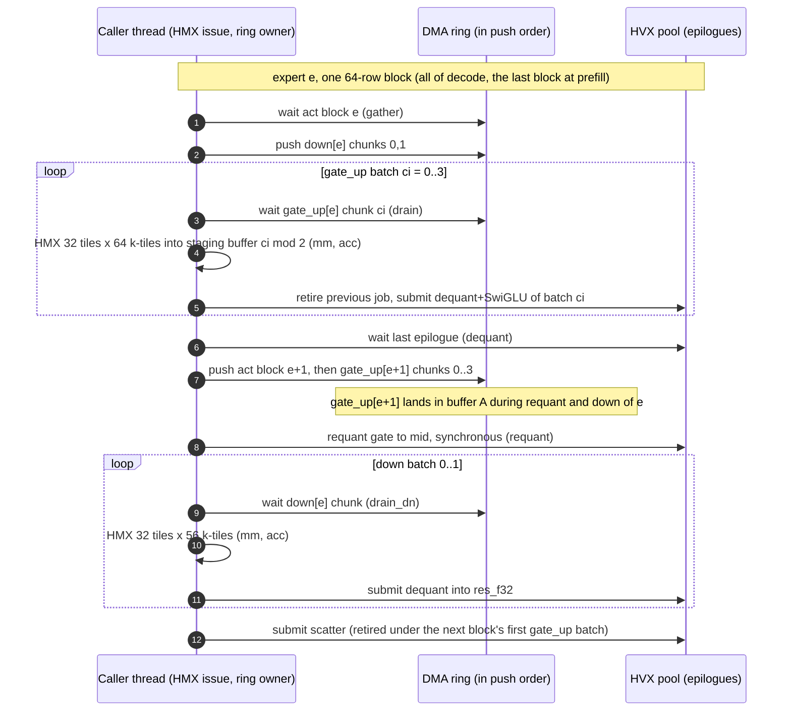
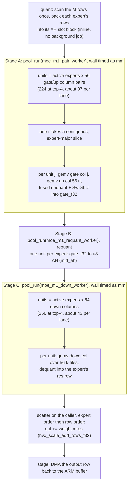

# The MoE FFN on the DSP

As of **2026-09-23**, `htp_moe` @ `9fb1a3bc`.

This chapter covers the one component that runs on the DSP in the measured
configuration: the MoE feed-forward block of the 22 MoE layers. It goes one
level below [architecture.md](architecture.md) §4. It covers the kernel entry
and its checks, the VTCM layout and DMA schedule of the matrix-unit (HMX)
path used for prefill, the vector-unit (HVX) matrix-vector path used for
decode, the VTCM weight feed that decode now uses by default, and the option
word that picks between them. It closes with the numbers
per path and the attempts that were dropped.

Shapes used throughout (LFM2.5-8B-A1B): hidden `K = 2048`, expert width
`inter = 1792`, output `N_out = 2048`, 32 experts, top-4 routing. In 32-wide
tiles: `k_tiles = 64`, gate_up has 112 column tiles (56 gate + 56 up), down
has 64 column tiles over 56 k-tiles. One expert's weights are gate_up
3.5 MiB + down 1.75 MiB = 5.25 MiB, so a decode call reads 4 × 5.25 MiB =
**22.02 MB**.

## 1. How the design got here

| step | provenance | what changed | effect that shaped today's code |
|---|---|---|---|
| Per-expert calls | upstream PR #4327 | Two FastRPC calls per expert (gate_up + SwiGLU, then down) | 176 calls per decode token (22 layers × 4 experts × 2); at ≈ 326 µs per call that is ≈ 57 ms/token of transport before any compute. Abandoned by construction |
| One call per layer | upstream PR #4327 | `hexkl_mm_u8i4_moe_layer_run`: routing, every expert, the weighted sum, in one call | Prefill transport 14.76 → 2.1 ms per layer (PR author's device). The pipeline work inside this call took prefill from 181 to 353 and then to 523 tok/s (prompt 444, PR author's device, 2026-09-15/16) |
| HVX GEMV decode path | `htp_moe`, PR #86 (opt-in), PR #108 (default, #101) | Calls with M ≤ 4 skip the HMX and run a matrix-vector product on HVX | M == 1 `dsp` 1384.6 → 1041.5 µs/call, decode +13.5 % at gen 64 (#100, 2026-09-23, in-sitting A/A0) |
| D192 | `htp_moe`, PR #115 (absorbs PR #107) | One-row inner loop + 192 KB `l2fetch` lead, both per-call bits of `moe_set_opts` | `mm` 1000.2 → 937.0 µs/call, decode +3.3 to +4.3 % (#113, 2026-09-23) |
| VTCM feed | `htp_moe`, PR #118 (merged as `d79c0efe`; default since `99fdbbf4`) | Each expert's weights are DMA'd into VTCM one expert ahead of the GEMV; the D192 arena read stays as the opt-out `NNTR_MOE_HTP_GEMV_FEED=0` | `mm` 931.9 → 676.4 µs/call, decode +28.6 to +32.5 % (#117, 2026-09-23) |

Each step removed the cost that the previous one exposed: first the round
trips, then the 64-row padding of the matrix unit, then the wait for weight
bytes.

## 2. The kernel entry

*Provenance: upstream PR #4327; the `use_m1` branch and the option bits are
`htp_moe`.*

Everything below lives in
`nntrainer/tensor/htp_backend/hmx/hexkl_mm_u8i4_moe.c`. The skel wrapper
`nntr_hvx_mm_u8i4_moe_layer` (and its timed twin) in
`test/htp/nntr_hvx_mm_u8i4.c` calls `hexkl_mm_u8i4_moe_layer_run` with the
session's weight table, VTCM, worker pool, heap scratch and the option word
stored by `nntr_hvx_moe_set_opts`.

**Inputs.** The routing arrives as three arrays in expert order:
`row_count[e]` (tokens routed to expert `e`, zero allowed), `row_index`
(those tokens' row numbers, grouped by expert) and `row_weight` (their
routing weights). Two handle arrays name each expert's gate_up and down
weights in the ION arena. The activation (`act_f32`, M × K) and the output
(`out_f32`, M × N_out) are plain pointers to the ARM's shared buffers.

**Validation happens before any work.** A handle found bad halfway through
would leave `out_f32` partly written, and the caller cannot tell that from a
correct result. So, in order:

1. Null pointers, `M == 0`, or no experts → `AEE_EBADPARM`.
2. `hexkl_mm_u8i4_moe_layout` checks that the shapes divide into tiles and
   that the VTCM layout (§3.1) fits `min(vtcm_size, config_off)` →
   `AEE_EBADPARM` or `AEE_ENOMEMORY`.
3. Every expert with rows has in-range, registered handles whose shapes
   match `K`, `2 × inter`, `inter`, `N_out` → `AEE_EBADPARM`.
4. Every `row_index` is below `M` → `AEE_EBADPARM`.
5. The accumulator layout probe is usable → `AEE_EUNSUPPORTED`; the weight
   chunk count fits the fixed arrays (`MOE_MAX_CHUNKS`, 16) →
   `AEE_EUNSUPPORTED`.

One thing is deliberately not checked: that a row appears only once inside
one expert's slice. The scatter relies on it, and top-k routing guarantees
it. The code marks this with a `ponytail:` comment; the fix, if a future
router breaks it, belongs on the ARM side.

**Scratch.** Per-call staging lives in one heap block kept for the session
(`hexkl_moe_scratch`). Allocating and freeing the ≈ 12.8 MB a prefill call
needs cost 3.0 ms per call; now the block only grows. It is sized for the
worst case of this many rows (`n_slots_cap`), not this call's routing, so
the 22 calls of one prompt cannot regrow it one by one.

**Uncached buffers are touched once.** The ARM's buffers are rpcmem, which
the DSP sees uncached. The kernel copies the activation in with one DMA
(`moe_dma_copy`) into cached heap (`act_c`), works there, and copies the
result out with one DMA at the end. Reading uncached memory element by
element had measured 17.3 ms of gather and 104.8 ms of scatter per call.

**Quantization.** Each source row is scanned once for its u8 scale and zero
point (`hvx_quant_rows_u8_params`), whatever number of experts use it. Rows
are then packed into *slot order*: every active expert's rows,
contiguous, padded to a 64-row block. A token routed to four experts
occupies four slots. Padding slots repeat row 0 and are never read back.

**Path decision** (`use_m1`):

```
use_m1 = (flags & HEXKL_MOE_FLAG_M1_GEMV)
         && M <= MOE_M1_MAX_ROWS (4)
         && widest row_count <= 4
         && 1 <= active experts <= MOE_M1_MAX_EXPERTS (16)
```

Prefill (M in the hundreds) can never enter the GEMV branch, so decode-side
changes cannot slow prefill. The `widest` term restates M ≤ 4 for a caller
that repeats a row inside an expert, because the GEMV's accumulator tiles
hold four rows. 16 experts is the top-4 bound at M = 4. A wider routing
falls back to the HMX loop rather than growing the scratch. The kernel
header documents `HEXKL_MOE_FLAG_M1_GEMV` as "off by default"; that is the
kernel's view (`flags = 0` is the HMX loop). The ARM side sets the bit
unless `NNTR_MOE_HTP_M1_GEMV=0`, so in practice it is on.

Inside the GEMV branch a second decision picks the weight source:

```
m1_feed = use_m1 && feed bit (default 1)
          && 2 * gate_up bytes <= arena && 2 * down bytes <= gate_up bytes
```

With `m1_feed` the weights are staged into VTCM (§6); without it the GEMV
reads them from the arena behind its own `l2fetch` (§4.3).

## 3. The HMX path (prefill)

*Provenance: upstream PR #4327.*

### 3.1 VTCM layout

`hexkl_mm_u8i4_moe_layout` carves the arena into fixed regions. Its sizes
at the LFM2 shape:

| region | holds | size |
|---|---|---:|
| `act_off` | one 64-row activation block, AH tiles | 128 KiB |
| `w_gu_off` (buffer A) | one expert's gate_up weights | 3.5 MiB |
| `w_dn_off` (buffer B) | one expert's down weights | 1.75 MiB |
| `gate_off` | 64 × 1792 f32: `silu(gate)·up`, written by the fused epilogue | 448 KiB |
| `mid_off` | the requantized SwiGLU output, AH tiles | 112 KiB |
| `result_off` | two staging buffers of 32 accumulator tiles each | 512 KiB |
| `res_f32_off` | 64 × 2048 f32, down's dequantized block | 512 KiB |
| **total** | | **≈ 6.9 MiB** of the ≈ 8.3 MB arena |

Two design points follow from this table:

- **Weights are not double-buffered.** Two copies of gate_up and down would
  be 10.5 MiB. Instead each buffer is reused with a time offset: once
  expert *e*'s last gate_up matmul is done, buffer A is dead, and expert
  *e+1*'s gate_up is pulled into it while *e*'s down matmul runs.
- **The accumulator count is capped at 32 tiles**, not maximized. It is
  also the weight chunk size: 32 leaves gate_up in 4 chunks of paired
  columns and down in 2. A smaller chunk lets the matmul start sooner.

"Activation" in VTCM is one 64-row block, not the whole M. The first
version sized it for all rows and failed with `AEE_ENOMEMORY` on expert 6
of a real run. The layout function now computes and rejects the layout
before any hardware is touched, which also makes it testable on a host.

### 3.2 Per block, stage by stage

The caller thread issues HMX work and owns the DMA ring. A worker pool (one
lane per HVX context) runs the HVX epilogues **one job behind** the HMX. The
names in `code` are the `[HTP-PROFILE]` columns (level 2) that time each
step. Most columns time only the *exposed* wait, not the work that ran
hidden.

| order | step | profile column |
|---|---|---|
| 1 | Grow the scratch if needed | `alloc` |
| 2 | Copy the activation in by DMA; zero the output | `stage` |
| 3 | Push expert 0's gate_up chunks, **before** quantization: nothing in the scan needs VTCM, so 3.5 MiB of transfer hides behind it | `push` |
| 4 | Row scan; background pack of slot blocks in 16-row units on the pool's background lane; wait only for the block about to be queued | `quant` |
| 5 | Wait for the activation block; copy its row scales | `gather` |
| 6 | First block of an expert: push its **down** chunks now, behind the activation and ahead of the whole gate_up matmul | `push` |
| 7 | Per gate_up batch: wait for the chunk (first block only) | `drain` |
| 8 | HMX: 16 gate + 16 up column tiles × 64 k-tiles into staging buffer `ci & 1` | `mm`, `acc` |
| 9 | Retire the previous pool job (the previous block's scatter, or epilogue `ci-1`), then submit this batch's **fused dequant + SwiGLU** into `gate_off` | `scatter` / `dequant` |
| 10 | Wait for the last epilogue (requant needs all of `gate_off`) | `dequant` |
| 11 | Buffer A is dead: push the next activation block, or, on the expert's last block, the next expert's first activation block and then its gate_up chunks | `push` |
| 12 | Requantize `gate_off` to u8 AH tiles in `mid_off`, on the pool, synchronously | `requant` |
| 13 | Per down batch: wait for the chunk (first block only), HMX, submit dequant into `res_f32` | `drain` (dn), `mm`, `acc`, `dequant` |
| 14 | Submit the routing multiply + scatter-add; it runs under the next block's first gate_up batch | `scatter` |
| 15 | After the last block: wait for the scatter, copy the output out by DMA | `scatter`, `stage` |

`rest` is the DSP clock minus every named column. `drain` also has a
`DMA_FIRST` sub-reading: the first gate_up wait of the call, which has
nothing to hide behind.



Three ordering rules make this work. The code comments name each one as easy
to undo by accident:

- **Activation ahead of weights.** The ring retires in push order, so a
  wait on index *i* waits for everything pushed before it. With the 128 KiB
  activation queued behind 5.25 MiB of weights, the "gather" wait covered
  the whole weight transfer (795 µs at decode). Queued first, the wait
  times only what it waits for. This one reorder was worth ≈ 2.8 ms per
  prefill call (PR author's device).
- **Paired gate/up chunks.** The epilogue consumes gate tile *j* and up tile
  *j* together (`hvx_dequant_swiglu_acc_tiles_to_f32`), so
  `moe_push_gate_up_chunks` sends each chunk as the gate columns and the up
  columns opposite them. Chunked by plain column order, the first batch
  would wait for three quarters of the weight.
- **Every pool wait sits where the dependency is.** Two staging buffers
  alternate under the HMX issue; `res_f32` has its own region so the
  scatter can read it while the next block's epilogue writes `gate_off`.
  Waiting for the scatter at the head of the block instead of after the
  first batch read 1056 µs per call; moved, it reads 23 µs.

**Fused SwiGLU in the dequant.** The gate and up accumulators never
materialize as separate f32 arrays. The epilogue dequantizes both tiles and
writes `silu(gate)·up` straight into `gate_off`, using the same deterministic
SwiGLU function (`hvx_swiglu_det_sf`) on the same two vectors as the
unfused sequence, so no output byte changed.

**Where a prefill call's time goes** (M > 1 row, 17.5 ms per call,
2026-09-16, prompt 444, PR author's device):

| column | ms/call |
|---|---:|
| `mm` (HMX issue) | 9.25 |
| `acc` (accumulator read-out) | 2.93 |
| transport (ARM ↔ DSP) | 2.1 |
| `requant` | 1.06 |
| `dequant` (exposed) | 0.85 |
| `stage`, `quant`, `drain`, `rest`, `gather`, `scatter`, `push` | 0.36 + 0.26 + 0.22 + 0.19 + 0.14 + 0.05 + 0.05 |

The HMX work itself is 70 % of the call. Everything else is at most 6 %
each. In our sittings the M > 1 `dsp` reads ≈ 16.4 ms per call (#117,
2026-09-23) and prefill runs at ≈ 400–530 tok/s for a 512-token prompt,
against the CPU's 270–340.

**At decode this path pays for 64 rows to compute 1.** Four experts × one
64-row block, plus a 22 MB weight DMA that one live row cannot hide:
`dsp` 1384.6 µs, `mm` 783.1 µs, weight DMA 15.9 GB/s (#100, 2026-09-23,
M == 1). That is why decode left this path.

## 4. The GEMV path (decode, M ≤ 4)

*Provenance: `htp_moe` (PR #86, #108, #115, #118). The kernel
`hvx_gemm_u8i4_wh_col` was first written upstream for the prefill tail
path (§7) and is reused here.*

### 4.1 Stages

With `use_m1`, the call never touches the HMX. Each expert's rows are packed
inline into their slot block. Three stages follow on the worker pool, each
across every lane (6 on v79: 5 workers + the caller), with a full join
between them. The diagram shows the stages with weights read from the arena
(the opt-out, `NNTR_MOE_HTP_GEMV_FEED=0`), where each stage is one pool
run; §6 shows how the default feed splits stages A and C into one run per
expert.



Stage A and C's per-unit bodies are exactly the tail path's
(`moe_tail_pair_unit`, `moe_tail_down_unit`) on per-expert buffers carved
from the scratch. Reserved for 16 experts, that is ≈ 4.2 MB of heap, and
only when a decode call comes before any prefill call (a prefill call's
12.8 MB already covers it). At M == 1 the profile reads `blocks=0` and
`m1_gemv=calls/calls`, which is the per-call proof that this path ran.

The `swiglu` column means something else here: the summed wall time of every
lane inside stages A and C (`moe_tail_probe_add`). `swiglu / mm` therefore
reads as "lanes busy", ≈ 5.8 of 6 in #100. The printer
(`htp_moe_row_rest_us` in `htp_moe_opts.h`) leaves it out of `rest` on this
path.

### 4.2 The GEMV kernel

`hvx_gemm_u8i4_wh_col` in `nntrainer/tensor/htp_backend/hvx/hvx_gemm_u8i4_wh.c`
computes one 32-wide output column for up to 16 rows, reading the **same
weight bytes the HMX reads** (`QS4CX_WH` tiles in the arena). The layout is
what makes it cheap. Each 128-byte quarter of a 512-byte weight tile is one
HVX vector whose lane *c* holds four consecutive k values of column *c*.
That is exactly what `vrmpy` (u8 × i8 four-way dot product) multiplies
against four activation bytes.

- The nibbles are turned into `16·w` bytes by a shift-and-mask (low nibble)
  or a mask (high nibble), so one final arithmetic shift by 4 undoes the
  scaling exactly.
- `gemm_rows4` computes four rows with four accumulators: 8 `vrmpy` per
  quarter-tile, of which only 2 are stored at m = 1.
- `gemm_row1` computes a lone last row with one accumulator chain. It is
  `gemm_rows4`'s row-0 sequence with the other three rows left out.
  `rows1 = 1` selects it for m = 1, 5, 9, 13.

`hvx_gemm_u8i4_wh_col` issues its own `l2fetch` for the column before
computing it. `hvx_gemm_u8i4_wh_col_nopf` does not, for callers that
prefetched ahead of time.

### 4.3 The `l2fetch` lead, and why it helps one loop and hurts the other

This applies to the arena read only; under the feed the lead is off (§6).
Reading from the arena, the GEMV pulls 22 MB straight from DDR with vector
loads. The
arithmetic is ≈ 240 µs; the rest of `mm` is waiting for bytes. With a
lead (`lead_kb` > 0), each lane issues a 2D `l2fetch` box over its *next*
block of units before computing the current one. A box covers at most 127
tiles (the width field is 16 bits over 512-byte tiles), never crosses an
expert, and stays inside the lane's slice (`moe_m1_block_end`,
`moe_m1_lead_units`). At 192 KB that is 3 stage-A units (64 KB each: two
columns × 64 k-tiles × 512 B) or 6 stage-C units (28 KB each).

The hardware queues three `l2fetch` per thread and stalls the thread on a
fourth. Stage A therefore issues block *b+1*'s gate box before block *b*'s
first gate column and its up box only after block *b*'s last gate column. The
gate half gets the full lead; the up half gets about two column-computes of
it. The lead is read as an ordinal setting, not a byte count.

Measured on the whole (loop × lead) matrix (`MoeM1GemvFeedVsCompute`,
ns per weight tile, arena weights, #113, 2026-09-23):

| lead (KB) | 0 | 192 | 384 | 768 | 1536 |
|---|---:|---:|---:|---:|---:|
| four-row loop, arena | **133.5** | 282.3 | 316.4 | 323.1 | 328.4 |
| one-row loop, arena | 154.3 | **129.1** | 139.4 | 147.3 | 155.2 |
| four-row loop, L2-hot | 72.2 | 73.1 | 71.7 | 73.5 | 73.1 |
| one-row loop, L2-hot | 42.7 | **31.3** | 31.7 | 34.0 | 32.6 |

- **The one-row loop is latency-starved.** With 2 `vrmpy` per quarter-tile
  it has few loads in flight to cover DDR latency. Alone it is *slower*
  than the four-row loop on the arena (154.3 vs 133.5), even though it is
  2.3× faster when the data is already in L2. The lead supplies the
  missing loads in flight, down to a minimum at 192 KB. Past that the lanes'
  in-flight boxes (2 × lead × 6 lanes) exceed the L2 budget and it degrades.
- **The four-row loop is not latency-starved.** Its 8 `vrmpy` of loads per
  quarter-tile already cover the latency. Any lead makes it 2.1–2.5×
  slower, starting at the first non-zero value rather than at a capacity
  limit, while its L2-hot cell stays flat. That signature is
  **interference**: the prefetch boxes compete with the loop's own demand
  loads for L2 and the bus. It is not eviction.

In the layer call the same ranking holds: one-row + 192 KB (D192) `mm`
937.0 µs is the minimum of the matrix; four-row + 192 KB reads 1925.5
(#113). D192 has been the default loop and lead since PR #115. Under the
feed only its loop half matters.

### 4.4 Why the output is bit-identical to the HMX path

1. **Integer sums are exact.** Both units sum u8 × i4 products into int32
   with no rounding. `|sum| < 255 · 8 · 32 · 16 · k_tiles` fits int32, so
   the order of accumulation cannot change a bit, and the loop choice
   (`rows1`) and the lead cannot either.
2. **The epilogues are the same functions on the same numbers:** the fused
   dequant + SwiGLU, the requantization and the down dequant.
3. **Activation quantization does not depend on grouping.** A row's scale,
   zero point and bytes are the same whichever expert block it lands in.
4. **The f32 adds run in the same order.** The scatter adds each expert's
   contribution in expert order, row by row, which is the sequence
   `moe_scatter_worker` produces on the HMX path (blocks sequential across
   experts, distinct rows within one).

Checks that hold this, from host to silicon:

| check | where | what it proves |
|---|---|---|
| `gemv_native_check.c` | host, x86, the SDK's HVX emulation | The real kernel source equals a scalar sum over the WH nibbles for m = 1..16, `rows1` 0 and 1, both entries, random and extreme data (activation 255 against nibble −8); rows past m untouched |
| `moe_layer_host_check.c` | host, scalar stand-ins for HMX and HVX | The GEMV path and the HMX path produce byte-identical output at M = 1, 2, 4, on a tiny and the real shape, under the build default and every (lead × loop) word, with the feed off and on. With the arena read, every column is covered by its lane's prefetch box. With the feed, a scoreboard fails any read of a slab before its wait and any push onto a slab still being read |
| `moe_opts_host_check.c` | host | The option word for every env combination (`0x303e1` unset, `0x103e1` with the feed off, `0xe1` for the pre-PR #115 cell) |
| `MoeLayerM1GemvMatchesHmx` | device gtest (`test/unittest/unittest_hvx_mm_u8i4.cpp`) | The same layer call with option word 0 (HMX) and with the GEMV bit, byte-compared at M = 1 and M = 4 (one expert holding all four tokens), for all ten (lead × loop) pairs × {arena, feed}; the skel's echo must equal the word sent |
| Generated text | every device sitting | Text byte-identical between variants of one sitting (e.g. 36/36 runs in #117) |

The host checks run with `test/htp/host/run_host_checks.sh`; no DSP is
needed.

## 5. The option word (`moe_set_opts`)

*Provenance: `htp_moe` (PR #86; bits 6–16 from PR #115; bits 5 and 17 from
PR #118).*

The ARM side builds one 32-bit word per session (`htp_moe_opts_flags` in
`nntrainer/tensor/htp_backend/htp_moe_opts.h`) and sends it once through
`nntr_hvx_moe_set_opts` (`sendMoeOptsOnce` in `htp_compute_ops.cpp`). The
skel keeps only the bits it knows (`HEXKL_MOE_FLAGS_KNOWN`) and echoes them
back as `applied`.

| bits | mask | name (DSP / ARM) | meaning | env variable |
|---|---|---|---|---|
| 0 | `0x1` | `HEXKL_MOE_FLAG_M1_GEMV` / `HTP_MOE_FLAG_M1_GEMV` | calls with M ≤ 4 may take the GEMV path | `NNTR_MOE_HTP_M1_GEMV` (unset = on, `0` = off) |
| 1–4 | — | — | unused | |
| 5 | `0x20` | `HEXKL_MOE_FLAG_GEMV_FEED_SET` | bit 17 is authoritative | |
| 6 | `0x40` | `HEXKL_MOE_FLAG_GEMV_ROWS1_SET` | bit 16 is authoritative | |
| 7 | `0x80` | `HEXKL_MOE_FLAG_GEMV_LEAD_SET` | bits 15:8 are authoritative | |
| 15:8 | `0xFF00` | `HEXKL_MOE_GEMV_LEAD_SHIFT/BITS` | `l2fetch` lead in 64 KB units (ARM rounds to the nearest unit, clamps to 127) | `NNTR_MOE_HTP_GEMV_LEAD_KB` (default 192) |
| 16 | `0x10000` | `HEXKL_MOE_FLAG_GEMV_ROWS1` | 1 = one-row loop for a lone row | `NNTR_MOE_HTP_GEMV_ROWS1` (default 1) |
| 17 | `0x20000` | `HEXKL_MOE_FLAG_GEMV_FEED` | 1 = VTCM feed, 0 = arena read | `NNTR_MOE_HTP_GEMV_FEED` (default 1) |

Each tuning field has its own "set" bit. With the bit clear, the DSP uses its
compile-time default (`HVX_GEMV_PF_LEAD_KB`, `HVX_GEMV_M1_ROWS1`,
`HVX_GEMV_M1_FEED`), so naming
one knob never silently resets another to zero. The ARM side always sets
every "set" bit and fills the fields from env or from its own copy of the
defaults. The words that appear in logs:

| word | meaning |
|---|---|
| `0x303e1` | the unset run today: GEMV on, one-row loop, lead field 192 KB (ignored under the feed), VTCM feed |
| `0x103e1` | `NNTR_MOE_HTP_GEMV_FEED=0`: D192 reading the arena (the opt-out) |
| `0xe1` | `LEAD_KB=0 ROWS1=0 FEED=0`: four-row loop, no lead, arena (the pre-PR #115 cell) |
| `0x103c1`, `0xc1` | the same two arena cells as printed by apps built before PR #118 (no feed "set" bit); the #113 and #117 logs carry these |

**The echo is a version check.** A skel older than a bit masks it off, so
`applied` differs from what was sent, and the ARM side throws instead of
measuring the wrong variant. The same check made the matrix sweep of §4.3
possible: one skel and one app serve every (loop, lead) cell, and each log's
banner `[HTP] moe m1 gemv: on (applied=0x303e1) lead=192KB rows1=1
feed=vtcm source=default` names the cell that ran. With the GEMV bit off, only bit 0
must match, so an opt-out run still works on an older skel.

## 6. The VTCM feed (decode default)

*Provenance: `htp_moe`, PR #118 (merged as `d79c0efe`; `99fdbbf4` flips
`HVX_GEMV_M1_FEED` to 1), measured in #117. The numbers below are #117's
variant B, a lever cell: the feed has not yet been measured as the control
of its own sitting, so the reference "now" is still #117's variant A (the
arena read).*

**Why.** At m = 1 the GEMV is bound by how fast weights arrive. HVX vector
loads from DDR top out at 21–27 GB/s (≈ 23.6 GB/s under D192), while the DMA
engine moves the same bytes at 31–37 GB/s depending on the unit. HVX
reading VTCM beside a concurrent DMA into it costs 0.1–0.3 % (#100). So the
feed stages each expert into VTCM with the DMA engine and lets the GEMV read
the VTCM copy.

**Slabs.** The GEMV path uses no VTCM otherwise, so the whole arena is free.
Two gate_up-sized slabs are enough, and the feed runs only when they fit
(`2 · gu_bytes ≤ arena` and `2 · dn_bytes ≤ gu_bytes`; otherwise the call
falls back to the arena read):

| slab | offset | first holds | then holds |
|---|---|---|---|
| G0 | 0 | gate_up of experts 0, 2 | down of experts 0 and 1 (two 1.75 MiB halves) |
| G1 | 3.5 MiB | gate_up of experts 1, 3 | down of experts 2 and 3 |

7 MiB of the ≈ 8.3 MB arena. `moe_m1_gu_off` and `moe_m1_dn_off` compute
the offsets. Each push is one whole-matrix descriptor (`moe_m1_push`), which
is the `f2` shape #100 certified: 8 weight descriptors per call at top-4,
plus the two copy descriptors, so the ring reads `desc=10/call`.

**Schedule.** Stage A and stage C become one pool run *per expert*. Each
slab reuse follows the join of the run that read it, so every reuse is a
barrier that the host scoreboard in `moe_layer_host_check.c` can verify
exactly. Only the caller touches the ring.

```
push gu(e0) -> G0, gu(e1) -> G1            before the quant scan
A(e0): wait gu(e0); run;  push gu(e2) -> G0
A(e1): wait gu(e1); run;  push gu(e3) -> G1
A(e2): wait gu(e2); run;  push dn(e0), dn(e1) -> G0
A(e3): wait gu(e3); run;  push dn(e2), dn(e3) -> G1
B:     requant, all experts (unchanged)
C(e):  wait dn(e); run                       e = 0..3
```

A slab's compute (≈ 40 µs for a gate_up, ≈ 20 µs for a down, across 6
lanes) is shorter than its transfer (≈ 100–115 µs and ≈ 50–58 µs), so the
next push always lands while the engine is still busy with the previous
one. The DMA never idles and the compute hides under it:

```mermaid
gantt
    title VTCM feed, one decode call, schematic (x axis in microseconds)
    dateFormat x
    axisFormat %L
    section DMA engine
    gate_up e0 to G0   :d0, 0, 110
    gate_up e1 to G1   :d1, 110, 220
    gate_up e2 to G0   :d2, 220, 330
    gate_up e3 to G1   :d3, 330, 440
    down e0 to G0      :d4, 440, 495
    down e1 to G0      :d5, 495, 550
    down e2 to G1      :d6, 550, 605
    down e3 to G1      :d7, 605, 660
    section HVX pool (6 lanes)
    quant scan and pack :q, 0, 10
    A e0               :a0, 110, 150
    A e1               :a1, 220, 260
    A e2               :a2, 330, 370
    A e3               :a3, 440, 480
    B requant          :b, 480, 490
    C e0               :c0, 495, 515
    C e1               :c1, 550, 570
    C e2               :c2, 605, 625
    C e3               :c3, 660, 680
    scatter and copy out :s, 680, 705
```



The bars are sized from the measured rates, not traced. Measured in the
same call (#117 sitting 2, level-2 profile): the first gate_up is ready at
121–122 µs, the last weight is issued at ≈ 500 µs, and the engine is busy
for 640–682 µs of the 712 µs `dsp`. The pushes and waits run inside the
`mm` bracket, so `mm` reads the whole feed + compute wall; they are not
added to `drain`, which the `rest` subtraction would otherwise count twice.

**The lead is off under the feed** by construction. An `l2fetch` of a VTCM
address is meaningless, and one of the arena bytes would pull the same DDR
bytes twice. Workers take the `_nopf` entry and issue no box. The loop stays
one-row (L2-hot cell 31 vs 72 ns/tile).

**Measured** (#117, unit `R3CY10WM83Y`, 2026-09-23, two sittings, gen 64
level-2 profile, µs per M == 1 call):

| | `mm` | `dsp` | transport | weight read rate |
|---|---:|---:|---:|---:|
| D192, arena read (A) | 922.7 / 931.9 | 985.4 / 995.1 | 184.6 / 190.3 | ≈ 23.6 GB/s |
| D192 + VTCM feed (B) | **676.6 / 676.4** | **711.2 / 711.9** | **82.0 / 92.3** | ≈ 32.6 GB/s |

- Decode, B vs A, same sitting: +25.2 / +35.7 / +23.2 % (sitting 1, warm)
  and **+32.5 / +30.9 / +28.6 %** (sitting 2, cooled) at gen 64 / 512 /
  1024. Text identical in 36/36 runs.
- Bit identity: `MoeLayerM1GemvMatchesHmx` extended to ten (lead × loop)
  pairs × {arena, feed}, 0 bad elements at M = 1 and M = 4, both sittings.
- The `vtcm` microbench cell runs at the engine rate: 579 µs for 22.02 MB,
  no measurable compute tail. So the design alternative (one pool run per
  stage with workers polling the ring) has nothing left to win and was not
  built.
- Transport fell by ≈ 100 µs per call as well. The "+100 µs of the GEMV
  path" seen in #100 belonged to the direct arena read, not to the GEMV.
  The cause is not separated.
- Prefill: the feed never runs at M > 1 (`feed=0/23`); M > 1 `dsp` moved
  ±0.04 %.

**The gain depends on the unit.** This unit's DMA engine reads 37.3 GB/s
on an untouched reference cell; the other S25 Ultra used in this project
reads 31.2. The HVX arena read is the same on both. On the slower unit the
same `mm` would read ≈ 805–809 µs and decode would gain ≈ +10 % instead of
≈ +30 %. The floor per call is 22.02 MB divided by the engine rate: ≈ 590 µs
here, ≈ 705 µs there.

## 7. Measured, per path, per call

M == 1 row of the level-2 `[HTP-PROFILE]`, gen 64, µs per call. Rows inside
one block come from one sitting and can be compared; blocks cannot be
compared with each other (different day, different unit).

| sitting | unit | path | `mm` | `dsp` | transport |
|---|---|---|---:|---:|---:|
| #100, 2026-09-23 | `R3CY205ZMND` | HMX block loop | 783.1 | 1384.6 | 84.6 |
| | | GEMV, four-row, no lead | 980.9 | 1041.5 | 185.8 |
| #105, 2026-09-22 | `R3CY205ZMND` | GEMV, four-row, no lead | 973.0 | 1032.6 | 182–184 |
| | | GEMV, one-row, no lead | 1044.6 | 1104.9 | — |
| | | GEMV, one-row, 192 KB | 930.9 | 991.1 | 186–191 |
| #113, 2026-09-23 | `R3CY205ZMND` | GEMV, four-row, no lead | 1000.2 | 1059.4 | 180.8 |
| | | GEMV, four-row, 192 KB | 1925.5 | 1985.9 | 182.6 |
| | | GEMV, one-row, 384 KB | 1042.8 | 1103.8 | 185.0 |
| | | **GEMV, D192** (one-row, 192 KB) | **937.0** | **995.5** | 179.5 |
| #117 sitting 2, 2026-09-23 | `R3CY10WM83Y` | GEMV, four-row, no lead | 997.4 | 1059.4 | 185.2 |
| | | **GEMV, D192, arena read** (opt-out since PR #118) | **931.9** | **995.1** | 190.3 |
| | | **GEMV, D192 + VTCM feed** (default since PR #118) | **676.4** | **711.9** | **92.3** |

`mm` on the HMX row is the HMX issue alone; the weight wait is in `drain`
and `gather`. On the GEMV rows `mm` includes waiting for the weights.

Decode tok/s, in-sitting A/B only: GEMV vs HMX **+13.5 %** at gen 64
(#100); D192 vs four-row **+4.11 / +3.29 / +4.26 %** (#113) and **+2.41 /
+4.16 / +3.91 %** (#117 sitting 2); feed vs D192 **+32.5 / +30.9 / +28.6 %**
(#117 sitting 2).

Prefill, prompt 444 on the PR author's device: 181 → 353 → 523 tok/s over
the upstream pipeline work (2026-09-15/16). Prompt 512 in our sittings:
≈ 400–530 tok/s (e.g. 401.9–528.9 in #117 sitting 2). No change in this
chapter moved the M > 1 `dsp` by more than 0.1 % in its own sitting.

## 8. Tried and dropped

| attempt | result | why it matters |
|---|---|---|
| Per-expert FastRPC calls (upstream PR #4327, early) | 176 calls per decode token; ≈ 57 ms/token of transport before any compute | The reason the whole layer is one call |
| VTCM layout sized for all M rows (upstream, 2026-09-08) | `AEE_ENOMEMORY` on expert 6 of a real run (≈ 8.75 MB needed at `m_pad` 128) | The layout holds one 64-row block, and `hexkl_mm_u8i4_moe_layout` rejects a non-fitting layout before any work |
| Quant fused into one dispatch split by 4-row groups ("Q1"), splat hoisting in dequant ("DQ1"), on the earlier two-call path (2026-09-10, PR author's device) | Q1: `quant` 98.5 → 295.5 µs (scattered 128-byte writes into uncached DDR); DQ1: no effect. Both rolled back. Queuing the weight DMA before the activation quant ("D1") cut `drain` 80 % and survived | Memory type and access pattern decide the time here, not instruction counts. D1 survives as "first gate_up before the scan" (§3.2 step 3) |
| Requant row scan fused into the SwiGLU epilogue ("O4", 2026-09-16) | No change; reverted | The requant cost was worker wake-ups, not the scan. The fix was spin-before-sleep in the pool (`HVX_WORKER_POOL_SPIN`): `dequant` 1237 → 849, `requant` 1271 → 1059 µs, prefill 494 → 523 tok/s |
| Expert tail blocks (≤ 16 rows) on HVX during prefill ("O1", 2026-09-16) | 3.5 tails per call left the HMX (−0.59 ms), but tails finished late and held workers the epilogues waited for (+1.07 ms): net `dsp` +0.47 ms per call | Code kept, off by default (`MOE_TAIL_MAX_ROWS 0`), host-checked at 16. Its three stages became the decode GEMV path |
| GEMV instead of HMX at M = 1 for the dense FC path | Rejected there: the 64-row padding cost only ≈ 40 µs per matmul | Does not transfer to the MoE: at decode the 64-row tiles cost 1.03 ms of a 1.35 ms MoE call, which is why the GEMV was re-opened for it |
| One-row loop without a lead (#105, 2026-09-22) | `mm` 973.0 → 1044.6 µs (+7.4 %), decode −4.1 / −4.0 / −8.4 % | Cutting compute on a latency-bound loop makes it slower. The one-row loop only pays together with a lead, or when reading VTCM |
| Four-row loop with a lead (#113, 2026-09-23) | 192 KB: `mm` 1000.2 → 1925.5 µs; 384 KB: 2126.9 | Prefetch interferes with a loop that already has enough loads in flight. A prefetch knob gets its own L2-hot vs arena cell before it lands |
