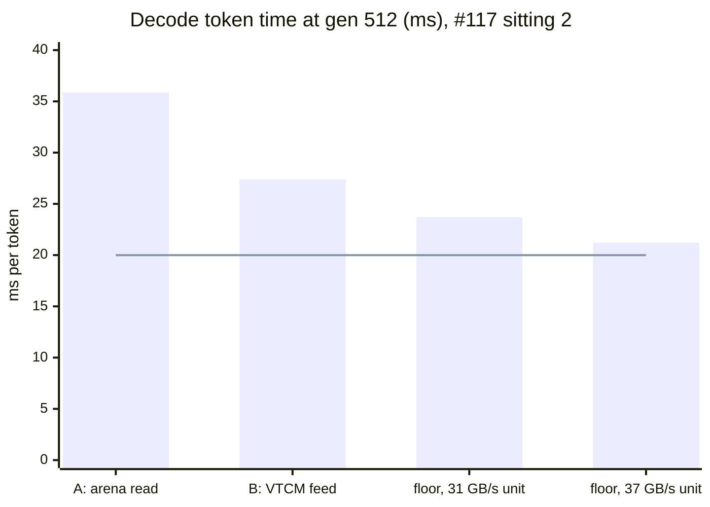
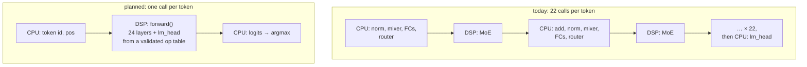
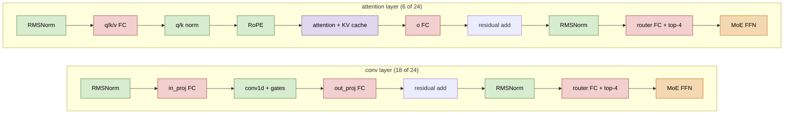
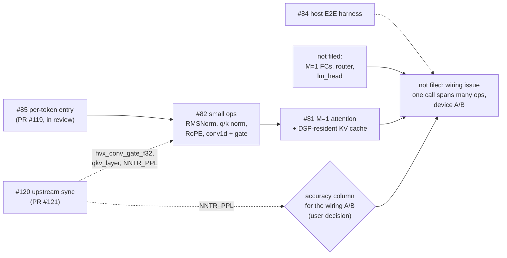

# Roadmap

As of **2026-09-23**, `htp_moe` @ `9fb1a3bc`.

This chapter covers what is left between today's NPU decode and the 50
tok/s target, and in what order it gets done. It starts with the per-token
time budget and the physical floor under it. Then it goes through the
near-term work (the VTCM feed and one engine gap), the one-call-per-token
track, the upstream sync, the accuracy track, the earlier `hvx_impl` work
this track can reuse, and the longer-term levers.

## 1. Where the time goes and what is left

*Provenance: `htp_moe` (budget from #117, 2026-09-23, unit `R3CY10WM83Y`).*

The budget below is for one decode token at gen 512 (512 generated tokens
after a 512-token prompt). It is derived, not measured directly: the token
time comes from the measured tok/s, and the MoE split comes from the level-2
per-call profile of the same sitting (22 calls per token × the per-call
`dsp` and transport times). "Outside" is whatever is left: everything the
CPU does between MoE calls (norms, conv or attention, the FC projections,
the router, lm_head).

| | A: arena read (the default before PR #118) | B: VTCM feed (the default since PR #118) | floor |
|---|---:|---:|---:|
| MoE work on the DSP, 22 × `dsp` | 22 × 0.995 = **21.9 ms** (61 %) | 22 × 0.712 = **15.7 ms** (57 %) | 13.0 ms at 37.3 GB/s · 15.5 ms at 31.2 GB/s |
| ARM ↔ DSP round trips, 22 × transport | 22 × 0.190 = **4.2 ms** (12 %) | 22 × 0.092 = **2.0 ms** (7 %) | ≈ 0 with one call per token |
| Outside the MoE call (CPU) | **≈ 9.8 ms** (27 %) | **≈ 9.7 ms** (35 %) | ≈ 8.2 ms (408 MB at ≈ 50 GB/s) |
| **token** | **35.86 ms** (27.89 tok/s) | **27.40 ms** (36.49 tok/s) | **≈ 21.2–23.7 ms** (≈ 42–47 tok/s) |

A and B come from the same sitting, so the A → B step is a valid
comparison: the feed cuts 8.5 ms per token. Inside the call, B moves 22.02
MB of expert weights through VTCM at 32.6 GB/s. The DMA engine is busy for
640–682 µs of the 712 µs call, so the ≈ 240 µs of HVX arithmetic is fully
hidden. The feed also halves the transport, because the direct arena read
used to cost the call ≈ 100 µs of extra round-trip time.

**The byte floors.** A token cannot be faster than the time its reader
needs to read the weights once. The byte counts come from the model's
shapes ([weight-format.md](weight-format.md)): the NPU model reads
**≈ 893 MB per token**, of which the DSP reads 484 MB and the CPU 408 MB.

- **MoE (DSP)**: 22 calls × 22.02 MB, divided by the unit's DMA rate. The
  "anchor" is an isolated single-stream DMA copy measured in the same
  sitting. It reads 37.3 GB/s on `R3CY10WM83Y` and 31.2 GB/s on
  `R3CY205ZMND`. The phones differ by 19 %, so the floor is 13.0 ms on one
  and 15.5 ms on the other.
- **Everything else (CPU)**: lm_head 147 MB, the conv projections 170 MB,
  attention 35 MB, dense FFN 50 MB, routers 6 MB = 408 MB. The CPU's own
  run shows how fast it reads. The CPU model reads ≈ 953 MB per token (its
  experts are Q4_0), and at 52.4 tok/s (#94) that is **≈ 50 GB/s**. At that
  rate 408 MB takes **≈ 8.2 ms**. The measured 9.7 ms is close to that
  floor.

The line is 20 ms, which is 50 tok/s. **Both floors are above it.**

**What this means for the target** (byte arithmetic, not a measurement):

1. **Inside the MoE call: at most 2.7 ms is left**, and only on the
   37 GB/s unit (15.7 − 13.0). About 1.9 ms of that is the engine gap in
   §2. On the 31 GB/s unit the call already sits at its floor (15.7 vs
   15.5).
2. **Outside the call: ≈ 3.5 ms is left.** That is 2.0 ms of round trips
   plus ≈ 1.5 ms of CPU work above its byte floor.
3. **With the DSP reading the MoE and the CPU reading the rest one after
   the other, the floor is ≈ 21–24 ms, which is ≈ 42–47 tok/s.** 50 tok/s
   needs one of these three:
   - the two processors reading **at the same time**,
   - fewer bytes per token (§7),
   - or the DSP reading faster than one DMA stream does today.
4. **One call per token (§3) moves the 408 MB from the CPU to the DSP.**
   At the DSP's measured 31–37 GB/s single-stream DMA rate, that is
   11–13 ms, slower than the CPU's ≈ 8 ms. It removes the round trips and
   the handoffs, but by bytes alone it only wins if the DSP can read those
   weights faster than one DMA stream does today. That needs a
   measurement before the track is built.

An earlier estimate, used by the project's contract and older notes, set
the token at ≈ 730 MB and the phone's memory at 34–38 GB/s. From that it
put a "physical ceiling" at 48–52 tok/s. Both inputs were low. The rest of
the model is 408 MB, not ≈ 246, and the CPU demonstrably reads ≈ 50 GB/s
(68 GB/s alone in #77's two-reader probe). So that ceiling is withdrawn.

## 2. Near term: the VTCM feed, then the engine gap

*Provenance: `htp_moe`.*

### 2.1 The VTCM feed (#117, PR #118)

In the decode (M = 1) path, the HVX matrix-vector kernel used to read each
expert's weights straight from DDR, behind a 192 KB `l2fetch` prefetch
lead. The feed changes that: the DMA engine copies each expert's weights
into VTCM (two linear descriptors per expert, issued one expert ahead), and
HVX computes from VTCM while the next copy runs.

It passed its gate in two sittings on 2026-09-23 (`mm` 676.6 / 676.4 µs per
call against a gate of ≤ 760, decode +32.5 / +30.9 / +28.6 % at gen 64 /
512 / 1024 in sitting 2, text identical to A in 36 of 36 runs, output
bit-identical to the HMX path, prefill unchanged on the M > 1 `dsp` time).

**State.** Merged as `d79c0efe` (PR #118). The feed is the decode default
(`HTP_MOE_GEMV_FEED_DEFAULT 1u` in
`nntrainer/tensor/htp_backend/htp_moe_opts.h`), and
`NNTR_MOE_HTP_GEMV_FEED=0` goes back to the arena read. The next sitting
measures it as its control (variant A). Until then the reference row stays
#117 A, and the feed's 36.49 tok/s is a measured variant.

### 2.2 Open item ㉓: the in-situ engine runs below the anchor

Inside the MoE call the DMA engine moves **32.3–34.4 GB/s**. The same
sitting's isolated anchor reads 37.3 GB/s, and the VTCM copy microbenchmark
37.7. At the anchor rate `mm` would be ≈ 590 µs instead of 676, so the gap
is ≈ 86 µs per call, **≈ 1.9 ms per token (≈ 7 %)**. That is the last
MoE-side lever on a 37 GB/s unit. On a 31 GB/s unit the in-situ rate
already beats the anchor, so there is nothing to win there.

What the DMA ring's profile line shows in B:

| signature | reading |
|---|---|
| `first expert ready at 122 µs` | the first 3.5 MB gate_up slab (106 µs at 33 GB/s) is never hidden: nothing overlaps it |
| `depth max=4` with 10 descriptors | the queue never gets deep |
| `last issue at 500 of 712 µs` | the last copy is issued late in the call |

Candidates, in order:

1. Kick expert 0's gate_up copy before the activation quantization (the
   first ≈ 20 µs of the call).
2. Issue expert e+1's gate_up before expert e's down, not after.
3. A deeper issue queue.

A cross-call prefetch (start the next layer's expert 0 during this call)
needs the next layer's router result. It exists only once §3 lands.

**State: an open item, not yet an issue.** It is filed after the sitting
that measures the feed as the default confirms the gap on the unit that
runs it. The gate when filed: `mm` ≤ 630 µs in-sitting with the anchor ≥
36 GB/s, text identical to A, prefill within −5 %.

## 3. One call per token

*Provenance: `htp_moe` (issues #85, #82, #81, #84); the kernels it reuses
come from `hvx_impl` (§6) and upstream PR #4327 (§4).*

### 3.1 Why

Today the DSP runs only the MoE FFN, so a token makes **22 ARM → DSP
calls**, and the CPU does everything in between. After the feed, what is
left outside the call is 2.0 ms of round trips and 9.7 ms of CPU work,
against a ≈ 8.2 ms byte floor for the CPU's 408 MB. Neither goes away one call at a time. The
planned end state: the ARM sends a token in, the DSP runs all 24 layers
and lm_head, and the ARM gets logits back.

### 3.2 What sits between two MoE calls

The call count drops only when **every** op between two MoE calls runs on
the DSP. The table below lists those ops per layer type and which issue
covers each.

Orange: resident with #85's skeleton (the MoE kernel exists). Green: #82.
Purple: #81. Red: **no issue yet**. Residual adds are trivial and not
scheduled separately. Layers 0–1 use a dense FFN instead of MoE, and
lm_head runs once at the end. Both are also uncovered.

| issue | what it builds | state (2026-09-23) |
|---|---|---|
| **#85** | The per-token entry: a C header describing the op list (`htp_graph_desc.h`), a DSP-side validator and `forward` loop (`hmx/hexkl_graph.c`), and four IDL methods (`graph_init`, `graph_release`, `forward`, `forward_debug`). Real op kinds with a per-op `resident` bit. Handles are bound once at init. Activations live in DSP-side slots. Per-op pcycles, one FARF line per call. Only `MOE` has a kernel slot. The ARM path goes through it behind `NNTR_HTP_FORWARD=1` | PR #119 open, in review. Not in this snapshot |
| **#82** | M = 1 kernels with a scalar `_det` spec (`m1_ops_det.h`), an HVX version and a host bit check each: RMSNorm, per-head q/k norm, RoPE for head_dim 64 (cos/sin rows made by the CPU's own function and uploaded once, 512 KiB at `max_seq_len` 2048), causal conv1d (L = 3) + gating. Test-only IDL entries. The prefill-shape conv kernel `hvx_conv_gate_f32` is taken unchanged from upstream | planned |
| **#81** | Decode attention at M = 1 with a **DSP-resident f32 KV cache** (K stored transposed, `[head_dim][max_seq]`, so one vector covers 32 positions; 48 MiB for 6 layers at `max_seq` 2048, 26 % of the ≈ 182 MiB DSP heap). `_det` spec, HVX kernel, host bit check across 0 / 3 / 7 pool workers, IDL entries `attn_m1_register` / `_kv_append` / `_forward` / `_release`. A separate object from the existing prefill attention (`hmx/hexkl_attn_u8.c`, u8 KV, which no app path calls) | planned |
| **#84** | A host end-to-end harness: the DSP skel compiled into the host `libnntrainer.so` and driven by the real ARM path (`HtpComputeOps`, the op table once #85 lands) on the tiny LFM2-MoE fixture. Gate: every MoE call's input and output bit-identical to a committed golden, with the GEMV and HMX paths agreeing. It proves wiring and marshalling, not speed | planned, runs in parallel |
| not filed | M = 1 FC projections (conv in_proj / out_proj, q/k/v/o, dense FFN), the router FC + top-k, lm_head | — |
| not filed | The wiring issue: fill the table slots, let one call span several ops, and run the device A/B | — |

**Why none of these saves time alone.** With only MoE resident, `forward`
runs one op and returns, which is still 22 calls per token. #85 moves the
per-call handle lists into the table bound at init, which is worth ≤ 0.1–0.2
ms per token, below one sitting's drift. The ops #82 builds cost the CPU
only ≈ 0.46 ms per token today. #81's attention costs ≈ 2.3 ms in the CPU
profile build, and on the DSP it pays about the same in bytes (0.5–1.5 ms
per token at positions 512–1536, reading the f32 cache). Their value is
residency: the transport (2.0 ms) and the excess CPU time go away only once
a whole stretch between two MoE calls runs on the DSP. That also means the
FC projections, which no issue covers yet, are the gate for any gain.

**The first stretch to close** is the conv layer: 18 of the 24 layers, and
its only non-#82 ops are two FCs and the router.

### 3.3 Order and dependencies

#82's q/k norm and RoPE are the inputs of #81's attention, and both fill
kinds in #85's table. #84 does not block anything, but it is the only way
to test the wiring on the workstation. Each of #85, #82 and #81 ends in a
PR gated on the host only. The first device number of this track comes
from the wiring issue.

**An open decision for the wiring A/B.** The CPU decodes attention in fp16
with its own exp and runs no `_det` specs for RMSNorm and RoPE. Once the
DSP runs these ops, the NPU text cannot match the CPU run bit for bit, and
it may drift from variant A as well. The options:

- (a) keep "text B ≡ A" and expect it to fail on attention layers;
- (b) use perplexity as the accuracy column (`NNTR_PPL`, which arrives with
  the upstream sync);
- (c) give the CPU path the same `_det` specs, which moves the CPU control
  and touches prefill.

The recommendation on record is (b), with the CPU `q40` perplexity as the
reference. The user decides.

### 3.4 Tried and dropped (design alternatives)

| attempt | result | why it matters |
|---|---|---|
| A model-level decode loop now: the ARM walks the op list and calls `forward` repeatedly, replacing nntrainer's executor for decode | rejected in #85's plan | With only MoE resident it saves nothing and puts `neuralnet.cpp` / `network_graph.cpp` in the diff with nothing to test against. It becomes right with the first two adjacent resident ops |
| One HTP call per FC projection (upstream, "doc 50") | measured on upstream: a round trip costs more than the matmul it carries at M = 1 | The reason the plan is one call per token and not more per-op calls. Upstream's fused calls (conv block, dense FFN) run only at prefill for the same reason |
| Prebound handle IDL pair (#88) | not built: the size-class staging and the 5 ms poll already met the ≤ 0.1 ms per-call transport gate | The handle binding reappears inside #85's `graph_init` |
| Mapping an rpcmem activation buffer (`fastrpc_mmap`) | deferred in #85's plan | It pays only once the ARM stops touching activations. Before that, a cached mapping moves cache maintenance into our code |
| A standalone `htp_e2e_test` binary fed from an activation file (the `hvx_impl` shape) | rejected in #84's plan | It would test a copy of the ARM path, not the path. It becomes right once `forward(tokens → logits)` has every kind resident |

## 4. Upstream sync (#120)

*Provenance: upstream PR #4327.*

`htp_moe` is frozen on upstream PR #4327 at `2ce38d65` (2026-09-21). Since
then the PR has gained **40 commits** up to `4ae1ebd7` (44 files,
+5667 / −998). On 2026-09-23 the user ordered the full sync (#120), and PR
#121 carries it as one merge commit plus four small fixes. #120 is waiting
for its device A/B: A is `htp_moe`, B the merged tree, in one sitting.
Gates: decode ≥ −2 % of A, prefill ≥ −5 %, text identical.

Three of the 40 commits are already on `htp_moe` as cherry-picks from PR
#103: size-class ION staging (`fb0f02b9`), the `NNTR_HTP_POLL_US` knob
(`04a2fcc4`) and the 5 ms poll default (`b0a384d6`). The rest, grouped by
what they bring:

| feature | commits | what it does | effect on decode |
|---|---|---|---|
| Conv block as one call | `7f81560b`, `e699e1bd`, `6f8f7791` + DIFF / SHADOW diagnostics | in_proj, gates, causal conv1d and out_proj of an LFM2 conv layer as one DSP call (`hmx/hexkl_conv_block.c`, `hvx/hvx_conv_gate_f32.c`, IDL `mm_u8i4_conv_block[_timed]`, `conv_block_layer.cpp`), behind `conv_block_engine` | none: it runs only when rows > 1. At M = 1 the layer stays on the CPU. `hvx_conv_gate_f32` is the kernel #82 builds on |
| q/k/v fusion | `1f538c20` | q, k, v and their two norms as one `qkv_layer`, one HTP call at prefill with `attn_proj_engine`. The layer is always used, and at M = 1 it runs on the CPU as before | none. It is the host-side seat for a future attention block call |
| Dense FFN through the MoE kernel | `d2f0bf47`, `35b6124b` | Layers 0–1's dense FFN cut into four 1792-wide chunks, each run as an "expert" of the MoE kernel, in one call, behind `dense_ffn_engine` | none at decode. Costs ≈ 4 % perplexity on the PR author's measure, so it stays **off** by default |
| Down matmul one block behind | `5731b6e5` | In the HMX (prefill) loop of `hexkl_mm_u8i4_moe.c`, the down matmul runs one block behind gate_up, to overlap them | the M = 1 GEMV path does not enter this loop. Unmeasured at M = 1 |
| `NNTR_PPL` | `32b46e32` | The prompt's teacher-forced perplexity, computed at prefill | the accuracy column §3.3 and §5 need |
| Profiling and FC | `3006d255`, `c64be9dd`, `aa371dd2` | FC profile row, epilogue worker time shown under the SWIGLU column, pooled FC epilogue (prefill FC calls only) | print only. `c64be9dd` overlaps `htp_moe`'s own GEMV-row print, and the merge keeps both |

The remaining commits are upstream design notes ("docs 50–53", Korean).

**Upstream's own numbers** ("doc 51", 2026-09-22, PR author's device,
prompt 444, everything on: conv block, dense FFN, attention projections,
5 ms poll): **prefill 585 ms (758 tok/s), decode 24.2 tok/s**, perplexity
62.09 on that config. These come from another phone, prompt and
configuration, so they are not comparable with this document's numbers.
They are recorded only to show what upstream reached with the HMX decode
path.

**What this means for the doc set.** The sync changes the attention, FC
and model-integration code (the conv block and qkv layers, the dense FFN
route, new IDL entries). Those chapters are written **after the sync
lands**, against the merged tree, not against this snapshot.

## 5. Accuracy track

*Provenance: `htp_moe` (#110 ports work first measured on a side tree based
on upstream PR #4327).*

**Hadamard rotation (#110; parked).** A 256-point Hadamard rotation of the
MoE down_proj input, folded into the weights offline (dtype
`QS4CX_WH_HAD`) and applied with a fast Walsh–Hadamard transform on the DSP
right before the u8 requantization. Measured in #95 on a side tree
(2026-09-22, unit `R3CY205ZMND`): perplexity **115.1 → 100.5 (−12.7 %)**,
below the CPU `q40` run's 109.8. Requant SNR median 34.7 → 42.7 dB. Cost
+0.3 % of the M = 1 `dsp` time and +2.7 % at prefill. #110 ports it to
`htp_moe`, including the M = 1 GEMV requant site, fixes a subnormal flush
in the scalar spec, and brings in `NNTR_PPL`. It does not move tok/s. The
user parked it on 2026-09-22 until the HVX decode work is done. It becomes
more urgent if perplexity is adopted as the accuracy column (§3.3). None of
it is in this snapshot.

**Replay content check (#99; p2).** `MoeChunkReplay`, a DMA replay test that
rides every device handoff as the DMA "anchor" cell, fails its content
check (`checksum_ok=n`) while its timing stands. The cause is known: the
replay writes packed where the kernel writes strided. The timing question it
was filed for is answered, so what is left is a `test/`-only fix, so that
nobody later reads the `FAILED` line as a regression.

## 6. Prior work: `hvx_impl`

*Provenance: the `hvx_impl` branch of this fork (frozen, last commit
2026-09-21). No code from it is in `htp_moe`.*

`hvx_impl` ran **Qwen3-0.6B** (a small dense model) with **W8A8**
quantization (int8 per-channel weights, per-token int8 activations) on the
DSP's **HVX units only**, without the HMX. Its structure is the one §3
aims for. The ARM hands the DSP an op list and every large buffer once,
and each `forward()` runs the whole list: **one FastRPC call per decode
token or prefill chunk** (≈ 0.26 ms per round trip).

Measured on the S25 Ultra with the v79-native skel, context 512
(2026-09-17 / 18):

| unit | prefill tok/s | decode tok/s |
|---|---:|---:|
| `R3CY205ZMND` | 207.4 | 31.4 |
| `R3CY10WM83Y` | 198.7 | 30.9 |
| `R3CY10WM83Y`, with cross-op weight prefetch | 191.1 | 33.7 |

Model-level accuracy: perplexity 19.98 against the x86 reference
executor's 20.27. A decode step's host wall time was within 0.5–3 ms of the
DSP's own op loop, which is the evidence that one call per token takes the
ARM out of the step. These numbers are for a different model and are not
comparable with LFM2's.

**What is reusable here**, in value order. Each row names the issue that
would take it. All of these are ports, not copies: shapes, dtypes and the
worker pool differ.

| from `hvx_impl` | serves | what changes in the port |
|---|---|---|
| M = 1 attention with a DSP-resident KV cache (`htp/ops/hvx-attn.c`: K transposed, workers split by kv head) | #81 | one token instead of a token loop; our worker pool; f32 KV instead of fp16 |
| "The DSP owns the graph": validate the op list once, then `forward` runs `table[kind]()` per op with per-op pcycles (`htp/htp_graph.{h,c}`, `nntr_htp.idl`) | #85 | LFM2.5's op sequence and kinds (MoE, conv1d); a `forward` entry beside the per-op IDL |
| Cross-op weight prefetch: the last chunk of op N starts op N+1's first chunk (`hvx-matmul.c` `mm_pf_kick`) | ㉓, and §3 once calls span several ops | our global DMA ring instead of a per-worker FIFO. The feed's depth-2 issue order in `test/htp/nntr_moe_dma_plan.h` already follows the same discipline |
| Host E2E harness (`test/hexagon/hexagon_e2e_test.cpp` and tools) | #84 | only the `E2E` line format and the dump comparator carry over; the driver is our own ARM path |
| RMSNorm, per-head q/k norm, RoPE, and the quantizer's integer-only rounding | #82 | head_dim 64 (theirs is 128), f32 residual (theirs fp16) |

Not reused: its W8A8 matmul (wrong layout for int4 weights), its DMA queue
and worker pool (`htp_moe` has its own), the Qwen3 lowering and app glue.
Causal conv1d + gating has no counterpart there.

Silicon rules learned there that also bind here:
- Compute in f32 inside an op and narrow once.
- Clamp the SiLU exp argument.
- int32 `vrmpy` sums are exact in any order, so divergence enters only in
  the epilogue.
- qf32 → sf conversion differs between v75 and v79, so quantizers decode
  integers, never sf bits.
- Never compare wall-clock tok/s across units.

## 7. Longer term

*Provenance: `htp_moe` (open items, not issues).*

- **Prefill residency.** Prefill already beats the CPU (≈ 400–530 vs
  270–340 tok/s) and is only guarded today. Keeping more of it on the DSP
  is expected to go past 700 tok/s. Taken up after the decode goal.
- **CPU + NPU expert split.** The CPU would take one of the four active
  experts per layer, synchronized once per layer. It raises the ceiling only
  if two readers together get more DDR bandwidth than one. The CPU side
  already loses 41 % under contention (#77), and the DSP side of that probe
  was invalid (it read from cache) and is re-filed as #90. When NPU-only
  stops and the split starts is an **open user decision**. The proposed
  rule: decode below 50 tok/s after §3, and the two-reader probe above
  45 GB/s.
- **Fewer bytes per token.** The only lever that raises the ceiling on a
  31 GB/s unit. Candidates: expert weights below 4 bits, and reusing
  experts across consecutive tokens so their weights are not re-read. Not
  studied or filed yet. Both change accuracy and need the perplexity column
  of §3.3.
