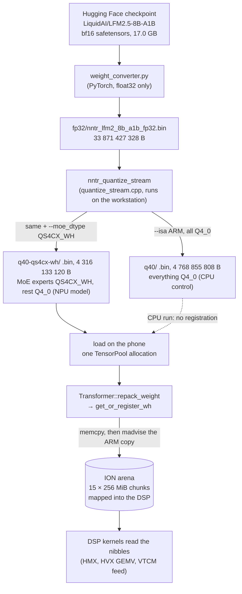
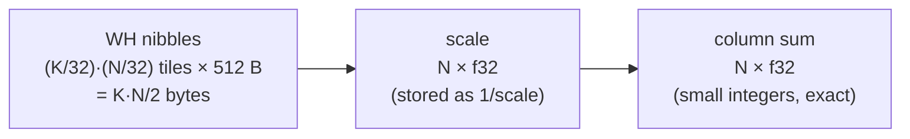
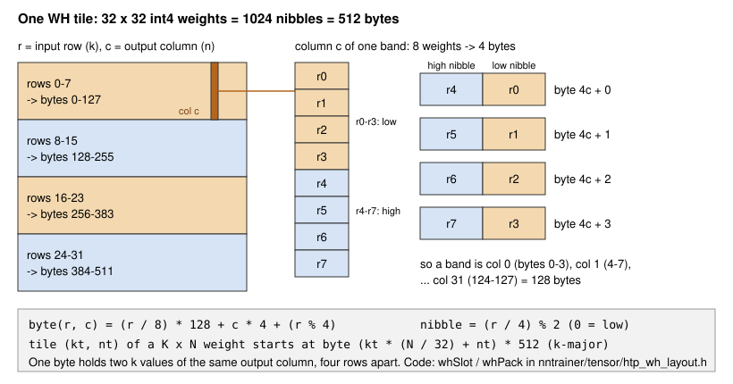
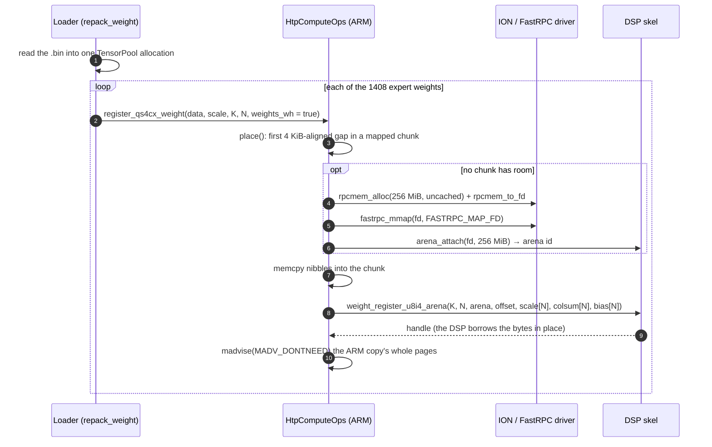

# Weight format

As of **2026-09-23**, `htp_moe` @ `9fb1a3bc`.

This chapter follows the weights from the Hugging Face checkpoint to the
bytes the DSP reads. It covers the two conversion tools, the formats
involved (`Q4_0`, `QS4CX`, `QS4CX_WH`, the u8 activations), how a
`QS4CX_WH` model is loaded into the ION arena, the exact byte counts, and
what the format costs in accuracy. It ends with the two model directories
and their configs.

Provenance: the formats, the quantizer support and the arena are
`upstream PR #4327`. None of those files changed on `htp_moe`. The model
directories and their measured sizes are `htp_moe` (#78).

## 1. The pipeline



| step | tool | runs where | output |
|---|---|---|---|
| 1 | `Applications/CausalLM/res/lfm2_moe/lfm2-8b-a1b/weight_converter.py` | workstation, once | one FP32 `.bin` in graph order |
| 2 | `Applications/CausalLM/quantize_stream.cpp` (binary `nntr_quantize_stream`) | workstation, once per model | a quantized `.bin` plus `nntr_config.json` |
| 3 | model load (`Transformer::repack_weight` in `Applications/CausalLM/models/transformer.cpp`) | phone, every start | expert weights registered in the ION arena |

All packing happens in steps 1 and 2. At load, the MoE expert bytes are
copied into the arena as they are. Nothing is converted on the phone.

## 2. Step 1: checkpoint to FP32 `.bin`

`weight_converter.py` (`save_lfm2_moe_for_nntrainer`) loads the checkpoint
with `transformers` and writes each tensor as raw float32, in the order the
nntrainer graph asks for its weights. The file has no header and no index.
Order is the only structure, so the quantizer must walk the same order
(`writeLfm2Moe` in `quantize_stream.cpp` mirrors it).

What it does to the tensors:

- **Linear weights are transposed** to `[in, out]`, which is the layout
  nntrainer's FC layers read in FP32.
- **Experts are written one by one**: for each of the 32 experts, a fused
  `gate_up` `[2048, 2 × 1792]` (gate half first, then up), then its `down`
  `[1792, 2048]`. The current HF layout (`experts.gate_up_proj`, one
  tensor for all experts) and the older per-expert `w1`/`w3`/`w2` layout
  both work.
- **The conv kernel is flipped** so row 0 is the current token, as
  nntrainer's `causal_conv1d` expects.
- **Expert bias** is written as zeros if the checkpoint has none, because
  the layer always asks for it.
- **No lm_head** is written: the model ties it to the input embedding
  (`tie_word_embeddings: true`).

Only float32 output is accepted. Norms, router weights, expert bias and
the conv kernel stay FP32 in the graph whatever the other weights become.

## 3. Step 2: the streaming quantizer

`nntr_quantize_stream <dir> [options]` reads `<dir>/config.json` (the HF
config, for shapes) and `<dir>/nntr_config.json` (for the input file name).
It then streams the FP32 file tensor by tensor. It never holds the model
in memory: one tensor buffer is capped at 64 MiB (`MAX_TENSOR_BUFFER_BYTES`),
and larger FC weights take a seek-based blocked transpose.

| flag | meaning | for this model |
|---|---|---|
| `--fc_dtype` | attention, conv and dense-FFN projections | `Q4_0` |
| `--embd_dtype` | embedding | `Q4_0` |
| `--lmhead_dtype` | lm_head (must equal `--embd_dtype` for a tied model, which the tool enforces) | `Q4_0` |
| `--moe_dtype` | MoE expert `gate_up` and `down`; defaults to `--fc_dtype` | `Q4_0` (CPU) or `QS4CX_WH` (NPU) |
| `--isa` | the `Q4_0` repack layout: `ARM` = 4-row interleave (`Q4_0x4`), `X86` = 8-row (`Q4_0x8`), `DEFAULT` = the layout of the machine the tool runs on | **always `ARM`** |
| `-o`, `--output_bin`, `--config` | output directory, file name, a config to inherit dtypes from (explicit flags win over `--config`) | |

The two commands:

```bash
nntr_quantize_stream fp32/ -o q40/ \
  --fc_dtype Q4_0 --embd_dtype Q4_0 --lmhead_dtype Q4_0 --isa ARM
nntr_quantize_stream fp32/ -o q40-qs4cx-wh/ \
  --fc_dtype Q4_0 --embd_dtype Q4_0 --lmhead_dtype Q4_0 --isa ARM \
  --moe_dtype QS4CX_WH
```

Things a reviewer should know:

- **`--isa` matters, and nothing checks it at load.** The quantizer runs
  on an x86 workstation, where `DEFAULT` means `Q4_0x8`. The phone's
  kernels read `Q4_0x4`. A `.bin` has no header to record the choice, so
  the only trace is the `_arm` suffix of the default file name
  (`defaultOutputBin`). A wrong layout gives wrong text, not an error.
  (The safetensors output records `nntr_q4_0_isa`, but the quantizer only
  writes `.bin`.) `QS4CX_WH` does not depend on `--isa`.
- **Both models get the same file name**, `nntr_lfm2_8b_a1b_q40_arm.bin`,
  because the default name is built from the FC dtype only. The directory
  is what tells them apart.
- **The embedding is stored unrepacked** (`writeEmbedding` passes
  `repack = false`): it is a row lookup. The tied lm_head then needs a
  repacked copy for fast GEMV, which `TieWordEmbedding::prepareLmhead`
  builds once at load (147 MB of extra RAM).
- **`QS4CX_WH` is refused** for an embedding (a lookup has no use for
  tiles) and for any tensor over 64 MiB (the tile order is k-major, so a
  row-blocked write would come out in the wrong order). The largest expert
  weight is 29 MB of FP32, so the model never hits that limit.
- **Output config.** The tool writes `model_file_name`,
  `model_tensor_type`, `fc_layer_dtype`, `embedding_dtype`,
  `lmhead_dtype` and `moe_layer_dtype` into the output `nntr_config.json`
  (`writeOutputConfig`). It does **not** write `moe_engine` or
  `moe_htp_layers`. Those are added by hand (§8).

## 4. The formats

Which format each weight has:

| weights | `q40/` (CPU) | `q40-qs4cx-wh/` (NPU) | read by |
|---|---|---|---|
| MoE experts, `gate_up` and `down` (1408 tensors) | `Q4_0x4` | **`QS4CX_WH`** | CPU / DSP |
| conv, attention, dense-FFN projections | `Q4_0x4` | `Q4_0x4` | CPU |
| embedding = tied lm_head | `Q4_0` (unrepacked; `Q4_0x4` copy built at load) | same | CPU |
| norms, router, expert bias, conv kernel | FP32 | FP32 | CPU |

### 4.1 `Q4_0` (CPU)

The ggml format. Each block of 32 consecutive weights along K is 18
bytes: one fp16 scale and 16 bytes of 4-bit values, which is 4.5 bits per
weight. The ARM repack (`Q4_0x4`, `__ggml_repack_q4_0_to_q4_0_4`)
interleaves the blocks of 4 output rows so a NEON kernel reads them in
one stream. Scales are per block, so they follow the local range of the
weights closely.

### 4.2 `QS4CX` (per-output-channel int4)

`QS4CX_Tensor` in `nntrainer/tensor/qs4cx_tensor.h`, quantized by
`quant_qs4cx_f32`. One f32 scale per output channel, over the whole input
width (2048 or 1792 values):

- range: `rmin = min(0, min w)`, `rmax = max(0, max w)` over the channel;
- `scale = 15 / (rmax − rmin)`, `q = clamp(round(w · scale), −8, 7)`;
- the file stores `1/scale` and the nibbles as `q + 8`, two per byte, one
  channel per row, even k in the low nibble.

There is no zero point. Layout on disk: `[N · ⌈K/2⌉ nibble bytes][N f32
scales]`. That is 4 bits per weight plus 4 bytes per channel. It is also
the input HexKL wants, up to the byte arrangement, so a `QS4CX` weight
reaches the DSP without a second quantization.

### 4.3 `QS4CX_WH` (the NPU model's expert weights)

`QS4CX_WH_Tensor` (same header): **the same values and the same scales as
`QS4CX`**, with two differences.

1. The nibbles are already in the **WH tile layout** the HMX matrix unit
   reads (`nntrainer/tensor/htp_wh_layout.h`).
2. A **column sum per output channel** follows the scales. The kernels use
   `Σₖ q[k][n]` to correct for the activation's zero point. Recomputing it
   from packed nibbles at load was estimated at about 20 s for the whole
   model, so the quantizer writes it.

The quantizer produces it by running the `QS4CX` quantizer unchanged,
unpacking to one int8 per value in K × N order while summing columns, and
calling `whPack` (`TensorWriter::writeQuantized`, `QS4CX_WH` branch). The
values are therefore bit-identical to a `QS4CX` model. Only their position
changes.

One tensor in the file:



`QS4CX_WH_Tensor::size()` is `QS4CX_Tensor::size()` plus `4N`, and that
is the only difference in the class. The nibble count equals `QS4CX`'s
because a 32 × 32 tile is 512 bytes in either arrangement.

**The WH tile.** Inside a K × N weight, tiles of 32 input rows × 32 output
columns are stored **k-major**: tile `(kt, nt)` sits at byte
`(kt · N/32 + nt) · 512`. So a strip of 32 input rows across all outputs
is contiguous, and a slice of output columns is a strided 2-D region.
Inside a tile:



Each byte holds **two k values of the same output column, four rows
apart**. That is the pair a u8 × i4 dot product reduces together. The
formula is `whSlot(r, c) = (r/8)·256 + c·8 + (r%4)·2 + (r/4)%2` (a nibble
index; byte = slot/2, low nibble for even slots).

The layout was read off the DSP's own bake routine, not taken from a
vendor document. On 2026-09-15 (PR author's device) the host packer
matched the DSP bake (`weight_bake_export`) byte for byte at 2048 × 3584,
the model's largest weight, and at a non-square 64 × 128 that also checks
the tile order. The device gtest `WhPackReferenceMatchesDspBake`
(`unittest_hvx_mm_u8i4`) is that check. It must keep passing: the header
is a copy of a hardware layout, and only the device can say it is still
right. (A vendor ARM function, `sdkl_cpu_i4_rm_to_i4_wh`, uses the
**transposed** tile and did not match. A square test shape hides both the
transpose and the argument order.)

The HVX GEMV decode kernel and the VTCM feed read these same bytes in the
same order, so one blob per expert serves every DSP path.

**No CPU fallback.** No CPU kernel reads WH tiles. `FloatTensor::dot`
throws on a `QS4CX_WH` weight with a message naming the two fixes (route
the layer to the HTP, or re-quantize as `QS4CX`). A model quantized this
way runs its MoE layers on the DSP or not at all.

### 4.4 Activations: u8 per row

Activations are quantized on the DSP, per call, to **unsigned 8-bit with a
per-row scale and zero point**. That is why the kernels are named `u8i4`.
The rule: `rmin/rmax` over the row with 0 folded in,
`scale = (rmax − rmin)/255`, round to nearest even, zero point clamped to
[0, 255]. The HMX's activation port is 8-bit only, so there is no wider
choice.

Inside the MoE kernel the activation is quantized twice per expert: once
on the way in (the 2048-wide input row), and again after SwiGLU (the
1792-wide intermediate, before `down`). The second one is the **requant
boundary** of §7.2.

`nntrainer/tensor/htp_act_quant.{h,cpp}` (`htp_quant_pack_u8_ah`) is an
ARM-side, bit-identical copy of the DSP's quantize-and-pack into the
HMX's 64 × 32 activation tiles. It is **dormant**. Its only caller,
`HtpComputeOps::invokeLayerU8In`, has no caller. On device, DSP time
dropped 19–26 % but wall time barely moved, because the ARM-side quantize
(≈ 200–420 µs) ate the saving. It stays in the tree for a caller that
already has quantized bytes.

### 4.5 `Q4_0` → qs4cx on the fly (`htp_q4_0_convert`)

`nntrainer/tensor/htp_q4_0_convert.{h,cpp}` has two converters into
HexKL's registry input (int4 in int8 containers, K × N, plus scale and
column sum):

| function | from | kind | used by |
|---|---|---|---|
| `htp_qs4cx_from_q4_0x4` | `Q4_0x4` | **a real requantization**: dequantize to f32, take a per-channel min/max, quantize again | FC projections sent to the HTP (`gemm_q4_0_accel_fp32`, `get_or_register_fc`). Off in the measured config (`*_engine` keys = `cpu`) |
| `htp_qs4cx_from_packed` | `QS4CX` | a bit rearrangement plus a column sum; values unchanged | plain `QS4CX` MoE models (`get_or_register_qs4cx`), which then bake on the DSP heap |

Going through `Q4_0` costs a second quantization. From PR #4327's host
measurements: about 0.7 dB of SNR (22.8 vs 23.5 dB), and a mean absolute
error of 0.0451 against 0.0333 when quantizing straight to `QS4CX`. It also
costs a full dequantize pass at load (95.9 vs 59.9 ms for a 2048 × 3584
weight on an x86 host). That is why the expert weights are quantized once,
straight from FP32.

## 5. Loading and registration

Provenance: `upstream PR #4327`. Measurements in this section are from
2026-09-14/15 (PR author's device).



Step by step:

1. **Load.** The tensor pool reads the file into **one** page-aligned
   allocation, and each weight is a slice of it. So no single weight can
   be freed. `Tensor::deallocate()` drops a pointer and returns nothing.
2. **Register at load, not on the first token.** `Transformer::repack_weight`
   walks the layers once after loading. For an `lfm2_moe` layer routed to
   the HTP, it calls `register_qs4cx_weight` on every expert tensor, which
   goes to `HtpComputeOps::get_or_register_wh`. The handle is cached by
   the weight's data pointer, so the forward-time call is a cache hit.
3. **Place.** `place()` scans every mapped chunk for a 4 KiB-aligned gap
   before it maps a new one. A 1.75 MiB `down` can fill a tail that a
   3.5 MiB `gate_up` cannot. Every weight size here is a multiple of 4 KiB,
   so alignment wastes nothing.
4. **A chunk** is an uncached ION buffer (`HTP_RPC_FLAGS_UNCACHED`). The
   DSP maps it once and the ARM keeps writing into it afterwards. Uncached,
   those writes reach DDR without a cache flush to remember. The ARM never
   reads it back. `fastrpc_mmap` must use `FASTRPC_MAP_FD`: flag `0`
   (`FASTRPC_MAP_STATIC`) is not tagged with the fd, and the DSP's
   `HAP_mmap_get` then refuses it.
5. **Register.** `weight_register_u8i4_arena` (IDL `test/htp/nntr_hvx.idl`)
   carries only the shape, the arena id, the offset and three N-long
   arrays: scales, column sums as int32, and a zero bias. No weight bytes
   cross FastRPC. The DSP keeps the three small arrays in its weight table
   and points the handle into the arena.
6. **Give back the ARM copy.** `releaseArmSource` calls
   `madvise(MADV_DONTNEED)` on the whole pages inside the weight's range
   (`whSourcePageRange` rounds inward, because the edge pages are shared
   with neighbouring weights). The mapping stays, so the pointer remains a
   valid cache key and no later allocation can reuse the address. Without
   this step the peak would be two copies of 3.9 GB. `NNTR_HTP_KEEP_ARM_WEIGHTS=1`
   keeps the copies, for bisecting a wrong answer.
7. **Fail loudly.** No arena (no `rpcmem_to_fd` or `fastrpc_mmap` on the
   device) means `get_or_register_wh` throws: WH bytes have no other home.
   A refused chunk throws with the call that refused, the mapped total and
   the process RSS.

FC weights on the HTP (off in the measured config) are registered **after**
all MoE chunks are mapped. A DSP heap allocation between two chunk
mappings strands the address space up to the next 256 MiB boundary.
Registered in graph order, the arena stopped at 3584 MiB instead of 3840.

**Measured at the first full run (2026-09-15, PR author's device):**
1408 of 1408 weights registered, **0.09 ms per weight**, 0 ms of
conversion, 15 × 256 MiB = 3840 MiB mapped, process RSS 4323 → 759 MB
after the ARM copies were given back.

### 5.1 Why 256 MiB chunks

The DSP process (the "user PD") has a **32-bit, 4 GB address space**.
Mappings and the DSP heap share it. `fastrpc_mmap` places each mapping
aligned to its own size, bumping a cursor:

| chunk size | mapped before refusal | why |
|---|---:|---|
| 1 GiB | 3072 MiB | the PD's own use sits at the bottom, so the first 1 GiB mapping lands at 1 G. The 768 MiB below it are never reachable again, and even 64 MiB was then refused |
| 256 MiB | 3840 MiB | 15 chunks fill the space up to 4 G with no gap |

The model needs 3696 MiB (1408 weights, §6), so it fits with 144 MiB to
spare. That one constant, `kArenaChunkMax` in `htp_compute_ops.cpp`, was
the whole fix for the "memory wall". With 3840 MiB mapped, the DSP heap
gave only 182 MiB more before `AEE_ENOMEMORY`. So the address space, not
host RAM, is the limit for anything else put on the DSP.

### 5.2 Why the packing is offline: the retired runtime bake

Upstream first sent row-major int4 weights over FastRPC and let the DSP
rearrange them into WH tiles (`weight_register_u8i4`, which runs
`hexkl_micro_hmx_rm_to_wh_i4`). The baked copy then lived on the DSP heap.
That path still exists for plain `QS4CX` models (`get_or_register_qs4cx`).
It was retired for the 8B model for two reasons:

- **Load time.** Registration cost ≈ 25 ms per weight, most of it the bake
  (2026-09-14, PR author's device). That is about 35 s for 1408 weights,
  and it was 48.2 % of prefill in the runs of the time.
- **Memory.** The DSP heap tops out at **1.89 GB**, against 3.9 GB of
  expert weights.

Offline packing removes both: the `.bin` holds the final bytes, and
registration is a memcpy plus one small FastRPC call (0.09 ms).

### Tried and dropped

| attempt | result | why it matters |
|---|---|---|
| Cache the DSP-baked bytes in side files (`NNTR_HTP_WEIGHT_CACHE`) | Worked for one layer. For 22 layers it would write +3.9 GB of duplicate files beside a 4.3 GB model, and still copy file → ION → DSP heap. Deleted with its host check | A weight is a constant, so the answer is a converted model, not a cache |
| Convert on the phone with the vendor ARM routine `sdkl_cpu_i4_rm_to_i4_wh` | 157 MB/s, ≈ 25 s per load for 3.9 GB. Its output was also the transposed tile, not the DSP's | Conversion cannot be on the load path. The portable host packer runs at 424 MB/s, once, at quantize time |
| 1 GiB arena chunks | Stopped at 3072 MiB (§5.1) | Anyone who "simplifies" to fewer, larger chunks will hit it again |
| Recompute column sums at load | ≈ 20 s estimated | Why the file carries 4N extra bytes per tensor |

## 6. Byte math

All figures below are computed from the tensor shapes. The same formulas
reproduce both model files' sizes to the byte (last table), which confirms
the shapes.

### 6.1 One expert

| tensor | shape (K × N) | `QS4CX_WH` nibbles | + scales + column sums | file bytes | `Q4_0` (CPU model) |
|---|---|---:|---:|---:|---:|
| `gate_up` | 2048 × 3584 | **3 670 016** (7168 tiles) | 14 336 + 14 336 | 3 698 688 | 4 128 768 |
| `down` | 1792 × 2048 | **1 835 008** (3584 tiles) | 8 192 + 8 192 | 1 851 392 | 2 064 384 |
| expert | | 5 505 024 | | 5 550 080 | 6 193 152 |

The DSP streams only the nibbles per call. Scales and column sums were
copied into its weight table at registration.

### 6.2 Per token (decode)

| part | bytes | MB |
|---|---:|---:|
| MoE experts: 22 layers × 4 active experts × 5 505 024 B (one DSP call per layer reads 22 020 096 B) | 484 442 112 | **484.4** |
| lm_head (tied embedding, `Q4_0`, 128 000 × 2048) | 147 456 000 | **147.5** |
| conv `in_proj` + `out_proj`, 18 layers (`Q4_0`) | 169 869 312 | 169.9 |
| attention q/k/v/o, 6 layers (`Q4_0`) | 35 389 440 | 35.4 |
| dense FFN, 2 layers (`Q4_0`) | 49 545 216 | 49.5 |
| routers (FP32, 22 × 2048 × 32) | 5 767 168 | 5.8 |
| norms, conv kernels, expert bias, one embedding row | ≈ 0.85 M | 0.9 |
| **total, NPU model** | ≈ 893 320 000 | **≈ 893** |
| (same on the CPU model: experts in `Q4_0` are 545.0 MB) | | ≈ 954 |

**Disagreement with the project's budget figure.** Elsewhere the per-token
figure is 730 MB (484 + 147 + "≈ 99 MB rest"). The shapes in the model
file put the non-MoE, non-lm_head part at **≈ 261 MB**, not 99. The 99 is
730 − 484 − 147, carried over from an earlier estimate that took the
lm_head as 75 MB (a 65 536-row vocabulary). The code and the file win: a
decode token reads ≈ 893 MB on the NPU model. (A comment in
`tie_word_embedding.cpp` still says the lm_head twin is "75 MB for this
model". It is 147 MB.)

### 6.3 Whole model

| | bytes |
|---|---:|
| all expert nibbles in the arena: 704 × 3 670 016 + 704 × 1 835 008 | 3 875 536 896 = **3696 MiB** |
| arena mapped | 15 × 256 MiB = 3840 MiB |
| FP32 `.bin` | 33 871 427 328 |
| `q40/nntr_lfm2_8b_a1b_q40_arm.bin` (CPU control) | **4 768 855 808** |
| `q40-qs4cx-wh/nntr_lfm2_8b_a1b_q40_arm.bin` (NPU model) | **4 316 133 120** |
| difference = 704 × ((4 128 768 − 3 698 688) + (2 064 384 − 1 851 392)) | 452 722 688 |

The NPU model is smaller because an expert costs 4 bits per weight plus
8 bytes per channel, against `Q4_0`'s 4.5 bits per weight.

## 7. Accuracy

### 7.1 What the format costs

`QS4CX_WH` and `QS4CX` carry the same values, so the WH layout itself
costs nothing. What changes against the CPU model is the quantizer: one
scale per 2048-wide (or 1792-wide) output channel instead of one per 32
weights. The NPU therefore runs **different weights** from the CPU control,
and its generated text is not expected to match the CPU's. Three checks
stand in for "text identical to the CPU":

- kernels are bit-identical to their reference path, by host and device
  tests;
- in each sitting, a variant's text must be byte-identical to that
  sitting's own NPU control;
- perplexity, measured once, against the CPU:

| model | PPL (511 prompt tokens, `NNTR_PPL`) | vs CPU |
|---|---:|---:|
| CPU, `q40` | 109.759 | — |
| NPU, `QS4CX_WH` | 115.095 | +4.9 % |

(#95, 2026-09-22, on a side tree; see §7.3.) In the same sitting the NPU
text left the CPU text at generated word 43 at every generation length.
That divergence comes from the weights, not from a kernel. The scale
granularity is the likely cause of the PPL gap, but no measurement
isolated it.

### 7.2 The requant boundary

After SwiGLU, each expert's 1792-wide intermediate is requantized to u8
(one scale and zero point per row) before the `down` projection. The DSP
computes SwiGLU with polynomial `exp` and reciprocal approximations that
are within ≈ 1e-6 relative error of the host's `expf`, but not identical
to it. Now and then that tiny difference lands one element on the other
side of a u8 rounding boundary. The `down` product sums over all 1792
inputs, so one flipped element moves the whole output row by an amount set
by that element's weight column. Under greedy decoding, such flips compound
into a different token stream.

Measured on real weights and a real activation (2026-09-09, PR author's
device): 5 of about 32 MoE calls in one forward had exactly **one**
flipped element out of 1792. The fused-SwiGLU kernel was left disabled
because of it. It is not a code defect. Any two float pipelines feeding
the same u8 quantizer disagree like this, and the HMX's 8-bit activation
port rules out a wider intermediate. The remaining lever is to make the
rounding boundary matter less.

### 7.3 Hadamard rotation (`QS4CX_WH_HAD`), measured off-tree

Provenance: #95 on the side tree `htp_hadamard` (PR #4327's HMX path only,
no M=1 GEMV). **Not in this tree.** The port is #110.

The idea: fold a Hadamard rotation into the `down` weights offline
(`Hᵀ · W_down`, block 256, 1792 = 7 × 256), and apply the matching
fast Walsh–Hadamard transform (FWHT-256, IEEE `sf` add/sub) to the
intermediate on the DSP right before the u8 requant. The rotation spreads
outlier energy across the row, so the row's range shrinks and each u8 step
is finer. The model file differs from `q40-qs4cx-wh` only in the 704
`down` tensors, under a new dtype `QS4CX_WH_HAD`.

Result (#95, 2026-09-22, one sitting, one binary set switched by the
model's dtype):

| | control (`QS4CX_WH`) | `QS4CX_WH_HAD` |
|---|---:|---:|
| PPL, 511 tokens (CPU `q40`: 109.759) | 115.095 | **100.497 (−12.7 %; −8.4 % vs CPU)** |
| requant SNR min / p10 / median, ≈ 6.2 k calls | 25.01 / 31.27 / 34.68 dB | **39.68 / 41.67 / 42.67 dB** |
| `dsp` per call, M == 1 / M > 1 | — | +0.3 % / +2.7 % |
| decode tok/s | — | change inside the sitting's thermal drift |

It is the first NPU variant with a lower PPL than the CPU. Two lessons
came with it:

- **v79 HVX IEEE float keeps subnormals.** A scalar reference that flushes
  them to zero is not bit-identical to the DSP. The reference must be plain
  IEEE round-to-nearest-even, and the host must not run with flush-to-zero
  on.
- **A synthetic single-shape gtest cannot judge accuracy.** The kernel's
  gtest was bit-exact against its reference and still showed −5.8 dB on
  uniform synthetic input, the opposite sign to the full model's +8.0 dB.
  Accuracy verdicts come from full-model runs (PPL, per-call requant SNR,
  text against the control). Gtests assert bit-identity only.

The port (#110) must add the M=1 GEMV requant site, which the side tree
lacked.

## 8. The two model directories

Provenance: `htp_moe` (#78, built 2026-09-21 from `htp_moe` @ `2ce38d65`).
Root: `/local/mnt/workspace/models/lfm2.5-8b-a1b/` on the workstation.

| dir | content | role |
|---|---|---|
| `hf/` | the checkpoint, bf16 safetensors | source |
| `fp32/` | `nntr_lfm2_8b_a1b_fp32.bin`, `config.json`, tokenizer, a hand-written `nntr_config.json` (`FP32-FP32`) | quantizer input |
| `q40/` | `nntr_lfm2_8b_a1b_q40_arm.bin`, md5 `d28f55c5…` | **CPU control** |
| `q40-qs4cx-wh/` | `nntr_lfm2_8b_a1b_q40_arm.bin`, md5 `7b7867fa…` | **NPU model** |

The two `nntr_config.json` files differ in these keys only (plus the
tokenizer path):

| key | `q40/` | `q40-qs4cx-wh/` | read by |
|---|---|---|---|
| `moe_layer_dtype` | `Q4_0` | `QS4CX_WH` | `Lfm2MoeCausalLM::setupParameters`; falls back to `fc_layer_dtype` when absent |
| `moe_engine` | absent (= `cpu`) | `htp` | same; the MoE layers' compute engine |
| `moe_htp_layers` | absent | `""` | same; a comma-separated list of layer ids that take `moe_engine`. **Empty means every MoE layer** (`Lfm2MoeCausalLM::createMoeLayer`) |

Rules that follow from the format:

- **A `QS4CX_WH` model needs every MoE layer on the HTP**: `moe_engine: htp`
  and `moe_htp_layers` empty (or listing all 22). A MoE layer left on the
  CPU throws at its first forward, in `FloatTensor::dot`. The throw is
  loud, not silent. The silent failure is a wrong **layout** (wrong
  `--isa` for `Q4_0`, or a WH packer out of step with the DSP), which
  gives plausible but wrong text.
- **A `QS4CX_WH` model always takes the DSP at decode.** The
  `tryMoeLayerOnAccelerator` gate that keeps a one-token call on the ARM
  applies only to plain `QS4CX` (`total_tokens <= 1 && !weights_wh`).
  `NNTR_MOE_HTP_DECODE=1` lifts it for `QS4CX`, as a measurement switch.
- **All experts of a layer must share one dtype.** The layer call takes one
  `weights_wh` flag, so a mix would read half the weights with the wrong
  layout. `tryMoeLayerOnAccelerator` checks this.
- The other engine keys (`attn_proj_engine`, `conv_in_proj_engine`,
  `conv_out_proj_engine`, `dense_ffn_engine`) stay absent (`cpu`) in both
  measured configs. When set, their `Q4_0` weights go through the on-the-fly
  requantization of §4.5.

## 9. Code map

| what | where |
|---|---|
| HF → FP32 | `Applications/CausalLM/res/lfm2_moe/lfm2-8b-a1b/weight_converter.py` (`save_lfm2_moe_for_nntrainer`) |
| quantizer | `Applications/CausalLM/quantize_stream.cpp` (`writeLfm2Moe`, `TensorWriter::writeFc`, `writeQuantized`, `flushQs4cxScales`, `quantizedSize`, `writeOutputConfig`) |
| WH layout | `nntrainer/tensor/htp_wh_layout.h` (`whSlot`, `whPack`, `whBytes`, `whSourcePageRange`) |
| tensor classes | `nntrainer/tensor/qs4cx_tensor.{h,cpp}` (`QS4CX_Tensor`, `QS4CX_WH_Tensor`) |
| CPU refusal | `nntrainer/tensor/float_tensor.cpp` (`FloatTensor::dot`, `QS4CX_WH` case) |
| on-the-fly converters | `nntrainer/tensor/htp_q4_0_convert.{h,cpp}` (`htp_qs4cx_from_q4_0x4`, `htp_qs4cx_from_packed`) |
| ARM activation quantizer (dormant) | `nntrainer/tensor/htp_act_quant.{h,cpp}` (`htp_quant_pack_u8_ah`) |
| registration at load | `Applications/CausalLM/models/transformer.cpp` (`Transformer::repack_weight`) |
| arena | `nntrainer/tensor/htp_backend/htp_compute_ops.cpp` (`get_or_register_wh`, `place`, `placeExisting`, `newChunk`, `tryChunk`, `registerFromArena`, `releaseArmSource`, `kArenaChunkMax`); `htp_rpcmem.h` |
| DSP interface | `test/htp/nntr_hvx.idl` (`arena_attach`, `weight_register_u8i4_arena`, `weight_register_u8i4`, `weight_bake_export`) |
| config keys | `Applications/CausalLM/models/lfm2_moe/lfm2_moe_causallm.cpp` (`setupParameters`, `createMoeLayer`); `lfm2_moe_layer.cpp` (`tryMoeLayerOnAccelerator`) |
| lm_head twin | `Applications/CausalLM/layers/tie_word_embedding.cpp` (`prepareLmhead`, `buildLmheadBlocked`) |
| layout check on device | `unittest_hvx_mm_u8i4`: `WhPackReferenceMatchesDspBake` |
